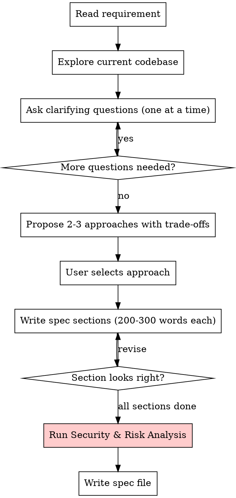

# Step 1: Brainstorm

**Input:** Feature requirement text from user.

**Goal:** Deeply understand the feature, find risks/issues/security concerns, and produce a precise spec file that serves as the contract for planning.

**This is the most important step.** Take your time. Be thorough. A bad spec cascades into bad planning and bad code.

### Process



### Codebase Exploration (REQUIRED)

Before asking any questions, explore the codebase to understand:

1. **Existing patterns** — How similar features are already implemented
2. **Affected files** — Which models, services, handlers, components will be touched
3. **Data flow** — How data moves through proto → backend → frontend
4. **Current security measures** — Auth middleware, validation, authorization checks
5. **Database schema** — Existing tables, relationships, constraints

Use parallel exploration agents to read:

- Related `.proto` files
- Related backend services and handlers
- Related frontend pages and components
- Existing tests for the affected area

### GitNexus Dependency Analysis (if index available)

Before proposing approaches, use GitNexus to understand the execution landscape:

1. `gitnexus_query({query: "<feature domain>"})` — find related execution flows and symbols
2. `gitnexus_context({name: "<key symbol>"})` — see callers/callees for symbols you plan to modify
3. `gitnexus_impact({target: "<symbol>", direction: "upstream"})` — map blast radius of planned changes

**Why:** Proposing an approach without understanding downstream dependencies leads to underestimated scope and missed regression risks.

> If GitNexus is not indexed: skip this and note "GitNexus not available" in the spec. Run `npx gitnexus analyze` to index.

### Question Guidelines

- **One question at a time** — Don't overwhelm
- **Multiple choice preferred** — When possible
- **Security-focused questions** — Always ask about:
  - Who should have access? (authorization)
  - What data is sensitive? (data classification)
  - What happens if this fails? (failure modes)
  - What are the abuse scenarios? (threat modeling)

### Security & Risk Analysis (MANDATORY)

Before writing the spec, complete this analysis using the checklist in `./security-checklist.md`. The analysis MUST cover:

1. **Data Flow Diagram (DFD)** — Map every data flow through trust boundaries (REQUIRED FIRST)
2. **STRIDE per trust boundary** — Apply STRIDE to each boundary crossing identified in the DFD
3. **OWASP Top 10 relevance** — Which vulnerabilities apply?
4. **Financial data integrity** — Can monetary values be manipulated?
5. **Authorization gaps** — Can users access others' data?
6. **Input validation** — What needs server-side validation?
7. **Rate limiting** — Can this be abused at scale?
8. **Data exposure** — What sensitive data could leak?
9. **Audit trail** — What operations need logging?
10. **External dependency risks** — What third-party APIs/packages are involved? What if they fail or are compromised?

**DFD is not optional.** STRIDE without data flows is ad-hoc and misses boundary-crossing threats. See `./security-checklist.md` for the DFD template.

### C4 Architecture Diagrams (REQUIRED)

**REQUIRED SUB-SKILL:** Use the `c4-architecture` skill for Mermaid C4 diagram syntax, element types, relationship labeling, and best practices. Follow the conventions in that skill when creating or updating any C4 diagram.

Before writing the spec, determine which C4 diagrams need to be **created or updated** for this feature. The project maintains C4 diagrams in `docs/architecture/` using **Mermaid syntax**.

**Existing diagrams:**

- `c4-context.md` — Level 1: System Context (external integrations)
- `c4-container.md` — Level 2: Containers (runtime units)
- `c4-component-backend.md` — Level 3: Backend components (handlers, services, repos)
- `c4-component-frontend.md` — Level 3: Frontend components (pages, modules, shared)
- `c4-code-investment.md` — Level 4: Code detail (class diagrams for complex domains)

**For each feature, assess:**

| Diagram Level | When to Update                                | When to Create New      |
| ------------- | --------------------------------------------- | ----------------------- |
| L1 Context    | New external system integration               | Never (rarely changes)  |
| L2 Container  | New runtime unit (worker, scheduler)          | Never (rarely changes)  |
| L3 Backend    | New handler, service, or repository           | Never (update existing) |
| L3 Frontend   | New page, feature module, or shared component | Never (update existing) |
| L4 Code       | Complex domain with 3+ models/services        | New bounded context     |

**Include in the spec:**

1. Which existing diagrams need updates (with description of changes)
2. Whether a new L4 code diagram is needed
3. Draft the Mermaid diagrams for new L4 code diagrams

**Mermaid format conventions** (match existing diagrams):

- Use `C4Component` for L3 diagrams
- Use `classDiagram` with `direction TB` for L4 code diagrams
- Include `<<interface>>` annotations for service/repository interfaces
- Show dependencies between components with labeled arrows

### Runtime Flow Diagrams (REQUIRED)

After implementation is complete, determine which **runtime flow diagrams** need to be created or updated. C4 diagrams show static structure ("what exists"); flow diagrams show dynamic behavior ("what happens when"). The project maintains flow diagrams in `docs/architecture/flow-*.md` using **Mermaid syntax**.

**Existing flow diagram files:**

- `flow-auth.md` — OAuth login/register, JWT middleware, session lifecycle
- `flow-wallet.md` — Create wallet, transfer funds, delete wallet
- `flow-transaction.md` — Create/update/delete transaction, bank statement import
- `flow-investment.md` — FIFO sell, buy+lot merge, dividend, market price update, portfolio summary
- `flow-cross-cutting.md` — FX rate resolution, frontend API lifecycle, background scheduler, currency conversion

**For each feature, assess:**

| Condition                                                   | Action                                                |
| ----------------------------------------------------------- | ----------------------------------------------------- |
| New API endpoint with multi-step business logic             | Add sequence diagram to the relevant `flow-*.md` file |
| New background job or scheduled task                        | Add to `flow-cross-cutting.md`                        |
| New branching/decision logic (e.g., deletion options)       | Add flowchart to the relevant `flow-*.md` file        |
| New domain not covered by existing files                    | Create new `flow-<domain>.md` file                    |
| Existing flow changed (new steps, different error paths)    | Update the existing diagram                           |
| Simple CRUD with no branching or multi-service coordination | No flow diagram needed                                |

**Include in the spec:**

1. Which existing flow diagrams need updates (with description of changes)
2. Whether new flow diagrams are needed (and which file they belong in)
3. Brief description of the flow to be diagrammed

**Flow diagram conventions** (match existing docs):

- `sequenceDiagram` for multi-participant request-response flows (most common)
- `flowchart TD` for branching/decision logic
- `stateDiagram-v2` for lifecycle/state-machine flows
- Each diagram includes: trigger, endpoint, source file reference
- Include error/alternative paths with `alt`/`else` blocks, not just happy path
- Add "Key Invariants" and "Error Paths" table after each diagram

### Spec File Structure

Save to: `docs/specs/YYYY-MM-DD-<feature>-spec.md`

```markdown
# [Feature Name] Specification

## Summary

[One paragraph describing what this feature does and why]

## User Stories

- As a [role], I want [action], so that [benefit]

## Functional Requirements

### FR-1: [Requirement Name]

[Detailed description]
**Acceptance criteria:**

- [ ] ...

## Non-Functional Requirements

- Performance: [expectations]
- Security: [requirements]

## Architecture Changes (C4)

### Diagrams to Update

[Which existing C4 diagrams need changes and what changes]

### New Diagrams

[L4 code diagram if this is a complex domain — include Mermaid source]

## Runtime Flow Diagrams

### Flow Diagrams to Update

[Which existing flow-*.md diagrams need changes and what changes]

### New Flow Diagrams

[New flows to document — specify target file, diagram type, and brief flow description]

## Data Model Changes

[New/modified tables, fields, relationships]

## API Changes

[New/modified endpoints with request/response shapes]

## UI/UX Changes

[New/modified pages, components, flows]

**REQUIRED for any frontend/UI work:**

- Follow **mobile-first design** — use `responsive-design` skill for Tailwind breakpoints and layout
- Follow **ui-ux-pro-max** skill for design system, color palette, typography, accessibility, and component patterns
- Follow **react-best-practices** skill for performance (no waterfalls, direct imports, dynamic imports for heavy components)
- This app uses `sm:` at 800px (custom breakpoint) — always verify against `tailwind.config.ts`

### Existing Component Inventory (REQUIRED)

Before proposing new components, check what already exists and can be reused:

| Need            | Existing Component                                                  | Location |
| --------------- | ------------------------------------------------------------------- | -------- |
| [describe need] | [component name or "NEW — create in features/<domain>/components/"] | [path]   |

**Shared components reference** (`components/`): BaseCard, Button, FormInput, FormSelect, FormNumberInput, FormDatePicker, FormToggle, FormTextarea, FormCreatableSelect, FormWizard, BaseModal, ConfirmationDialog, Success, MobileTable, TanStackTable, BarChart, LineChart, DonutChart, Sparkline, EmptyState, ErrorState, Toast, LoadingSpinner, FullPageLoading, Skeleton, BottomNav, ActiveLink, FloatingActionButton, SVG icons (components/icons/ or lucide-react)

**Image components**: `OptimizedImage` (blur placeholder + fallback), `Avatar` (pre-sized: xs/sm/md/lg/xl/full) — both from `components/OptimizedImage.tsx`. Use `next/image` directly for static assets.

### New Components (if any)

| Component | Location                                                    | Justification (why not reuse existing) |
| --------- | ----------------------------------------------------------- | -------------------------------------- |
| [name]    | `features/<domain>/components/` or `components/<category>/` | [reason]                               |

## Security & Risk Assessment

### Data Flow Diagram

| #   | Source | Data | Trust Boundary Crossed? | Destination | Notes |
| --- | ------ | ---- | ----------------------- | ----------- | ----- |
| 1   | ...    | ...  | Yes/No: [boundary]      | ...         | ...   |

### Trust Boundaries

| Boundary       | Crossed By    | Security Control |
| -------------- | ------------- | ---------------- |
| Internet → App | User requests | JWT + validation |

### Threats Identified (STRIDE per boundary crossing)

| #   | Data Flow | Boundary       | STRIDE    | Threat | Severity        | Mitigation |
| --- | --------- | -------------- | --------- | ------ | --------------- | ---------- |
| T-1 | 1         | Internet → App | Tampering | ...    | High/Medium/Low | ...        |

### Authorization Rules

[Who can do what]

### Input Validation Rules

[What needs validation, where]

### External Dependency Risks

[Third-party APIs/packages, failure modes, trust level]

### Sensitive Data Handling

[What data is sensitive, how to protect it]

### Issues & Risks Summary

1. [Issue/risk a]
2. [Issue/risk b]
3. [Issue/risk c]

## Edge Cases & Error Handling

[What can go wrong, how to handle it]

## Dependencies & Assumptions

[External services, existing features, assumptions]

## Out of Scope

[What this feature explicitly does NOT include]
```
