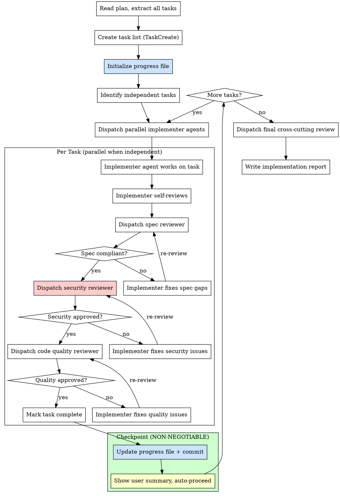

# Step 3: Implement

**Input:** Plan file path from plan step.

**Goal:** Execute the plan using coordinated teams of agents that work in parallel with task lists and direct peer-to-peer communication.

### Progress File (Context Survival)

**Purpose:** An on-disk progress record that survives context compaction and enables cross-session resume. TaskCreate/TaskUpdate state is ephemeral (lives only in conversation context) — the progress file is the durable source of truth.

**File path:** `docs/reports/YYYY-MM-DD-<feature>-progress.md`

**Template:**

```markdown
# [Feature Name] — Implementation Progress

## Metadata

- **Feature:** [feature name]
- **Plan file:** [path to plan file]
- **Spec file:** [path to spec file]
- **Started:** [ISO timestamp]
- **Last updated:** [ISO timestamp]
- **Current state:** [not_started | in_progress | completed]
- **Current task:** [task number currently being worked on, or "done"]

## Task Progress

| #   | Task Name                       | Status  | Commit | Summary |
| --- | ------------------------------- | ------- | ------ | ------- |
| 0   | Update C4 Architecture Diagrams | pending | —      | —       |
| 1   | [task name from plan]           | pending | —      | —       |
| 2   | [task name from plan]           | pending | —      | —       |
| ... | ...                             | ...     | ...    | ...     |

**Status values:** `pending` | `in_progress` | `done` | `skipped`

## Resume Instructions

To resume this implementation in a new session:

1. Read this progress file
2. Read the plan file referenced above
3. Check `git log --oneline -10` to verify last commit matches the last `done` task
4. Check `git status` for any uncommitted work
5. Continue from the next `pending` task using the same checkpoint protocol

## Notes

[Any context, blockers, or decisions made during implementation]
```

**Update rules:**

1. **Initialize** the progress file before starting the first task (after creating the task list)
2. **Update on task start** — set status to `in_progress`, update `Current task`
3. **Update on task complete** — set status to `done`, add commit hash and one-line summary, advance `Current task`
4. **Always include** the progress file in every commit (it travels with the code)
5. **Mark `completed`** when all tasks are done and the implementation report is written

### Process



### Three-Stage Review (Per Task)

Unlike the standard two-stage review, financial features require **three stages**:

1. **Spec Compliance Review** — Did they build what was requested? (Use `./spec-reviewer-prompt.md`)
2. **Security Review** — Are security requirements met? (Use `./security-reviewer-prompt.md`)
3. **Code Quality Review** — Is the code clean and maintainable? (Use `./code-quality-reviewer-prompt.md`)

**Order matters:** Spec first, then security, then quality. No skipping.

### Commit Checkpoint Protocol (Per Task)

**NON-NEGOTIABLE.** After all three reviews pass for a task, execute this 4-step checkpoint sequence before moving to the next task:

**Step 1: Update progress file**

- Set the task status to `done` in the progress table
- Add the commit hash (from step 2 — use a placeholder, then amend or update after committing)
- Add a one-line summary of what was implemented
- Advance `Current task` to the next pending task number (or `done` if this was the last task)
- Update `Last updated` timestamp

**Step 2: Stage and commit**

- Stage all files changed by the task **plus** the progress file
- Commit with a descriptive message: `feat(<feature>): implement task N — <task name>`
- The progress file MUST be included in the commit

**Step 3: Show user summary**
Present a clear summary to the user:

```
## Task N Complete: [task name]

**Files changed:** [list]
**Commit:** [hash] — [message]
**Progress:** N/M tasks done
**Next task:** Task N+1 — [next task name]
```

**Step 4: Auto-proceed to next task**

- Display the summary and immediately continue to the next task
- Do NOT wait for user approval — keep implementation flowing continuously
- The user can interrupt at any time if they need to course-correct
- Only pause to ask the user if you encounter a blocker, ambiguity, or error

**Why this matters:** Context compaction can happen at any time. By committing after each task and persisting progress to disk, the worst case is losing in-progress work on one task — all completed tasks are safely committed and the progress file tells the next session exactly where to resume. Implementation runs continuously — the user can interrupt at any time but doesn't need to manually trigger each task.

### Parallel Execution

- Identify tasks that are independent (no shared files, no data dependencies)
- Dispatch independent tasks to parallel implementer agents
- **Never dispatch parallel agents on tasks that modify the same files**
- Use the task list (TaskCreate/TaskUpdate/TaskList) for coordination
- Each agent reports completion; orchestrator dispatches reviews

**Parallel execution and checkpoints:** When multiple independent tasks complete in the same parallel batch, commit each task individually (separate commits), then update the progress file once with all completed tasks marked `done`. Show the user a combined summary listing all completed tasks in the batch, then immediately proceed to the next batch.

### Implementation Report

Save to: `docs/reports/YYYY-MM-DD-<feature>-report.md`

```markdown
# [Feature Name] Implementation Report

## Summary

[What was implemented]

## Spec Reference

[Path to spec file]

## Plan Reference

[Path to plan file]

## Tasks Completed

| #   | Task | Status | Files Changed | Tests    | TDD |
| --- | ---- | ------ | ------------- | -------- | --- |
| 1   | ...  | Done   | ...           | 5/5 pass | Yes |

## Test Coverage Summary

| Layer              | Test File     | Tests | Pass | Coverage Area               |
| ------------------ | ------------- | ----- | ---- | --------------------------- |
| Backend Service    | `..._test.go` | N     | N/N  | Business logic, edge cases  |
| Backend Handler    | `..._test.go` | N     | N/N  | HTTP, auth, validation      |
| Frontend Component | `...test.tsx` | N     | N/N  | Render, interaction, errors |

## Security Implementation Summary

| Concern          | Implementation                        | Verified |
| ---------------- | ------------------------------------- | -------- |
| Input validation | Server-side Zod + Go validators       | Yes      |
| Authorization    | User ownership check in service layer | Yes      |
| ...              | ...                                   | ...      |

## Review Results

### Spec Compliance

[Summary of spec review findings and resolutions]

### Security Review

[Summary of security review findings and resolutions]

### Code Quality

[Summary of quality review findings and resolutions]

## Known Issues / Technical Debt

[Any issues deferred or technical debt introduced]

## Files Changed

[Complete list of all files created/modified]

## How to Test

### Unit & Integration Tests

[Test commands and expected results]

### Dependency Impact Verification (GitNexus)

Run after implementation to verify blast radius is covered:

1. **Map affected flows:**
   ```
   # In the project root (requires GitNexus index)
   # Use gitnexus_detect_changes({scope: "staged"}) via MCP
   ```
   - Lists all execution flows affected by your changes
   - Each affected flow should have corresponding test coverage

2. **Verify upstream dependents:**
   ```
   # For each key changed symbol:
   # Use gitnexus_impact({target: "<symbol>", direction: "upstream"}) via MCP
   ```
   - d=1 dependents (WILL BREAK) must be tested or verified compatible
   - d=2 dependents (LIKELY AFFECTED) should be regression-tested

3. **Coverage gap check:**
   | Changed Symbol | d=1 Dependents | Tested? | Notes |
   |---|---|---|---|
   | [symbol] | [callers] | Yes/No | [explanation if untested] |

> If GitNexus is not indexed, skip this section and note "GitNexus not available — manual blast radius review performed."

### Manual Testing Steps

[Manual testing steps for verification]
```

### Resuming from Progress File

If a session is lost to context compaction or you're starting a new session to continue an in-progress implementation:

**Procedure:**

1. **Read the progress file** — `docs/reports/YYYY-MM-DD-<feature>-progress.md`
   - Identify `Current state`, `Current task`, and which tasks are `done` vs `pending`
2. **Read the plan file** — referenced in the progress file's `Metadata` section
   - Understand the full task list, dependencies, and security notes
3. **Verify git state:**
   - `git log --oneline -10` — confirm the last commit matches the last `done` task in the progress file
   - `git status` — check for uncommitted work (if any, investigate before proceeding)
   - `git diff` — review any uncommitted changes
4. **Recreate TaskCreate list** from the plan:
   - Create all tasks via TaskCreate
   - Mark tasks as `completed` per the progress file (use TaskUpdate)
   - The first `pending` task becomes your next work item
5. **Continue from the next pending task** — follow the same implement → review → checkpoint protocol
6. **Follow the same Commit Checkpoint Protocol** — commit after each task, show summary, auto-proceed to next task

**Key rule:** The **progress file is the source of truth**, not TaskList state. TaskList is ephemeral (lives in conversation context only). If there's a conflict between the progress file and TaskList state, trust the progress file.

**Edge case — uncommitted work found:**

- If `git status` shows uncommitted changes, present them to the user
- Ask whether to: (a) commit them as part of the current task, (b) stash them, or (c) discard them
- Never silently discard uncommitted work
