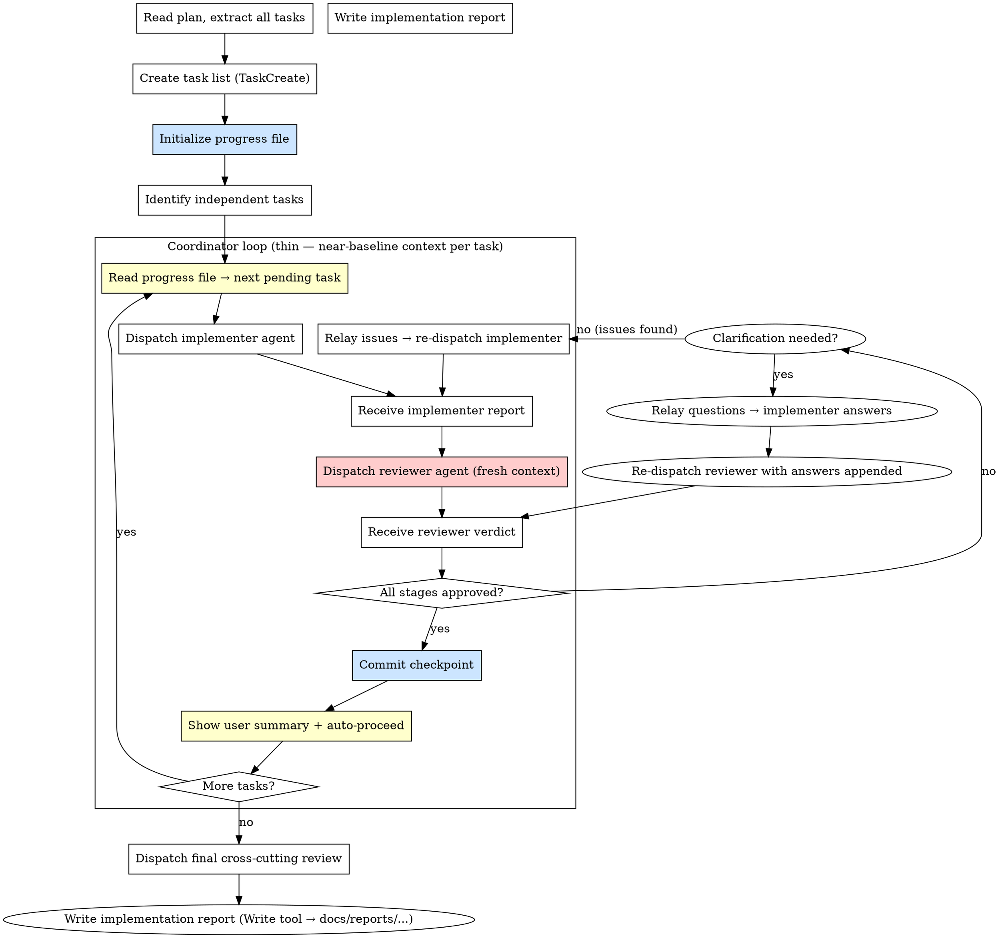

# Step 3: Implement

**Input:** Plan file path from plan step.

**Goal:** Execute the plan using coordinated teams of agents that work in parallel with task lists and direct peer-to-peer communication.

### Progress File (Context Survival)

**Purpose:** An on-disk progress record that survives context compaction and enables cross-session resume. TaskCreate/TaskUpdate state is ephemeral (lives only in conversation context) — the progress file is the durable source of truth.

**File path:** `docs/reports/YYYY-MM-DD-<feature>-progress.md`

**Template:**

```markdown
# [Feature Name] — Implementation Progress

## Metadata

- **Feature:** [feature name]
- **Plan file:** [path to plan file]
- **Spec file:** [path to spec file]
- **Started:** [ISO timestamp]
- **Last updated:** [ISO timestamp]
- **Current state:** [not_started | in_progress | completed]
- **Current task:** [task number currently being worked on, or "done"]

## Task Progress

| #   | Task Name                       | Status  | Commit | Summary |
| --- | ------------------------------- | ------- | ------ | ------- |
| 0   | Update C4 Architecture Diagrams | pending | —      | —       |
| 1   | [task name from plan]           | pending | —      | —       |
| 2   | [task name from plan]           | pending | —      | —       |
| ... | ...                             | ...     | ...    | ...     |

**Status values:** `pending` | `in_progress` | `done` | `skipped`

## Skill Recovery

**MANDATORY: Re-read these files before continuing work (context compaction drops them):**

1. `.claude/skills/secure-feature-pipeline/step-3-implement.md` — coordinator protocol, two-agent model, commit checkpoint
2. `.claude/skills/secure-feature-pipeline/implementer-agent-prompt.md` — implementer template (placeholders to fill)
3. `.claude/skills/secure-feature-pipeline/reviewer-agent-prompt.md` — reviewer template (placeholders to fill)

**After re-reading, verify you can answer:**
- What are the two agents per task and what does each one do?
- Which agent commits — the implementer, the reviewer, or the coordinator?
- What is the next pending task?

## Resume Instructions

To resume this implementation after context compaction or in a new session:

1. Read this progress file completely (including the Skill Recovery section above)
2. **Re-read ALL skill files listed in Skill Recovery section above** — this is NON-NEGOTIABLE
3. Read the plan file referenced in Metadata
4. Read the spec file referenced in Metadata
5. Check `git log --oneline -10` to verify last commit matches the last `done` task
6. Check `git status` for any uncommitted work
7. Cite the three-stage review order and checkpoint protocol (proves context is recovered)
8. Continue from the next `pending` task using the same checkpoint protocol

## Notes

[Any context, blockers, or decisions made during implementation]
```

**Update rules:**

1. **Initialize** the progress file before starting the first task (after creating the task list)
2. **Update on task start** — set status to `in_progress`, update `Current task`
3. **Update on task complete** — set status to `done`, add commit hash and one-line summary, advance `Current task`
4. **Always include** the progress file in every commit (it travels with the code)
5. **Mark `completed`** when all tasks are done and the implementation report is written

### Architecture: Thin Coordinator + Isolated Implementer + Fresh Reviewer

**Why this design:** A single long-running orchestrator accumulates context from every agent report it reads — after 3-4 tasks the context triggers compaction which drops the protocol. The fix is to keep the coordinator thin and give each task a bounded context.

**The model:**
- The **coordinator** (you) holds only: progress file content + task list. Per task it dispatches ONE implementer agent, receives its structured report, dispatches ONE reviewer agent with that report, receives the verdict, then commits and loops.
- The **implementer agent** starts fresh per task: implements with TDD, does a security self-check, writes/updates Playwright E2E tests (does NOT run them), and self-review, then reports back. It does NOT commit.
- The **reviewer agent** starts with a completely fresh context — no knowledge of implementation choices. It receives only the task spec + implementer report + file list, reads the actual code independently, and runs all 3 review stages. This fresh context is the quality guarantee: a separate agent can't be biased toward choices it never made.
- The **coordinator commits** after the reviewer approves — updating the progress file and staging all files in one checkpoint.

**Context budget per task loop:**
- Coordinator holds: implementer report (~1-2k tokens) + reviewer verdict (~1k tokens) → discards both after commit → next task starts near-baseline
- Worst-case compaction hits one in-progress task cycle, not the whole feature

### Process



### Three-Stage Review (Per Task — Reviewer Agent)

Financial features require **three stages**, all run by the reviewer agent on a fresh context:

1. **Stage 1 — Spec Compliance** — Did it build what was requested?
2. **Stage 2 — Security** — Are all 9 security categories satisfied?
3. **Stage 3 — Code Quality** — Is the code clean, structured, and maintainable?

**Order matters:** Spec first, then security, then quality. No skipping.
**Gate:** Each stage must pass before the next. If any stage fails, reviewer reports issues with `file:line` references. Coordinator relays to implementer for fixes, then re-dispatches a fresh reviewer.
**Why a separate agent:** The reviewer starts with NO knowledge of the implementation decisions. It cannot rationalize away choices it never made.

### Dispatching Implementer Agents

Use `./implementer-agent-prompt.md` as the template. Fill in ALL placeholders:

| Placeholder | What to fill in |
|---|---|
| `[TASK_NUMBER]` | Task number from the plan (0, 1, 2, …) |
| `[TASK_NAME]` | Task name from the plan |
| `[FULL_TASK_TEXT]` | **Paste the complete task text** from the plan — do NOT tell agent to read the plan file |
| `[CONTEXT]` | Where this fits, dependencies, architectural notes |
| `[SECURITY_NOTES]` | Security notes for this task from the plan |
| `[PROGRESS_FILE_PATH]` | `docs/reports/YYYY-MM-DD-<feature>-progress.md` |
| `[PLAN_FILE_PATH]` | Path to the plan file |
| `[SPEC_FILE_PATH]` | Path to the spec file |

### Handling CLARIFICATION NEEDED

When the reviewer returns `CLARIFICATION NEEDED`:

1. **Dispatch an implementer agent** with a minimal prompt — just the questions and the original task context. No new implementation needed; the implementer only answers the questions.
2. **Collect answers** from the implementer's response.
3. **Re-dispatch the reviewer** using the same reviewer template, with one addition at the bottom of `[IMPLEMENTER_REPORT]`:
   ```
   ### Clarification answers (added by coordinator)
   Q: [question from reviewer]
   A: [implementer's answer]
   ```
4. The reviewer resumes from where it left off — it already has its Stage N findings, it only needs to resolve the questions before issuing a final verdict.

**Limit:** Max 1 clarification round per stage. If the reviewer raises new questions after receiving answers, treat them as issues — it means the design needs fixing, not more Q&A.

### Dispatching Reviewer Agents

Use `./reviewer-agent-prompt.md` as the template. Fill in ALL placeholders:

| Placeholder | What to fill in |
|---|---|
| `[TASK_NUMBER]` | Same task number |
| `[TASK_NAME]` | Same task name |
| `[ORIGINAL_TASK_TEXT]` | **Same full task text** pasted inline — do NOT reference plan file |
| `[SECURITY_NOTES]` | Same security notes from the plan |
| `[IMPLEMENTER_REPORT]` | **Full text of implementer's report** — paste it inline |
| `[FILES_CHANGED]` | List of all changed files (from implementer report) |
| `[SPEC_FILE_PATH]` | Path to spec file (reviewer may read for full context) |

**Critical:** Paste the implementer report inline. The reviewer must not need to read any external state besides the changed code files themselves.

### Commit Checkpoint (Coordinator, after reviewer approves)

After the reviewer returns APPROVED on all stages, the coordinator executes the 4-step checkpoint:

**Step 1: Update progress file**
- Set task status to `done`
- Add commit hash placeholder (update after step 2)
- Add one-line summary of what was implemented
- Advance `Current task` to next pending (or `done` if last)
- Update `Last updated` timestamp

**Step 2: Stage and commit**
- Stage all task files + progress file
- Commit: `feat(<feature>): implement task N — <task name>`
- Progress file MUST be in the commit
- Update commit hash in progress file, then `git commit --amend --no-edit`

**Step 3: Show user summary**
```
## Task N Complete: [task name]

**Files changed:** [list]
**Commit:** [hash] — [message]
**Progress:** N/M tasks done
**Next task:** Task N+1 — [name, or "done"]
```

**Step 4: Auto-proceed**
- Immediately dispatch the next implementer agent — do NOT wait for user approval
- Only pause for blockers, ambiguity, or errors

### Parallel Execution

- Identify tasks that are independent (no shared files, no data dependencies)
- Dispatch independent tasks as **parallel implementer agents** simultaneously
- **Never parallelize tasks that modify the same files**
- After all parallel implementers report back, dispatch **parallel reviewer agents** (one per implementer report)
- After all reviewers approve, commit each task individually (separate commits), update progress file once with all completed tasks, show combined summary, proceed to next batch

### Implementation Report

**MANDATORY: The coordinator MUST create this file on disk using the Write tool — do NOT just display it in chat.**

Save to: `docs/reports/YYYY-MM-DD-<feature>-report.md`

**After writing, commit:** Stage the report file along with the progress file and include in a final commit: `docs(report): complete <feature> implementation report`.

```markdown
# [Feature Name] Implementation Report

## Summary

[What was implemented]

## Spec Reference

[Path to spec file]

## Plan Reference

[Path to plan file]

## Tasks Completed

| #   | Task | Status | Files Changed | Tests    | TDD |
| --- | ---- | ------ | ------------- | -------- | --- |
| 1   | ...  | Done   | ...           | 5/5 pass | Yes |

## Test Coverage Summary

| Layer              | Test File     | Tests | Pass | Coverage Area               |
| ------------------ | ------------- | ----- | ---- | --------------------------- |
| Backend Service    | `..._test.go` | N     | N/N  | Business logic, edge cases  |
| Backend Handler    | `..._test.go` | N     | N/N  | HTTP, auth, validation      |
| Frontend Component | `...test.tsx` | N     | N/N  | Render, interaction, errors |

## Security Implementation Summary

| Concern          | Implementation                        | Verified |
| ---------------- | ------------------------------------- | -------- |
| Input validation | Server-side Zod + Go validators       | Yes      |
| Authorization    | User ownership check in service layer | Yes      |
| ...              | ...                                   | ...      |

## Review Results

### Spec Compliance

[Summary of spec review findings and resolutions]

### Security Review

[Summary of security review findings and resolutions]

### Code Quality

[Summary of quality review findings and resolutions]

## Known Issues / Technical Debt

[Any issues deferred or technical debt introduced]

## Files Changed

[Complete list of all files created/modified]

## How to Test

### Unit & Integration Tests

[Test commands and expected results]

### Dependency Impact Verification (GitNexus)

Run after implementation to verify blast radius is covered:

1. **Map affected flows:**
   ```
   # In the project root (requires GitNexus index)
   # Use gitnexus_detect_changes({scope: "staged"}) via MCP
   ```
   - Lists all execution flows affected by your changes
   - Each affected flow should have corresponding test coverage

2. **Verify upstream dependents:**
   ```
   # For each key changed symbol:
   # Use gitnexus_impact({target: "<symbol>", direction: "upstream"}) via MCP
   ```
   - d=1 dependents (WILL BREAK) must be tested or verified compatible
   - d=2 dependents (LIKELY AFFECTED) should be regression-tested

3. **Coverage gap check:**
   | Changed Symbol | d=1 Dependents | Tested? | Notes |
   |---|---|---|---|
   | [symbol] | [callers] | Yes/No | [explanation if untested] |

> If GitNexus is not indexed, skip this section and note "GitNexus not available — manual blast radius review performed."

### Manual Testing Steps

**MANDATORY: Write concrete, numbered steps a human can follow without reading the code.**

Each step must include:
- **Preconditions** (logged in as which user, what data must exist)
- **Action** (exact UI interactions or API calls)
- **Expected result** (what should appear or happen)

Structure per scenario:

```
#### Scenario: [Happy path name]
**Preconditions:** [Describe required state]
1. Navigate to [URL or screen]
2. [Perform action] → Expected: [what to see]
3. [Next action] → Expected: [what to see]

#### Scenario: [Error / edge case name]
**Preconditions:** [Describe required state]
1. [Action that triggers the edge case]
2. Expected: [error message, empty state, or boundary behavior]

#### Scenario: [Authorization check]
**Preconditions:** Logged in as a different user
1. Attempt to access [resource owned by another user]
2. Expected: 403 or resource not found — no data leakage
```

**Minimum required scenarios:**
- Happy path (create/view/edit/delete as applicable)
- Validation error (submit with invalid inputs)
- Authorization boundary (access another user's resource)
- Empty state (if feature shows a list or dashboard)
- Mobile viewport (375px — verify layout and touch targets)
```

### Context Compaction Recovery (COORDINATOR)

**The coordinator's context is thin by design** — it holds only the progress file + current task's implementer report + reviewer verdict, then clears. Compaction hitting the coordinator is unlikely, but if it does, recovery is fast.

**Detection — you may have lost context if:**
- You can't recall the two-agent model (implementer then reviewer per task)
- You don't know which agent commits (the coordinator does, not the agents)
- You don't know which task to dispatch next

**Recovery protocol:**
1. Re-read `.claude/skills/secure-feature-pipeline/step-3-implement.md`
2. Re-read the progress file — `docs/reports/YYYY-MM-DD-<feature>-progress.md`
3. Verify: what is the next pending task? Which agent commits?

**The progress file's `Skill Recovery` section** lists the three files to re-read. It's on disk, survives compaction.

### Resuming from Progress File

If the coordinator session is lost or you're starting a new session:

1. **Read the progress file** — identify `Current state`, `Current task`, `done` vs `pending` tasks
2. **Re-read skill files** from progress file's Skill Recovery section:
   - `step-3-implement.md`, `implementer-agent-prompt.md`, `reviewer-agent-prompt.md`
3. **Verify git state:**
   - `git log --oneline -10` — last commit should match last `done` task
   - `git status` — if uncommitted work exists, ask the user before proceeding
4. **Recreate TaskCreate list** from the plan; mark `completed` per progress file
5. **Dispatch implementer for the first `pending` task**

**Key rule:** Progress file is the source of truth, not TaskList state. If conflict, trust the progress file.

**Uncommitted work found:** Ask the user: (a) commit as part of current task, (b) stash, or (c) discard. Never silently discard.
