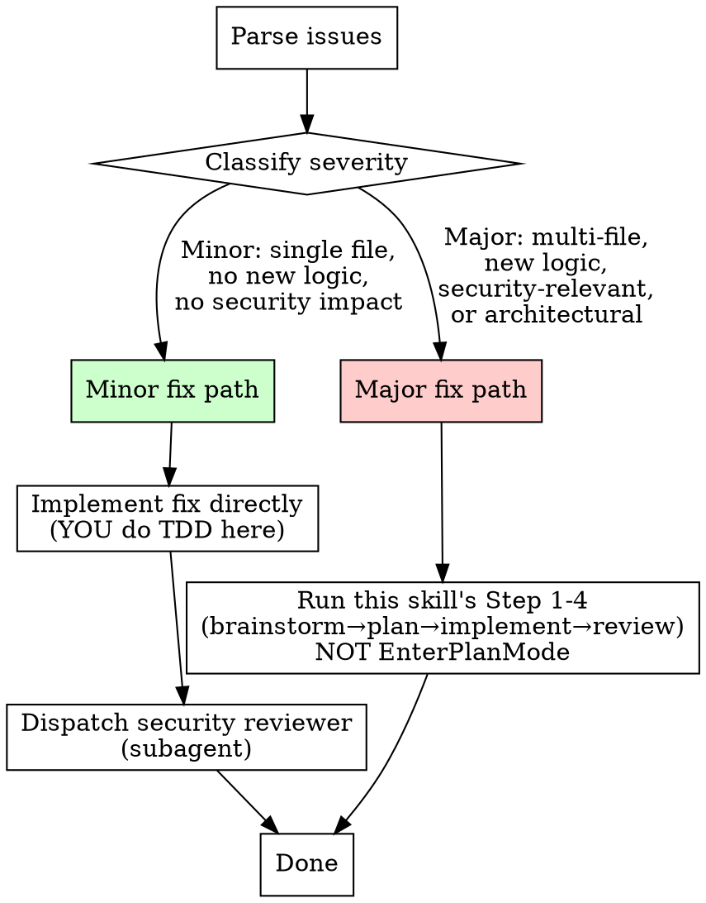

# Step 5: Fix

**Input:** Issue description (text) OR implementation report with issues.

**Goal:** Fix the identified problems, using the appropriate path based on severity.

### CRITICAL REMINDER: This Skill Controls the Workflow

**Do NOT call `EnterPlanMode` during the fix step.** When the fix step says "plan", it means **this skill's Step 2** (writing a plan to `docs/plans/`), NOT the built-in plan mode tool.

**Do NOT implement without following this skill's process.** Even for minor fixes, you must follow the steps below — don't just start coding.

**Red flags that you're about to go off-script:**
- Thinking "let me enter plan mode to figure this out" → WRONG. Follow the fix path below.
- Starting to write code before classifying severity → STOP. Classify first.
- Implementing without dispatching a subagent (for major fixes) → STOP. Use the implementer prompt.
- Skipping the security reviewer dispatch → STOP. Always dispatch it.

### Severity-Based Fix Path



### Minor Fix Path (Lightweight)

Use when ALL of these are true:

- Fix touches **1-2 files** only
- No new business logic or API changes
- No security implications (e.g., fixing a typo, adjusting UI alignment, fixing a display format)
- No changes to data models, authorization, or validation logic

**Process:**

1. **Parse the issue** — Understand exactly what's wrong. Read the relevant source files.
2. **Implement the fix yourself (TDD still applies):**
   - Write a failing test FIRST that reproduces the issue
   - Implement the minimal fix to make the test pass
   - Run ALL tests to verify no regressions
   - Follow project conventions from CLAUDE.md (int64 for money, parameterized queries, etc.)
   - **Do NOT call `EnterPlanMode`.** You already know what to fix — just fix it with TDD.
3. **Dispatch security reviewer subagent** — Use `./security-reviewer-prompt.md` template. Quick check that the fix doesn't introduce vulnerabilities. This is NOT optional.
4. **Append to original implementation report** — Add a "Fix History" entry to `docs/reports/YYYY-MM-DD-<feature>-report.md`:

```markdown
## Fix History

| Date       | Fix                             | Severity | Commit        |
| ---------- | ------------------------------- | -------- | ------------- |
| YYYY-MM-DD | [description of what was fixed] | Minor    | [commit hash] |
```

5. **Done** — No need for full brainstorm/plan cycle or a separate report file

### Major Fix Path (Full Pipeline)

Use when ANY of these are true:

- Fix touches **3+ files**
- Introduces new business logic
- Changes authorization, validation, or data models
- Has security implications (auth, money, data exposure)
- Changes API contracts (proto files)
- Root cause analysis reveals a design issue

**Process:**

1. **Parse the issues** — Extract specific problems from the input
2. **Invoke this skill's Step 1 (brainstorm)** with the fix as the "feature requirement"
   - The requirement is: "Fix these specific issues: [list]"
   - Context: reference the original spec, plan, and report
   - **This means running the brainstorm process from this skill's Step 1 section above.** It does NOT mean calling `EnterPlanMode`.
3. **Then invoke this skill's Step 2 (plan)** on the fix spec produced by brainstorm
   - The plan saves to `docs/plans/YYYY-MM-DD-<fix>-plan.md`
   - **Again: do NOT call `EnterPlanMode`.** Follow Step 2 of THIS skill.
4. **Then invoke this skill's Step 3 (implement)** using the plan
   - Dispatch implementer subagents using `./implementer-prompt.md` template
   - The implement step produces `docs/reports/YYYY-MM-DD-<fix>-report.md`
5. **Then invoke this skill's Step 4 (review)** on the implementation
6. **The fix spec should be focused** — Only address the identified issues, don't scope-creep

### Rationalization Table — Fix Step

| Excuse you might think | Why it's wrong |
|---|---|
| "Let me enter plan mode to plan the fix" | This skill IS your plan mode. Follow Step 2 above. `EnterPlanMode` writes to the wrong location. |
| "This is simple enough to just code directly" | Even simple fixes need severity classification first. Minor fixes still need TDD + security review. |
| "I'll skip the security reviewer for this small fix" | Financial app. No exceptions. Dispatch the reviewer. |
| "I'll do the review myself instead of dispatching a subagent" | Self-review has blind spots. Dispatch the security reviewer subagent. |
| "Let me just implement this and run the full pipeline after" | The pipeline IS the implementation process. Don't implement outside of it. |
| "I already know what to do, no need to read source files first" | You must read the relevant files before fixing. Assumptions cause regressions. |

### Fix Spec Template (for Major Fix Path)

```markdown
# Fix: [Issue Summary]

## Original Feature

[Reference to original spec/plan/report]

## Issues to Fix

| #   | Issue | Source                     | Severity |
| --- | ----- | -------------------------- | -------- |
| 1   | ...   | Review / User report / Bug | ...      |

## Root Cause Analysis

[Why did this happen? What was missed?]

## Fix Approach

[How to fix each issue]

## Regression Risks

[What could break when fixing this?]
```
