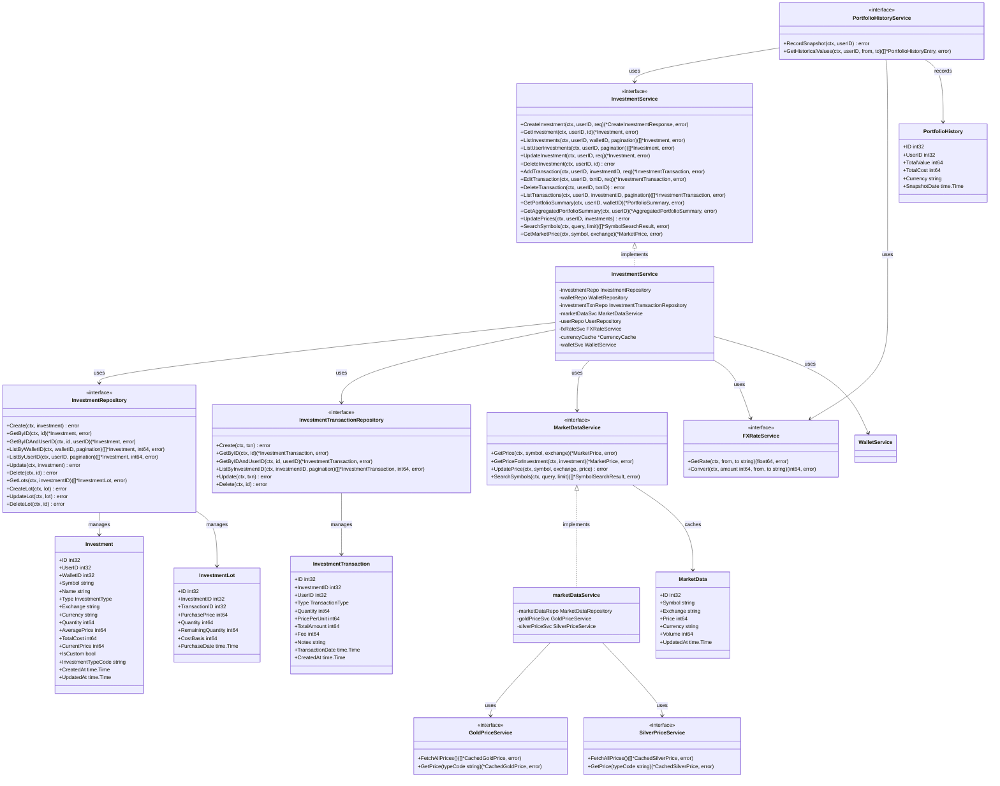

# C4 Level 4: Investment Domain Code

Class-level detail of the investment bounded context — the most complex domain in WealthJourney.



## FIFO Cost Basis Algorithm

The investment service uses First-In, First-Out (FIFO) for cost basis accounting:

```
Buy 100 shares @ $10 → Lot A: qty=100, price=$10, cost=$1000
Buy  50 shares @ $12 → Lot B: qty=50,  price=$12, cost=$600

Sell 120 shares @ $15:
  1. Consume Lot A: 100 shares @ $10 = $1000 cost basis
  2. Consume Lot B:  20 shares @ $12 = $240  cost basis
  Total cost basis: $1240
  Proceeds: 120 × $15 = $1800
  Realized PNL: $1800 - $1240 = $560

Remaining: Lot B: qty=30, price=$12, cost=$360
```

## Investment Types

| Type | Value | Currency | Storage Unit | Market Price Unit |
|------|-------|----------|-------------|-------------------|
| STOCK | 1 | Any | shares × 10000 | per share |
| ETF | 2 | Any | shares × 10000 | per share |
| CRYPTO | 3 | Any | units × 10000 | per unit |
| BOND | 4 | Any | units × 10000 | per unit |
| MUTUAL_FUND | 5 | Any | units × 10000 | per unit |
| COMMODITY | 6 | Any | units × 10000 | per unit |
| OTHER | 7 | Any | units × 10000 | per unit |
| GOLD_VND | 8 | VND | grams × 10000 | per mace (convert) |
| GOLD_USD | 9 | USD | ounces × 10000 | per ounce |
| SILVER_VND | 10 | VND | grams × 10000 | per tael (convert) |
| SILVER_USD | 11 | USD | ounces × 10000 | per ounce |

## Key Design Decisions

1. **All quantities stored as int64 × 10000**: Avoids floating-point precision issues
2. **FIFO lot tracking**: Each buy creates a lot; sells consume oldest lots first
3. **Market data cached in both Redis (15min TTL) and PostgreSQL (permanent)**
4. **Gold/silver prices normalized**: VND prices converted from per-lượng to per-gram for storage
5. **Custom investments**: `isCustom=true` skips market data lookup, uses manual price updates
6. **Portfolio snapshots**: Hourly snapshots enable historical performance charts without recalculating
