# C4 Level 3: Backend Components

Shows the internal structure of the Go backend — how HTTP requests flow through handlers, services, and repositories to data stores and external APIs.

```mermaid
C4Component
    title WealthJourney Backend - Component Diagram (with Trust Boundaries)

    Container_Boundary(transport, "Transport Layer — TRUST BOUNDARY: Untrusted input enters here") {
        Component(gin, "Gin HTTP Server", "gin-gonic/gin", "Request routing, CORS, middleware pipeline")
        Component(auth_mw, "Auth Middleware", "JWT + Redis", "Extracts bearer token, verifies against Redis whitelist, sets user context")
        Component(rate_mw, "Rate Limiter", "Token bucket", "Per-IP (public) and per-user (protected) rate limiting")
        Component(grpc_srv, "gRPC Server", "google.golang.org/grpc", "Protocol Buffer service implementations")
        Component(grpc_gw, "gRPC-Gateway", "grpc-ecosystem/grpc-gateway", "HTTP-to-gRPC reverse proxy")
    }

    Container_Boundary(handlers, "HTTP Handlers — Input validated and user authenticated at this layer") {
        Component(auth_h, "Auth Handlers", "Register, Login, Logout, Verify", "Google OAuth token verification, JWT issuance")
        Component(user_h, "User Handlers", "CRUD + Preferences", "Handles user CRUD, preferences (currency + language), and profile operations")
        Component(wallet_h, "Wallet Handlers", "CRUD + Transfer + Balance", "Wallet management and fund operations")
        Component(txn_h, "Transaction Handlers", "CRUD + Reports", "Transaction management and financial reports")
        Component(cat_h, "Category Handlers", "CRUD", "User-defined transaction categories")
        Component(budget_h, "Budget Handlers", "CRUD + Items", "Budget and budget item management")
        Component(invest_h, "Investment Handlers", "CRUD + Txn + Prices", "Investment holdings, transactions, market data")
        Component(import_h, "Import Handlers", "Upload + Parse + Execute", "Bank statement import wizard endpoints")
        Component(price_h, "Market Price Handlers", "Gold + Silver + Market", "Gold/silver type codes and combined market prices")
        Component(gold_chart_h, "Gold Chart Handler", "handlers/gold_chart.go", "Proxies gold price history from mihong.vn with Redis caching")
        Component(silver_chart_h, "Silver Chart Handler", "handlers/silver_chart.go", "Proxies silver price history from giabac.vn and Yahoo Finance SI=F with Redis caching")
        Component(community_h, "Community Handlers", "Posts + Comments + Likes + Follows + Reports", "Social feed, post CRUD, commenting, liking, user following, content moderation; Phase 3: UploadImage, UpdateComment, GetReplies, GetLikedPosts, UpdateProfile, StreamNotifications")
        Component(public_h, "Public Handlers", "handlers/public.go", "No-auth endpoint returning gold/silver type names from in-memory registries. IP-rate-limited only.")
    }

    Container_Boundary(services, "Service Layer — TRUST BOUNDARY: Data considered validated after this point") {
        Component(auth_svc, "Auth Service", "domain/auth", "Google token verification, JWT generation, session management")
        Component(user_svc, "User Service", "domain/service", "User CRUD, preferences (currency + language), currency conversion orchestration")
        Component(wallet_svc, "Wallet Service", "domain/service", "Balance tracking, fund transfers, multi-currency support")
        Component(txn_svc, "Transaction Service", "domain/service", "Transaction CRUD, financial reports, category breakdowns")
        Component(cat_svc, "Category Service", "domain/service", "Category CRUD, default category seeding for new users")
        Component(budget_svc, "Budget Service", "domain/service", "Budget lifecycle, budget item tracking, spending analysis")
        Component(invest_svc, "Investment Service", "domain/service", "Holdings management, FIFO cost basis, PNL calculation")
        Component(market_svc, "Market Data Service", "domain/service", "Price caching, Yahoo Finance integration, gold/silver normalization")
        Component(fx_svc, "FX Rate Service", "domain/service", "Currency conversion rates, cross-currency calculations")
        Component(import_svc, "Import Service", "domain/service", "File parsing, field mapping, duplicate detection, batch execution")
        Component(portfolio_svc, "Portfolio History Service", "domain/service", "Historical portfolio value snapshots for charts")
        Component(community_svc, "Community Service", "domain/service", "Social interactions: posts, comments, likes, follows, content reports; Phase 2: SharePost, GetNotifications, GetUnreadNotificationCount, MarkNotificationsRead, SavePost, UnsavePost, GetSavedPosts, GetSuggestedUsers, GetTrendingTopics, GetFollowing, GetFollowers; Phase 3: UploadImage, UpdateComment, GetReplies, GetLikedPosts, UpdateProfile, StreamNotifications")
    }

    Container_Boundary(repos, "Repository Layer (Data Access)") {
        Component(user_repo, "User Repository", "GORM", "User table CRUD with soft deletes")
        Component(wallet_repo, "Wallet Repository", "GORM", "Wallet table CRUD with balance locking")
        Component(txn_repo, "Transaction Repository", "GORM", "Transaction table with pagination and filtering")
        Component(cat_repo, "Category Repository", "GORM", "Category table with user scoping")
        Component(budget_repo, "Budget Repository", "GORM", "Budget + BudgetItem tables")
        Component(invest_repo, "Investment Repository", "GORM", "Investment + InvestmentLot tables")
        Component(invest_txn_repo, "Investment Transaction Repository", "GORM", "Investment transaction records")
        Component(market_repo, "Market Data Repository", "GORM", "Cached market price records")
        Component(fx_repo, "FX Rate Repository", "GORM", "Exchange rate history")
        Component(import_repo, "Import Repository", "GORM", "Import batches, templates, merchant rules")
        Component(portfolio_repo, "Portfolio History Repository", "GORM", "Historical portfolio value records")
        Component(post_repo, "Post Repository", "GORM", "Community posts with content and topic tags; GetByIDs batch fetch, IncrementShareCount, hashtag filter on GetFeed")
        Component(comment_repo, "Comment Repository", "GORM", "Post comments")
        Component(like_repo, "Like Repository", "GORM", "Post likes with unique constraints")
        Component(follow_repo, "Follow Repository", "GORM", "User follow relationships; GetFriendsOfFriends, GetTopUsersByFollowers, GetFollowing, GetFollowers (paginated with Preload)")
        Component(report_repo, "Report Repository", "GORM", "Content reports for moderation")
        Component(notification_repo, "Notification Repository", "GORM", "CRUD for user notifications (like, comment, follow, share events)")
        Component(saved_post_repo, "Saved Post Repository", "GORM", "Save/unsave posts per user with unique constraints")
        Component(hashtag_repo, "Hashtag Repository", "GORM", "Hashtag extraction index and trending hashtag aggregations")
    }

    Container_Boundary(external, "External Integrations — TRUST BOUNDARY: Untrusted external responses") {
        Component(yahoo_client, "Yahoo Finance Client", "pkg/yahoo", "Market price quotes, symbol search, rate throttling")
        Component(vang_client, "vangsaigon.vn Client", "pkg/vnprice", "Vietnamese gold/silver price fetching via vangsaigon.vn REST API")
        Component(google_client, "Google OAuth Verifier", "domain/auth", "ID token verification via Google APIs")
        Component(supabase_client, "Supabase Storage Client", "pkg/storage", "File upload/download for bank statements and community image uploads")
        Component(imaging_pkg, "Imaging Package", "pkg/imaging", "Image processing: resize, compress, format conversion for community post/profile images")
        Component(mihong_client, "mihong.vn API", "direct HTTP", "Gold price history for domestic/global market")
        Component(giabac_client, "giabac.vn API", "direct HTTP", "Domestic silver price history")
    }

    Container_Boundary(infra, "Infrastructure") {
        ComponentDb(postgres, "PostgreSQL 16", "Supabase", "All domain tables")
        ComponentDb(redis, "Redis 7", "Cache/Queue", "Sessions, prices, queues")
        Component(redis_pubsub, "Redis Pub/Sub", "Redis channels", "Real-time notification fanout for StreamNotifications SSE endpoint; community_notifications channel")
    }

    Rel(gin, auth_mw, "Applies to protected routes")
    Rel(gin, rate_mw, "Applies to all routes")
    Rel(gin, auth_h, "Routes /auth/*")
    Rel(gin, user_h, "Routes /users/*")
    Rel(gin, wallet_h, "Routes /wallets/*")
    Rel(gin, txn_h, "Routes /transactions/*")
    Rel(gin, cat_h, "Routes /categories/*")
    Rel(gin, budget_h, "Routes /budgets/*")
    Rel(gin, invest_h, "Routes /investments/*")
    Rel(gin, import_h, "Routes /import/*")
    Rel(gin, price_h, "Routes /investments/market-prices")
    Rel(gin, gold_chart_h, "Routes /investments/gold-chart")
    Rel(gin, silver_chart_h, "Routes /investments/silver-chart")
    Rel(gin, community_h, "Routes /community/*")

    Rel(auth_h, auth_svc, "Delegates auth logic")
    Rel(user_h, user_svc, "Delegates user ops")
    Rel(wallet_h, wallet_svc, "Delegates wallet ops")
    Rel(txn_h, txn_svc, "Delegates transaction ops")
    Rel(cat_h, cat_svc, "Delegates category ops")
    Rel(budget_h, budget_svc, "Delegates budget ops")
    Rel(invest_h, invest_svc, "Delegates investment ops")
    Rel(invest_h, market_svc, "Price lookups")
    Rel(invest_h, portfolio_svc, "Historical values")
    Rel(import_h, import_svc, "Delegates import ops")
    Rel(price_h, market_svc, "Combined gold/silver prices")
    Rel(community_h, community_svc, "Delegates social interactions")
    Rel(community_h, redis_pubsub, "Subscribes for SSE StreamNotifications")
    Rel(gold_chart_h, redis, "Read/write price history cache")
    Rel(silver_chart_h, redis, "Read/write price history cache")

    Rel(wallet_svc, wallet_repo, "Persists wallets")
    Rel(wallet_svc, fx_svc, "Currency conversion")
    Rel(txn_svc, txn_repo, "Persists transactions")
    Rel(cat_svc, cat_repo, "Persists categories")
    Rel(budget_svc, budget_repo, "Persists budgets")
    Rel(invest_svc, invest_repo, "Persists investments")
    Rel(invest_svc, invest_txn_repo, "Persists inv transactions")
    Rel(invest_svc, market_svc, "Current prices for PNL")
    Rel(market_svc, market_repo, "Caches prices in DB")
    Rel(market_svc, yahoo_client, "Fetches market prices")
    Rel(market_svc, vang_client, "Fetches gold/silver prices")
    Rel(fx_svc, fx_repo, "Persists FX rates")
    Rel(import_svc, import_repo, "Persists import data")
    Rel(import_svc, txn_repo, "Creates transactions")
    Rel(portfolio_svc, portfolio_repo, "Persists snapshots")
    Rel(portfolio_svc, invest_svc, "Current portfolio value")
    Rel(community_svc, redis_pubsub, "Publishes notification events")
    Rel(community_svc, supabase_client, "Stores community images")
    Rel(community_svc, imaging_pkg, "Processes images before upload")
    Rel(community_svc, post_repo, "Persists posts")
    Rel(community_svc, comment_repo, "Persists comments")
    Rel(community_svc, like_repo, "Persists likes")
    Rel(community_svc, follow_repo, "Persists follows")
    Rel(community_svc, report_repo, "Persists reports")
    Rel(community_svc, notification_repo, "Persists notifications")
    Rel(community_svc, saved_post_repo, "Persists saved posts")
    Rel(community_svc, hashtag_repo, "Persists and queries hashtags")

    Rel(user_repo, postgres, "SQL")
    Rel(wallet_repo, postgres, "SQL")
    Rel(txn_repo, postgres, "SQL")
    Rel(post_repo, postgres, "SQL")
    Rel(comment_repo, postgres, "SQL")
    Rel(like_repo, postgres, "SQL")
    Rel(follow_repo, postgres, "SQL")
    Rel(report_repo, postgres, "SQL")
    Rel(notification_repo, postgres, "SQL")
    Rel(saved_post_repo, postgres, "SQL")
    Rel(hashtag_repo, postgres, "SQL")
    Rel(auth_svc, redis, "JWT whitelist")
    Rel(market_svc, redis, "Price cache")
    Rel(fx_svc, redis, "Rate cache")
    Rel(auth_svc, google_client, "Verify ID tokens")
    Rel(import_svc, supabase_client, "File operations")
    Rel(gold_chart_h, mihong_client, "Fetches domestic/global gold price history")
    Rel(silver_chart_h, giabac_client, "Fetches domestic silver price history")
    Rel(silver_chart_h, yahoo_client, "Fetches global SI=F silver futures history")
```



## Trust Boundaries Within Backend

| Boundary | Where | What Happens |
|----------|-------|--------------|
| **Untrusted → Auth Middleware** | Transport Layer entry | Raw HTTP request enters. JWT extracted and verified against Redis whitelist. Rate limiting applied. |
| **Auth Middleware → Handlers** | After authentication | User ID set in context (from JWT, never from request params). Request is authenticated but input not yet validated. |
| **Handlers → Service Layer** | Handler calls service method | Handler validates/parses request body. Service layer performs business validation + ownership checks. After service validation, data is considered trusted. |
| **Service Layer → Repository** | Service calls repository | Data is validated and authorized. Repository only handles persistence logic (no business rules). |
| **Service → External APIs** | Outbound to Yahoo/vangsaigon.vn/Google | Responses are UNTRUSTED. Must validate types, ranges, handle timeouts. Cache with TTL for resilience. |
| **External APIs → Service** | Inbound price/token data | All external data validated before storing. Numeric ranges checked. Graceful fallback to stale cache on failure. |
| **Handler → External APIs (chart)** | Outbound to mihong.vn/giabac.vn/Yahoo Finance | Chart handlers call external APIs directly (no service layer). Responses are UNTRUSTED. Query params validated via allowlist. Stale cache used as fallback on failure. |

**Security invariants:**
- User ID ALWAYS comes from JWT context, never from request parameters
- Every service method that accesses user data verifies ownership
- External API failures never cause data corruption (cache fallback)
- Database errors are wrapped before returning to client (no leaking internals)

## Data Flow Examples

### Authentication Flow
```
User → SPA → REST API → Auth Middleware → Auth Service → Google OAuth (verify)
                                                       → Redis (session)
                                                       → PostgreSQL (user record)
                                        ← JWT token ←
```

### Create Investment Flow
```
User → SPA → REST API → Auth MW → Investment Handler → Investment Service
                                                      → Wallet Service (verify wallet ownership)
                                                      → Investment Repository (create holding)
                                                      → Investment Lot Repository (create FIFO lot)
                                                      → Market Data Service (fetch current price)
                                   ← Investment details ←
```

### Gold/Silver Chart Data Flow
```
User → SPA → REST API → Auth MW → GoldChartHandler  → Redis (cache hit? serve immediately)
                                                      → mihong.vn (cache miss: fetch history)
                                                      → Redis (write fresh cache + stale fallback)
                                  ← chart data points ←

User → SPA → REST API → Auth MW → SilverChartHandler → Redis (cache hit? serve immediately)
                                  [domestic]           → giabac.vn (fetch history)
                                  [global]             → Yahoo Finance SI=F (fetch history)
                                                       → Redis (write fresh cache + stale fallback)
                                  ← chart data points ←
```

### Background Price Update Flow
```
Scheduler (every 15min) → User Repository (list all users)
                        → Investment Repository (list user investments)
                        → Market Data Service → Yahoo Finance (stocks/ETFs/crypto)
                                              → vangsaigon.vn (gold/silver)
                                              → Redis (update price cache)
                                              → Market Data Repository (persist to DB)
```
