# C4 Level 3: Frontend Components

Shows the internal structure of the Next.js frontend — how pages delegate to feature modules, which use shared components and the API layer.

```mermaid
C4Component
    title WealthJourney Frontend - Component Diagram

    Container_Boundary(app, "App Router (Pages)") {
        Component(landing, "Landing Page", "app/landing", "Marketing page with features, testimonials, CTA")
        Component(auth_pages, "Auth Pages", "app/auth", "Login and register with Google OAuth")
        Component(dashboard, "Dashboard Home", "app/dashboard/home", "Balance overview, wallet list, quick actions")
        Component(txn_page, "Transaction Page", "app/dashboard/transaction", "Transaction list with filters and search")
        Component(wallet_page, "Wallet Page", "app/dashboard/wallets", "Wallet grid/list with fund operations")
        Component(portfolio_page, "Portfolio Page", "app/dashboard/portfolio", "Investment portfolio with analytics")
        Component(budget_page, "Budget Page", "app/dashboard/budget", "Budget tracking with progress indicators")
        Component(report_page, "Report Page", "app/dashboard/report", "Financial reports with exports")
        Component(prices_page, "Prices Page", "app/dashboard/prices", "Live gold/silver/market prices")
        Component(settings, "Settings Pages", "app/dashboard/settings", "Sessions, import templates")
    }

    Container_Boundary(features, "Feature Modules (Target State)") {
        Component(auth_feat, "Auth Feature", "features/auth", "Login/register forms, auth hooks, Redux auth state")
        Component(wallet_feat, "Wallet Feature", "features/wallet", "Wallet CRUD forms, wallet cards, balance display")
        Component(txn_feat, "Transaction Feature", "features/transaction", "Transaction forms, filters, cards, category management")
        Component(budget_feat, "Budget Feature", "features/budget", "Budget forms, progress cards, category breakdown")
        Component(invest_feat, "Investment Feature", "features/investment", "Investment forms, detail modal, portfolio analytics, gold/silver calculators")
        Component(import_feat, "Import Feature", "features/import", "Import wizard steps, template management, file upload")
        Component(prices_feat, "Market Prices Feature", "features/market-prices", "Price display tables, symbol lookup")
        Component(report_feat, "Report Feature", "features/report", "Financial tables, period selectors, CSV/PDF export")
    }

    Container_Boundary(shared, "Shared Layer") {
        Component(layout, "Layout Components", "shared/components/layout", "Dashboard layout, sidebar, bottom nav, active link")
        Component(forms, "Form Components", "shared/components/forms", "FormInput, FormSelect, FormNumberInput, DatePicker, Textarea")
        Component(modals, "Modal Components", "shared/components/modals", "BaseModal, BottomSheet, ConfirmationDialog, Success")
        Component(selects, "Select Components", "shared/components/select", "Select, CreatableSelect, MultiSelect, CurrencySelector")
        Component(charts, "Chart Components", "shared/components/charts", "BarChart, LineChart, DonutChart, Sparkline")
        Component(tables, "Table Components", "shared/components/table", "MobileTable, TanStackTable, VirtualizedList")
        Component(loading, "Loading Components", "shared/components/loading", "LoadingSpinner, FullPageLoading, Skeleton variants")
        Component(feedback, "Feedback Components", "shared/components/feedback", "EmptyState, ErrorState, Toast, Notification")
        Component(icons, "Icon System", "shared/components/icons", "SVG icon library: actions, finance, navigation, ui")
        Component(hooks, "Shared Hooks", "shared/hooks", "useMobile, useDebounce, useInfiniteScroll, useExchangeRate")
        Component(contexts, "React Contexts", "shared/contexts", "CurrencyContext, NotificationContext")
        Component(utils, "Shared Utilities", "shared/utils", "cn, date, number-format, z-index, error-sanitizer")
    }

    Container_Boundary(api_layer, "API Layer") {
        Component(gen_hooks, "Generated Hooks", "utils/generated/hooks.ts", "React Query hooks auto-generated from Protobuf")
        Component(gen_api, "Generated API Client", "utils/generated/api.ts", "REST API client auto-generated from Protobuf")
        Component(gen_types, "Generated Types", "gen/protobuf/v1", "TypeScript types auto-generated from Protobuf")
        Component(rq_config, "React Query Config", "lib/react-query", "Query client setup, default options, cache config")
    }

    Container_Boundary(state, "State Management") {
        Component(redux, "Redux Store", "redux/", "Auth state only: user, token, isAuthenticated")
        Component(rq_cache, "React Query Cache", "@tanstack/react-query", "Server state: wallets, transactions, investments, etc.")
    }

    Rel(dashboard, wallet_feat, "Renders wallet list")
    Rel(dashboard, txn_feat, "Renders recent transactions")
    Rel(txn_page, txn_feat, "Renders transaction management")
    Rel(wallet_page, wallet_feat, "Renders wallet management")
    Rel(portfolio_page, invest_feat, "Renders portfolio")
    Rel(budget_page, budget_feat, "Renders budgets")
    Rel(report_page, report_feat, "Renders reports")
    Rel(prices_page, prices_feat, "Renders price tables")
    Rel(auth_pages, auth_feat, "Renders auth forms")
    Rel(settings, import_feat, "Renders import templates")

    Rel(wallet_feat, forms, "Uses form components")
    Rel(wallet_feat, modals, "Uses modal components")
    Rel(txn_feat, forms, "Uses form components")
    Rel(txn_feat, tables, "Uses table components")
    Rel(invest_feat, charts, "Uses chart components")
    Rel(invest_feat, modals, "Uses modal components")
    Rel(import_feat, forms, "Uses form components")
    Rel(report_feat, tables, "Uses table components")
    Rel(report_feat, charts, "Uses chart components")

    Rel(wallet_feat, gen_hooks, "useQueryListWallets, useMutationCreateWallet, etc.")
    Rel(txn_feat, gen_hooks, "useQueryListTransactions, useMutationCreateTransaction, etc.")
    Rel(invest_feat, gen_hooks, "useQueryListInvestments, useMutationCreateInvestment, etc.")
    Rel(budget_feat, gen_hooks, "useQueryListBudgets, useMutationCreateBudget, etc.")
    Rel(import_feat, gen_hooks, "useMutationUploadFile, useMutationParseFile, etc.")

    Rel(gen_hooks, gen_api, "Wraps API calls")
    Rel(gen_api, gen_types, "Uses request/response types")
    Rel(gen_hooks, rq_cache, "Manages server state cache")
    Rel(auth_feat, redux, "Manages auth state")
```



## Feature Module Structure

Each feature module follows this internal structure:

```
features/<feature>/
├── components/          # Feature-specific React components
├── forms/               # Feature-specific form components
├── hooks/               # Feature-specific custom hooks
├── utils/               # Feature-specific utilities
├── validation/          # Zod schemas for this feature
└── index.ts             # Barrel export
```

## Import Rules

```
pages      → features    ✅  (pages delegate to features)
pages      → shared      ✅  (pages use shared layout/components)
features   → shared      ✅  (features use shared components)
features   → api         ✅  (features call generated hooks)
features   → features    ❌  (no cross-feature imports)
shared     → features    ❌  (shared must not know about features)
shared     → api         ✅  (shared hooks may use generated types)
```
