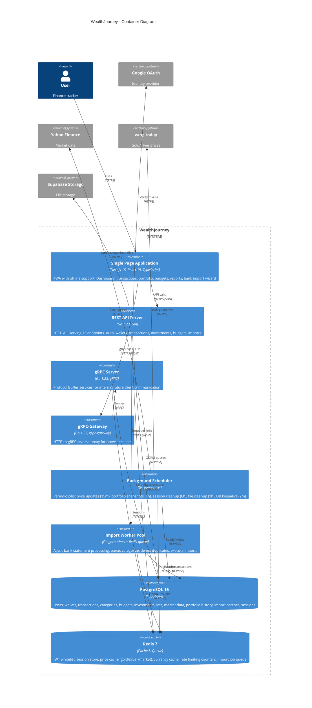

# C4 Level 2: Container Diagram

Shows the major runtime units of WealthJourney and how they communicate.

## Container Responsibilities

### SPA (Next.js 15)
- Server-side rendered pages with App Router
- PWA support (installable, offline-capable)
- Auto-generated React Query hooks from Protobuf
- Mobile-first responsive design (800px breakpoint)
- Feature modules: auth, wallet, transaction, investment, budget, import, prices, report

### REST API Server (Gin)
- 75 REST endpoints across 10 route groups
- JWT authentication with Redis session whitelist
- Rate limiting (general + import-specific)
- CORS configuration for SPA origin

### gRPC Server
- Protobuf-defined service contracts
- Used for internal communication and future mobile clients

### gRPC-Gateway
- Auto-generated HTTP reverse proxy to gRPC services
- Enables browser clients to call gRPC services via REST

### Background Scheduler
- **Price Update Job** (every 15min): Fetches market prices for all user investments
- **Portfolio Snapshot Job** (every 1h): Records historical portfolio values
- **Session Cleanup Job** (every 6h): Removes expired sessions
- **File Cleanup Job** (every 1h): Removes orphaned upload files
- **DB Keepalive Job** (every 2min): Prevents idle connection drops

### Import Worker Pool
- Redis-backed job queue for async import processing
- Handles CSV/Excel parsing, currency conversion, duplicate detection
- Supports job cancellation and status polling
