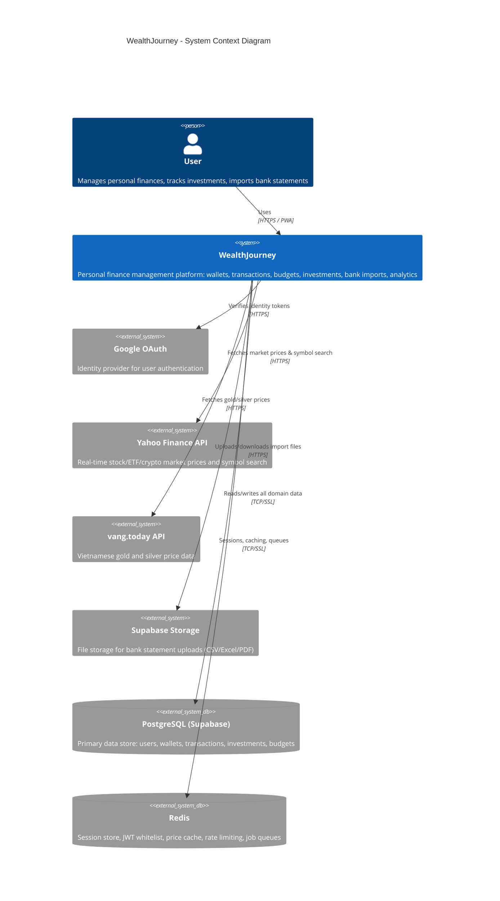

# C4 Level 1: System Context

Shows WealthJourney in its environment — the user and all external systems it interacts with.

## External System Details

| System | Purpose | Protocol | Rate Limits |
|--------|---------|----------|-------------|
| Google OAuth | User authentication via ID tokens | HTTPS | N/A |
| Yahoo Finance | Market prices, symbol search | HTTPS | 120 req/min (self-imposed) |
| vang.today | Gold & silver prices (Vietnam market) | HTTPS | 15-min cache TTL |
| Supabase Storage | Bank statement file upload/download | HTTPS | Per-project limits |
| PostgreSQL | All persistent domain data | TCP/SSL (port 5432) | Connection pool: 10 |
| Redis | Ephemeral data: sessions, cache, queues | TCP/SSL (port 6379) | N/A |
