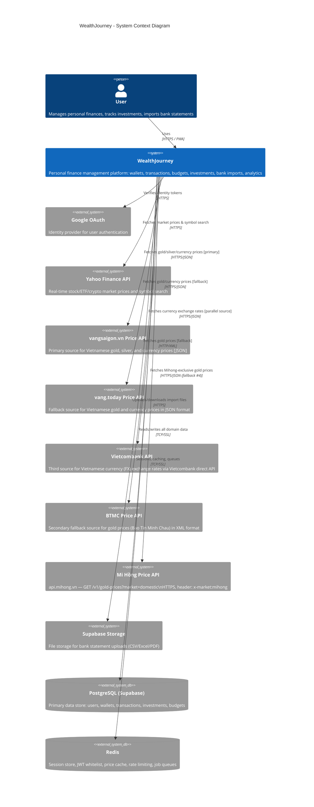

# C4 Level 1: System Context

Shows WealthJourney in its environment — the user and all external systems it interacts with.

## External System Details

| System | Purpose | Protocol | Rate Limits |
|--------|---------|----------|-------------|
| Google OAuth | User authentication via ID tokens | HTTPS | N/A |
| Yahoo Finance | Market prices, symbol search | HTTPS | 120 req/min (self-imposed) |
| vangsaigon.vn | Gold, silver & currency prices (Vietnam market) — **primary source** | HTTPS/JSON | 15-min cache TTL |
| vang.today | Gold & currency prices — **fallback source #1** (waterfall after vangsaigon.vn fails) | HTTPS/JSON | 5-sec per-request timeout |
| Vietcombank API | Currency (FX) exchange rates — **third parallel currency source** (runs concurrently with vangsaigon.vn and vang.today) | HTTPS/JSON | 5-sec per-request timeout |
| BTMC | Gold prices (Bao Tin Minh Chau) — **fallback source #2** (waterfall after vang.today fails) | HTTP/XML | 5-sec per-request timeout |
| Mi Hồng Price API | Mihong-exclusive gold prices (`Mihong_999` etc.) — **fallback source #3** (waterfall after BTMC fails); header `x-market: mihong` required | HTTPS/JSON | 5-sec per-request timeout |
| Supabase Storage | Bank statement file upload/download | HTTPS | Per-project limits |
| PostgreSQL | All persistent domain data | TCP/SSL (port 5432) | Connection pool: 10 |
| Redis | Ephemeral data: sessions, cache, queues | TCP/SSL (port 6379) | N/A |
