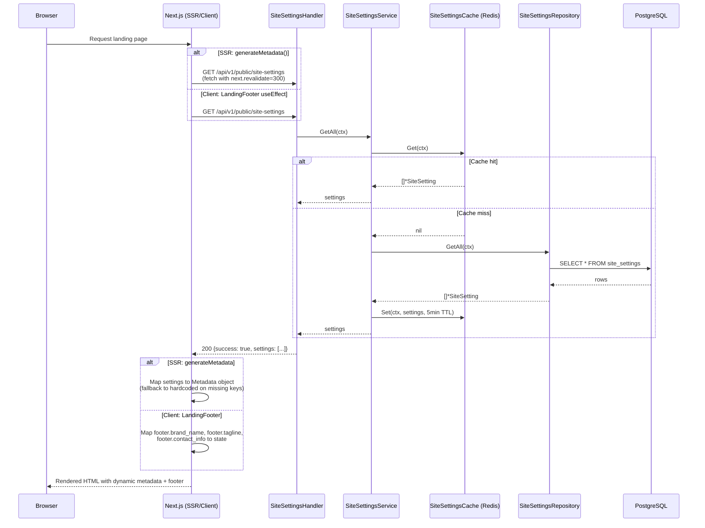
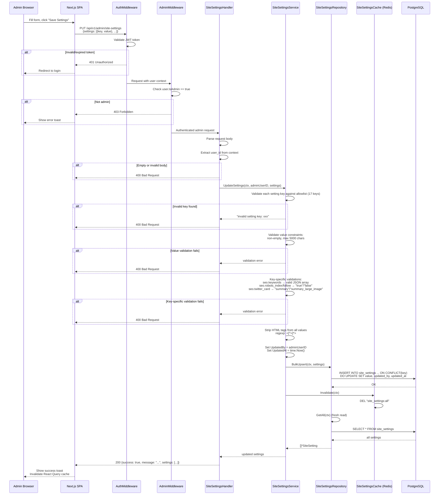
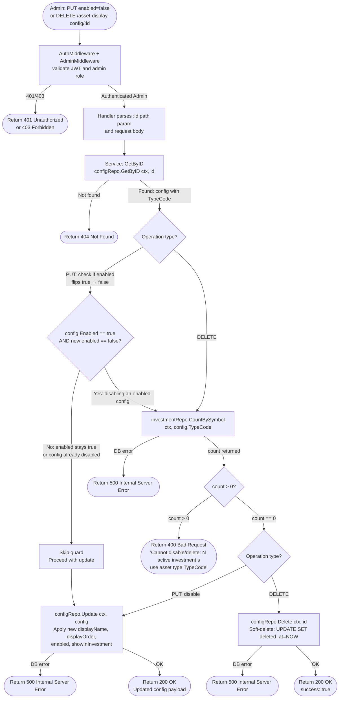

# Admin CMS Domain — Runtime Flows

Admin content management flows covering site settings retrieval (public, cached), updates (admin-only, validated), and asset display config disable/delete with active-investment guard.

## Table of Contents

- [Public Site Settings Fetch](#1-public-site-settings-fetch)
- [Admin Update Site Settings](#2-admin-update-site-settings)
- [Asset Display Config Disable/Delete Guard](#3-asset-display-config-disabledelete-guard)

---

## 1. Public Site Settings Fetch

**Trigger:** Landing page server render (SSR/ISR) or client-side mount
**Endpoint:** `GET /api/v1/public/site-settings`
**Source:** `handlers/site_settings.go`, `domain/service/site_settings_service.go`

### Key Invariants

- **Cache-first reads:** Redis cache is always checked before querying PostgreSQL
- **5-minute TTL:** Cache entries expire after 5 minutes, keeping content reasonably fresh
- **No authentication required:** This is a public endpoint — no JWT needed
- **Hardcoded fallbacks:** Both `generateMetadata()` and `LandingFooter` have full hardcoded fallback values if the API fails or returns incomplete data
- **ISR revalidation:** Next.js `generateMetadata()` uses `next: { revalidate: 300 }` for 5-minute ISR caching

### Error Paths

| Condition | Response | Fallback |
|-----------|----------|----------|
| Redis unavailable | Service queries DB directly | Transparent to caller |
| DB query fails | 500 Internal Server Error | Next.js uses hardcoded FALLBACK_METADATA |
| API unreachable from SSR | `fetchSiteSettings()` returns null | Uses FALLBACK_METADATA constant |
| API unreachable from client | `fetch` catch block fires | LandingFooter uses DEFAULTS constant |

---

## 2. Admin Update Site Settings

**Trigger:** Admin user clicks "Save Settings" on `/dashboard/admin` CMS page
**Endpoint:** `PUT /api/v1/admin/site-settings`
**Source:** `handlers/site_settings.go`, `domain/service/site_settings_service.go`

### Key Invariants

- **Allowlist validation:** Only the 17 predefined keys are accepted — no arbitrary key injection
- **HTML stripping:** All values are sanitized with regex `<[^>]*>` before persistence (XSS prevention at storage layer)
- **Cache invalidation:** Redis cache is always invalidated after successful update, ensuring the next public GET serves fresh data
- **Upsert semantics:** `ON CONFLICT(key) DO UPDATE` ensures idempotent writes — repeated saves are safe
- **Admin-only access:** Two middleware layers (AuthMiddleware + AdminMiddleware) protect the endpoint
- **Audit trail:** `updated_by` records which admin made the change

### Error Paths

| Condition | Response | Rollback |
|-----------|----------|----------|
| JWT invalid/expired | 401 Unauthorized | None (request never reaches handler) |
| User not admin | 403 Forbidden | None (request never reaches handler) |
| Empty request body | 400 Bad Request | None |
| Invalid setting key | 400 "invalid setting key: {key}" | None (no DB write attempted) |
| Empty or oversized value | 400 validation error | None (no DB write attempted) |
| Invalid JSON in seo.keywords | 400 validation error | None (no DB write attempted) |
| DB upsert fails | 500 Internal Server Error | Cache not invalidated (stale cache acceptable) |
| Cache invalidation fails | Logged as warning | Stale cache expires in 5min via TTL |

---

## 3. Asset Display Config Disable/Delete Guard

**Trigger:** Admin calls PUT (with `enabled: false`) or DELETE on `/api/v1/admin/asset-display-config/:id`
**Endpoints:**
- `PUT /api/v1/admin/asset-display-config/:id` — Update (disable guard fires when `enabled` flips true→false)
- `DELETE /api/v1/admin/asset-display-config/:id` — Delete (guard always fires)
**Source:** `domain/service/asset_display_config_service.go`, `domain/repository/investment_repository_impl.go`

### Key Invariants

- **Guard fires only on true→false flip:** `CountBySymbol` is skipped when `enabled` stays `true` or the config is already disabled — avoids unnecessary DB round-trips on non-disabling updates
- **Delete always guarded:** Every `DELETE` triggers `CountBySymbol` regardless of the current `enabled` state
- **404 before count check:** `GetByID` runs first; a missing config returns 404 without querying investments
- **Parameterized query:** `CountBySymbol` uses `WHERE symbol = ?` — GORM parameterized query, no SQL injection risk
- **GORM soft-delete scope:** Count query automatically includes `AND deleted_at IS NULL`, excluding soft-deleted investments
- **Error message reveals only count and TypeCode:** Safe for admin context — TypeCode is a market symbol (e.g., `SJL1L10`), not sensitive data
- **Admin-only:** Both endpoints require `AuthMiddleware` + `AdminMiddleware` — no auth changes needed

### Error Paths

| Condition | Response | Details |
|-----------|----------|---------|
| JWT invalid/expired | 401 Unauthorized | AuthMiddleware rejects before handler |
| User not admin | 403 Forbidden | AdminMiddleware rejects before handler |
| Config not found | 404 Not Found | GetByID returns NotFoundError |
| count > 0 (disable) | 400 Bad Request | "Cannot disable: N active investment(s) use asset type TypeCode" |
| count > 0 (delete) | 400 Bad Request | "Cannot delete: N active investment(s) use asset type TypeCode" |
| CountBySymbol DB error | 500 Internal Server Error | Wrapped internal error, details not exposed |
| configRepo.Update fails | 500 Internal Server Error | Standard handler error propagation |
| configRepo.Delete fails | 500 Internal Server Error | Standard handler error propagation |
