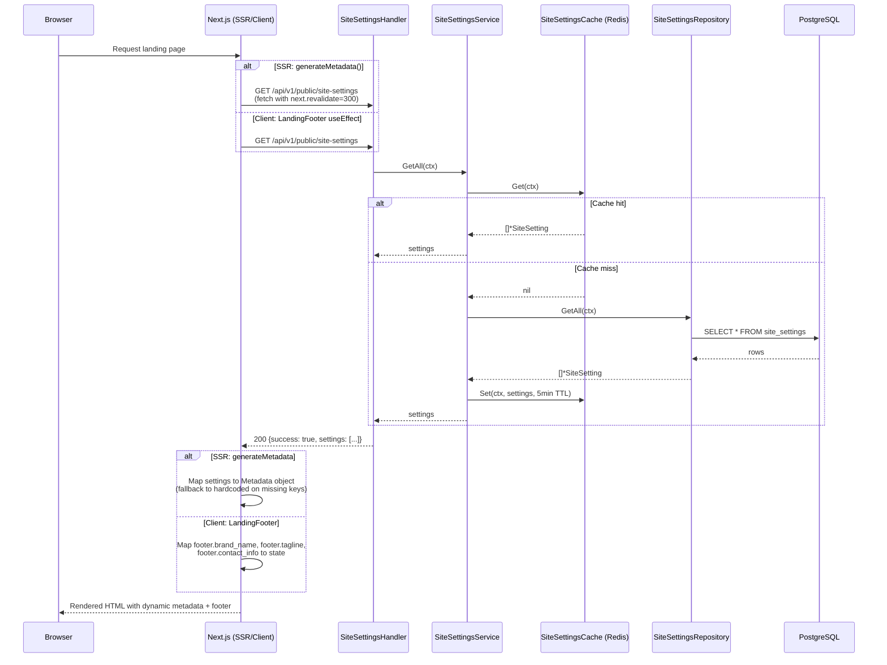
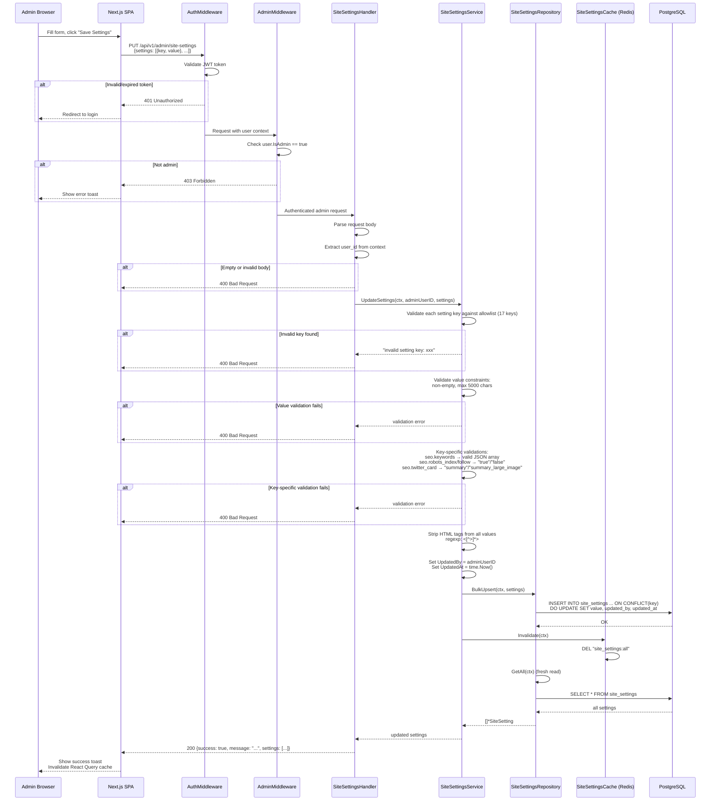

# Admin CMS Domain — Runtime Flows

Admin content management flows covering site settings retrieval (public, cached) and updates (admin-only, validated). The public GET endpoint powers the landing page's dynamic SEO metadata and footer content. The admin PUT endpoint allows admin users to edit settings through the CMS page.

## Table of Contents

- [Public Site Settings Fetch](#1-public-site-settings-fetch)
- [Admin Update Site Settings](#2-admin-update-site-settings)

---

## 1. Public Site Settings Fetch

**Trigger:** Landing page server render (SSR/ISR) or client-side mount
**Endpoint:** `GET /api/v1/public/site-settings`
**Source:** `handlers/site_settings.go`, `domain/service/site_settings_service.go`

### Key Invariants

- **Cache-first reads:** Redis cache is always checked before querying PostgreSQL
- **5-minute TTL:** Cache entries expire after 5 minutes, keeping content reasonably fresh
- **No authentication required:** This is a public endpoint — no JWT needed
- **Hardcoded fallbacks:** Both `generateMetadata()` and `LandingFooter` have full hardcoded fallback values if the API fails or returns incomplete data
- **ISR revalidation:** Next.js `generateMetadata()` uses `next: { revalidate: 300 }` for 5-minute ISR caching

### Error Paths

| Condition | Response | Fallback |
|-----------|----------|----------|
| Redis unavailable | Service queries DB directly | Transparent to caller |
| DB query fails | 500 Internal Server Error | Next.js uses hardcoded FALLBACK_METADATA |
| API unreachable from SSR | `fetchSiteSettings()` returns null | Uses FALLBACK_METADATA constant |
| API unreachable from client | `fetch` catch block fires | LandingFooter uses DEFAULTS constant |

---

## 2. Admin Update Site Settings

**Trigger:** Admin user clicks "Save Settings" on `/dashboard/admin` CMS page
**Endpoint:** `PUT /api/v1/admin/site-settings`
**Source:** `handlers/site_settings.go`, `domain/service/site_settings_service.go`

### Key Invariants

- **Allowlist validation:** Only the 17 predefined keys are accepted — no arbitrary key injection
- **HTML stripping:** All values are sanitized with regex `<[^>]*>` before persistence (XSS prevention at storage layer)
- **Cache invalidation:** Redis cache is always invalidated after successful update, ensuring the next public GET serves fresh data
- **Upsert semantics:** `ON CONFLICT(key) DO UPDATE` ensures idempotent writes — repeated saves are safe
- **Admin-only access:** Two middleware layers (AuthMiddleware + AdminMiddleware) protect the endpoint
- **Audit trail:** `updated_by` records which admin made the change

### Error Paths

| Condition | Response | Rollback |
|-----------|----------|----------|
| JWT invalid/expired | 401 Unauthorized | None (request never reaches handler) |
| User not admin | 403 Forbidden | None (request never reaches handler) |
| Empty request body | 400 Bad Request | None |
| Invalid setting key | 400 "invalid setting key: {key}" | None (no DB write attempted) |
| Empty or oversized value | 400 validation error | None (no DB write attempted) |
| Invalid JSON in seo.keywords | 400 validation error | None (no DB write attempted) |
| DB upsert fails | 500 Internal Server Error | Cache not invalidated (stale cache acceptable) |
| Cache invalidation fails | Logged as warning | Stale cache expires in 5min via TTL |
