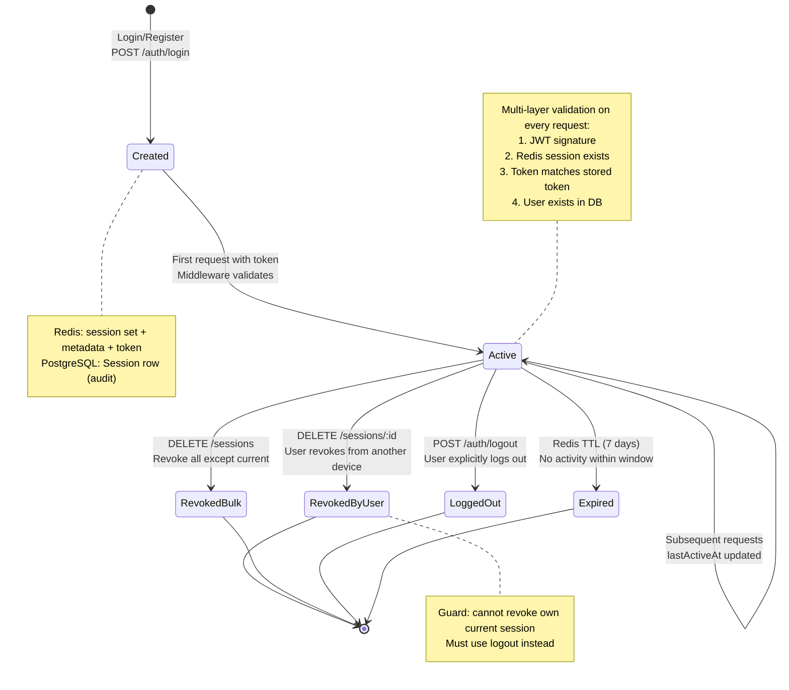
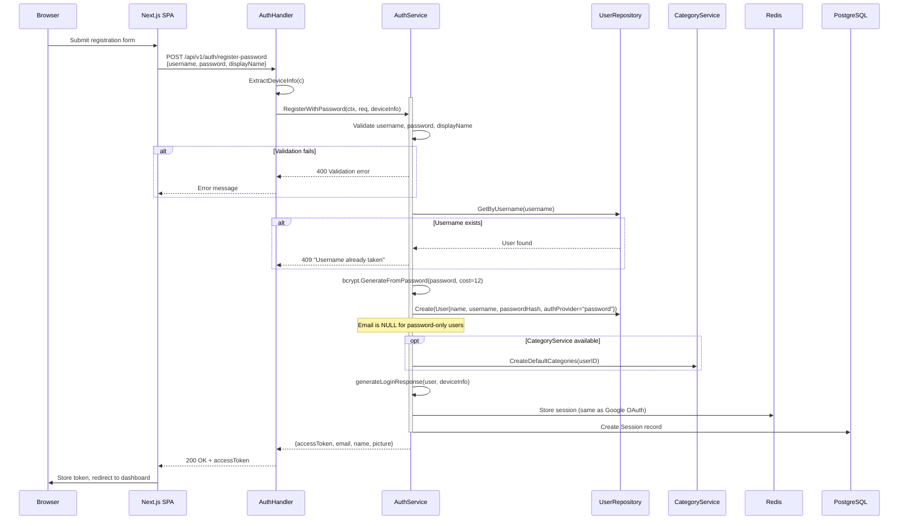
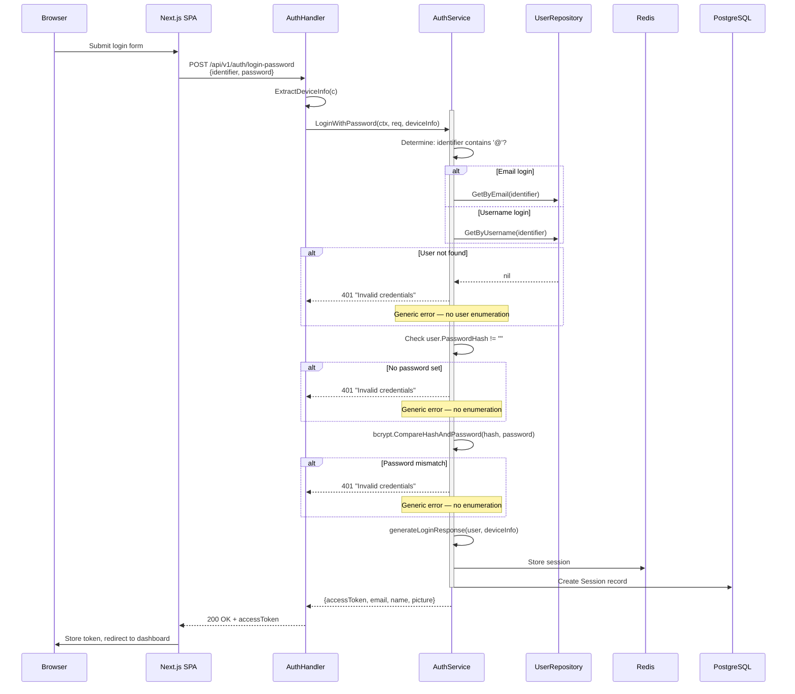
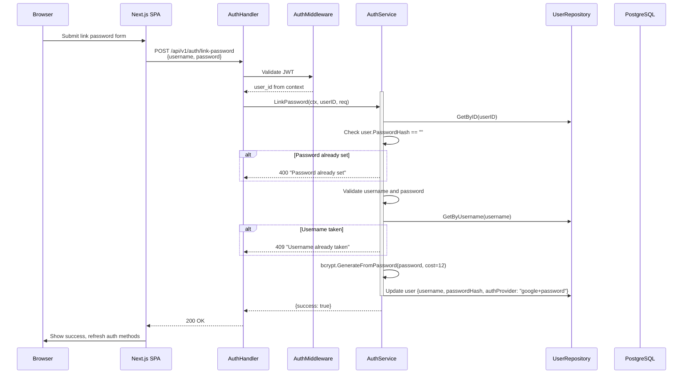
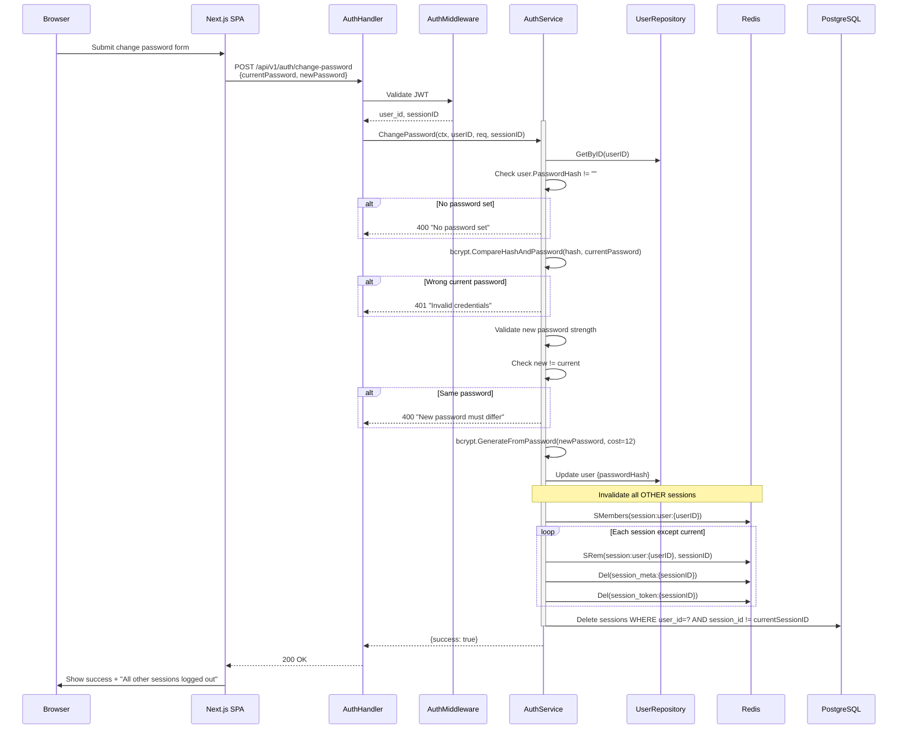
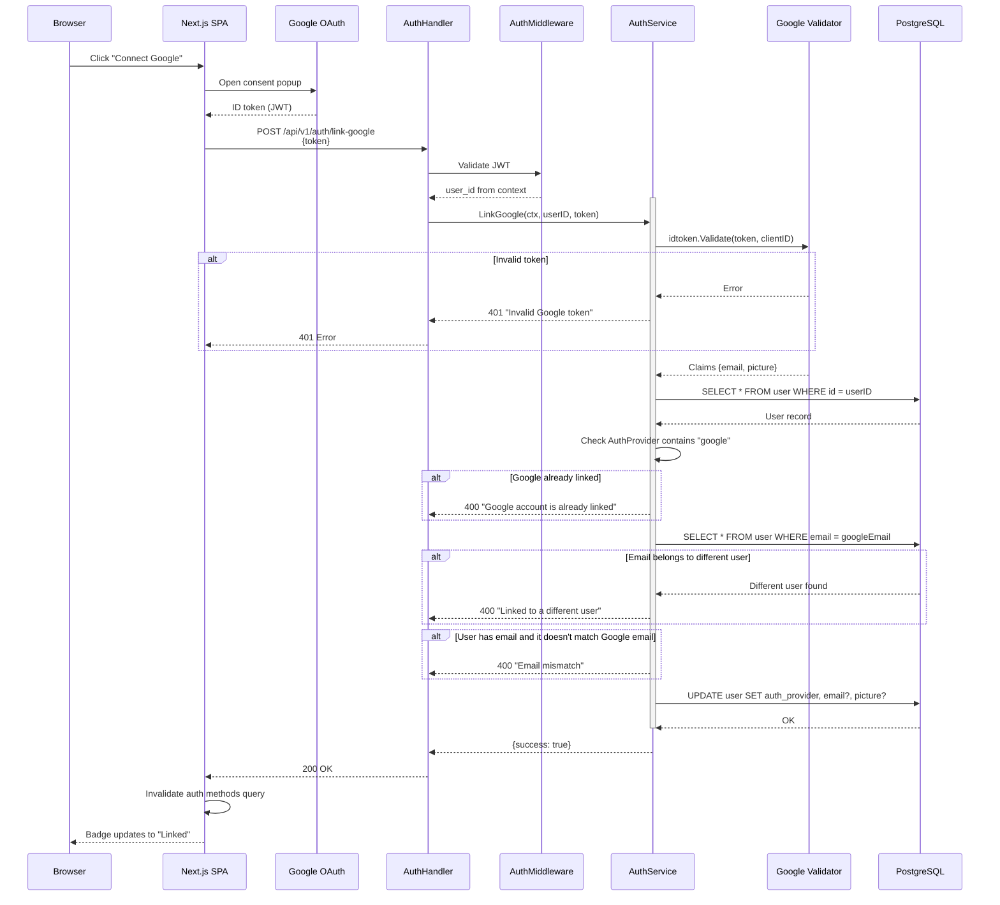

# Authentication Domain — Runtime Flows

Authentication and session management flows covering Google OAuth, JWT token lifecycle, and multi-device session tracking. Redis is the source of truth for active sessions; PostgreSQL serves as an audit trail.

## Table of Contents

- [Google OAuth Register/Login](#1-google-oauth-registerlogin)
- [JWT Validation Middleware Chain](#2-jwt-validation-middleware-chain)
- [Session Lifecycle](#3-session-lifecycle)
- [Password Registration](#4-password-registration)
- [Password Login](#5-password-login)
- [Link Password (Account Linking)](#6-link-password-account-linking)
- [Change Password](#7-change-password)
- [Link Google (Account Linking)](#8-link-google-account-linking)

---

## 1. Google OAuth Register/Login

**Trigger:** User clicks "Sign in with Google" in the SPA
**Endpoint:** `POST /api/v1/auth/register` or `POST /api/v1/auth/login`
**Source:** `domain/auth/auth.go`, `handlers/auth.go`


### Key Invariants

- Google token is validated against the configured `clientID` — tokens from other apps are rejected
- If a user already exists during registration, the flow silently redirects to login (no error)
- Redis is the authoritative session store; PostgreSQL is best-effort backup
- Session TTL is 7 days from creation (both Redis keys and JWT expiration)
- Default categories are created for new users but failures don't block registration

### Locale Sync After Login

After the SPA receives the auth response and stores the JWT token, the client performs locale synchronization:

1. Client reads `preferredLanguage` from the auth response
2. Client sets the `wj-locale` cookie to the user's `preferredLanguage`
3. If the current URL locale does not match `preferredLanguage`, the client redirects to `/{preferredLanguage}/dashboard/home`

This ensures the UI language matches the user's stored preference immediately after login. See [i18n Flows](flow-i18n.md) for the full locale detection and language switch diagrams.

### Error Paths

| Condition | Response | Rollback |
|-----------|----------|----------|
| Missing/empty token in body | 400 Bad Request | None |
| Invalid Google token (expired/wrong audience) | 400 error | None |
| Database error on user lookup | 500 Internal | None |
| Failed to create new user | 500 Internal | None |
| JWT signing failure | 500 Internal | None |
| Redis session storage failure | 500 Internal | User created but no session |
| PostgreSQL session insert failure | Warning logged | Redis session still valid |

---

## 2. JWT Validation Middleware Chain

**Trigger:** Any request to a protected route passes through `AuthMiddleware`
**Source:** `pkg/middleware/auth.go`, `domain/auth/auth.go`


### Key Invariants

- Multi-layer validation: JWT signature + Redis session existence + exact token match + user existence
- Token mismatch detection prevents replay of old tokens after re-login (new login generates new token for same session ID)
- `lastActiveAt` update is best-effort — failure doesn't block the request
- Middleware sets `user_id`, `user_email`, and `user_name` in the Gin context for downstream handlers

### Unprotected Routes

These routes skip the middleware entirely:
- `POST /api/v1/auth/register` (Google OAuth)
- `POST /api/v1/auth/login` (Google OAuth)
- `POST /api/v1/auth/register-password` (username/password)
- `POST /api/v1/auth/login-password` (username or email/password)
- `POST /api/v1/auth/logout`
- `GET /api/v1/auth/verify` (uses header OR query param)

---

## 3. Session Lifecycle

**Trigger:** Login creates a session; logout/revoke/expiration destroys it
**Source:** `handlers/session.go`, `domain/auth/auth.go`



### Session Operations

| Operation | Endpoint | Self-Session? | Effect |
|-----------|----------|---------------|--------|
| **List** | `GET /sessions` | Marked with `isCurrent: true` | Read-only, returns all active sessions |
| **Revoke one** | `DELETE /sessions/:id` | Blocked (400 error) | Removes from Redis; DB best-effort |
| **Revoke all** | `DELETE /sessions` | Preserved (kept active) | Removes all others; partial failure logged |
| **Logout** | `POST /auth/logout` | Yes (self only) | Removes current session from Redis + DB |

### Redis Data Structures

```
session:user:<userID>       → Redis Set of session IDs (TTL: 7d)
session_meta:<sessionID>    → JSON {deviceName, deviceType, ip, createdAt, lastActiveAt, expiresAt} (TTL: 7d)
session_token:<sessionID>   → JWT string for exact-match validation (TTL: 7d)
```

### Error Paths

| Condition | Response | Recovery |
|-----------|----------|----------|
| Revoke own current session | 400 "Use logout instead" | User uses logout endpoint |
| Session not found / not owned | 404 "Session not found" | Stale UI; refresh session list |
| Redis removal partially fails | Error returned | Session may remain active |
| Revoke-all: some sessions fail | Warning logged per session | Successful count returned |
| DB delete fails on logout | Warning logged | Redis removal still succeeds |

---

## 4. Password Registration

**Trigger:** User submits the registration form with username, display name, and password
**Endpoint:** `POST /api/v1/auth/register-password`
**Source:** `domain/auth/auth.go`, `handlers/auth.go`



### Key Invariants

- Password is hashed with bcrypt cost 12 before storage
- Email is not required — password-only users have NULL email
- Username uniqueness checked before creation
- Username is case-sensitive, 3-30 chars, alphanumeric + underscore only
- Password requires 10-72 chars (72 is bcrypt limit)
- Same session creation flow as Google OAuth

### Error Paths

| Condition | Response | Rollback |
|-----------|----------|----------|
| Invalid username/password format | 400 Validation error | None |
| Username already taken | 409 Conflict | None |
| bcrypt hashing failure | 500 Internal | None |
| Database error on user creation | 500 Internal | None |

---

## 5. Password Login

**Trigger:** User submits login form with email/username and password
**Endpoint:** `POST /api/v1/auth/login-password`
**Source:** `domain/auth/auth.go`, `handlers/auth.go`



### Key Invariants

- **No user enumeration**: All failure cases return the same generic "Invalid credentials" error
- Identifier is treated as email if it contains `@`, otherwise as username
- Users with Google-only auth (no password) get the same generic error
- No timing oracle: bcrypt comparison is constant-time

### Error Paths

| Condition | Response | Rollback |
|-----------|----------|----------|
| Missing identifier or password | 400 Bad Request | None |
| User not found (any reason) | 401 "Invalid credentials" | None |
| Password not set on account | 401 "Invalid credentials" | None |
| Password mismatch | 401 "Invalid credentials" | None |

---

## 6. Link Password (Account Linking)

**Trigger:** Google-only user sets a username and password from security settings
**Endpoint:** `POST /api/v1/auth/link-password` (authenticated)
**Source:** `domain/auth/auth.go`, `handlers/auth.go`



### Key Invariants

- Only users without an existing password can link one
- AuthProvider is updated from "google" to "google+password"
- Username uniqueness is enforced
- Existing sessions remain valid (no invalidation needed)

### Error Paths

| Condition | Response | Rollback |
|-----------|----------|----------|
| Not authenticated | 401 Unauthorized | None |
| Password already set | 400 "Password already set" | None |
| Invalid username/password | 400 Validation error | None |
| Username already taken | 409 Conflict | None |

---

## 7. Change Password

**Trigger:** User with existing password changes it from security settings
**Endpoint:** `POST /api/v1/auth/change-password` (authenticated)
**Source:** `domain/auth/auth.go`, `handlers/auth.go`



### Key Invariants

- Current password must be verified before allowing change
- New password must differ from current password
- All other sessions are invalidated (Redis + DB) — only the current session survives
- The current session's JWT remains valid (no re-authentication needed)

### Error Paths

| Condition | Response | Rollback |
|-----------|----------|----------|
| Not authenticated | 401 Unauthorized | None |
| No password set on account | 400 "No password set" | None |
| Wrong current password | 401 "Invalid credentials" | None |
| Weak new password | 400 Validation error | None |
| New password same as current | 400 "New password must differ" | None |
| Partial Redis session cleanup failure | Warning logged | Some sessions may remain active |

---

## 8. Link Google (Account Linking)

**Trigger:** Password-only user clicks "Connect Google" in Security Settings
**Endpoint:** `POST /api/v1/auth/link-google` (authenticated)
**Source:** `domain/auth/auth.go`, `handlers/auth.go`



### Key Invariants

- Google token must be validated server-side (never trust client email)
- Google email must not belong to a different user (prevents account takeover)
- If user has an email set, it must match the Google email
- AuthProvider is updated from "password" to "password+google"
- Email is set from Google if user has no email (password-only registration)
- Picture is updated from Google if currently empty
- Existing sessions remain valid (no invalidation needed)

### Error Paths

| Condition | Response | Rollback |
|-----------|----------|----------|
| Not authenticated | 401 Unauthorized | None |
| Invalid/expired Google token | 401 "Invalid Google token" | None |
| Google already linked | 400 "Google account is already linked" | None |
| Email belongs to different user | 400 "Linked to a different user" | None |
| Email mismatch (user has different email) | 400 "Email mismatch" | None |
| Database error | 500 Internal Error | None (no partial state) |
