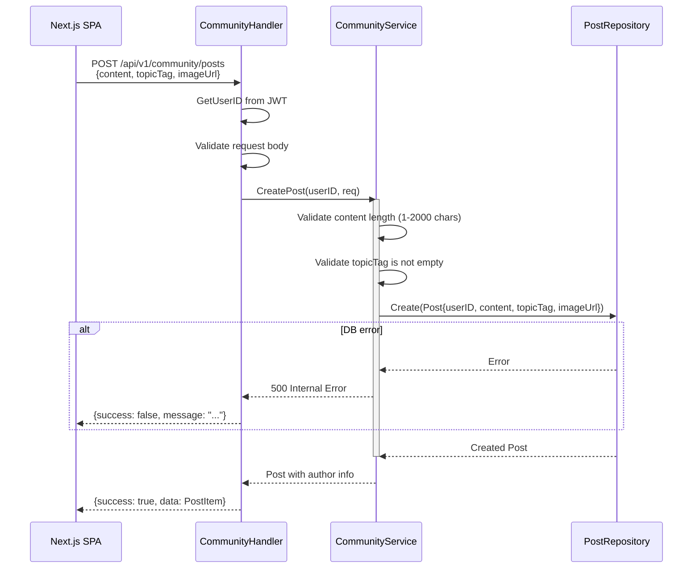
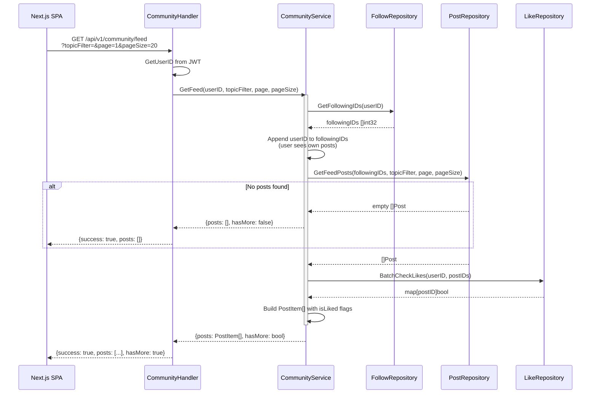
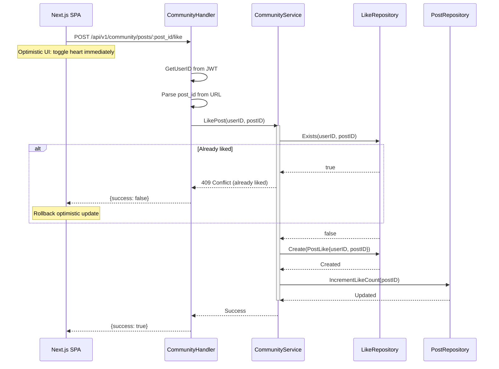
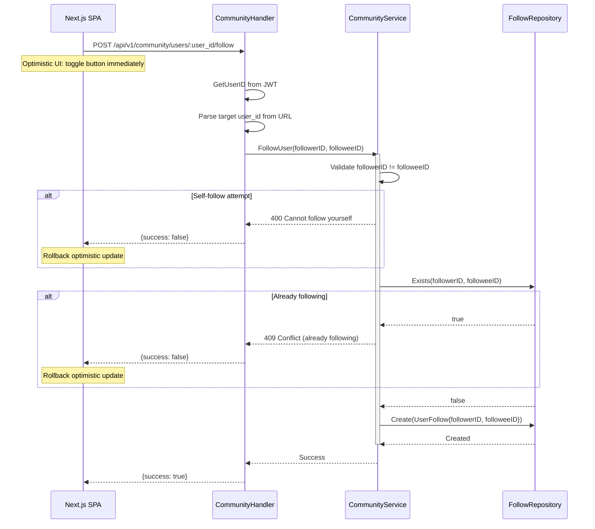
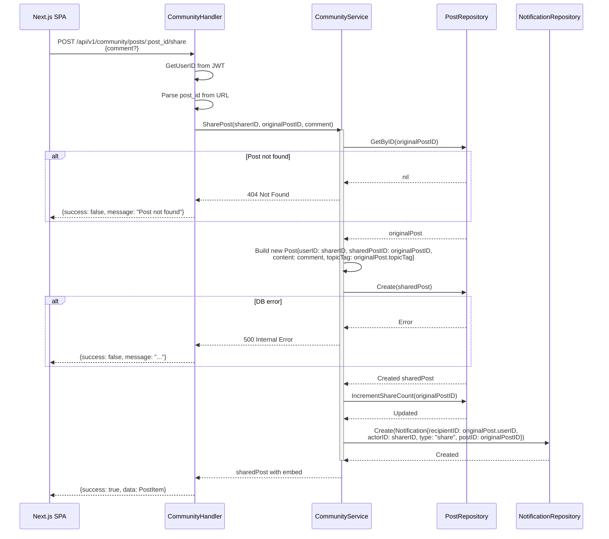
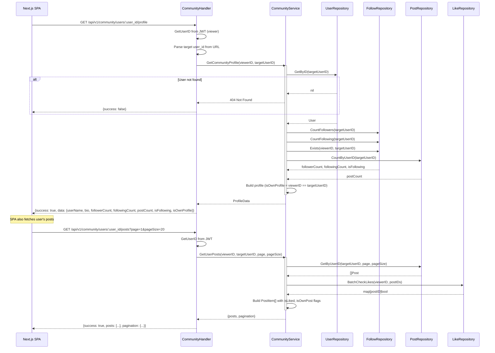
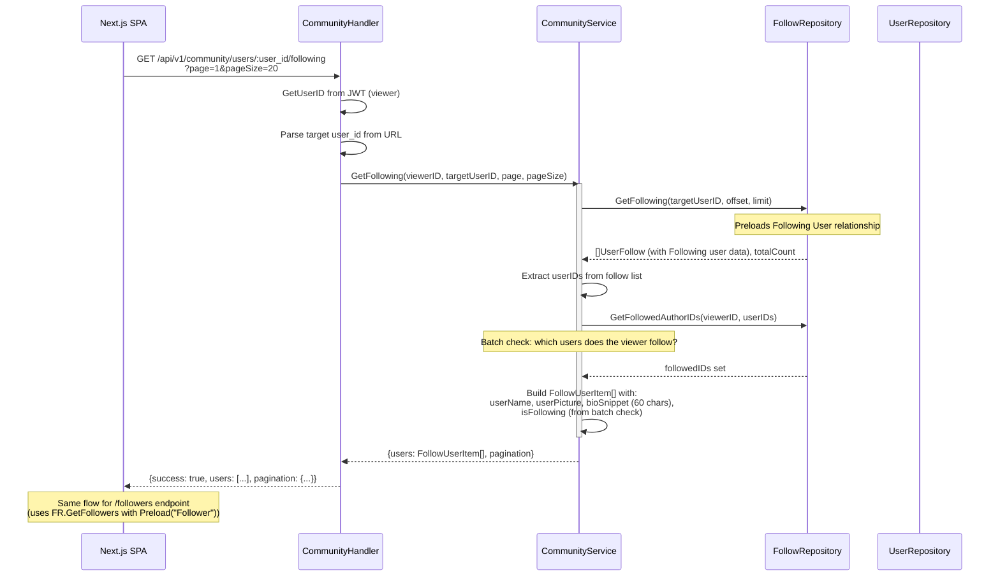

# Community Domain — Runtime Flows

Community social feed flows covering post creation, feed generation, like/unlike toggling, follow/unfollow operations, and Phase 2 social features (share post, notifications, saved posts). All operations require JWT authentication and enforce content ownership rules.

## Table of Contents

- [Create Post](#1-create-post)
- [Feed Generation](#2-feed-generation)
- [Like / Unlike Post](#3-like--unlike-post)
- [Follow / Unfollow User](#4-follow--unfollow-user)
- [Share Post](#5-share-post)
- [View User Profile](#6-view-user-profile)
- [Get Following / Followers List](#7-get-following--followers-list)

---

## 1. Create Post

**Trigger:** User submits "Create Post" form with content, topic tag, and optional image URL
**Endpoint:** `POST /api/v1/community/posts`
**Source:** `domain/service/community_service.go`, `handlers/community.go`

**Key Invariants:**
- Content must be 1-2000 characters
- Topic tag must not be empty
- Author ID comes from JWT (never from request body)
- Image URL is optional; no server-side upload in Phase 1

**Error Paths:**

| Condition | Response | Rollback |
|-----------|----------|----------|
| Missing/invalid JWT | 401 Unauthorized | None |
| Empty content | 400 Validation Error | None |
| Empty topic tag | 400 Validation Error | None |
| DB write failure | 500 Internal Error | None |

---

## 2. Feed Generation

**Trigger:** User opens community page or scrolls to load more posts
**Endpoint:** `GET /api/v1/community/feed?topicFilter=&page=1&pageSize=20`
**Source:** `domain/service/community_service.go`, `handlers/community.go`

**Key Invariants:**
- Feed shows posts from users the current user follows + own posts
- Posts are ordered by createdAt descending (newest first)
- Topic filter is optional; empty string returns all topics
- `isLiked` is resolved per-post for the requesting user
- Page size capped at reasonable limit to prevent abuse

**Error Paths:**

| Condition | Response | Rollback |
|-----------|----------|----------|
| Missing/invalid JWT | 401 Unauthorized | None |
| Invalid page/pageSize | 400 Validation Error | None |
| DB read failure | 500 Internal Error | None |

---

## 3. Like / Unlike Post

**Trigger:** User clicks the heart button on a post
**Endpoint:** `POST /api/v1/community/posts/:post_id/like` (like) or `DELETE /api/v1/community/posts/:post_id/like` (unlike)
**Source:** `domain/service/community_service.go`, `handlers/community.go`

**Unlike flow** mirrors the like flow:
1. Check like exists → if not, return 404
2. Delete the PostLike record
3. Decrement like count on the Post

**Key Invariants:**
- One like per user per post (unique constraint)
- Like count on Post is denormalized for read performance
- Frontend uses optimistic updates with rollback on error
- Like count cannot go below 0

**Error Paths:**

| Condition | Response | Rollback |
|-----------|----------|----------|
| Missing/invalid JWT | 401 Unauthorized | None |
| Post not found | 404 Not Found | None |
| Already liked (on like) | 409 Conflict | Frontend rollback |
| Not liked (on unlike) | 404 Not Found | Frontend rollback |

---

## 4. Follow / Unfollow User

**Trigger:** User clicks "Theo dõi" (Follow) or "Đang theo dõi" (Unfollow) button
**Endpoint:** `POST /api/v1/community/users/:user_id/follow` (follow) or `DELETE /api/v1/community/users/:user_id/follow` (unfollow)
**Source:** `domain/service/community_service.go`, `handlers/community.go`

**Unfollow flow** mirrors the follow flow:
1. Validate not self-unfollow
2. Check follow exists → if not, return 404
3. Delete the UserFollow record

**Key Invariants:**
- Users cannot follow themselves
- One follow relationship per user pair (unique constraint)
- Follow/unfollow affects which posts appear in the user's feed
- Frontend uses optimistic updates with rollback on error

**Error Paths:**

| Condition | Response | Rollback |
|-----------|----------|----------|
| Missing/invalid JWT | 401 Unauthorized | None |
| Self-follow attempt | 400 Bad Request | Frontend rollback |
| Already following (on follow) | 409 Conflict | Frontend rollback |
| Not following (on unfollow) | 404 Not Found | Frontend rollback |
| Target user not found | 404 Not Found | Frontend rollback |

---

## 5. Share Post

**Trigger:** User clicks "Share" on a post, writes an optional comment in `SharePostModal`, and submits
**Endpoint:** `POST /api/v1/community/posts/:post_id/share`
**Source:** `domain/service/community_service.go`, `handlers/community.go`

**Key Invariants:**
- A share creates a new Post record referencing the original via `sharedPostID`
- The original post's `shareCount` is incremented atomically
- A notification is dispatched to the original post's author (skipped if sharer == author)
- The optional `comment` field is the sharer's own caption (may be empty)
- The original post is embedded in the feed response as `SharedPostEmbed` for display
- Shared posts carry the original's `topicTag` so they appear in the same topic filter

**Error Paths:**

| Condition | Response | Rollback |
|-----------|----------|----------|
| Missing/invalid JWT | 401 Unauthorized | None |
| Original post not found | 404 Not Found | None |
| Comment exceeds 2000 chars | 400 Validation Error | None |
| DB write failure (new post) | 500 Internal Error | None |
| DB failure (share count increment) | 500 Internal Error | New post is rolled back |

---

## 6. View User Profile

**Trigger:** User clicks an avatar or username in the feed, or navigates to own profile from sidebar
**Endpoint:** `GET /api/v1/community/users/:user_id/profile` + `GET /api/v1/community/users/:user_id/posts`
**Source:** `domain/service/community_service.go`, `handlers/community.go`

**Key Invariants:**
- Profile data includes `isOwnProfile` flag to control UI (edit bio vs follow button)
- Viewer's follow status is resolved (`isFollowing`) for the follow button
- Posts are paginated and include the viewer's like/save state
- Bio editing is only available when `isOwnProfile` is true

**Error Paths:**

| Condition | Response | Rollback |
|-----------|----------|----------|
| Missing/invalid JWT | 401 Unauthorized | None |
| Target user not found | 404 Not Found | None |
| Invalid page/pageSize | 400 Validation Error | None |
| DB read failure | 500 Internal Error | None |

---

## 7. Get Following / Followers List

**Trigger:** User clicks "Đang theo dõi" (Following) or "Người theo dõi" (Followers) count on a profile
**Endpoint:** `GET /api/v1/community/users/:user_id/following` or `GET /api/v1/community/users/:user_id/followers`
**Source:** `domain/service/community_service.go`, `handlers/community.go`

**Key Invariants:**
- Results are paginated with total count for "load more" support
- Each user includes `isFollowing` from the viewer's perspective (enables follow/unfollow buttons in the list)
- Bio snippet is truncated to 60 characters for compact display
- Users are ordered by follow creation time (newest first)
- Viewer cannot see follow lists of non-existent users (404)

**Error Paths:**

| Condition | Response | Rollback |
|-----------|----------|----------|
| Missing/invalid JWT | 401 Unauthorized | None |
| Target user not found | 404 Not Found | None |
| Invalid page/pageSize | 400 Validation Error | None |
| DB read failure | 500 Internal Error | None |
