# Community Domain — Runtime Flows

Community social feed flows covering post creation, feed generation, like/unlike toggling, follow/unfollow operations, Phase 2 social features (share post, notifications, saved posts), and Phase 3 advanced features (image upload, edit comment, reply threads, SSE notification stream, reply list). All operations require JWT authentication and enforce content ownership rules.

## Table of Contents

- [Create Post](#1-create-post)
- [Feed Generation](#2-feed-generation)
- [Like / Unlike Post](#3-like--unlike-post)
- [Follow / Unfollow User](#4-follow--unfollow-user)
- [Share Post](#5-share-post)
- [View User Profile](#6-view-user-profile)
- [Get Following / Followers List](#7-get-following--followers-list)
- [Image Upload](#8-image-upload)
- [Edit Comment](#9-edit-comment)
- [Reply Thread (Create Reply)](#10-reply-thread-create-reply)
- [SSE Notification Stream](#11-sse-notification-stream)
- [Get Reply List](#12-get-reply-list)

---

## 1. Create Post

**Trigger:** User submits "Create Post" form with content, topic tag, and optional image URL
**Endpoint:** `POST /api/v1/community/posts`
**Source:** `domain/service/community_service.go`, `handlers/community.go`

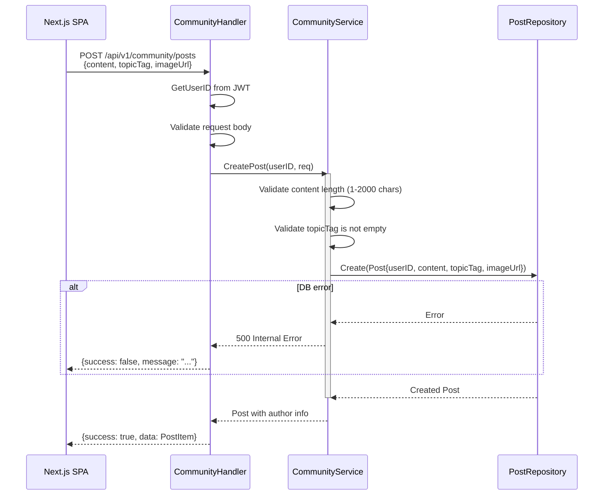

**Key Invariants:**
- Content must be 1-2000 characters
- Topic tag must not be empty
- Author ID comes from JWT (never from request body)
- Image URL is optional; no server-side upload in Phase 1

**Error Paths:**

| Condition | Response | Rollback |
|-----------|----------|----------|
| Missing/invalid JWT | 401 Unauthorized | None |
| Empty content | 400 Validation Error | None |
| Empty topic tag | 400 Validation Error | None |
| DB write failure | 500 Internal Error | None |

---

## 2. Feed Generation

**Trigger:** User opens community page or scrolls to load more posts
**Endpoint:** `GET /api/v1/community/feed?topicFilter=&page=1&pageSize=20`
**Source:** `domain/service/community_service.go`, `handlers/community.go`

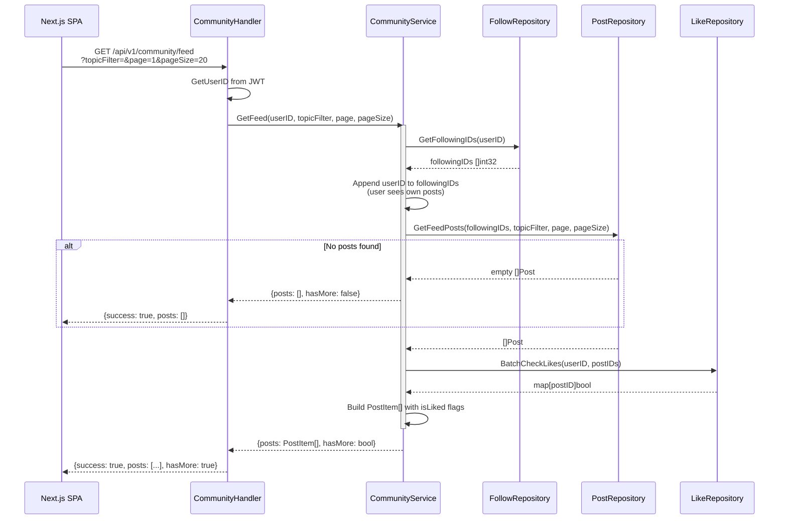

**Key Invariants:**
- Feed shows posts from users the current user follows + own posts
- Posts are ordered by createdAt descending (newest first)
- Topic filter is optional; empty string returns all topics
- `isLiked` is resolved per-post for the requesting user
- Page size capped at reasonable limit to prevent abuse

**Error Paths:**

| Condition | Response | Rollback |
|-----------|----------|----------|
| Missing/invalid JWT | 401 Unauthorized | None |
| Invalid page/pageSize | 400 Validation Error | None |
| DB read failure | 500 Internal Error | None |

---

## 3. Like / Unlike Post

**Trigger:** User clicks the heart button on a post
**Endpoint:** `POST /api/v1/community/posts/:post_id/like` (like) or `DELETE /api/v1/community/posts/:post_id/like` (unlike)
**Source:** `domain/service/community_service.go`, `handlers/community.go`

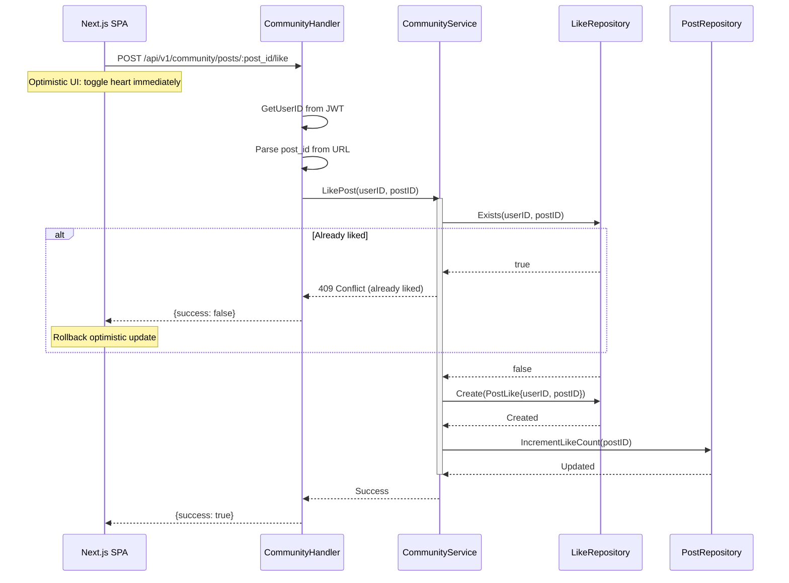

**Unlike flow** mirrors the like flow:
1. Check like exists → if not, return 404
2. Delete the PostLike record
3. Decrement like count on the Post

**Key Invariants:**
- One like per user per post (unique constraint)
- Like count on Post is denormalized for read performance
- Frontend uses optimistic updates with rollback on error
- Like count cannot go below 0

**Error Paths:**

| Condition | Response | Rollback |
|-----------|----------|----------|
| Missing/invalid JWT | 401 Unauthorized | None |
| Post not found | 404 Not Found | None |
| Already liked (on like) | 409 Conflict | Frontend rollback |
| Not liked (on unlike) | 404 Not Found | Frontend rollback |

---

## 4. Follow / Unfollow User

**Trigger:** User clicks "Theo dõi" (Follow) or "Đang theo dõi" (Unfollow) button
**Endpoint:** `POST /api/v1/community/users/:user_id/follow` (follow) or `DELETE /api/v1/community/users/:user_id/follow` (unfollow)
**Source:** `domain/service/community_service.go`, `handlers/community.go`

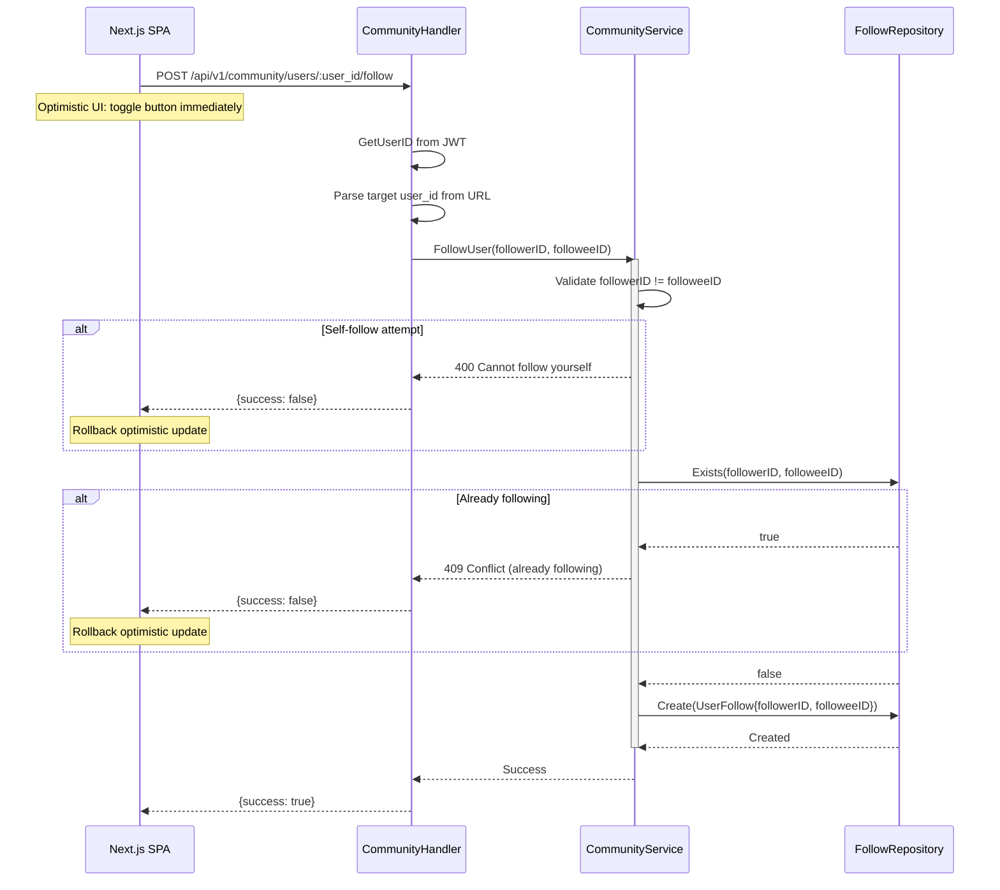

**Unfollow flow** mirrors the follow flow:
1. Validate not self-unfollow
2. Check follow exists → if not, return 404
3. Delete the UserFollow record

**Key Invariants:**
- Users cannot follow themselves
- One follow relationship per user pair (unique constraint)
- Follow/unfollow affects which posts appear in the user's feed
- Frontend uses optimistic updates with rollback on error

**Error Paths:**

| Condition | Response | Rollback |
|-----------|----------|----------|
| Missing/invalid JWT | 401 Unauthorized | None |
| Self-follow attempt | 400 Bad Request | Frontend rollback |
| Already following (on follow) | 409 Conflict | Frontend rollback |
| Not following (on unfollow) | 404 Not Found | Frontend rollback |
| Target user not found | 404 Not Found | Frontend rollback |

---

## 5. Share Post

**Trigger:** User clicks "Share" on a post, writes an optional comment in `SharePostModal`, and submits
**Endpoint:** `POST /api/v1/community/posts/:post_id/share`
**Source:** `domain/service/community_service.go`, `handlers/community.go`

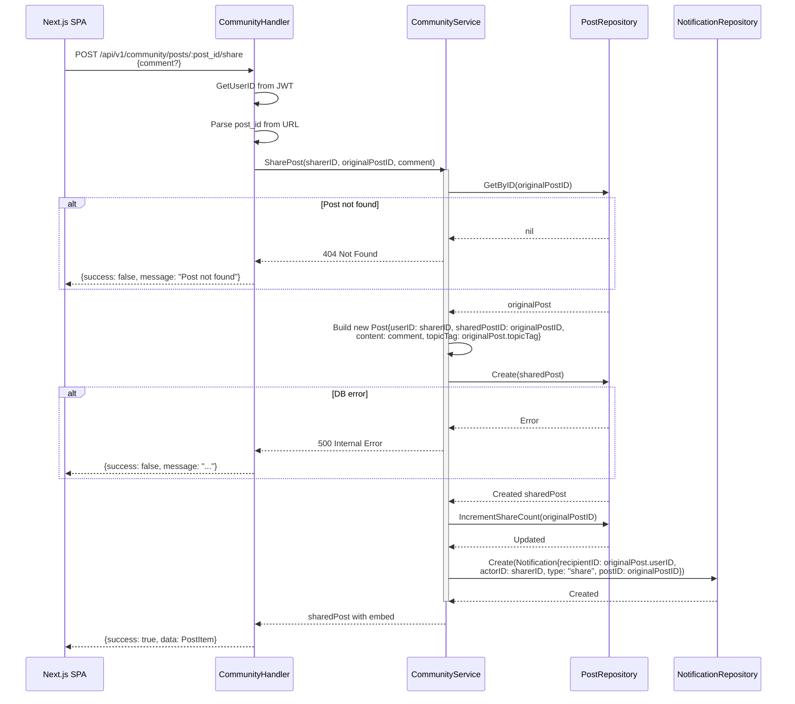

**Key Invariants:**
- A share creates a new Post record referencing the original via `sharedPostID`
- The original post's `shareCount` is incremented atomically
- A notification is dispatched to the original post's author (skipped if sharer == author)
- The optional `comment` field is the sharer's own caption (may be empty)
- The original post is embedded in the feed response as `SharedPostEmbed` for display
- Shared posts carry the original's `topicTag` so they appear in the same topic filter

**Error Paths:**

| Condition | Response | Rollback |
|-----------|----------|----------|
| Missing/invalid JWT | 401 Unauthorized | None |
| Original post not found | 404 Not Found | None |
| Comment exceeds 2000 chars | 400 Validation Error | None |
| DB write failure (new post) | 500 Internal Error | None |
| DB failure (share count increment) | 500 Internal Error | New post is rolled back |

---

## 6. View User Profile

**Trigger:** User clicks an avatar or username in the feed, or navigates to own profile from sidebar
**Endpoint:** `GET /api/v1/community/users/:user_id/profile` + `GET /api/v1/community/users/:user_id/posts`
**Source:** `domain/service/community_service.go`, `handlers/community.go`

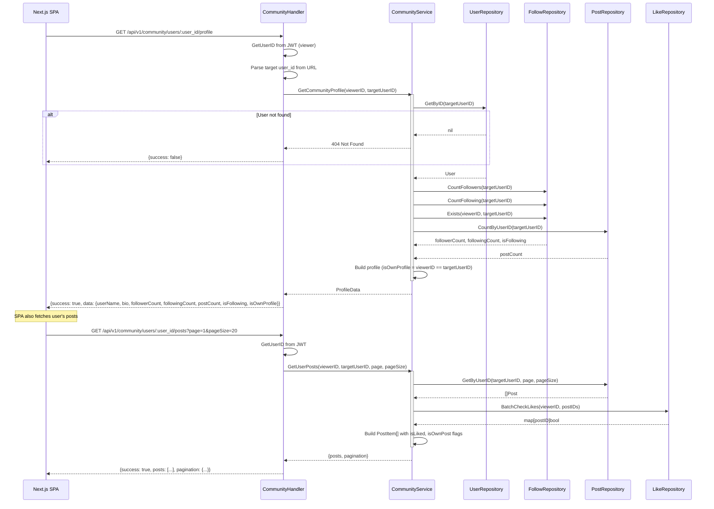

**Key Invariants:**
- Profile data includes `isOwnProfile` flag to control UI (edit bio vs follow button)
- Viewer's follow status is resolved (`isFollowing`) for the follow button
- Posts are paginated and include the viewer's like/save state
- Bio editing is only available when `isOwnProfile` is true

**Error Paths:**

| Condition | Response | Rollback |
|-----------|----------|----------|
| Missing/invalid JWT | 401 Unauthorized | None |
| Target user not found | 404 Not Found | None |
| Invalid page/pageSize | 400 Validation Error | None |
| DB read failure | 500 Internal Error | None |

---

## 7. Get Following / Followers List

**Trigger:** User clicks "Đang theo dõi" (Following) or "Người theo dõi" (Followers) count on a profile
**Endpoint:** `GET /api/v1/community/users/:user_id/following` or `GET /api/v1/community/users/:user_id/followers`
**Source:** `domain/service/community_service.go`, `handlers/community.go`

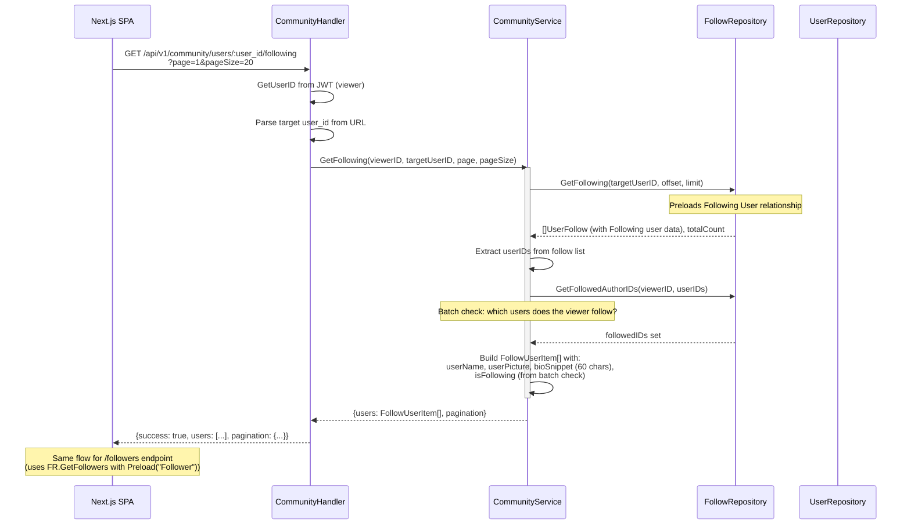

**Key Invariants:**
- Results are paginated with total count for "load more" support
- Each user includes `isFollowing` from the viewer's perspective (enables follow/unfollow buttons in the list)
- Bio snippet is truncated to 60 characters for compact display
- Users are ordered by follow creation time (newest first)
- Viewer cannot see follow lists of non-existent users (404)

**Error Paths:**

| Condition | Response | Rollback |
|-----------|----------|----------|
| Missing/invalid JWT | 401 Unauthorized | None |
| Target user not found | 404 Not Found | None |
| Invalid page/pageSize | 400 Validation Error | None |
| DB read failure | 500 Internal Error | None |

---

## 8. Image Upload

**Trigger:** User selects an image file in a post editor, profile edit modal, or cover photo picker
**Endpoint:** `POST /api/v1/community/upload` (multipart/form-data)
**Source:** `handlers/community.go` `UploadImage`, `domain/service/community_service.go` `UploadImage`, `pkg/imaging/imaging.go`

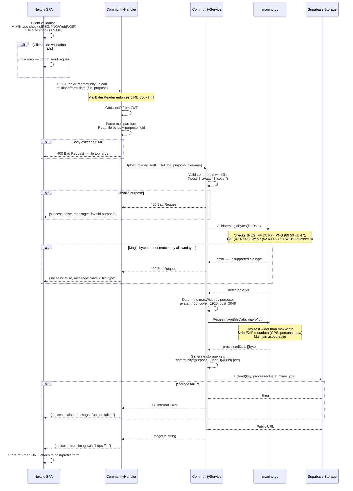

### Key Invariants

- Magic bytes validation is server-side (not relying on Content-Type header from client) — prevents polyglot file attacks
- EXIF metadata is stripped from all images before storage (prevents GPS/personal data leakage)
- Storage keys use UUID-based filenames — no user input appears in the storage path
- File size limit is enforced both at Go `MaxBytesReader` level (hard cut) and as a client-side UX guard (soft pre-check)
- Rate limit: max 10 uploads per user per minute
- The `purpose` field determines the resize threshold; it is validated against a fixed whitelist

### Error Paths

| Condition | HTTP Status | Details |
|-----------|-------------|---------|
| Missing/invalid JWT | 401 Unauthorized | Auth middleware rejects before handler |
| Body exceeds 5 MB | 400 Bad Request | Go `MaxBytesReader` truncates and returns error |
| Client sends non-image file | 400 Bad Request | Magic bytes check fails; Content-Type is untrusted |
| Invalid purpose value | 400 Bad Request | Only "post", "avatar", "cover" are accepted |
| Image processing/resize failure | 500 Internal Error | Imaging library error |
| Supabase Storage unavailable | 500 Internal Error | No partial state; image is never referenced |

---

## 9. Edit Comment

**Trigger:** User clicks the edit option on their own comment and submits the updated text inline
**Endpoint:** `PUT /api/v1/community/comments/{commentId}`
**Source:** `handlers/community.go` `UpdateComment`, `domain/service/community_service.go` `UpdateComment`

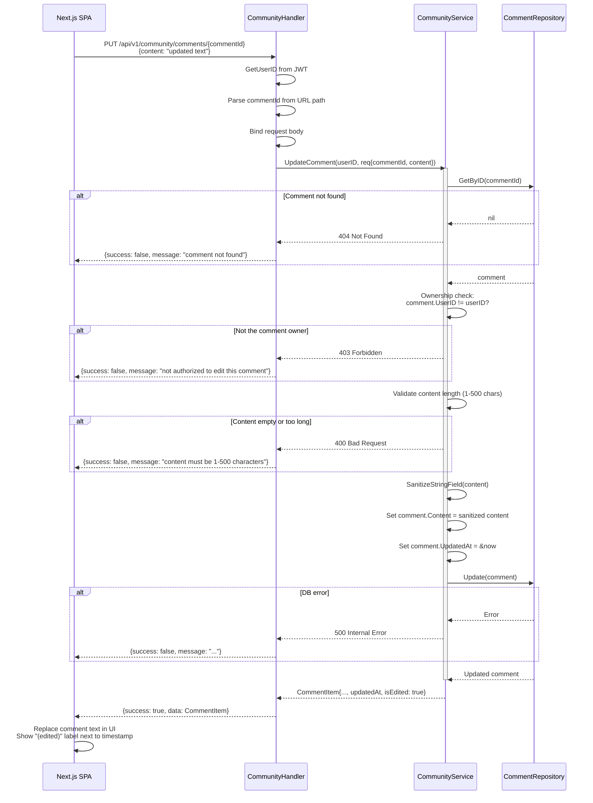

### Key Invariants

- Ownership is enforced in the service layer using the JWT-derived `userID` (not a request body field)
- `UpdatedAt` is always set to server time on successful edit — clients cannot supply a custom timestamp
- `isEdited` is derived at read time: `updatedAt != nil` indicates the comment has been edited
- Content is sanitized via the same `SanitizeStringField` function used at creation (XSS prevention)
- The comment's `PostID`, `ParentCommentID`, and `UserID` are immutable — only `Content` and `UpdatedAt` change

### Error Paths

| Condition | HTTP Status | Details |
|-----------|-------------|---------|
| Missing/invalid JWT | 401 Unauthorized | Auth middleware rejects before handler |
| Comment not found | 404 Not Found | `commentRepo.GetByID` returns nil |
| Requester is not the comment owner | 403 Forbidden | `comment.UserID != userID` check in service |
| Content is empty | 400 Bad Request | Minimum length 1 character |
| Content exceeds 500 characters | 400 Bad Request | Maximum length 500 characters |
| DB save failure | 500 Internal Error | No partial state; original comment is unchanged |

---

## 10. Reply Thread (Create Reply)

**Trigger:** User clicks "Reply" on a root comment, types a reply, and submits
**Endpoint:** `POST /api/v1/community/posts/{postId}/comments` with `parentCommentId > 0` in body
**Source:** `handlers/community.go` `CreateComment`, `domain/service/community_service.go` `CreateComment`

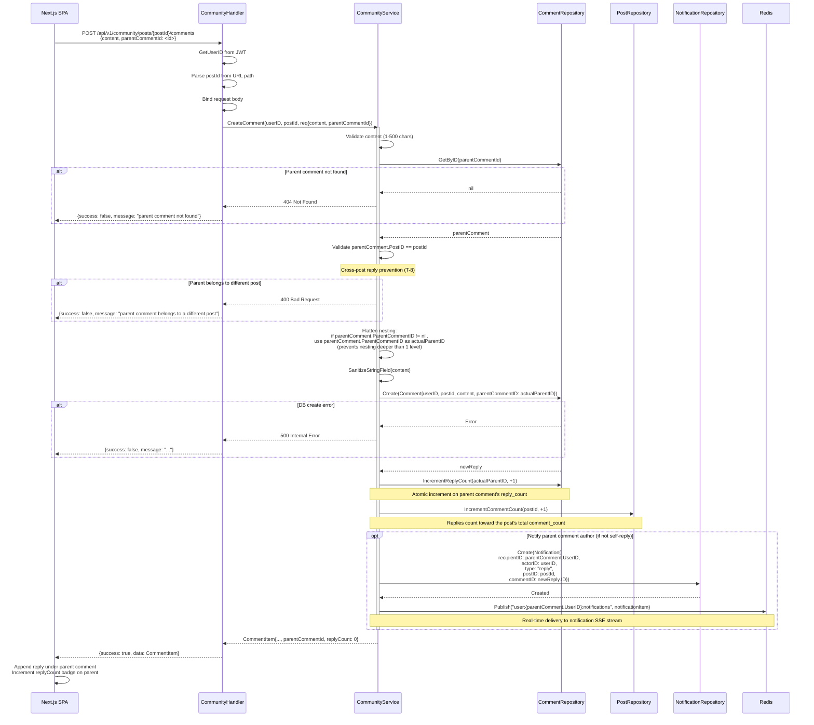

### Key Invariants

- Nesting is enforced to exactly 1 level: if the targeted parent is itself a reply, the new reply is re-parented to the grandparent (the original root comment)
- Cross-post reply prevention: the parent comment's `PostID` must match the URL `postId` parameter
- Both `IncrementReplyCount` (on the parent comment) and `IncrementCommentCount` (on the post) are executed — replies count toward total post comment count
- Notifications are published to Redis synchronously after DB write; Redis failure does not fail the request (best-effort)
- `GetComments` (root comment listing) excludes replies (`WHERE parent_comment_id IS NULL`) so they only appear when the reply list is explicitly loaded

### Error Paths

| Condition | HTTP Status | Details |
|-----------|-------------|---------|
| Missing/invalid JWT | 401 Unauthorized | Auth middleware rejects before handler |
| Parent comment not found | 404 Not Found | `commentRepo.GetByID` returns nil |
| Parent comment belongs to a different post | 400 Bad Request | Cross-post reply prevention check |
| Content empty or exceeds 500 chars | 400 Bad Request | Validation before DB write |
| DB create failure | 500 Internal Error | No reply is created; counts are not incremented |
| `IncrementReplyCount` failure | 500 Internal Error | Reply is rolled back conceptually (inconsistency risk) |

---

## 11. SSE Notification Stream

**Trigger:** Frontend mounts the notification bell component (community layout or dashboard layout)
**Endpoint:** `GET /api/v1/community/notifications/stream?token=<jwt>`
**Source:** `handlers/community.go` `StreamNotifications`

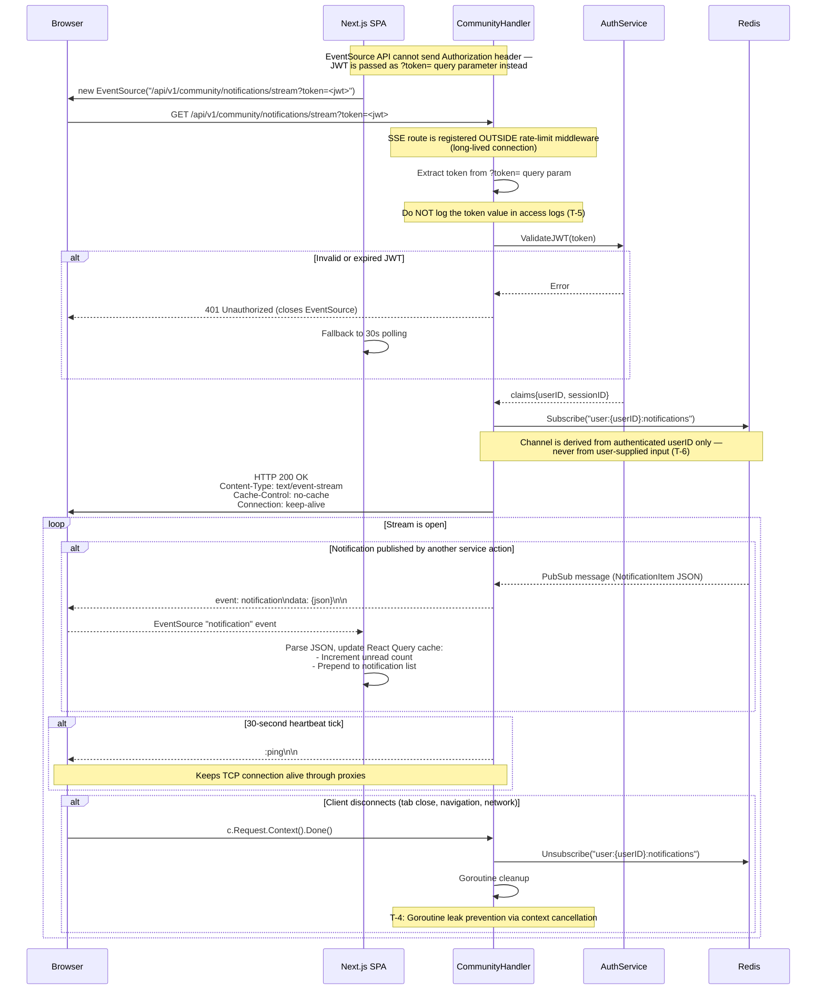

### Key Invariants

- Authentication uses `?token=` query parameter because the `EventSource` browser API does not support custom headers
- The token value must not appear in server access logs to prevent token leakage in log aggregation systems
- The Redis channel is always `user:{authenticatedUserID}:notifications` — constructed from the validated JWT, never from a request parameter
- Goroutine lifetime is bounded by `c.Request.Context().Done()` — no goroutine leak on client disconnect
- Heartbeat pings every 30 seconds prevent proxy/load-balancer timeout disconnections
- Rate limit: maximum 1 SSE connection per user at a time (subsequent connections return 429)
- Frontend maintains 30-second polling as a fallback if SSE fails to connect or is unavailable

### Error Paths

| Condition | HTTP Status | Details |
|-----------|-------------|---------|
| Missing or empty `?token=` param | 401 Unauthorized | JWT extraction fails before handler logic |
| Invalid, expired, or tampered JWT | 401 Unauthorized | `ValidateJWT` returns error; EventSource closes |
| Redis connection failure at subscribe time | 500 Internal Error | Stream cannot be established; client falls back to polling |
| Redis connection drops mid-stream | Stream terminates | `PubSub.Receive` returns error; handler cleans up and returns |
| User already has 1 active SSE connection | 429 Too Many Requests | Rate limiter enforces max 1 SSE per user |
| Client disconnects normally | — | Context cancellation triggers cleanup; no error logged |

---

## 12. Get Reply List

**Trigger:** User clicks "View N replies" under a root comment to expand the reply thread
**Endpoint:** `GET /api/v1/community/comments/{commentId}/replies?page=1&pageSize=5`
**Source:** `handlers/community.go` `GetReplies`, `domain/service/community_service.go` `GetReplies`

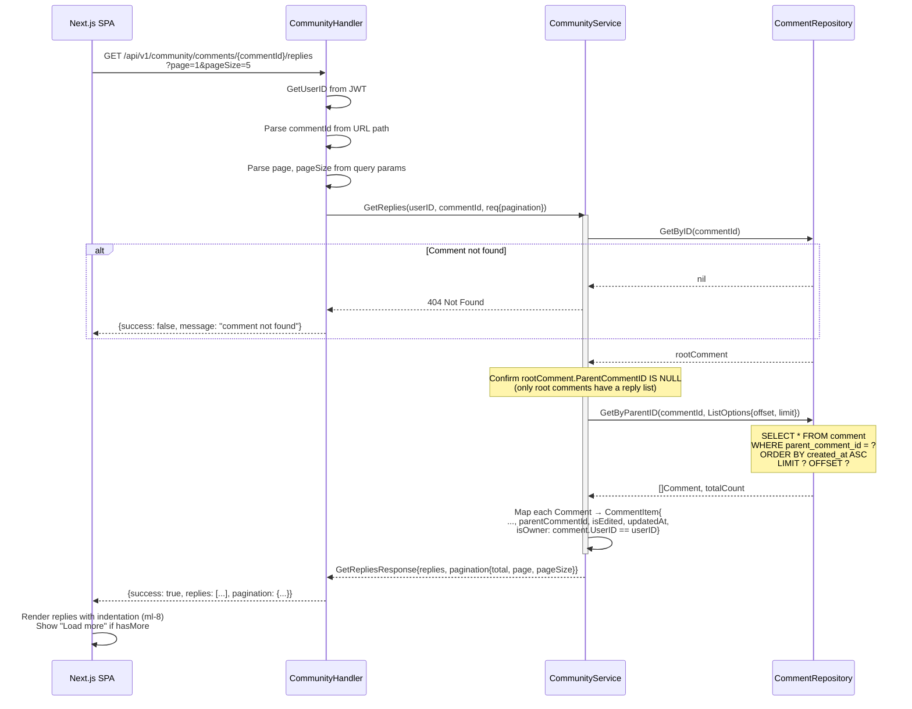

### Key Invariants

- Only root comments (those with `parent_comment_id IS NULL`) have a reply list; requesting replies for a reply returns an empty list (the reply has no children)
- Replies are ordered by `created_at ASC` (chronological, oldest first) — matches conversation reading order
- `isOwner` is resolved per-reply using the JWT `userID` so the frontend can show edit/delete controls
- `isEdited` is derived from `updatedAt != nil`
- Page size defaults to 5; larger values are accepted up to a configured cap to prevent abuse
- The total count returned enables the frontend to show a "N of M replies loaded" indicator

### Error Paths

| Condition | HTTP Status | Details |
|-----------|-------------|---------|
| Missing/invalid JWT | 401 Unauthorized | Auth middleware rejects before handler |
| Comment not found | 404 Not Found | `commentRepo.GetByID` returns nil |
| Invalid page or pageSize | 400 Bad Request | Negative or non-integer values |
| DB read failure | 500 Internal Error | No partial data returned |
