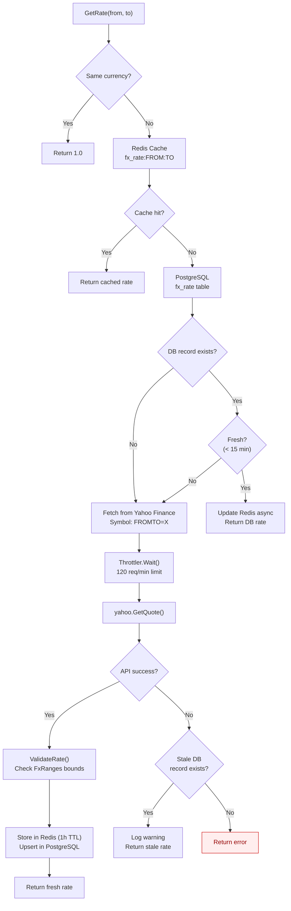
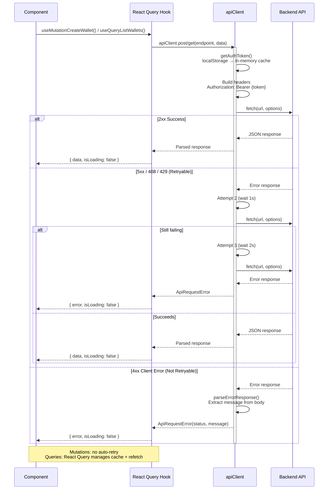
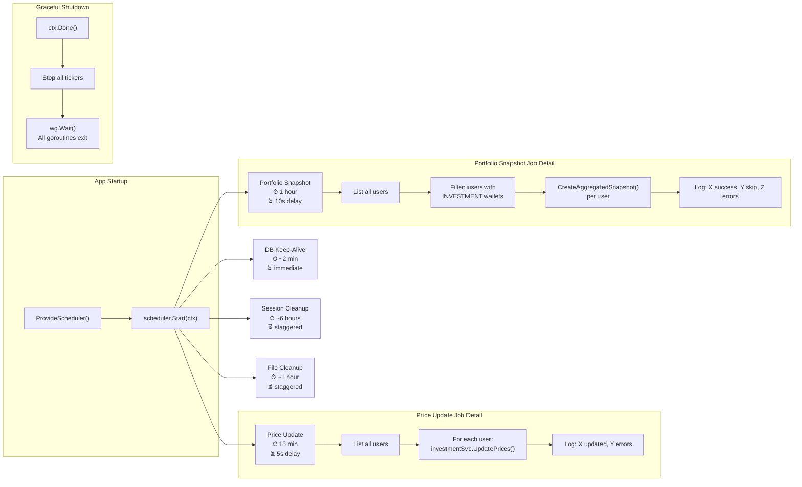
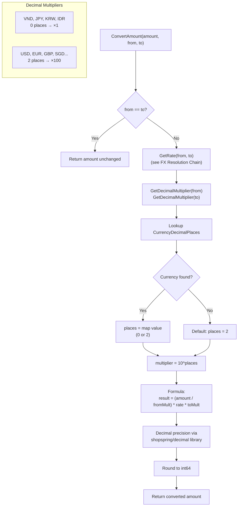

# Cross-Cutting Concerns — Runtime Flows

Infrastructure-level flows that are referenced by multiple domain flows. Read this document first to understand caching, API communication, and background processing patterns.

## Table of Contents

- [FX Rate Resolution Chain](#1-fx-rate-resolution-chain)
- [Frontend API Call Lifecycle](#2-frontend-api-call-lifecycle)
- [Background Scheduler Jobs](#3-background-scheduler-jobs)
- [Currency Conversion Logic](#4-currency-conversion-logic)

---

## 1. FX Rate Resolution Chain

**Trigger:** Any service calls `FXRateService.GetRate(from, to)`
**Source:** `domain/service/fx_rate_service.go`

### Key Invariants

- Same-currency requests (`USD→USD`) always return `1.0` without any lookup
- Redis TTL is 1 hour; DB freshness window is 15 minutes
- External API failures never crash the caller — stale cache is used as fallback
- Rate validation rejects values outside known bounds per currency pair (e.g., USD:VND must be 20,000–30,000)

### Error Paths

| Condition | Response | Fallback |
|-----------|----------|----------|
| Redis miss | Fall through to DB | Transparent |
| DB record stale | Fall through to API | Transparent |
| Yahoo Finance timeout/error | Use stale DB rate | Logged warning |
| No cache at all + API failure | Return error | Caller handles |
| Rate outside valid range | Reject, retry | Use stale cache |

---

## 2. Frontend API Call Lifecycle

**Trigger:** Component calls a generated React Query hook
**Source:** `wj-client/utils/api-client.ts`, `wj-client/utils/generated/hooks.ts`

### Key Invariants

- Token is cached in-memory; `localStorage` read only on cold start or cache invalidation
- Mutations (`useMutation*`) have `retry: false` — no automatic retries
- Queries (`useQuery*`) are cached by `[EVENT_Name, payload]` key and managed by React Query
- Only 5xx, 408, and 429 responses trigger retry; all other 4xx errors fail immediately
- Exponential backoff: 1s, 2s, 3s (3 max attempts)

### Error Paths

| Condition | Retry? | User Impact |
|-----------|--------|-------------|
| Network failure | Yes (3x) | Spinner, then error toast |
| 401 Unauthorized | No | Redirect to login |
| 400 Bad Request | No | Show validation error |
| 500 Internal Server Error | Yes (3x) | Spinner, then error toast |
| 429 Rate Limited | Yes (3x) | Transparent retry with backoff |

---

## 3. Background Scheduler Jobs

**Trigger:** Application startup in `cmd/main.go`
**Source:** `internal/scheduler/scheduler.go`

### Key Invariants

- Each job runs in its own goroutine with independent error handling
- Job failures are logged but never crash the scheduler or other jobs
- Startup delays prevent thundering herd on application boot
- `scheduler.Stop()` waits for all jobs to finish gracefully via `sync.WaitGroup`
- Conditional jobs (Session Cleanup, File Cleanup) only run if enabled via environment variables

### Job Configuration

| Job | Interval | Startup Delay | Condition |
|-----|----------|---------------|-----------|
| DB Keep-Alive | ~2 min | Immediate | Always |
| Price Update | 15 min | 5 sec | Always |
| Portfolio Snapshot | 1 hour | 10 sec | Always |
| Session Cleanup | ~6 hours | Staggered | `ENABLE_SESSION_CLEANUP` |
| File Cleanup | ~1 hour | Staggered | `ENABLE_FILE_CLEANUP` |

---

## 4. Currency Conversion Logic

**Trigger:** `FXRateService.ConvertAmount(ctx, amount, from, to)` or `ConvertAmountWithRate()`
**Source:** `domain/service/fx_rate_service.go`, `pkg/fx/validator.go`

### Key Invariants

- All monetary values are stored as `int64` in the smallest currency unit (VND = whole dong, USD = cents)
- Conversion uses `shopspring/decimal` for arbitrary-precision arithmetic — no floating-point rounding errors
- Same-currency conversion is a no-op returning the input value
- Unknown currencies default to 2 decimal places (×100 multiplier)

### Conversion Examples

| Input | From | Rate | To | Calculation | Result |
|-------|------|------|----|-------------|--------|
| 4200 (cents) | USD (×100) | 25,850 | VND (×1) | (4200/100) × 25850 × 1 | 1,085,700 VND |
| 1,000,000 VND | VND (×1) | 0.0000387 | USD (×100) | (1000000/1) × 0.0000387 × 100 | 3,870 cents ($38.70) |
| 10,000 JPY | JPY (×1) | 172.5 | VND (×1) | (10000/1) × 172.5 × 1 | 1,725,000 VND |
