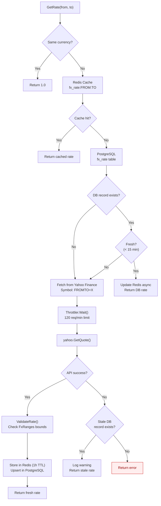
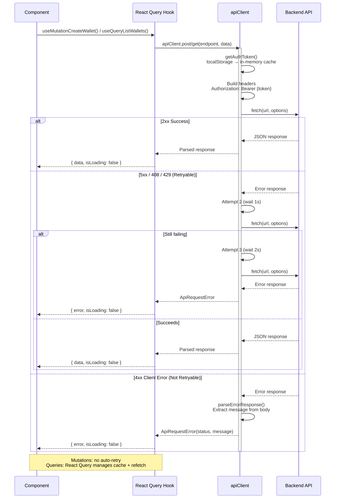
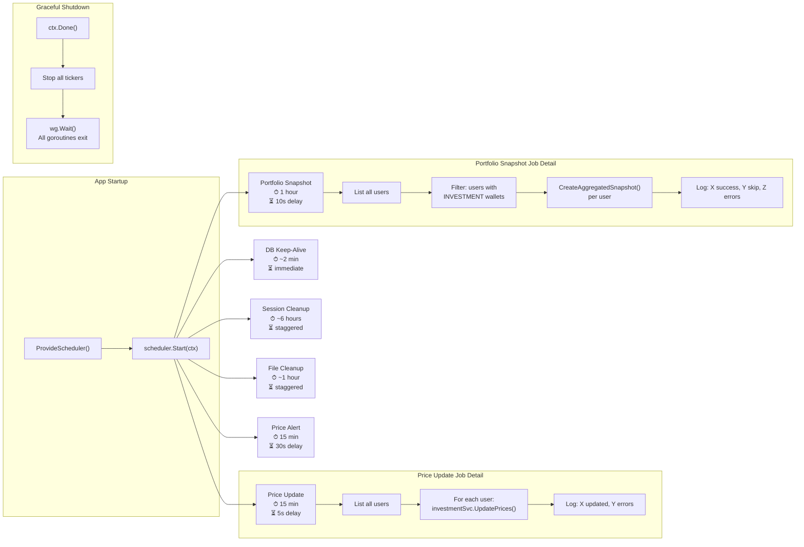
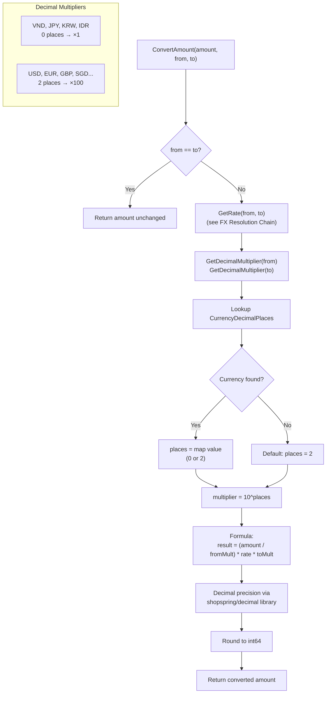
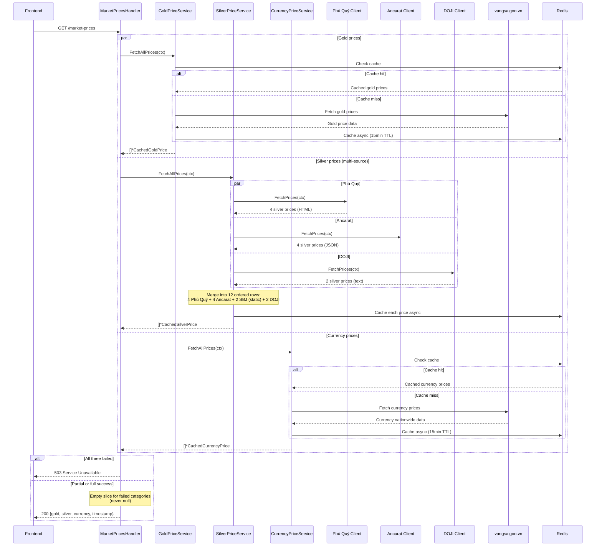
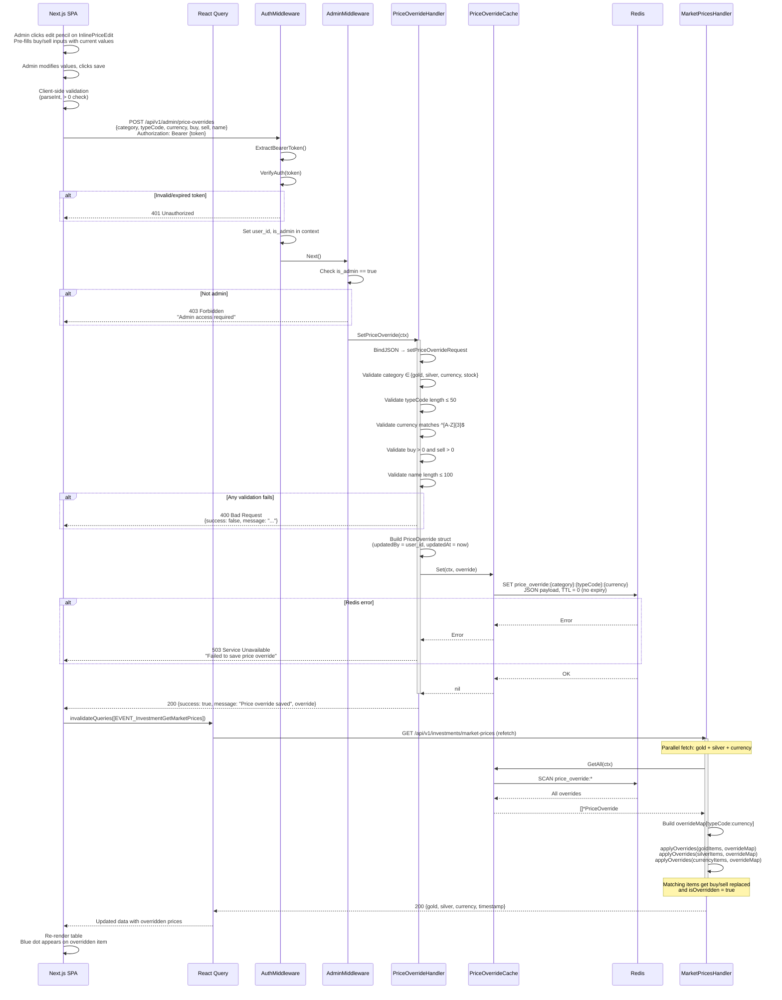
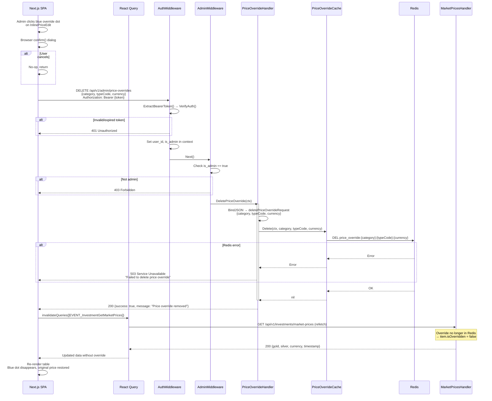
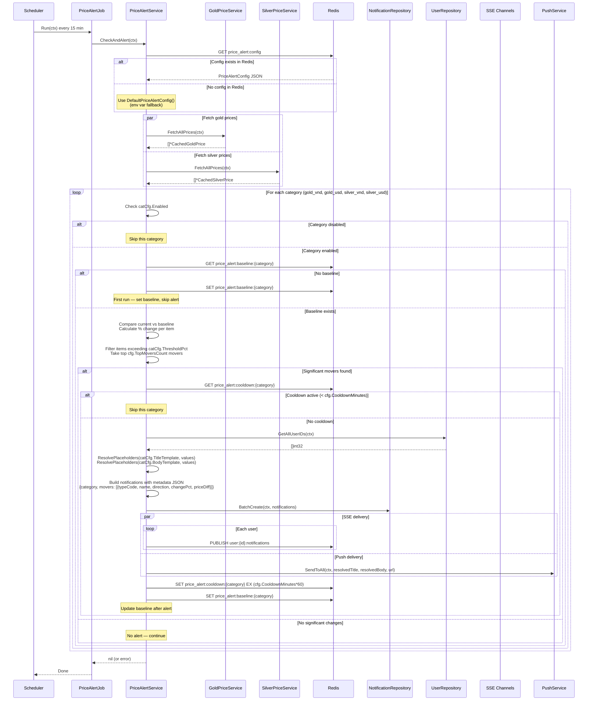
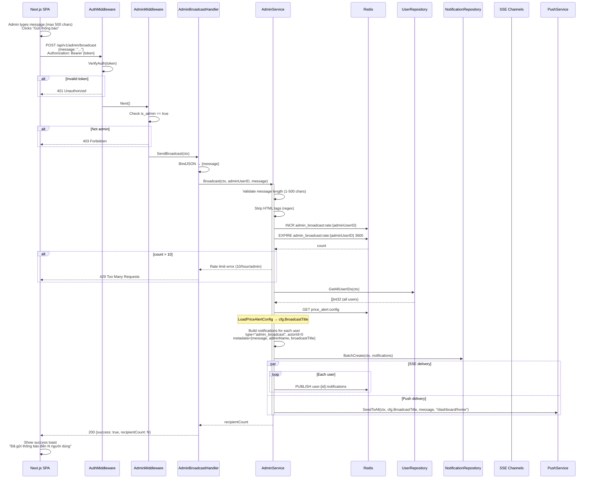
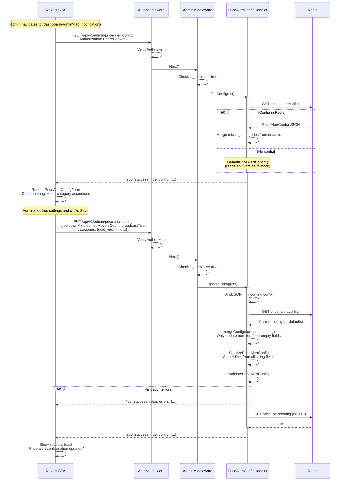

# Cross-Cutting Concerns — Runtime Flows

Infrastructure-level flows that are referenced by multiple domain flows. Read this document first to understand caching, API communication, and background processing patterns.

## Table of Contents

- [FX Rate Resolution Chain](#1-fx-rate-resolution-chain)
- [Frontend API Call Lifecycle](#2-frontend-api-call-lifecycle)
- [Background Scheduler Jobs](#3-background-scheduler-jobs)
- [Currency Conversion Logic](#4-currency-conversion-logic)
- [Market Prices Aggregation Flow](#5-market-prices-aggregation-flow)
- [Admin Price Override Flow](#6-admin-price-override-flow)
- [Price Alert Detection Flow](#7-price-alert-detection-flow)
- [Admin Broadcast Flow](#8-admin-broadcast-flow)
- [Admin Price Alert Config Flow](#9-admin-price-alert-config-flow)

---

## 1. FX Rate Resolution Chain

**Trigger:** Any service calls `FXRateService.GetRate(from, to)`
**Source:** `domain/service/fx_rate_service.go`

### Key Invariants

- Same-currency requests (`USD→USD`) always return `1.0` without any lookup
- Redis TTL is 1 hour; DB freshness window is 15 minutes
- External API failures never crash the caller — stale cache is used as fallback
- Rate validation rejects values outside known bounds per currency pair (e.g., USD:VND must be 20,000–30,000)

### Error Paths

| Condition | Response | Fallback |
|-----------|----------|----------|
| Redis miss | Fall through to DB | Transparent |
| DB record stale | Fall through to API | Transparent |
| Yahoo Finance timeout/error | Use stale DB rate | Logged warning |
| No cache at all + API failure | Return error | Caller handles |
| Rate outside valid range | Reject, retry | Use stale cache |

---

## 2. Frontend API Call Lifecycle

**Trigger:** Component calls a generated React Query hook
**Source:** `wj-client/utils/api-client.ts`, `wj-client/utils/generated/hooks.ts`

### Key Invariants

- Token is cached in-memory; `localStorage` read only on cold start or cache invalidation
- Mutations (`useMutation*`) have `retry: false` — no automatic retries
- Queries (`useQuery*`) are cached by `[EVENT_Name, payload]` key and managed by React Query
- Only 5xx, 408, and 429 responses trigger retry; all other 4xx errors fail immediately
- Exponential backoff: 1s, 2s, 3s (3 max attempts)

### Error Paths

| Condition | Retry? | User Impact |
|-----------|--------|-------------|
| Network failure | Yes (3x) | Spinner, then error toast |
| 401 Unauthorized | No | Redirect to login |
| 400 Bad Request | No | Show validation error |
| 500 Internal Server Error | Yes (3x) | Spinner, then error toast |
| 429 Rate Limited | Yes (3x) | Transparent retry with backoff |

---

## 3. Background Scheduler Jobs

**Trigger:** Application startup in `cmd/main.go`
**Source:** `internal/scheduler/scheduler.go`

### Key Invariants

- Each job runs in its own goroutine with independent error handling
- Job failures are logged but never crash the scheduler or other jobs
- Startup delays prevent thundering herd on application boot
- `scheduler.Stop()` waits for all jobs to finish gracefully via `sync.WaitGroup`
- Conditional jobs (Session Cleanup, File Cleanup) only run if enabled via environment variables

### Job Configuration

| Job | Interval | Startup Delay | Condition |
|-----|----------|---------------|-----------|
| DB Keep-Alive | ~2 min | Immediate | Always |
| Price Update | 15 min | 5 sec | Always |
| Portfolio Snapshot | 1 hour | 10 sec | Always |
| Session Cleanup | ~6 hours | Staggered | `ENABLE_SESSION_CLEANUP` |
| File Cleanup | ~1 hour | Staggered | `ENABLE_FILE_CLEANUP` |
| Price Alert | 15 min | 30 sec | Redis available |

---

## 4. Currency Conversion Logic

**Trigger:** `FXRateService.ConvertAmount(ctx, amount, from, to)` or `ConvertAmountWithRate()`
**Source:** `domain/service/fx_rate_service.go`, `pkg/fx/validator.go`

### Key Invariants

- All monetary values are stored as `int64` in the smallest currency unit (VND = whole dong, USD = cents)
- Conversion uses `shopspring/decimal` for arbitrary-precision arithmetic — no floating-point rounding errors
- Same-currency conversion is a no-op returning the input value
- Unknown currencies default to 2 decimal places (×100 multiplier)

### Conversion Examples

| Input | From | Rate | To | Calculation | Result |
|-------|------|------|----|-------------|--------|
| 4200 (cents) | USD (×100) | 25,850 | VND (×1) | (4200/100) × 25850 × 1 | 1,085,700 VND |
| 1,000,000 VND | VND (×1) | 0.0000387 | USD (×100) | (1000000/1) × 0.0000387 × 100 | 3,870 cents ($38.70) |
| 10,000 JPY | JPY (×1) | 172.5 | VND (×1) | (10000/1) × 172.5 × 1 | 1,725,000 VND |

---

## 5. Market Prices Aggregation Flow

**Trigger:** `GET /api/v1/investments/market-prices` (authenticated) or `GET /api/v1/public/market-types` (public)
**Source:** `handlers/market_prices.go`, `handlers/public.go`

### Key Invariants

- Gold, silver, and currency are fetched in parallel via `sync.WaitGroup` — one failure does not block others
- Silver aggregates from 4 sources (Phú Quý, Ancarat, DOJI, SBJ); SBJ entries are static (prices = 0, displayed as "—")
- Currency prices come from vangsaigon's `currencyNationWide` field — raw VND values (no ×1000 multiplier)
- 503 is returned only if ALL THREE categories fail; partial success returns empty slices for failed categories
- All prices are cached in Redis with 15-minute TTL; cache writes are non-blocking goroutines

### Error Paths

| Condition | Response | Fallback |
|-----------|----------|----------|
| One category fails (e.g., silver) | 200 with empty `silver: []` | Other categories still returned |
| All three categories fail | 503 Service Unavailable | No fallback |
| Individual silver source fails (e.g., Phú Quý down) | Rows from that source omitted | Other sources still included |
| Redis cache write fails | Logged warning | Next request re-fetches from source |
| vangsaigon.vn timeout | Gold/currency return empty | Stale cache if available |

---

## 6. Admin Price Override Flow

Admin users can manually override buy/sell prices for any market price item (gold, silver, currency). Overrides are stored in Redis with no TTL and merged into the GetMarketPrices response at read time.

### 6a. Set Price Override

**Trigger:** Admin clicks the edit (pencil) icon on `InlinePriceEdit`, enters new buy/sell values, clicks save
**Endpoint:** `POST /api/v1/admin/price-overrides`
**Source:** `handlers/price_override.go`, `pkg/cache/price_override_cache.go`, `features/market-prices/components/InlinePriceEdit.tsx`

### 6b. Delete Price Override

**Trigger:** Admin clicks the blue override indicator dot on an overridden item, confirms removal
**Endpoint:** `DELETE /api/v1/admin/price-overrides`
**Source:** `handlers/price_override.go`, `pkg/cache/price_override_cache.go`, `features/market-prices/components/InlinePriceEdit.tsx`

### Key Invariants

- Only users with `is_admin = true` can access `/api/v1/admin/*` routes — enforced by `AuthMiddleware` + `AdminMiddleware` chain
- Price overrides are stored in Redis with **no TTL** — they persist until explicitly deleted
- Redis key format: `price_override:{category}:{typeCode}:{currency}` — uniquely identifies one price row
- Override merge happens at **read time** in `GetMarketPrices` — overrides do not mutate the upstream price source data
- The `applyOverrides` function matches by `typeCode:currency` composite key and replaces only `buy` and `sell` fields, preserving all other fields (changeBuy, changeSell, updatedAt, name)
- The `isOverridden` flag is set to `true` on matched items so the frontend can display the blue indicator dot
- Override cache failures during `GetMarketPrices` are **graceful** — original prices are returned without overrides (no 503)
- Category validation allows `gold`, `silver`, `currency`, `stock` — a fixed allowlist, not a dynamic enum
- Client-side validation (parseInt, positive check) runs before the API call; server-side validation is the authoritative gate
- Delete operation is idempotent — deleting a non-existent key returns success

### Error Paths

| Condition | Response | Fallback |
|-----------|----------|----------|
| Missing/invalid JWT | 401 Unauthorized | Redirect to login |
| Non-admin user | 403 Forbidden | No fallback |
| Invalid category | 400 Bad Request | Client shows error toast |
| TypeCode > 50 chars | 400 Bad Request | Client shows error toast |
| Currency not `^[A-Z]{3}$` | 400 Bad Request | Client shows error toast |
| Buy or sell ≤ 0 | 400 Bad Request | Client shows error toast |
| Name > 100 chars | 400 Bad Request | Client shows error toast |
| Redis SET/DEL failure | 503 Service Unavailable | Client shows error toast |
| Redis SCAN failure during GetMarketPrices | Original prices returned (no override applied) | Graceful degradation |
| Delete non-existent override | 200 OK (idempotent) | No-op |

---

## 7. Price Alert Detection Flow

**Trigger:** Scheduler runs `PriceAlertJob` every 15 minutes (30-second startup delay)
**Source:** `internal/scheduler/price_alert_job.go`, `domain/service/price_alert_service.go`

### Key Invariants

- Each category is checked independently — a gold alert does not affect silver alerts
- Categories can be individually enabled/disabled via admin config (`catCfg.Enabled`)
- Baselines are set on first run and updated only after an alert is sent
- Cooldown period is configurable via admin UI (`cfg.CooldownMinutes`, default 120 min)
- Thresholds are configurable per category via admin UI (`catCfg.ThresholdPct`), with env var fallback defaults
- Notification title and body use template resolution with placeholders (`{moverName}`, `{changePct}`, `{direction}`, etc.)
- Config is loaded from Redis at runtime via `LoadPriceAlertConfig(ctx, rdb)` — falls back to `DefaultPriceAlertConfig()` which reads env vars
- Push delivery failures are non-fatal — SSE and DB notifications still persist
- Only the top N movers (`cfg.TopMoversCount`, default 5) are included in notification metadata
- Notification metadata includes `priceDiff` (absolute price change) in addition to `changePct`

### Error Paths

| Condition | Response | Fallback |
|-----------|----------|----------|
| Gold price fetch failure | Skip gold categories | Silver categories still checked |
| Silver price fetch failure | Skip silver categories | Gold categories still checked |
| Redis baseline read failure | Skip that category | Other categories still checked |
| BatchCreate failure | Error logged, alert not sent | Next run retries |
| SSE publish failure | Non-fatal, logged | DB notification persists |
| Push delivery failure | Non-fatal, logged | SSE + DB notifications still work |
| All price fetches fail | Job returns error, scheduler logs it | Next run retries |

---

## 8. Admin Broadcast Flow

**Trigger:** Admin submits broadcast message via `POST /api/v1/admin/broadcast`
**Source:** `handlers/admin_broadcast.go`, `domain/service/admin_service.go`

### Key Invariants

- Only users with `is_admin = true` can broadcast — enforced by double middleware (Auth + Admin)
- Rate limit: 10 broadcasts per hour per admin, tracked via Redis INCR with 1-hour TTL
- HTML tags are stripped from messages to prevent injection — plain text only
- Message length: minimum 1 character, maximum 500 characters
- Notifications use `actorId = 0` to indicate system origin (no user avatar)
- Metadata JSON stores the broadcast message text, admin name, and `broadcastTitle` (from config)
- Push notification title uses `cfg.BroadcastTitle` from `LoadPriceAlertConfig` — configurable via admin UI
- SSE and Push delivery are best-effort — DB notifications are the source of truth

### Error Paths

| Condition | Response | Fallback |
|-----------|----------|----------|
| Missing/invalid JWT | 401 Unauthorized | Client redirects to login |
| Non-admin user | 403 Forbidden | Client shows error |
| Empty message | 400 Bad Request | Client shows validation error |
| Message > 500 chars | 400 Bad Request | Client-side char counter prevents this |
| Rate limit exceeded (10/hr) | 429 Too Many Requests | Admin must wait |
| GetAllUserIDs failure | 500 Internal Server Error | Admin can retry |
| BatchCreate failure | 500 Internal Server Error | Admin can retry |
| SSE publish failure | Non-fatal, logged | DB notifications persist |
| Push delivery failure | Non-fatal, logged | SSE + DB notifications still work |

---

## 9. Admin Price Alert Config Flow

**Trigger:** Admin opens "Notifications" tab on Admin CMS page, views or updates price alert configuration
**Source:** `handlers/price_alert_config.go`, `domain/service/price_alert_config.go`, `features/admin/components/PriceAlertConfigForm.tsx`

### Key Invariants

- Config is stored in Redis under key `price_alert:config` with **no TTL** — persists until explicitly overwritten
- When no config exists in Redis, `DefaultPriceAlertConfig()` provides defaults from environment variables
- Missing categories are merged from defaults — adding a new category to defaults auto-fills it for existing configs
- All string fields are sanitized (HTML stripped) before saving to prevent XSS
- Validation enforces: cooldownMinutes 1–1440, topMoversCount 1–20, thresholdPct 0.1–50, non-empty templates and broadcastTitle
- Partial updates: `mergeConfig` only overwrites fields with non-zero/non-empty values from the incoming request
- Config changes take effect on the **next** scheduler run (no restart needed) — `PriceAlertService.CheckAndAlert` reads config from Redis each invocation

### Error Paths

| Condition | Response | Fallback |
|-----------|----------|----------|
| Missing/invalid JWT | 401 Unauthorized | Client redirects to login |
| Non-admin user | 403 Forbidden | Client shows error |
| Redis read failure on GET | Returns DefaultPriceAlertConfig() | Transparent fallback |
| Redis write failure on PUT | 500 Internal Server Error | Admin can retry |
| Validation error (e.g., cooldown=0) | 400 {errors: {cooldownMinutes: "..."}} | Client shows field-level error |
| HTML-only template (empty after strip) | 400 validation error | Client shows error |
