# Cross-Cutting Concerns — Runtime Flows

Infrastructure-level flows that are referenced by multiple domain flows. Read this document first to understand caching, API communication, and background processing patterns.

## Table of Contents

- [FX Rate Resolution Chain](#1-fx-rate-resolution-chain)
- [Frontend API Call Lifecycle](#2-frontend-api-call-lifecycle)
- [Background Scheduler Jobs](#3-background-scheduler-jobs)
- [Currency Conversion Logic](#4-currency-conversion-logic)
- [Market Prices Aggregation Flow](#5-market-prices-aggregation-flow)
- [Admin Price Override Flow](#6-admin-price-override-flow)
- [Price Alert Detection Flow](#7-price-alert-detection-flow)
- [Admin Broadcast Flow](#8-admin-broadcast-flow)
- [Admin Price Alert Config Flow](#9-admin-price-alert-config-flow)
- [Error Code Translation Flow](#10-error-code-translation-flow)
- [FetchAllPrices Aggregate Cache Flow](#11-fetchallprices-aggregate-cache-flow)
- [Price Fallback Chain](#12-price-fallback-chain)
- [Price Cache Background Job](#13-price-cache-background-job)
- [Gold Display Prices Read Flow](#14-gold-display-prices-read-flow)
- [Admin Gold Display Config CRUD Flow](#15-admin-gold-display-config-crud-flow)

---

## 1. FX Rate Resolution Chain

**Trigger:** Any service calls `FXRateService.GetRate(from, to)`
**Source:** `domain/service/fx_rate_service.go`

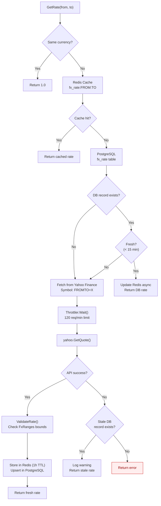
```mermaid
flowchart TD
    A["GetRate(from, to)"] --> B{Same currency?}
    B -- Yes --> C["Return 1.0"]
    B -- No --> D["Redis Cache\nfx_rate:FROM:TO"]

    D --> E{Cache hit?}
    E -- Yes --> F["Return cached rate"]
    E -- No --> G["PostgreSQL\nfx_rate table"]

    G --> H{DB record exists?}
    H -- No --> K["Fetch from Yahoo Finance\nSymbol: FROMTO=X"]
    H -- Yes --> I{"Fresh?\n(< 15 min)"}
    I -- Yes --> J["Update Redis async\nReturn DB rate"]
    I -- No --> K

    K --> L["Throttler.Wait()\n120 req/min limit"]
    L --> M["yahoo.GetQuote()"]
    M --> N{API success?}
    N -- Yes --> O["ValidateRate()\nCheck FxRanges bounds"]
    O --> P["Store in Redis (1h TTL)\nUpsert in PostgreSQL"]
    P --> Q["Return fresh rate"]

    N -- No --> R{Stale DB\nrecord exists?}
    R -- Yes --> S["Log warning\nReturn stale rate"]
    R -- No --> T["Return error"]:::error

    classDef error fill:#fee,stroke:#c00,color:#900
```

### Key Invariants

- Same-currency requests (`USD→USD`) always return `1.0` without any lookup
- Redis TTL is 1 hour; DB freshness window is 15 minutes
- External API failures never crash the caller — stale cache is used as fallback
- Rate validation rejects values outside known bounds per currency pair (e.g., USD:VND must be 20,000–30,000)

### Error Paths

| Condition | Response | Fallback |
|-----------|----------|----------|
| Redis miss | Fall through to DB | Transparent |
| DB record stale | Fall through to API | Transparent |
| Yahoo Finance timeout/error | Use stale DB rate | Logged warning |
| No cache at all + API failure | Return error | Caller handles |
| Rate outside valid range | Reject, retry | Use stale cache |

---

## 2. Frontend API Call Lifecycle

**Trigger:** Component calls a generated React Query hook
**Source:** `wj-client/utils/api-client.ts`, `wj-client/utils/generated/hooks.ts`

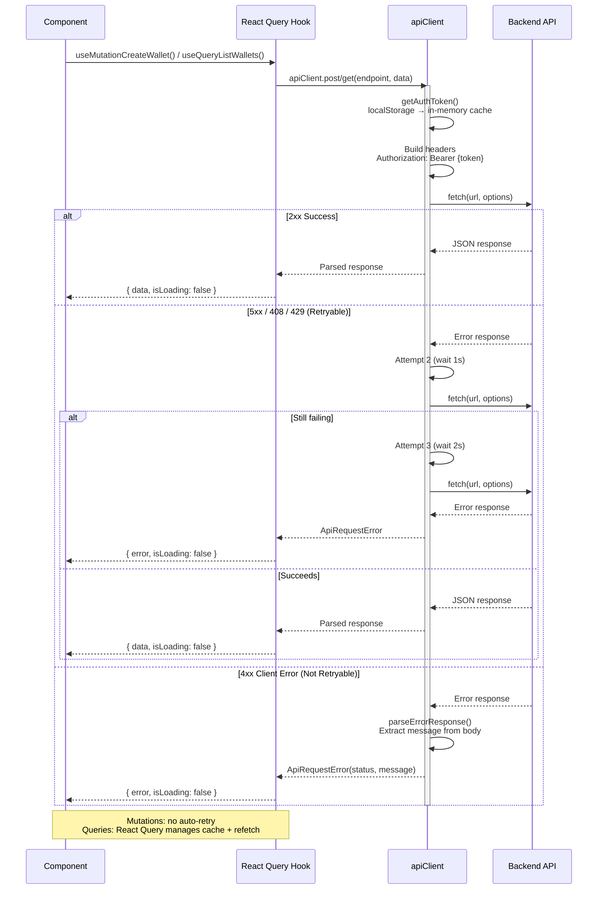
```mermaid
sequenceDiagram
    participant C as Component
    participant H as React Query Hook
    participant A as apiClient
    participant B as Backend API

    C->>H: useMutationCreateWallet() / useQueryListWallets()
    H->>A: apiClient.post/get(endpoint, data)

    activate A
    A->>A: getAuthToken()<br/>localStorage → in-memory cache
    A->>A: Build headers<br/>Authorization: Bearer {token}
    A->>B: fetch(url, options)

    alt 2xx Success
        B-->>A: JSON response
        A-->>H: Parsed response
        H-->>C: { data, isLoading: false }
    else 5xx / 408 / 429 (Retryable)
        B-->>A: Error response
        A->>A: Attempt 2 (wait 1s)
        A->>B: fetch(url, options)
        alt Still failing
            A->>A: Attempt 3 (wait 2s)
            A->>B: fetch(url, options)
            B-->>A: Error response
            A-->>H: ApiRequestError
            H-->>C: { error, isLoading: false }
        else Succeeds
            B-->>A: JSON response
            A-->>H: Parsed response
            H-->>C: { data, isLoading: false }
        end
    else 4xx Client Error (Not Retryable)
        B-->>A: Error response
        A->>A: parseErrorResponse()<br/>Extract message from body
        A-->>H: ApiRequestError(status, message)
        H-->>C: { error, isLoading: false }
    end
    deactivate A

    Note over C,H: Mutations: no auto-retry<br/>Queries: React Query manages cache + refetch
```

### Key Invariants

- Token is cached in-memory; `localStorage` read only on cold start or cache invalidation
- Mutations (`useMutation*`) have `retry: false` — no automatic retries
- Queries (`useQuery*`) are cached by `[EVENT_Name, payload]` key and managed by React Query
- Only 5xx, 408, and 429 responses trigger retry; all other 4xx errors fail immediately
- Exponential backoff: 1s, 2s, 3s (3 max attempts)

### Error Paths

| Condition | Retry? | User Impact |
|-----------|--------|-------------|
| Network failure | Yes (3x) | Spinner, then error toast |
| 401 Unauthorized | No | Redirect to login |
| 400 Bad Request | No | Show validation error |
| 500 Internal Server Error | Yes (3x) | Spinner, then error toast |
| 429 Rate Limited | Yes (3x) | Transparent retry with backoff |

---

## 3. Background Scheduler Jobs

**Trigger:** Application startup in `cmd/main.go`
**Source:** `internal/scheduler/scheduler.go`

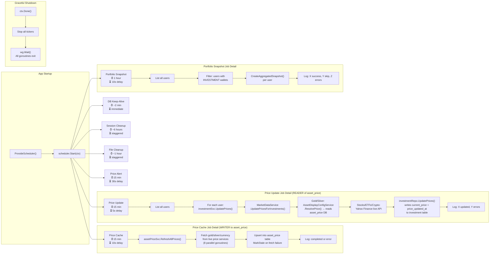
```mermaid
flowchart LR
    subgraph Startup["App Startup"]
        S["ProvideScheduler()"]
        S --> Start["scheduler.Start(ctx)"]
    end

    Start --> KA["DB Keep-Alive\n⏱ ~2 min\n⏳ immediate"]
    Start --> PU["Price Update\n⏱ 15 min\n⏳ 5s delay"]
    Start --> PC["Price Cache\n⏱ 15 min\n⏳ 10s delay"]
    Start --> PS["Portfolio Snapshot\n⏱ 1 hour\n⏳ 10s delay"]
    Start --> SC["Session Cleanup\n⏱ ~6 hours\n⏳ staggered"]
    Start --> FC["File Cleanup\n⏱ ~1 hour\n⏳ staggered"]
    Start --> PA["Price Alert\n⏱ 15 min\n⏳ 30s delay"]

    subgraph PriceCache["Price Cache Job Detail (WRITER to asset_price)"]
        PC --> PC1["assetPriceSvc.RefreshAllPrices()"]
        PC1 --> PC2["Fetch gold/silver/currency\nfrom live price services\n(8 parallel goroutines)"]
        PC2 --> PC3["Upsert into asset_price table\nMarkStale on fetch failure"]
        PC3 --> PC4["Log: completed or error"]
    end

    subgraph PriceUpdate["Price Update Job Detail (READER of asset_price)"]
        PU --> PU1["List all users"]
        PU1 --> PU2["For each user:\ninvestmentSvc.UpdatePrices()"]
        PU2 --> PU2a["MarketDataService\n.UpdatePricesForInvestments()"]
        PU2a --> PU2b["Gold/Silver: AssetDisplayConfigService\n.ResolvePrice() → reads asset_price DB"]
        PU2b --> PU2c["Stocks/ETFs/Crypto:\nYahoo Finance live API"]
        PU2c --> PU3["investmentRepo.UpdatePrices()\nwrites current_price + price_updated_at\nto investment table"]
        PU3 --> PU4["Log: X updated, Y errors"]
    end

    subgraph PortfolioSnapshot["Portfolio Snapshot Job Detail"]
        PS --> PS1["List all users"]
        PS1 --> PS2["Filter: users with\nINVESTMENT wallets"]
        PS2 --> PS3["CreateAggregatedSnapshot()\nper user"]
        PS3 --> PS4["Log: X success, Y skip, Z errors"]
    end

    subgraph Shutdown["Graceful Shutdown"]
        CTX["ctx.Done()"] --> STOP["Stop all tickers"]
        STOP --> WAIT["wg.Wait()\nAll goroutines exit"]
    end
```

### Key Invariants

- Each job runs in its own goroutine with independent error handling
- Job failures are logged but never crash the scheduler or other jobs
- Startup delays prevent thundering herd on application boot
- `scheduler.Stop()` waits for all jobs to finish gracefully via `sync.WaitGroup`
- Conditional jobs (Session Cleanup, File Cleanup) only run if enabled via environment variables
- **Producer-consumer pattern for gold/silver prices**: `PriceCacheJob` (sole writer) writes to `asset_price` every 15 min; `PriceUpdateJob` (reader) reads from `asset_price` via `AssetDisplayConfigService.ResolvePrice()` — they operate independently; a `PriceUpdateJob` run with a stale or cold `asset_price` table falls back to live APIs

### Job Configuration

| Job | Interval | Startup Delay | Condition | Role |
|-----|----------|---------------|-----------|------|
| DB Keep-Alive | ~2 min | Immediate | Always | — |
| Price Cache | 15 min | 10 sec | `AssetPriceService` available | **Sole writer** to `asset_price` |
| Price Update | 15 min | 5 sec | Always | **Reader** of `asset_price` (gold/silver); live Yahoo Finance (stocks) |
| Portfolio Snapshot | 1 hour | 10 sec | Always | — |
| Session Cleanup | ~6 hours | Staggered | `ENABLE_SESSION_CLEANUP` | — |
| File Cleanup | ~1 hour | Staggered | `ENABLE_FILE_CLEANUP` | — |
| Price Alert | 15 min | 30 sec | Redis available | Reader of `asset_price` |

---

## 4. Currency Conversion Logic

**Trigger:** `FXRateService.ConvertAmount(ctx, amount, from, to)` or `ConvertAmountWithRate()`
**Source:** `domain/service/fx_rate_service.go`, `pkg/fx/validator.go`

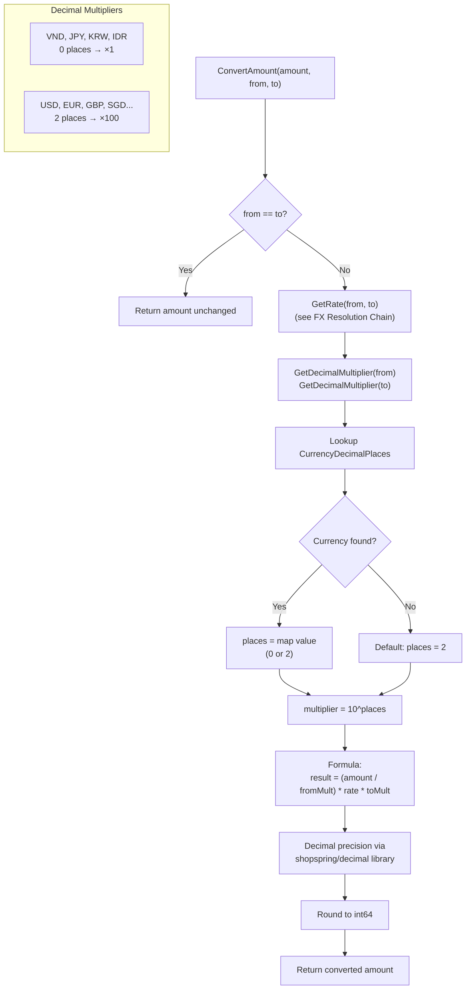
```mermaid
flowchart TD
    A["ConvertAmount(amount, from, to)"] --> B{from == to?}
    B -- Yes --> C["Return amount unchanged"]
    B -- No --> D["GetRate(from, to)\n(see FX Resolution Chain)"]
    D --> E["GetDecimalMultiplier(from)\nGetDecimalMultiplier(to)"]

    E --> F["Lookup CurrencyDecimalPlaces"]
    F --> G{"Currency found?"}
    G -- Yes --> H["places = map value\n(0 or 2)"]
    G -- No --> I["Default: places = 2"]
    H --> J["multiplier = 10^places"]
    I --> J

    J --> K["Formula:\nresult = (amount / fromMult) * rate * toMult"]

    K --> L["Decimal precision via\nshopspring/decimal library"]
    L --> M["Round to int64"]
    M --> N["Return converted amount"]

    subgraph Multipliers["Decimal Multipliers"]
        direction LR
        M1["VND, JPY, KRW, IDR\n0 places → ×1"]
        M2["USD, EUR, GBP, SGD...\n2 places → ×100"]
    end
```

### Key Invariants

- All monetary values are stored as `int64` in the smallest currency unit (VND = whole dong, USD = cents)
- Conversion uses `shopspring/decimal` for arbitrary-precision arithmetic — no floating-point rounding errors
- Same-currency conversion is a no-op returning the input value
- Unknown currencies default to 2 decimal places (×100 multiplier)

### Conversion Examples

| Input | From | Rate | To | Calculation | Result |
|-------|------|------|----|-------------|--------|
| 4200 (cents) | USD (×100) | 25,850 | VND (×1) | (4200/100) × 25850 × 1 | 1,085,700 VND |
| 1,000,000 VND | VND (×1) | 0.0000387 | USD (×100) | (1000000/1) × 0.0000387 × 100 | 3,870 cents ($38.70) |
| 10,000 JPY | JPY (×1) | 172.5 | VND (×1) | (10000/1) × 172.5 × 1 | 1,725,000 VND |

---

## 5. Market Prices Aggregation Flow

**Trigger:** `GET /api/v1/investments/market-prices` (authenticated) or `GET /api/v1/public/market-types` (public)
**Source:** `handlers/market_prices.go`, `handlers/public.go`, `domain/service/asset_price_service.go`

Handlers now read from the DB-backed `asset_price` table via `AssetPriceService`. Live external API calls happen only in the background `PriceCacheJob` (see [Section 13](#13-price-cache-background-job)), not on every HTTP request.

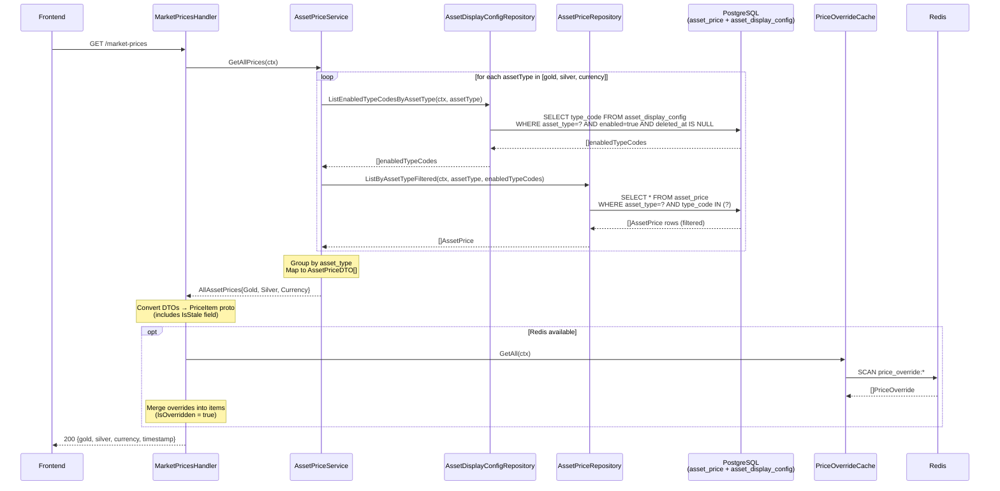
```mermaid
sequenceDiagram
    participant C as Frontend
    participant H as MarketPricesHandler
    participant APS as AssetPriceService
    participant ADCR as AssetDisplayConfigRepository
    participant APR as AssetPriceRepository
    participant DB as PostgreSQL<br/>(asset_price + asset_display_config)
    participant POC as PriceOverrideCache
    participant R as Redis

    C->>H: GET /market-prices

    H->>APS: GetAllPrices(ctx)
    loop for each assetType in [gold, silver, currency]
        APS->>ADCR: ListEnabledTypeCodesByAssetType(ctx, assetType)
        ADCR->>DB: SELECT type_code FROM asset_display_config<br/>WHERE asset_type=? AND enabled=true AND deleted_at IS NULL
        DB-->>ADCR: []enabledTypeCodes
        ADCR-->>APS: []enabledTypeCodes
        APS->>APR: ListByAssetTypeFiltered(ctx, assetType, enabledTypeCodes)
        APR->>DB: SELECT * FROM asset_price<br/>WHERE asset_type=? AND type_code IN (?)
        DB-->>APR: []AssetPrice rows (filtered)
        APR-->>APS: []AssetPrice
    end
    Note over APS: Group by asset_type<br/>Map to AssetPriceDTO[]
    APS-->>H: AllAssetPrices{Gold, Silver, Currency}

    Note over H: Convert DTOs → PriceItem proto<br/>(includes IsStale field)

    opt Redis available
        H->>POC: GetAll(ctx)
        POC->>R: SCAN price_override:*
        R-->>POC: []PriceOverride
        Note over H: Merge overrides into items<br/>(IsOverridden = true)
    end

    H-->>C: 200 {gold, silver, currency, timestamp}
```

### Key Invariants

- `GetMarketPrices` never calls external APIs — all data comes from the DB-backed `asset_price` table
- **Display config filter**: `GetAllPrices` and `GetMarketTypes` only return prices whose `type_code + asset_type` pair has a matching enabled, non-deleted `asset_display_config` row — deleted or disabled configs are excluded immediately on next request
- `IsStale = true` on a price item means the last background fetch for that type failed; the price shown is the last known value
- Admin price overrides (Redis) are applied on top of DB data at read time; override failures are graceful (original prices returned)
- If `AssetPriceService` returns an error, `handler.HandleError` returns 500 (unlike the old flow which returned 503 only when all three failed)
- Cold start (before first `PriceCacheJob` run): `asset_price` table is empty → `GetAllPrices` returns empty slices; `GetPublicMarketTypes` falls back to static registries
- **ResolvePrice path unaffected**: `AssetDisplayConfigService.ResolvePrice()` calls `repo.ListByAssetType` directly (not via `GetAllPrices`); the display-config filter does NOT apply to investment price resolution

### Error Paths

| Condition | Response | Fallback |
|-----------|----------|----------|
| DB read error | 500 Internal Server Error | None — handler returns error |
| `IsStale = true` on price item | 200 with item in response, `isStale: true` | Frontend displays `"--"` for stale values |
| Redis override cache unavailable | 200 without overrides applied | Graceful degradation |
| DB empty (cold start) | 200 with empty arrays (authenticated); static registry fallback (public) | Public endpoint always returns data |

---

## 6. Admin Price Override Flow

Admin users can manually override buy/sell prices for any market price item (gold, silver, currency). Overrides are stored in Redis with no TTL and merged into the GetMarketPrices response at read time.

### 6a. Set Price Override

**Trigger:** Admin clicks the edit (pencil) icon on `InlinePriceEdit`, enters new buy/sell values, clicks save
**Endpoint:** `POST /api/v1/admin/price-overrides`
**Source:** `handlers/price_override.go`, `pkg/cache/price_override_cache.go`, `features/market-prices/components/InlinePriceEdit.tsx`

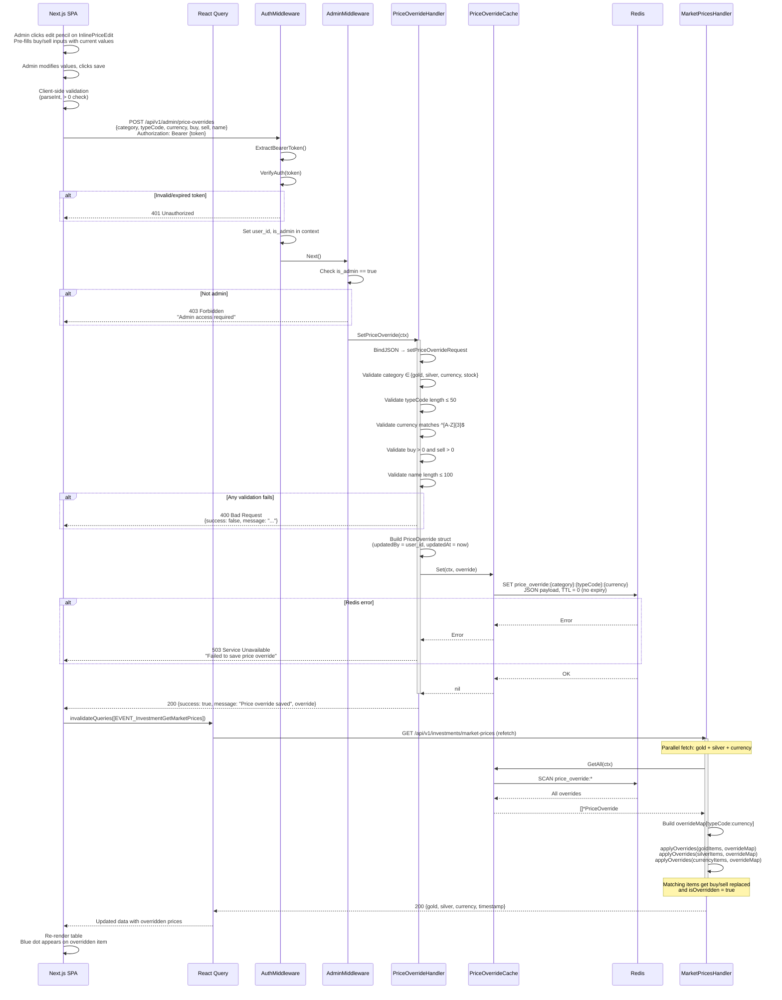
```mermaid
sequenceDiagram
    participant SPA as Next.js SPA
    participant RQ as React Query
    participant AM as AuthMiddleware
    participant ADM as AdminMiddleware
    participant PH as PriceOverrideHandler
    participant POC as PriceOverrideCache
    participant R as Redis
    participant MPH as MarketPricesHandler

    SPA->>SPA: Admin clicks edit pencil on InlinePriceEdit<br/>Pre-fills buy/sell inputs with current values
    SPA->>SPA: Admin modifies values, clicks save
    SPA->>SPA: Client-side validation<br/>(parseInt, > 0 check)

    SPA->>AM: POST /api/v1/admin/price-overrides<br/>{category, typeCode, currency, buy, sell, name}<br/>Authorization: Bearer {token}

    AM->>AM: ExtractBearerToken()
    AM->>AM: VerifyAuth(token)
    alt Invalid/expired token
        AM-->>SPA: 401 Unauthorized
    end
    AM->>AM: Set user_id, is_admin in context

    AM->>ADM: Next()
    ADM->>ADM: Check is_admin == true
    alt Not admin
        ADM-->>SPA: 403 Forbidden<br/>"Admin access required"
    end

    ADM->>PH: SetPriceOverride(ctx)
    activate PH
    PH->>PH: BindJSON → setPriceOverrideRequest
    PH->>PH: Validate category ∈ {gold, silver, currency, stock}
    PH->>PH: Validate typeCode length ≤ 50
    PH->>PH: Validate currency matches ^[A-Z]{3}$
    PH->>PH: Validate buy > 0 and sell > 0
    PH->>PH: Validate name length ≤ 100

    alt Any validation fails
        PH-->>SPA: 400 Bad Request<br/>{success: false, message: "..."}
    end

    PH->>PH: Build PriceOverride struct<br/>(updatedBy = user_id, updatedAt = now)
    PH->>POC: Set(ctx, override)
    POC->>R: SET price_override:{category}:{typeCode}:{currency}<br/>JSON payload, TTL = 0 (no expiry)

    alt Redis error
        R-->>POC: Error
        POC-->>PH: Error
        PH-->>SPA: 503 Service Unavailable<br/>"Failed to save price override"
    end

    R-->>POC: OK
    POC-->>PH: nil
    deactivate PH
    PH-->>SPA: 200 {success: true, message: "Price override saved", override}

    SPA->>RQ: invalidateQueries([EVENT_InvestmentGetMarketPrices])
    RQ->>MPH: GET /api/v1/investments/market-prices (refetch)

    activate MPH
    Note over MPH: Parallel fetch: gold + silver + currency
    MPH->>POC: GetAll(ctx)
    POC->>R: SCAN price_override:*
    R-->>POC: All overrides
    POC-->>MPH: []*PriceOverride
    MPH->>MPH: Build overrideMap[typeCode:currency]
    MPH->>MPH: applyOverrides(goldItems, overrideMap)<br/>applyOverrides(silverItems, overrideMap)<br/>applyOverrides(currencyItems, overrideMap)
    Note over MPH: Matching items get buy/sell replaced<br/>and isOverridden = true
    deactivate MPH

    MPH-->>RQ: 200 {gold, silver, currency, timestamp}
    RQ-->>SPA: Updated data with overridden prices
    SPA->>SPA: Re-render table<br/>Blue dot appears on overridden item
```

### 6b. Delete Price Override

**Trigger:** Admin clicks the blue override indicator dot on an overridden item, confirms removal
**Endpoint:** `DELETE /api/v1/admin/price-overrides`
**Source:** `handlers/price_override.go`, `pkg/cache/price_override_cache.go`, `features/market-prices/components/InlinePriceEdit.tsx`

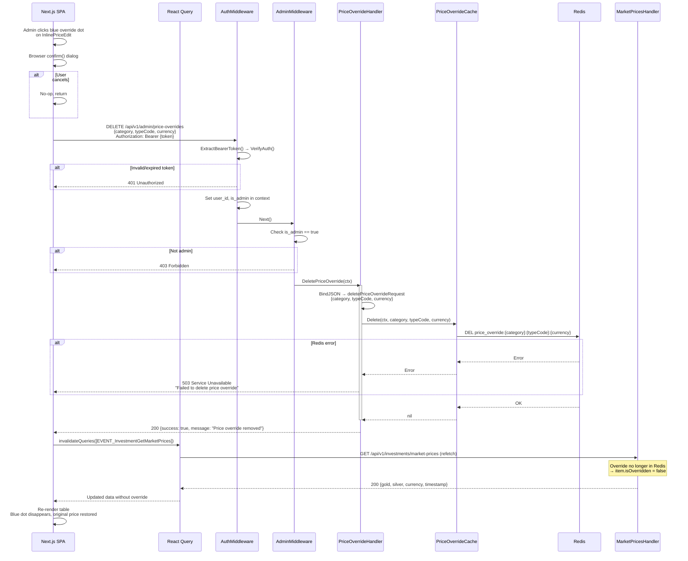
```mermaid
sequenceDiagram
    participant SPA as Next.js SPA
    participant RQ as React Query
    participant AM as AuthMiddleware
    participant ADM as AdminMiddleware
    participant PH as PriceOverrideHandler
    participant POC as PriceOverrideCache
    participant R as Redis
    participant MPH as MarketPricesHandler

    SPA->>SPA: Admin clicks blue override dot<br/>on InlinePriceEdit
    SPA->>SPA: Browser confirm() dialog
    alt User cancels
        SPA->>SPA: No-op, return
    end

    SPA->>AM: DELETE /api/v1/admin/price-overrides<br/>{category, typeCode, currency}<br/>Authorization: Bearer {token}

    AM->>AM: ExtractBearerToken() → VerifyAuth()
    alt Invalid/expired token
        AM-->>SPA: 401 Unauthorized
    end
    AM->>AM: Set user_id, is_admin in context

    AM->>ADM: Next()
    ADM->>ADM: Check is_admin == true
    alt Not admin
        ADM-->>SPA: 403 Forbidden
    end

    ADM->>PH: DeletePriceOverride(ctx)
    activate PH
    PH->>PH: BindJSON → deletePriceOverrideRequest<br/>{category, typeCode, currency}
    PH->>POC: Delete(ctx, category, typeCode, currency)
    POC->>R: DEL price_override:{category}:{typeCode}:{currency}

    alt Redis error
        R-->>POC: Error
        POC-->>PH: Error
        PH-->>SPA: 503 Service Unavailable<br/>"Failed to delete price override"
    end

    R-->>POC: OK
    POC-->>PH: nil
    deactivate PH
    PH-->>SPA: 200 {success: true, message: "Price override removed"}

    SPA->>RQ: invalidateQueries([EVENT_InvestmentGetMarketPrices])
    RQ->>MPH: GET /api/v1/investments/market-prices (refetch)
    Note over MPH: Override no longer in Redis<br/>→ item.isOverridden = false
    MPH-->>RQ: 200 {gold, silver, currency, timestamp}
    RQ-->>SPA: Updated data without override
    SPA->>SPA: Re-render table<br/>Blue dot disappears, original price restored
```

### Key Invariants

- Only users with `is_admin = true` can access `/api/v1/admin/*` routes — enforced by `AuthMiddleware` + `AdminMiddleware` chain
- Price overrides are stored in Redis with **no TTL** — they persist until explicitly deleted
- Redis key format: `price_override:{category}:{typeCode}:{currency}` — uniquely identifies one price row
- Override merge happens at **read time** in `GetMarketPrices` — overrides do not mutate the upstream price source data
- The `applyOverrides` function matches by `typeCode:currency` composite key and replaces only `buy` and `sell` fields, preserving all other fields (changeBuy, changeSell, updatedAt, name)
- The `isOverridden` flag is set to `true` on matched items so the frontend can display the blue indicator dot
- Override cache failures during `GetMarketPrices` are **graceful** — original prices are returned without overrides (no 503)
- Category validation allows `gold`, `silver`, `currency`, `stock` — a fixed allowlist, not a dynamic enum
- Client-side validation (parseInt, positive check) runs before the API call; server-side validation is the authoritative gate
- Delete operation is idempotent — deleting a non-existent key returns success

### Error Paths

| Condition | Response | Fallback |
|-----------|----------|----------|
| Missing/invalid JWT | 401 Unauthorized | Redirect to login |
| Non-admin user | 403 Forbidden | No fallback |
| Invalid category | 400 Bad Request | Client shows error toast |
| TypeCode > 50 chars | 400 Bad Request | Client shows error toast |
| Currency not `^[A-Z]{3}$` | 400 Bad Request | Client shows error toast |
| Buy or sell ≤ 0 | 400 Bad Request | Client shows error toast |
| Name > 100 chars | 400 Bad Request | Client shows error toast |
| Redis SET/DEL failure | 503 Service Unavailable | Client shows error toast |
| Redis SCAN failure during GetMarketPrices | Original prices returned (no override applied) | Graceful degradation |
| Delete non-existent override | 200 OK (idempotent) | No-op |

---

## 7. Price Alert Detection Flow

**Trigger:** Scheduler runs `PriceAlertJob` every 15 minutes (30-second startup delay)
**Source:** `internal/scheduler/price_alert_job.go`, `domain/service/price_alert_service.go`

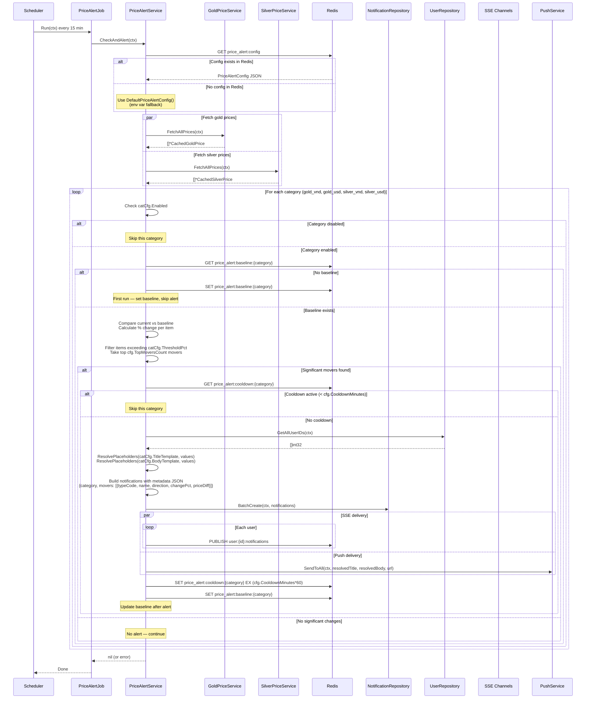
```mermaid
sequenceDiagram
    participant SCH as Scheduler
    participant PAJ as PriceAlertJob
    participant PAS as PriceAlertService
    participant GPS as GoldPriceService
    participant SPS as SilverPriceService
    participant R as Redis
    participant NR as NotificationRepository
    participant UR as UserRepository
    participant SSE as SSE Channels
    participant PUSH as PushService

    SCH->>PAJ: Run(ctx) every 15 min
    PAJ->>PAS: CheckAndAlert(ctx)

    PAS->>R: GET price_alert:config
    alt Config exists in Redis
        R-->>PAS: PriceAlertConfig JSON
    else No config in Redis
        Note over PAS: Use DefaultPriceAlertConfig()<br/>(env var fallback)
    end

    par Fetch gold prices
        PAS->>GPS: FetchAllPrices(ctx)
        GPS-->>PAS: []*CachedGoldPrice
    and Fetch silver prices
        PAS->>SPS: FetchAllPrices(ctx)
        SPS-->>PAS: []*CachedSilverPrice
    end

    loop For each category (gold_vnd, gold_usd, silver_vnd, silver_usd)
        PAS->>PAS: Check catCfg.Enabled
        alt Category disabled
            Note over PAS: Skip this category
        else Category enabled
            PAS->>R: GET price_alert:baseline:{category}
            alt No baseline
                PAS->>R: SET price_alert:baseline:{category}
                Note over PAS: First run — set baseline, skip alert
            else Baseline exists
                PAS->>PAS: Compare current vs baseline<br/>Calculate % change per item
                PAS->>PAS: Filter items exceeding catCfg.ThresholdPct<br/>Take top cfg.TopMoversCount movers

                alt Significant movers found
                    PAS->>R: GET price_alert:cooldown:{category}
                    alt Cooldown active (< cfg.CooldownMinutes)
                        Note over PAS: Skip this category
                    else No cooldown
                        PAS->>UR: GetAllUserIDs(ctx)
                        UR-->>PAS: []int32

                        PAS->>PAS: ResolvePlaceholders(catCfg.TitleTemplate, values)<br/>ResolvePlaceholders(catCfg.BodyTemplate, values)
                        PAS->>PAS: Build notifications with metadata JSON<br/>{category, movers: [{typeCode, name, direction, changePct, priceDiff}]}
                        PAS->>NR: BatchCreate(ctx, notifications)

                        par SSE delivery
                            loop Each user
                                PAS->>R: PUBLISH user:{id}:notifications
                            end
                        and Push delivery
                            PAS->>PUSH: SendToAll(ctx, resolvedTitle, resolvedBody, url)
                        end

                        PAS->>R: SET price_alert:cooldown:{category} EX (cfg.CooldownMinutes*60)
                        PAS->>R: SET price_alert:baseline:{category}
                        Note over PAS: Update baseline after alert
                    end
                else No significant changes
                    Note over PAS: No alert — continue
                end
            end
        end
    end

    PAS-->>PAJ: nil (or error)
    PAJ-->>SCH: Done
```

### Key Invariants

- Each category is checked independently — a gold alert does not affect silver alerts
- Categories can be individually enabled/disabled via admin config (`catCfg.Enabled`)
- Baselines are set on first run and updated only after an alert is sent
- Cooldown period is configurable via admin UI (`cfg.CooldownMinutes`, default 120 min)
- Thresholds are configurable per category via admin UI (`catCfg.ThresholdPct`), with env var fallback defaults
- Notification title and body use template resolution with placeholders (`{moverName}`, `{changePct}`, `{direction}`, etc.)
- Config is loaded from Redis at runtime via `LoadPriceAlertConfig(ctx, rdb)` — falls back to `DefaultPriceAlertConfig()` which reads env vars
- Push delivery failures are non-fatal — SSE and DB notifications still persist
- Only the top N movers (`cfg.TopMoversCount`, default 5) are included in notification metadata
- Notification metadata includes `priceDiff` (absolute price change) in addition to `changePct`

### Error Paths

| Condition | Response | Fallback |
|-----------|----------|----------|
| Gold price fetch failure | Skip gold categories | Silver categories still checked |
| Silver price fetch failure | Skip silver categories | Gold categories still checked |
| Redis baseline read failure | Skip that category | Other categories still checked |
| BatchCreate failure | Error logged, alert not sent | Next run retries |
| SSE publish failure | Non-fatal, logged | DB notification persists |
| Push delivery failure | Non-fatal, logged | SSE + DB notifications still work |
| All price fetches fail | Job returns error, scheduler logs it | Next run retries |

---

## 8. Admin Broadcast Flow

**Trigger:** Admin submits broadcast message via `POST /api/v1/admin/broadcast`
**Source:** `handlers/admin_broadcast.go`, `domain/service/admin_service.go`

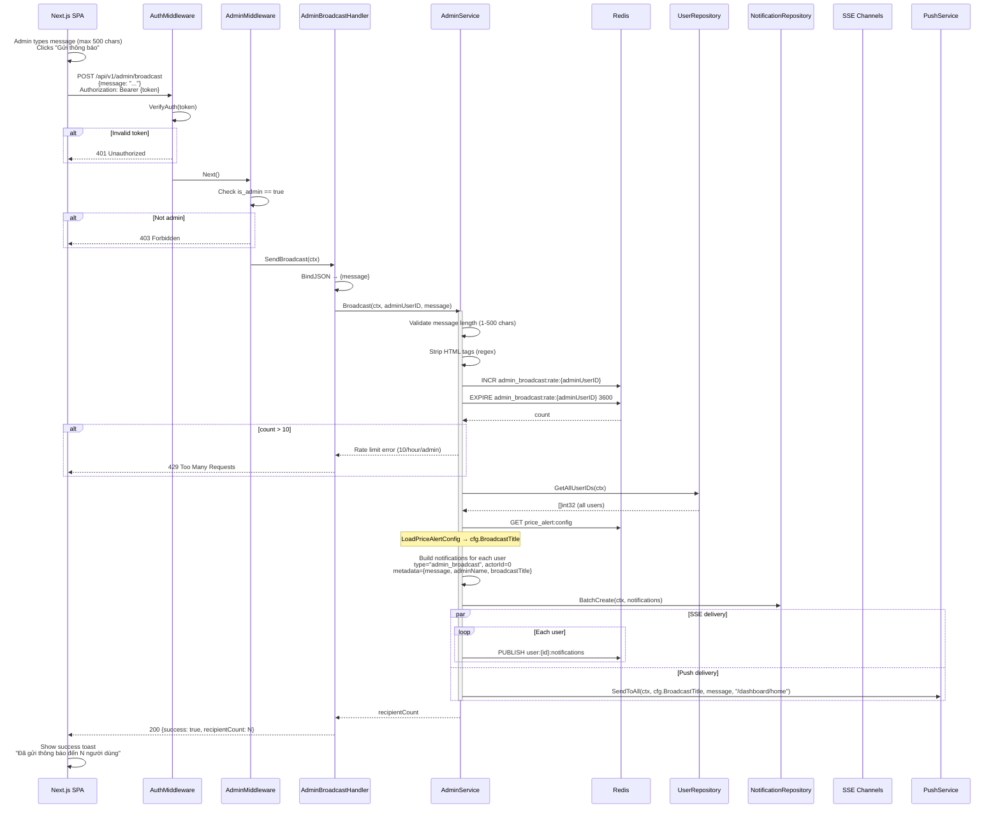
```mermaid
sequenceDiagram
    participant SPA as Next.js SPA
    participant AM as AuthMiddleware
    participant ADM as AdminMiddleware
    participant ABH as AdminBroadcastHandler
    participant AS as AdminService
    participant R as Redis
    participant UR as UserRepository
    participant NR as NotificationRepository
    participant SSE as SSE Channels
    participant PUSH as PushService

    SPA->>SPA: Admin types message (max 500 chars)<br/>Clicks "Gửi thông báo"

    SPA->>AM: POST /api/v1/admin/broadcast<br/>{message: "..."}<br/>Authorization: Bearer {token}

    AM->>AM: VerifyAuth(token)
    alt Invalid token
        AM-->>SPA: 401 Unauthorized
    end

    AM->>ADM: Next()
    ADM->>ADM: Check is_admin == true
    alt Not admin
        ADM-->>SPA: 403 Forbidden
    end

    ADM->>ABH: SendBroadcast(ctx)
    ABH->>ABH: BindJSON → {message}
    ABH->>AS: Broadcast(ctx, adminUserID, message)

    activate AS
    AS->>AS: Validate message length (1-500 chars)
    AS->>AS: Strip HTML tags (regex)

    AS->>R: INCR admin_broadcast:rate:{adminUserID}
    AS->>R: EXPIRE admin_broadcast:rate:{adminUserID} 3600
    R-->>AS: count

    alt count > 10
        AS-->>ABH: Rate limit error (10/hour/admin)
        ABH-->>SPA: 429 Too Many Requests
    end

    AS->>UR: GetAllUserIDs(ctx)
    UR-->>AS: []int32 (all users)

    AS->>R: GET price_alert:config
    Note over AS: LoadPriceAlertConfig → cfg.BroadcastTitle

    AS->>AS: Build notifications for each user<br/>type="admin_broadcast", actorId=0<br/>metadata={message, adminName, broadcastTitle}

    AS->>NR: BatchCreate(ctx, notifications)

    par SSE delivery
        loop Each user
            AS->>R: PUBLISH user:{id}:notifications
        end
    and Push delivery
        AS->>PUSH: SendToAll(ctx, cfg.BroadcastTitle, message, "/dashboard/home")
    end

    deactivate AS
    AS-->>ABH: recipientCount
    ABH-->>SPA: 200 {success: true, recipientCount: N}

    SPA->>SPA: Show success toast<br/>"Đã gửi thông báo đến N người dùng"
```

### Key Invariants

- Only users with `is_admin = true` can broadcast — enforced by double middleware (Auth + Admin)
- Rate limit: 10 broadcasts per hour per admin, tracked via Redis INCR with 1-hour TTL
- HTML tags are stripped from messages to prevent injection — plain text only
- Message length: minimum 1 character, maximum 500 characters
- Notifications use `actorId = 0` to indicate system origin (no user avatar)
- Metadata JSON stores the broadcast message text, admin name, and `broadcastTitle` (from config)
- Push notification title uses `cfg.BroadcastTitle` from `LoadPriceAlertConfig` — configurable via admin UI
- SSE and Push delivery are best-effort — DB notifications are the source of truth

### Error Paths

| Condition | Response | Fallback |
|-----------|----------|----------|
| Missing/invalid JWT | 401 Unauthorized | Client redirects to login |
| Non-admin user | 403 Forbidden | Client shows error |
| Empty message | 400 Bad Request | Client shows validation error |
| Message > 500 chars | 400 Bad Request | Client-side char counter prevents this |
| Rate limit exceeded (10/hr) | 429 Too Many Requests | Admin must wait |
| GetAllUserIDs failure | 500 Internal Server Error | Admin can retry |
| BatchCreate failure | 500 Internal Server Error | Admin can retry |
| SSE publish failure | Non-fatal, logged | DB notifications persist |
| Push delivery failure | Non-fatal, logged | SSE + DB notifications still work |

---

## 9. Admin Price Alert Config Flow

**Trigger:** Admin opens "Notifications" tab on Admin CMS page, views or updates price alert configuration
**Source:** `handlers/price_alert_config.go`, `domain/service/price_alert_config.go`, `features/admin/components/PriceAlertConfigForm.tsx`

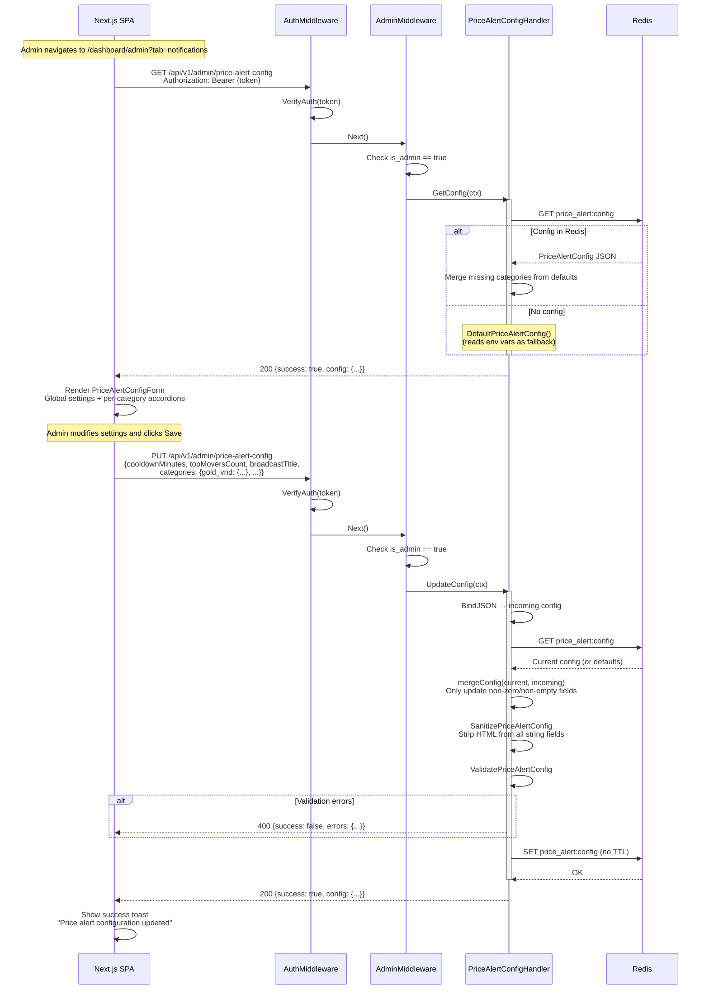
```mermaid
sequenceDiagram
    participant SPA as Next.js SPA
    participant AM as AuthMiddleware
    participant ADM as AdminMiddleware
    participant PACH as PriceAlertConfigHandler
    participant R as Redis

    Note over SPA: Admin navigates to /dashboard/admin?tab=notifications

    SPA->>AM: GET /api/v1/admin/price-alert-config<br/>Authorization: Bearer {token}
    AM->>AM: VerifyAuth(token)
    AM->>ADM: Next()
    ADM->>ADM: Check is_admin == true

    ADM->>PACH: GetConfig(ctx)
    activate PACH
    PACH->>R: GET price_alert:config
    alt Config in Redis
        R-->>PACH: PriceAlertConfig JSON
        PACH->>PACH: Merge missing categories from defaults
    else No config
        Note over PACH: DefaultPriceAlertConfig()<br/>(reads env vars as fallback)
    end
    deactivate PACH
    PACH-->>SPA: 200 {success: true, config: {...}}

    SPA->>SPA: Render PriceAlertConfigForm<br/>Global settings + per-category accordions

    Note over SPA: Admin modifies settings and clicks Save

    SPA->>AM: PUT /api/v1/admin/price-alert-config<br/>{cooldownMinutes, topMoversCount, broadcastTitle,<br/>categories: {gold_vnd: {...}, ...}}
    AM->>AM: VerifyAuth(token)
    AM->>ADM: Next()
    ADM->>ADM: Check is_admin == true

    ADM->>PACH: UpdateConfig(ctx)
    activate PACH
    PACH->>PACH: BindJSON → incoming config
    PACH->>R: GET price_alert:config
    R-->>PACH: Current config (or defaults)
    PACH->>PACH: mergeConfig(current, incoming)<br/>Only update non-zero/non-empty fields
    PACH->>PACH: SanitizePriceAlertConfig<br/>Strip HTML from all string fields
    PACH->>PACH: ValidatePriceAlertConfig
    alt Validation errors
        PACH-->>SPA: 400 {success: false, errors: {...}}
    end
    PACH->>R: SET price_alert:config (no TTL)
    R-->>PACH: OK
    deactivate PACH
    PACH-->>SPA: 200 {success: true, config: {...}}

    SPA->>SPA: Show success toast<br/>"Price alert configuration updated"
```

### Key Invariants

- Config is stored in Redis under key `price_alert:config` with **no TTL** — persists until explicitly overwritten
- When no config exists in Redis, `DefaultPriceAlertConfig()` provides defaults from environment variables
- Missing categories are merged from defaults — adding a new category to defaults auto-fills it for existing configs
- All string fields are sanitized (HTML stripped) before saving to prevent XSS
- Validation enforces: cooldownMinutes 1–1440, topMoversCount 1–20, thresholdPct 0.1–50, non-empty templates and broadcastTitle
- Partial updates: `mergeConfig` only overwrites fields with non-zero/non-empty values from the incoming request
- Config changes take effect on the **next** scheduler run (no restart needed) — `PriceAlertService.CheckAndAlert` reads config from Redis each invocation

### Error Paths

| Condition | Response | Fallback |
|-----------|----------|----------|
| Missing/invalid JWT | 401 Unauthorized | Client redirects to login |
| Non-admin user | 403 Forbidden | Client shows error |
| Redis read failure on GET | Returns DefaultPriceAlertConfig() | Transparent fallback |
| Redis write failure on PUT | 500 Internal Server Error | Admin can retry |
| Validation error (e.g., cooldown=0) | 400 {errors: {cooldownMinutes: "..."}} | Client shows field-level error |
| HTML-only template (empty after strip) | 400 validation error | Client shows error |

---

## 10. Error Code Translation Flow

**Trigger:** Any API call returns an error response with a granular `code` field
**Source:** `pkg/apperrors/codes.go` (backend registry), `lib/utils/error-translation.ts` (frontend mapper), `messages/en.json` + `messages/vi.json` (i18n catalogs)

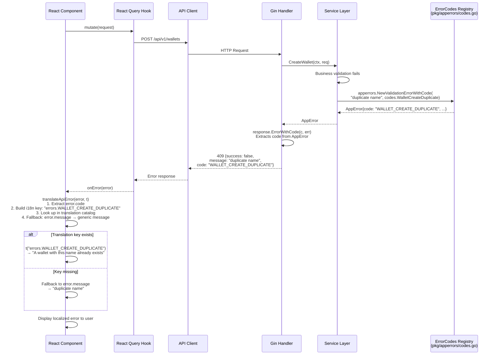
```mermaid
sequenceDiagram
    participant UI as React Component
    participant Hook as React Query Hook
    participant API as API Client
    participant GIN as Gin Handler
    participant SVC as Service Layer
    participant ERR as ErrorCodes Registry<br/>(pkg/apperrors/codes.go)

    UI->>Hook: mutate(request)
    Hook->>API: POST /api/v1/wallets
    API->>GIN: HTTP Request

    GIN->>SVC: CreateWallet(ctx, req)
    SVC->>SVC: Business validation fails
    SVC->>ERR: apperrors.NewValidationErrorWithCode(<br/>"duplicate name", codes.WalletCreateDuplicate)
    ERR-->>SVC: AppError{code: "WALLET_CREATE_DUPLICATE", ...}
    SVC-->>GIN: AppError

    GIN->>GIN: response.ErrorWithCode(c, err)<br/>Extracts code from AppError
    GIN-->>API: 409 {success: false,<br/>message: "duplicate name",<br/>code: "WALLET_CREATE_DUPLICATE"}

    API-->>Hook: Error response
    Hook-->>UI: onError(error)

    UI->>UI: translateApiError(error, t)<br/>1. Extract error.code<br/>2. Build i18n key: "errors.WALLET_CREATE_DUPLICATE"<br/>3. Look up in translation catalog<br/>4. Fallback: error.message → generic message

    alt Translation key exists
        UI->>UI: t("errors.WALLET_CREATE_DUPLICATE")<br/>→ "A wallet with this name already exists"
    else Key missing
        UI->>UI: Fallback to error.message<br/>→ "duplicate name"
    end

    UI->>UI: Display localized error to user
```

### Key Invariants

- Error codes follow the `DOMAIN_ACTION_REASON` pattern (e.g., `WALLET_CREATE_DUPLICATE`, `AUTH_LOGIN_INVALID_CREDENTIALS`)
- All error codes are defined as constants in `pkg/apperrors/codes.go` — the single source of truth for the backend
- Frontend translation keys mirror error codes under the `errors.*` namespace in `messages/en.json` and `messages/vi.json`
- The `translateApiError` utility gracefully falls back: i18n key → raw `error.message` → generic fallback message
- Error codes are optional — legacy error responses without a `code` field still work via the `message` fallback
- The HTTP status code is determined by the error type (validation → 400, not found → 404, conflict → 409), not by the error code
- Error codes are stable strings (not enums) — safe for frontend to match against without tight coupling to backend releases

---

## 11. FetchAllPrices Aggregate Cache Flow

**Trigger:** `GET /api/v1/investments/market-prices` (Prices page load or manual refresh)
**Source:** `domain/service/gold_price_service.go`, `domain/service/silver_price_service.go`, `domain/service/currency_price_service.go`

Gold and currency services use a multi-source waterfall with emergency cache. Silver service uses a direct aggregation (unchanged). The aggregate cache key prevents repeated API calls on page reload.

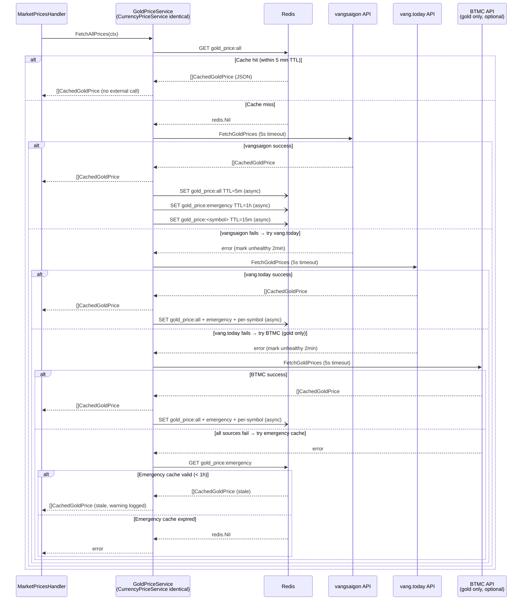
```mermaid
sequenceDiagram
    participant H as MarketPricesHandler
    participant S as GoldPriceService<br/>(CurrencyPriceService identical)
    participant R as Redis
    participant V1 as vangsaigon API
    participant V2 as vang.today API
    participant BT as BTMC API<br/>(gold only, optional)

    H->>S: FetchAllPrices(ctx)
    S->>R: GET gold_price:all
    alt Cache hit (within 5 min TTL)
        R-->>S: []CachedGoldPrice (JSON)
        S-->>H: []CachedGoldPrice (no external call)
    else Cache miss
        R-->>S: redis.Nil
        S->>V1: FetchGoldPrices (5s timeout)
        alt vangsaigon success
            V1-->>S: []CachedGoldPrice
            S-->>H: []CachedGoldPrice
            S-)R: SET gold_price:all TTL=5m (async)
            S-)R: SET gold_price:emergency TTL=1h (async)
            S-)R: SET gold_price:<symbol> TTL=15m (async)
        else vangsaigon fails → try vang.today
            V1-->>S: error (mark unhealthy 2min)
            S->>V2: FetchGoldPrices (5s timeout)
            alt vang.today success
                V2-->>S: []CachedGoldPrice
                S-->>H: []CachedGoldPrice
                S-)R: SET gold_price:all + emergency + per-symbol (async)
            else vang.today fails → try BTMC (gold only)
                V2-->>S: error (mark unhealthy 2min)
                S->>BT: FetchGoldPrices (5s timeout)
                alt BTMC success
                    BT-->>S: []CachedGoldPrice
                    S-->>H: []CachedGoldPrice
                    S-)R: SET gold_price:all + emergency + per-symbol (async)
                else all sources fail → try emergency cache
                    BT-->>S: error
                    S->>R: GET gold_price:emergency
                    alt Emergency cache valid (< 1h)
                        R-->>S: []CachedGoldPrice (stale)
                        S-->>H: []CachedGoldPrice (stale, warning logged)
                    else Emergency cache expired
                        R-->>S: redis.Nil
                        S-->>H: error
                    end
                end
            end
        end
    end
```

### Key Invariants

- The aggregate cache key (`gold_price:all`, `currency_price:all`) is **global** (not user-scoped) — market prices are public data
- Aggregate cache TTL is **5 minutes**; individual per-symbol TTL is **15 minutes**; emergency cache TTL is **1 hour**
- Unhealthy sources are **skipped for 2 minutes** (Redis TTL on health key) — the last source in the chain is always tried
- Emergency cache is updated on **every successful fetch** (any source) — ensures freshness within the hour
- Cache write failures are **non-fatal** — logged as warnings, response returned to caller regardless
- BTMC is **optional** — if `BTMC_API_KEY` is absent, gold chain runs with 2 sources (vangsaigon → vang.today)
- Currency service uses **2 sources only** (vangsaigon → vang.today) — BTMC has no currency data

### Error Paths

| Condition | Response | Notes |
|-----------|----------|-------|
| Redis unavailable on GET | Cache miss → proceed to waterfall | `redis.Nil` treated as miss |
| Redis unavailable on SET | Warning logged; result returned normally | Non-fatal |
| Single source fails | Next source tried; failing source marked unhealthy | Self-healing after 2-min TTL |
| All live sources fail, emergency cache warm | Stale data returned with warning | Graceful degradation |
| All live sources fail, emergency cache cold | Error propagated to `MarketPricesHandler` | Handler returns 503 |
| Silver partial source failure (e.g., Phú Quý down) | Best-effort result cached | Silver service unchanged |

---

## 12. Price Fallback Chain

**Source:** `domain/service/price_fetcher.go`, `domain/service/gold_price_service.go`, `domain/service/currency_price_service.go`
**Added:** 2026-03-25 (price-fallback feature)

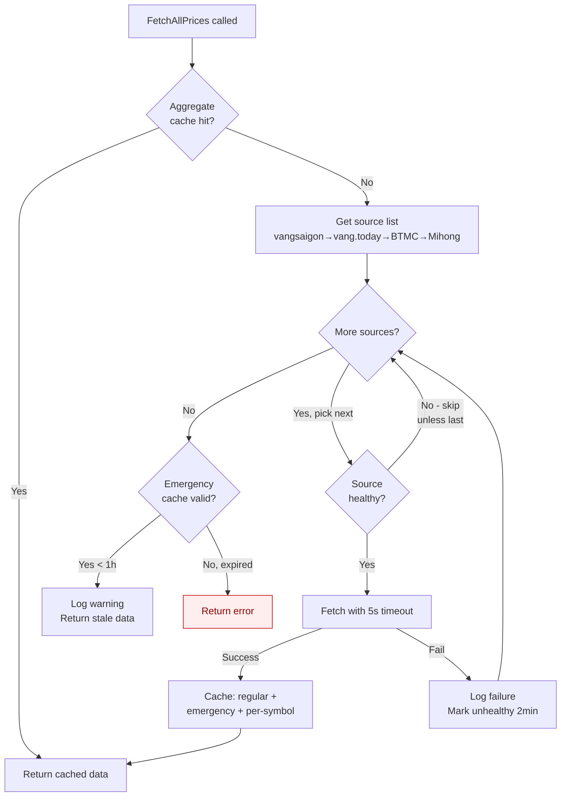
```mermaid
flowchart TD
    A[FetchAllPrices called] --> B{Aggregate\ncache hit?}
    B -->|Yes| C[Return cached data]
    B -->|No| D[Get source list\nvangsaigon→vang.today→BTMC→Mihong]
    D --> E{More sources?}
    E -->|No| K{Emergency\ncache valid?}
    E -->|Yes, pick next| F{Source\nhealthy?}
    F -->|No - skip\nunless last| E
    F -->|Yes| G[Fetch with 5s timeout]
    G -->|Success| H[Cache: regular +\nemergency + per-symbol]
    H --> C
    G -->|Fail| I[Log failure\nMark unhealthy 2min]
    I --> E
    K -->|Yes < 1h| L[Log warning\nReturn stale data]
    K -->|No, expired| M[Return error]:::error

    classDef error fill:#fee,stroke:#c00,color:#900
```

### Source Health State Machine

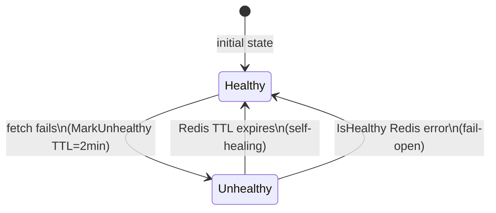
```mermaid
stateDiagram-v2
    [*] --> Healthy : initial state
    Healthy --> Unhealthy : fetch fails\n(MarkUnhealthy TTL=2min)
    Unhealthy --> Healthy : Redis TTL expires\n(self-healing)
    Unhealthy --> Healthy : IsHealthy Redis error\n(fail-open)
```

### FetchPriceForSymbol Flow

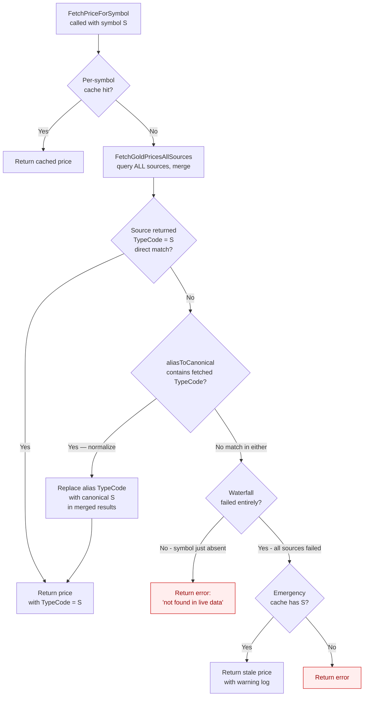
```mermaid
flowchart TD
    A[FetchPriceForSymbol\ncalled with symbol S] --> B{Per-symbol\ncache hit?}
    B -->|Yes| C[Return cached price]
    B -->|No| D[FetchGoldPricesAllSources\nquery ALL sources, merge]
    D --> E{Source returned\nTypeCode = S\ndirect match?}
    E -->|Yes| F[Return price\nwith TypeCode = S]
    E -->|No| G{aliasToCanonical\ncontains fetched TypeCode?}
    G -->|Yes — normalize| H[Replace alias TypeCode\nwith canonical S\nin merged results]
    H --> F
    G -->|No match in either| I{Waterfall\nfailed entirely?}
    I -->|No - symbol just absent| J[Return error:\n'not found in live data']:::error
    I -->|Yes - all sources failed| K{Emergency\ncache has S?}
    K -->|Yes| L[Return stale price\nwith warning log]
    K -->|No| M[Return error]:::error

    classDef error fill:#fee,stroke:#c00,color:#900
```

> **Note:** Alias normalization happens inside `WaterfallGoldFetcher.FetchGoldPrices` (and `FetchGoldPricesAllSources`) before returning — the result always contains canonical TypeCodes. `FetchPriceForSymbol`'s exact-match loop at `gold_price_service.go:144` finds `"SJC"` regardless of which source served it.
>
> **Alias map (`gold.AliasToCanonical` in `pkg/gold/types.go` — single source of truth alongside canonical definitions):**
>
> | Source TypeCode | Canonical TypeCode | Notes |
> |---|---|---|
> | `VNGSJC` | `SJC` | vang.today main SJC bar code |
> | `SJL1L10` | `SJC` | vang.today SJC 1L/10L bar variant |
> | `SJ9999` | `Vàng nhẫn SJC` | vang.today SJC ring 9999 |
> | `MIHONG_999` | `Mihong_999` | vang.today uppercases the underscore variant |
> | `DOHN` | `Doji` | DOJI Hanoi branch |
> | `DOHCM` | `Doji` | DOJI HCM branch |
> | `BTSJC` | `BTMC` | Bảo Tín SJC bar |
> | `BT9999` | `BTMC_24K` | Bảo Tín 24K bar |
> | `VIETTINM` | `VietinGold` | VietinBank gold |

### Key Invariants

- **Fail-open**: if Redis is unavailable, `IsHealthy` returns `true` — never block all sources
- **Last-source guarantee**: the last fetcher in the slice is **always tried** regardless of health status
- **Emergency cache**: written asynchronously on every successful fetch; read synchronously only when all live sources fail
- **BTMC key rotation**: if the API key changes, restart the service — the key is read once at startup via `os.Getenv`
- **Mihong source**: `api.mihong.vn/v1/gold-prices?market=domestic` (requires `x-market: mihong` header) — carries Mihong-exclusive products (e.g., `Mihong_999`) not available from any other source
- **Canonical TypeCodes always returned**: both `FetchGoldPrices` (waterfall single-source) and `FetchGoldPricesAllSources` (all-sources merge) normalize alias TypeCodes via `gold.AliasToCanonical` (`pkg/gold/types.go`); callers always see canonical codes regardless of which source provided the price
- **Alias map lives in `pkg/gold/types.go`**: co-located with canonical `GoldTypes` definitions — single source of truth; add new aliases there when a price source introduces a new code
- **Alias staleness degrades gracefully**: if a source renames a TypeCode, the alias miss falls through to the emergency cache — no user-visible error beyond the existing "not found in live data" warning

---

## 13. Price Cache Background Job

**Trigger:** Application startup — runs every 15 minutes (10-second startup delay)
**Source:** `internal/scheduler/price_cache_job.go`, `domain/service/asset_price_service.go`, `domain/repository/asset_price_repository.go`

`PriceCacheJob` is the **sole writer** to the `asset_price` PostgreSQL table. It decouples all price consumers (HTTP handlers and the `PriceUpdateJob`) from live external APIs. The job fetches gold from 6 independent direct sources (VangSaiGon, VangToday, SJC, DOJI, BTMC, PNJ), silver, and currency prices in **8 parallel goroutines** and persists them to `asset_price`. All consumers then read from the DB exclusively, eliminating per-request external API calls.

**Producer-consumer relationship:**
- `PriceCacheJob` (this job) — **producer**: writes `asset_price` rows every 15 min
- `MarketPricesHandler` / `PublicHandler` — **consumers**: read `asset_price` via `AssetPriceService.GetAllPrices()`
- `PriceUpdateJob` → `MarketDataService` → `AssetDisplayConfigService.ResolvePrice()` — **consumer**: reads `asset_price` to update `investment.current_price` (see [Section 10 of flow-investment.md](flow-investment.md#10-goldsilver-price-resolution-via-fetch-codes))

```mermaid
sequenceDiagram
    participant SCH as Scheduler
    participant PCJ as PriceCacheJob
    participant APS as AssetPriceService
    participant VSG as VangSaiGonFetcher
    participant VT as VangTodayFetcher
    participant SPS as SilverPriceService
    participant CPS as CurrencyPriceService
    participant SJC as pkg/sjc.Client
    participant DOJ as pkg/doji.Client
    participant BTC as pkg/btmcdirect.Client
    participant PNJ as pkg/pnj.Client
    participant APR as AssetPriceRepository
    participant DB as PostgreSQL<br/>(asset_price table)

    SCH->>PCJ: Run(ctx) [every 15 min]
    PCJ->>APS: RefreshAllPrices(ctx)
    Note over APS: Launches 8 goroutines into buffered channel<br/>WaitGroup closer goroutine drains when all done

    par VangSaiGon gold fetch [source="vangsaigon"]
        APS->>VSG: refreshGoldVangSaiGon(ctx)
        VSG->>VangSaiGon API: GET /prices (vnprice.Client)
        alt success
            VangSaiGon API-->>VSG: gold prices
            Note over APS: Normalize AliasToCanonical<br/>Convert to []AssetPrice<br/>AssetType="gold", Source="vangsaigon", IsStale=false
            APS->>APR: UpsertBatch(ctx, batch)
        else fetch or upsert fails
            APS->>APR: MarkStaleByAssetTypeAndSource(ctx, "gold", "vangsaigon")
        end
    and VangToday gold fetch [source="vangtoday"]
        APS->>VT: refreshGoldVangToday(ctx)
        VT->>VangToday API: GET /prices (vangtoday.Client)
        alt success
            VangToday API-->>VT: gold prices (canonical TypeCodes)
            Note over APS: Convert to []AssetPrice<br/>AssetType="gold", Source="vangtoday", IsStale=false
            APS->>APR: UpsertBatch(ctx, batch)
        else fetch or upsert fails
            APS->>APR: MarkStaleByAssetTypeAndSource(ctx, "gold", "vangtoday")
        end
    and SJC direct fetch [source="sjc"]
        APS->>SJC: FetchGoldPrices(ctx)
        alt Fetch success
            SJC-->>APS: []*sjc.GoldPrice (TypeCode="SJC_*", Buy/Sell int64)
            Note over APS: Convert to []AssetPrice<br/>Source="sjc", IsStale=false
            APS->>APR: UpsertBatch(ctx, sjcPrices)
        else Fetch failure / nil client
            SJC-->>APS: error
            APS->>APR: MarkStaleByAssetTypeAndSource(ctx, "gold", "sjc")
        end
    and DOJI direct fetch [source="doji"]
        APS->>DOJ: FetchGoldPrices(ctx)
        alt Fetch success
            DOJ-->>APS: []*doji.GoldPrice (TypeCode="DOJI_*", ×1,000,000 applied)
            Note over APS: Convert to []AssetPrice<br/>Source="doji", IsStale=false
            APS->>APR: UpsertBatch(ctx, dojiPrices)
        else Fetch failure / nil client
            DOJ-->>APS: error
            APS->>APR: MarkStaleByAssetTypeAndSource(ctx, "gold", "doji")
        end
    and BTMC direct fetch [source="btmc"]
        APS->>BTC: FetchGoldPrices(ctx)
        alt Fetch success
            BTC-->>APS: []*btmcdirect.GoldPrice (TypeCode="BTMC_*", ×1,000 applied)
            Note over APS: Convert to []AssetPrice<br/>Source="btmc", IsStale=false
            APS->>APR: UpsertBatch(ctx, btmcPrices)
        else Fetch failure / nil client
            BTC-->>APS: error
            APS->>APR: MarkStaleByAssetTypeAndSource(ctx, "gold", "btmc")
        end
    and PNJ direct fetch [source="pnj"]
        APS->>PNJ: FetchGoldPrices(ctx)
        alt Fetch success
            PNJ-->>APS: []*pnj.GoldPrice (TypeCode="PNJ_*", ×1,000 applied, TPHCM region)
            Note over APS: Convert to []AssetPrice<br/>Source="pnj", IsStale=false
            APS->>APR: UpsertBatch(ctx, pnjPrices)
        else Fetch failure / nil client
            PNJ-->>APS: error
            APS->>APR: MarkStaleByAssetTypeAndSource(ctx, "gold", "pnj")
        end
    and Silver fetch [source="waterfall"]
        APS->>SPS: FetchAllPrices(ctx)
        alt Fetch success
            SPS-->>APS: []*CachedSilverPrice
            Note over APS: Convert to []AssetPrice<br/>AssetType="silver", Source="waterfall", IsStale=false
            APS->>APR: UpsertBatch(ctx, silverPrices)
        else Fetch failure
            SPS-->>APS: error
            APS->>APR: MarkStaleByAssetTypeAndSource(ctx, "silver", "waterfall")
        end
    and Currency fetch [source="waterfall"]
        APS->>CPS: FetchAllPrices(ctx)
        alt Fetch success
            CPS-->>APS: []*CachedCurrencyPrice
            Note over APS: Convert to []AssetPrice<br/>AssetType="currency", Source="waterfall", IsStale=false
            APS->>APR: UpsertBatch(ctx, currencyPrices)
        else Fetch failure
            CPS-->>APS: error
            APS->>APR: MarkStaleByAssetTypeAndSource(ctx, "currency", "waterfall")
        end
    end

    Note over APS: Collect all 8 refreshResult values from channel<br/>failCount < 8 → nil; failCount == 8 → error "all price sources failed"
    APS-->>PCJ: nil (or error if all 8 failed)
    PCJ-->>SCH: Log result
```

### Key Invariants

- **`PriceCacheJob` is the sole writer to `asset_price`** — no other job or handler writes to this table; all other consumers are read-only
- All 8 fetches are **independent** — one failure does not prevent others from succeeding
- On fetch success: `UpsertBatch` uses `ON CONFLICT (type_code, currency, source) DO UPDATE` — idempotent (3-column unique index)
- On fetch failure: `MarkStaleByAssetTypeAndSource(ctx, assetType, source)` marks stale only for that source — other sources' rows for the same `asset_type` are unaffected
- Nil client (e.g., no `BTMC_API_KEY`) → goroutine treats it as failure → marks stale for that source; the other 7 sources are unaffected
- Error is returned only if **all 8** sources fail simultaneously
- The job never crashes the scheduler — all errors are logged and returned without panicking
- `PriceCacheJob` has a 10-second startup delay so the app is fully initialized before the first fetch
- **`PriceUpdateJob` is a consumer, not a writer**: it reads from `asset_price` via `AssetDisplayConfigService.ResolvePrice()` to resolve gold/silver prices for individual investments, then writes only to `investment.current_price` + `investment.price_updated_at`
- **Alias normalization boundary**: vangsaigon TypeCodes are normalized via `gold.AliasToCanonical` before upsert; vangtoday TypeCodes are already canonical. `AssetPriceService` receives only canonical codes for both sources.
- **TypeCode namespacing**: vangsaigon and vangtoday codes are canonical (e.g., `SJC`, `DOJI`); per-source direct codes carry a source prefix (e.g., `SJC_1L10L1KG`, `DOJI_NHANVANG`). No collision possible due to the 3-column unique index including `source`.

### Error Paths

| Condition | Response | User Impact |
|-----------|----------|-------------|
| One per-source client fails (e.g., SJC API down) | `MarkStaleByAssetTypeAndSource("gold", "sjc")` | SJC-sourced gold prices show `isStale: true`; other 7 sources unaffected |
| VangSaiGon gold fails | `MarkStaleByAssetTypeAndSource("gold", "vangsaigon")` | VangSaiGon gold prices stale; other 7 sources unaffected |
| VangToday gold fails | `MarkStaleByAssetTypeAndSource("gold", "vangtoday")` | VangToday gold prices stale; other 7 sources unaffected |
| All 8 sources fail | `RefreshAllPrices` returns error | All price items have `isStale: true`; frontend displays `"--"` |
| DB write fails for one source | Error logged; that source's prices may lag | Next run retries; other sources update normally |
| DB empty (first run not yet complete) | Handlers return empty arrays or static fallback | `GetPublicMarketTypes` falls back to static registries |

### DB-Backed Consumers of asset_price Table

`PriceCacheJob` is the sole writer. All of the following are read-only consumers. **None of them call live gold/silver/currency APIs directly** (except as cold-start fallbacks in `MarketDataService`).

| Consumer | Access path | Stale handling |
|----------|-------------|----------------|
| `MarketPricesHandler` / `PublicHandler` | `AssetPriceService.GetAllPrices()` | `IsStale: true` → `isStale` field in response; frontend displays `"--"` |
| `PriceUpdateJob` → `MarketDataService` → `AssetDisplayConfigService.ResolvePrice()` | `AssetPriceRepository.ListByAssetType()` + fetch code priority lookup | All stale → returns freshest stale price; no rows → falls back to live `GoldPriceService` / `SilverPriceService` |
| `PriceAlertJob` → `PriceAlertService` | `GetPricesByAssetType("gold")`, `GetPricesByAssetType("silver")` | Rows with `IsStale: true` are skipped — no alert fired on stale price |
| `UserPriceAlertJob` → `UserPriceAlertService` | `GetPriceByTypeCode(symbol)` (single alert), `GetPricesByAssetType` (batch) | Returns price 0 / skips map entry when stale — alert not triggered |
| `WatchlistService.ListItems` | `GetAllPrices()` | Falls back to zero buy/sell prices on error; stale rows propagated to client as-is |

**Yahoo Finance (`MarketDataService`) remains live** — `WatchlistService` still fetches market items (stocks, crypto, ETFs) from Yahoo Finance concurrently. Only the gold/silver/currency lookup in `WatchlistService.ListItems` uses the DB cache. `PriceUpdateJob` also calls Yahoo Finance live for stocks/ETFs/crypto investments (not gold/silver).

---

## 14. Gold Display Prices Read Flow

**Trigger:** Any component calls `useQueryGetGoldDisplayPrices()`
**Sources:** `handlers/gold_display_config.go`, `domain/service/gold_display_config_service.go`, `domain/repository/gold_display_config_repository.go`

```mermaid
flowchart TD
    A["Component calls\nuseQueryGetGoldDisplayPrices()"] --> B["GET /api/v1/public/gold-display-prices"]
    B --> C["GoldDisplayConfigHandler\n.GetDisplayPrices"]

    C --> D["GoldDisplayConfigService\n.GetDisplayPrices(ctx)"]

    D --> E["repo.ListEnabled(ctx)\nReturns enabled configs\nsorted by display_order"]
    D --> F["AssetPriceService\n.GetPricesByAssetType(ctx, 'gold')\nBuilds priceMap[typeCode]→price"]

    E --> G["Join: for each config,\nlook up TypeCode in priceMap"]
    F --> G

    G --> H{TypeCode found\nin priceMap?}
    H -- Yes --> I["Populate buy/sell/currency\nupdatedAt/isStale from price row"]
    H -- No --> J["buy=0, sell=0\nisStale=true (safe default)"]

    I --> K["Service returns\n[]GoldDisplayPrice"]
    J --> K

    K --> L["Handler: PriceOverrideCache\n.GetAll(ctx)\n(graceful skip if Redis nil)"]
    L --> M["Build overrideMap\n[typeCode:currency]→override"]
    M --> N["Apply override if\ntypeCode:currency key present"]
    N --> O["Return GetGoldDisplayPricesResponse\n{Prices: [...]}"]

    O --> P["Frontend receives prices array\nsorted by displayOrder"]
    P --> Q{isStale || buy === 0?}
    Q -- Yes --> R["Display '--'"]
    Q -- No --> S["Format and display price"]

    classDef service fill:#ddf,stroke:#66c,color:#003
    classDef handler fill:#dfd,stroke:#6a6,color:#030
    classDef repo fill:#ffd,stroke:#aa6,color:#330
    classDef frontend fill:#fdf,stroke:#c6c,color:#303
    classDef default_node fill:#eee,stroke:#999,color:#333

    class C,N handler
    class D,K service
    class E,F repo
    class A,P,Q,R,S frontend
```

### Key Invariants

- Missing prices never block the response — zero prices with `isStale=true` are safe defaults for configs with no matching price row in the DB cache
- Redis overrides are applied at handler level, not service level (same pattern as `market_prices.go`)
- Response is sorted by `displayOrder` from the DB config — the order is fully admin-controlled
- Frontend stale check: `isStale || buy === 0` → display `"--"` (same convention as market prices page)
- `GetAll` on the override cache uses a graceful skip if `PriceOverrideCache` is nil — no panic on cold start

---

## 15. Admin Gold Display Config CRUD Flow

**Trigger:** Admin opens the `GoldDisplayConfigTable` or submits `GoldDisplayConfigForm`
**Sources:** `handlers/gold_display_config.go`, `domain/service/gold_display_config_service.go`, `domain/repository/gold_display_config_repository.go`

### Diagram A — Read: ListAll

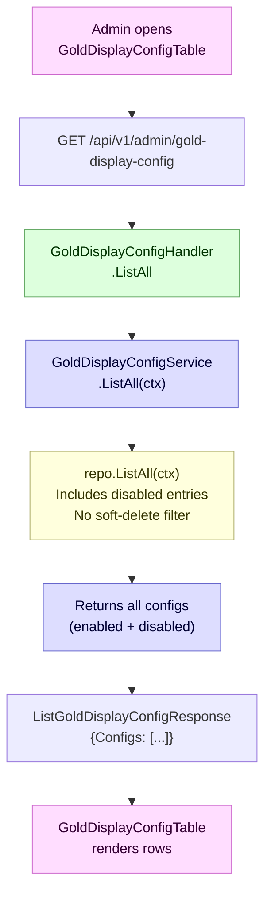
```mermaid
flowchart TD
    A["Admin opens\nGoldDisplayConfigTable"] --> B["GET /api/v1/admin/gold-display-config"]
    B --> C["GoldDisplayConfigHandler\n.ListAll"]
    C --> D["GoldDisplayConfigService\n.ListAll(ctx)"]
    D --> E["repo.ListAll(ctx)\nIncludes disabled entries\nNo soft-delete filter"]
    E --> F["Returns all configs\n(enabled + disabled)"]
    F --> G["ListGoldDisplayConfigResponse\n{Configs: [...]}"]
    G --> H["GoldDisplayConfigTable\nrenders rows"]

    classDef handler fill:#dfd,stroke:#6a6,color:#030
    classDef service fill:#ddf,stroke:#66c,color:#003
    classDef repo fill:#ffd,stroke:#aa6,color:#330
    classDef frontend fill:#fdf,stroke:#c6c,color:#303

    class C handler
    class D,F service
    class E repo
    class A,H frontend
```

### Diagram B — Write: Create / Update / Delete

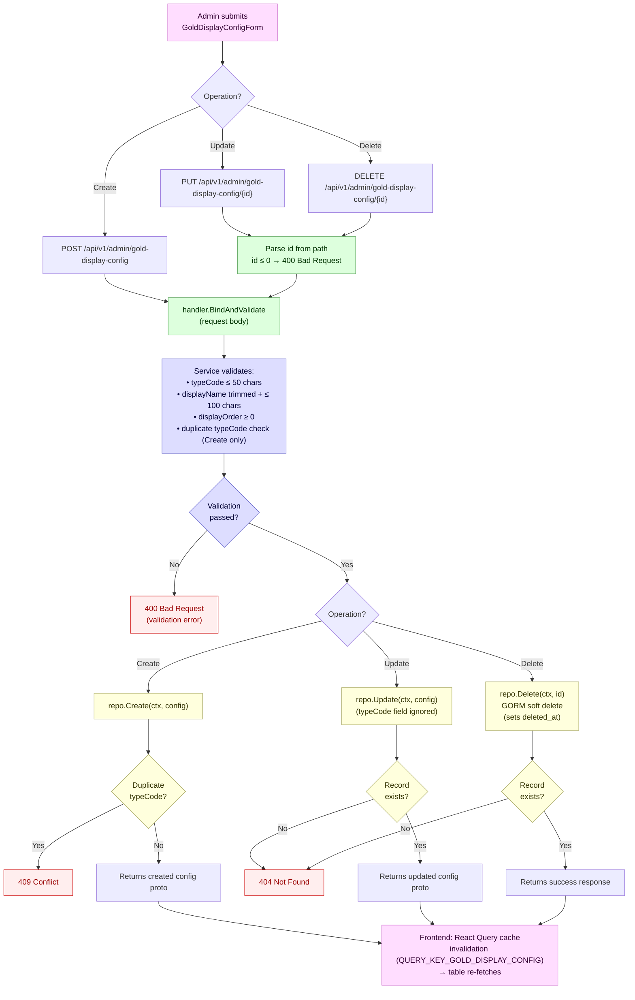
```mermaid
flowchart TD
    A["Admin submits\nGoldDisplayConfigForm"] --> B{Operation?}

    B -- Create --> C["POST /api/v1/admin/gold-display-config"]
    B -- Update --> D["PUT /api/v1/admin/gold-display-config/{id}"]
    B -- Delete --> E["DELETE /api/v1/admin/gold-display-config/{id}"]

    D --> F["Parse id from path\nid ≤ 0 → 400 Bad Request"]
    E --> F

    C --> G["handler.BindAndValidate\n(request body)"]
    F --> G

    G --> H["Service validates:\n• typeCode ≤ 50 chars\n• displayName trimmed + ≤ 100 chars\n• displayOrder ≥ 0\n• duplicate typeCode check (Create only)"]

    H --> I{Validation\npassed?}
    I -- No --> J["400 Bad Request\n(validation error)"]

    I -- Yes --> K{Operation?}

    K -- Create --> L["repo.Create(ctx, config)"]
    K -- Update --> M["repo.Update(ctx, config)\n(typeCode field ignored)"]
    K -- Delete --> N["repo.Delete(ctx, id)\nGORM soft delete\n(sets deleted_at)"]

    L --> O{Duplicate\ntypeCode?}
    O -- Yes --> P["409 Conflict"]
    O -- No --> Q["Returns created config proto"]

    M --> R{Record\nexists?}
    R -- No --> S["404 Not Found"]
    R -- Yes --> T["Returns updated config proto"]

    N --> U{Record\nexists?}
    U -- No --> S
    U -- Yes --> V["Returns success response"]

    Q --> W["Frontend: React Query cache\ninvalidation (QUERY_KEY_GOLD_DISPLAY_CONFIG)\n→ table re-fetches"]
    T --> W
    V --> W

    classDef handler fill:#dfd,stroke:#6a6,color:#030
    classDef service fill:#ddf,stroke:#66c,color:#003
    classDef repo fill:#ffd,stroke:#aa6,color:#330
    classDef frontend fill:#fdf,stroke:#c6c,color:#303
    classDef error fill:#fee,stroke:#c00,color:#900

    class G,F handler
    class H,I service
    class L,M,N,O,R,U repo
    class A,W frontend
    class J,P,S error
```

### Key Invariants

- `typeCode` is immutable after creation — the Update endpoint does not accept a `typeCode` field; any value sent is ignored
- Soft deletes via GORM `DeletedAt` — deleted records remain in the DB but are hidden from `ListEnabled` (the public read path)
- Admin CRUD endpoints do NOT use generated proto hooks — the frontend uses `apiClient` directly (no RPCs defined for these endpoints in the proto file)
- `ListAll` (admin) includes disabled entries; `ListEnabled` (public) filters to `is_enabled = true` only
- React Query cache invalidation key `QUERY_KEY_GOLD_DISPLAY_CONFIG` is shared across the table and any other consumers of the admin list endpoint
