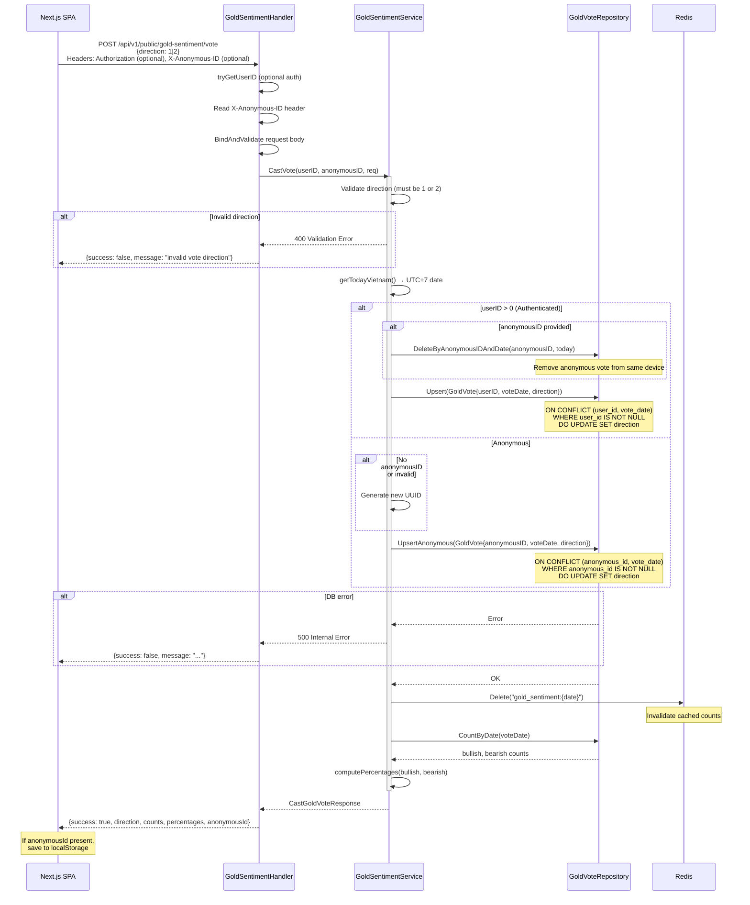
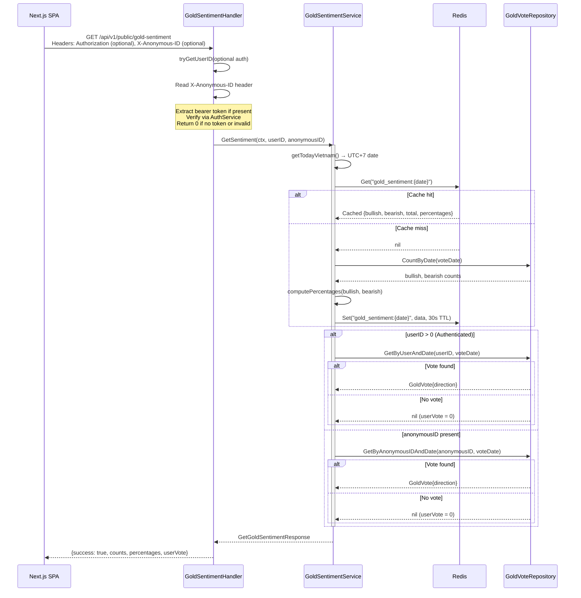
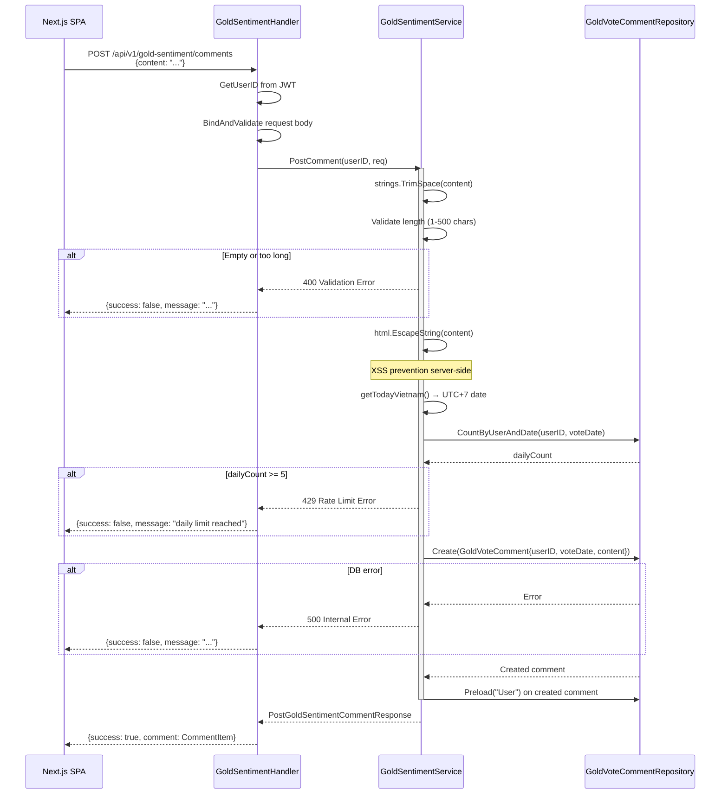

# Gold Sentiment Domain — Runtime Flows

Daily gold sentiment voting and commenting flows. Public GET endpoints support optional auth for user-specific data. Protected write endpoints require JWT authentication.

## Table of Contents

- [Cast Vote](#1-cast-vote)
- [Get Sentiment](#2-get-sentiment)
- [Post Comment](#3-post-comment)

---

## 1. Cast Vote

**Trigger:** User (authenticated or anonymous) clicks bullish or bearish vote button
**Endpoint:** `POST /api/v1/public/gold-sentiment/vote`
**Source:** `domain/service/gold_sentiment_service.go`, `handlers/gold_sentiment.go`

**Key Invariants:**
- Direction must be 1 (BULLISH) or 2 (BEARISH); 0 (UNSPECIFIED) is rejected
- Public endpoint — no auth required, supports both authenticated and anonymous votes
- Authenticated users: 1 vote/day via UNIQUE partial index `(user_id, vote_date) WHERE user_id IS NOT NULL`
- Anonymous users: 1 vote/day per UUID via UNIQUE partial index `(anonymous_id, vote_date) WHERE anonymous_id IS NOT NULL`
- When authenticated user votes, any anonymous vote from same device (same `X-Anonymous-ID`) is deleted
- Vote date calculated in Vietnam timezone (UTC+7)
- Redis cache invalidated after every vote to ensure fresh counts
- Anonymous ID validated as UUID format (36 chars, regex)

**Error Paths:**

| Condition | Response | Rollback |
|-----------|----------|----------|
| Direction = 0 or > 2 | 400 Validation Error | None |
| DB upsert failure | 500 Internal Error | None |

---

## 2. Get Sentiment

**Trigger:** Page loads gold sentiment card (landing or dashboard)
**Endpoint:** `GET /api/v1/public/gold-sentiment`
**Source:** `domain/service/gold_sentiment_service.go`, `handlers/gold_sentiment.go`

**Key Invariants:**
- Public endpoint — no auth required, but auth or `X-Anonymous-ID` is attempted for `userVote` field
- Redis cache with 30s TTL prevents excessive DB queries
- `userVote` populated from auth (user_id lookup) or anonymous ID (anonymous_id lookup)
- `userVote` is 0 (UNSPECIFIED) when neither authenticated nor anonymous ID present, or no vote exists
- Cache stores only aggregate counts, not per-user data

**Error Paths:**

| Condition | Response | Rollback |
|-----------|----------|----------|
| Redis unavailable | Falls through to DB | None |
| DB query failure | 500 Internal Error | None |
| Invalid auth token | userID = 0, continues without user vote | None |

---

## 3. Post Comment

**Trigger:** Authenticated user submits a comment on dashboard home
**Endpoint:** `POST /api/v1/gold-sentiment/comments`
**Source:** `domain/service/gold_sentiment_service.go`, `handlers/gold_sentiment.go`

**Key Invariants:**
- Content trimmed, validated (1-500 chars), and HTML-escaped server-side
- Rate limit: 5 comments per user per day (enforced in service layer)
- Comment date matches today's vote date (Vietnam TZ)
- User info preloaded for response (avatar, name)
- No `dangerouslySetInnerHTML` on frontend — all content rendered as text nodes

**Error Paths:**

| Condition | Response | Rollback |
|-----------|----------|----------|
| Missing/invalid JWT | 401 Unauthorized | None |
| Empty content after trim | 400 Validation Error | None |
| Content > 500 chars | 400 Validation Error | None |
| Daily limit (5) exceeded | 429 Rate Limit Error | None |
| DB write failure | 500 Internal Error | None |
