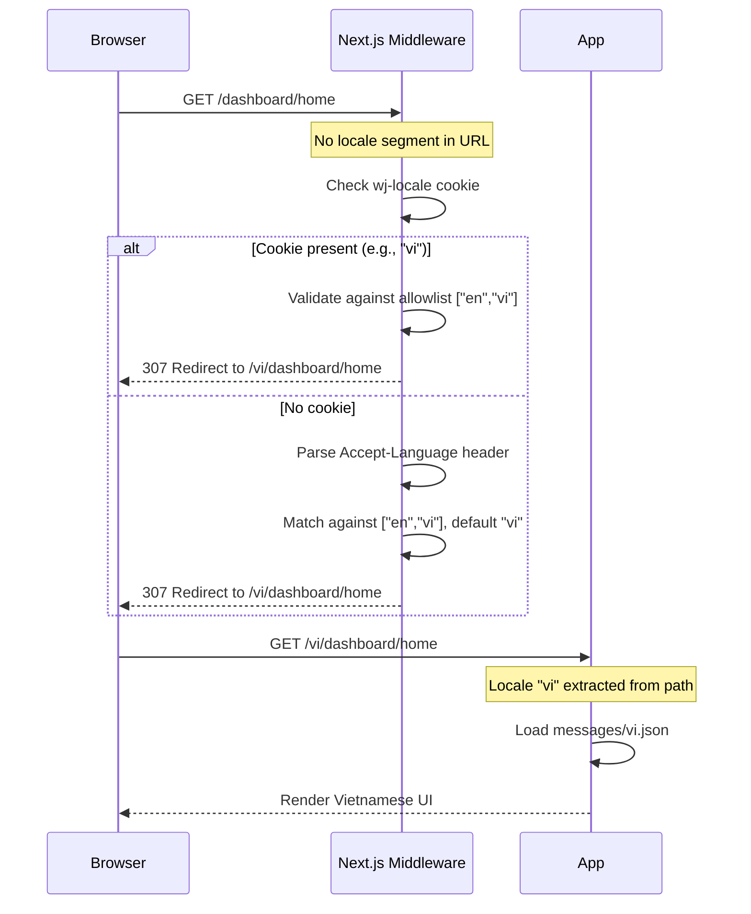

# i18n Flow Diagrams

## Flow 1: First Visit Locale Detection
**Trigger:** Browser requests any URL (no locale in path)
**Source:** `src/wj-client/middleware.ts`



**Key Invariants:**
- Unsupported locale in URL → redirect to /vi/ (never rendered as-is)
- Cookie value always validated against allowlist before use

**Error Paths:**

| Condition | Response | Rollback |
|-----------|----------|----------|
| Unsupported locale in URL (e.g. /fr/) | 307 → /vi/ | N/A |
| Invalid cookie value | Ignored, fall back to Accept-Language or "vi" | N/A |
| Malformed Accept-Language header | Graceful parse failure, fall back to "vi" | N/A |

---

## Flow 2: Language Switch in Settings
**Trigger:** User selects new language and clicks Save in /*/dashboard/settings
**Source:** `src/wj-client/features/settings/components/LanguageSelector.tsx`

```mermaid
sequenceDiagram
    participant U as User (Browser)
    participant FE as LanguageSelector
    participant API as Go Backend
    participant DB as PostgreSQL

    U->>FE: Select "English", click Save
    FE->>API: PUT /api/v1/users/preferences {language: "en"}
    API->>API: Validate JWT (existing middleware)
    API->>API: Validate "en" ∈ ["en","vi"]
    API->>DB: UPDATE user SET preferred_language='en' WHERE id=$userID
    DB-->>API: OK
    API-->>FE: 200 {success: true, data: {preferredLanguage: "en"}}
    FE->>U: Set cookie: wj-locale=en; SameSite=Lax
    FE->>U: router.replace(currentPath, {locale: "en"})
    Note over U: URL changes from /vi/dashboard/settings → /en/dashboard/settings
    Note over U: Page re-renders with English UI
```

**Key Invariants:**
- Language is validated server-side against allowlist before DB write
- Cookie is set AFTER successful API response (not before)
- Redirect uses `router.replace` (not `push`) to avoid extra history entry

**Error Paths:**

| Condition | Response | Rollback |
|-----------|----------|----------|
| Unauthenticated request | 401 from existing JWT middleware | No DB change |
| Invalid language value | 400 ValidationError from service | No DB change |
| DB write failure | 500 from handler | Cookie not set, no redirect |
