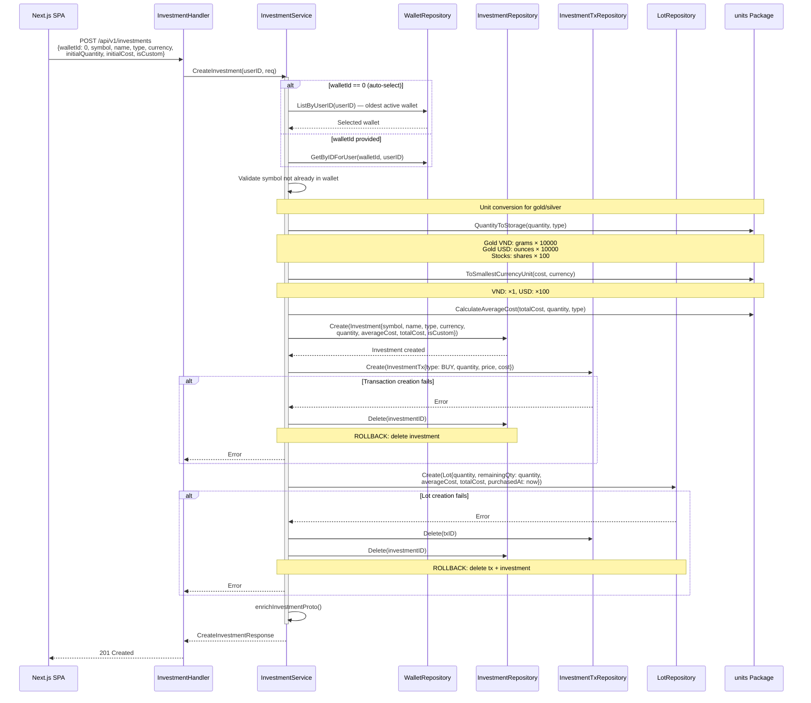
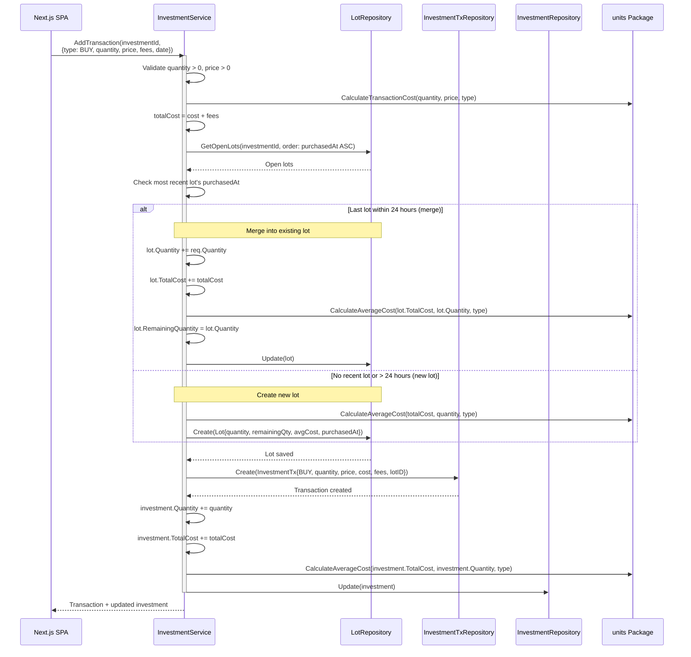
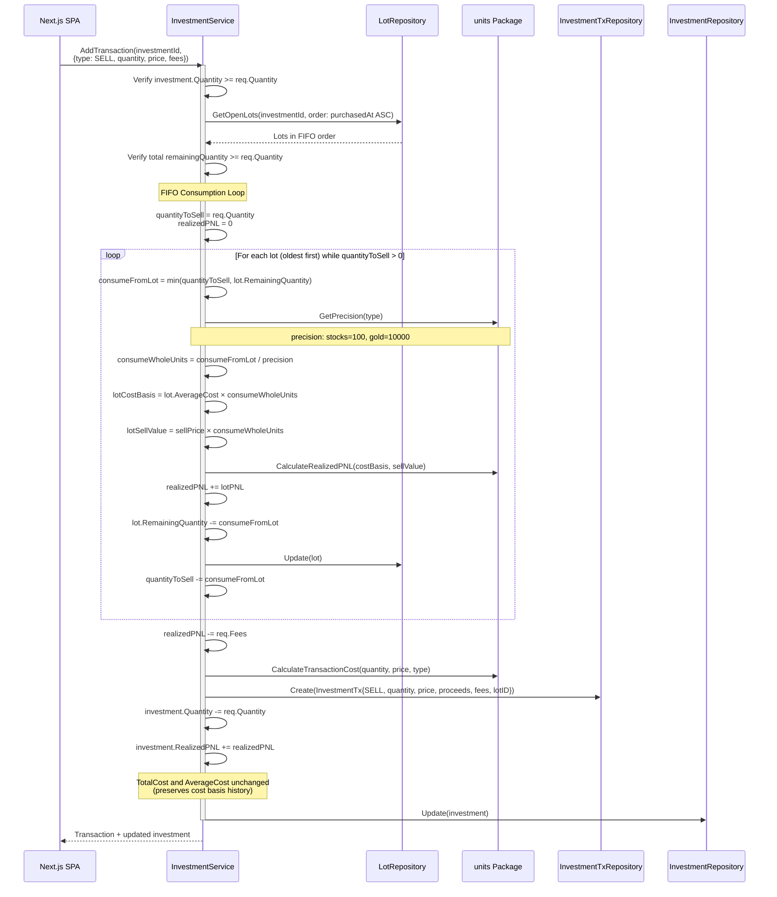
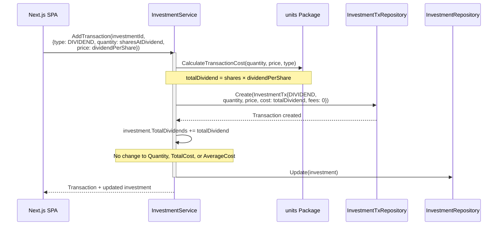
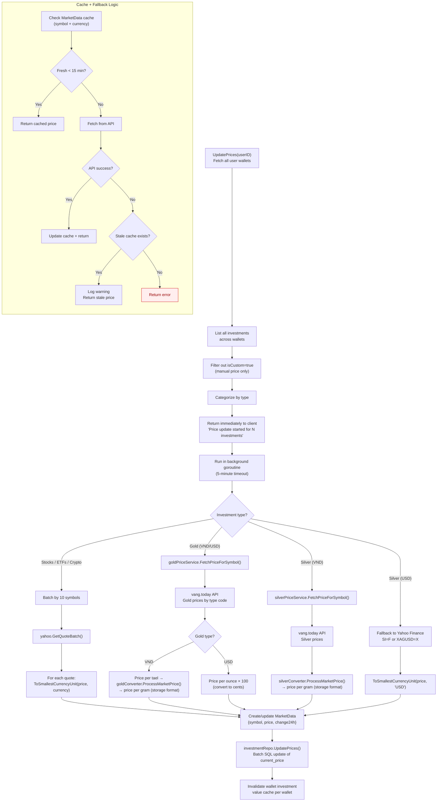
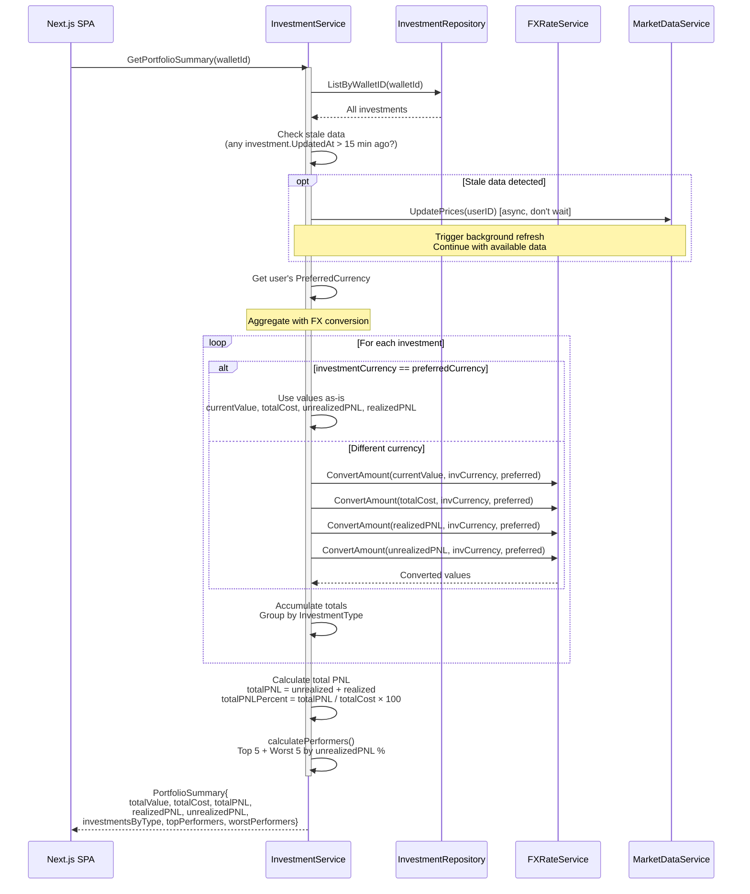
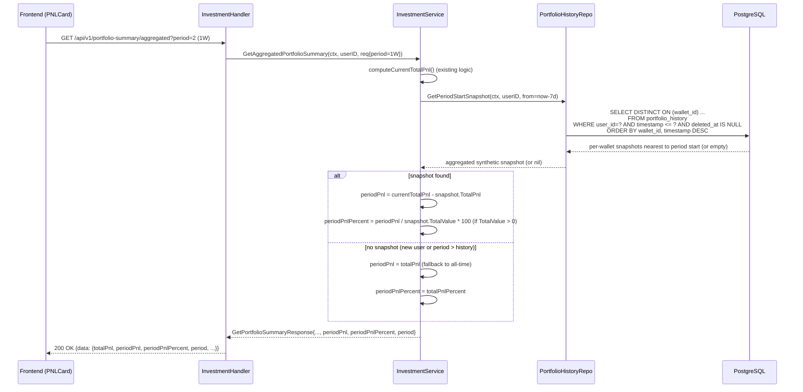
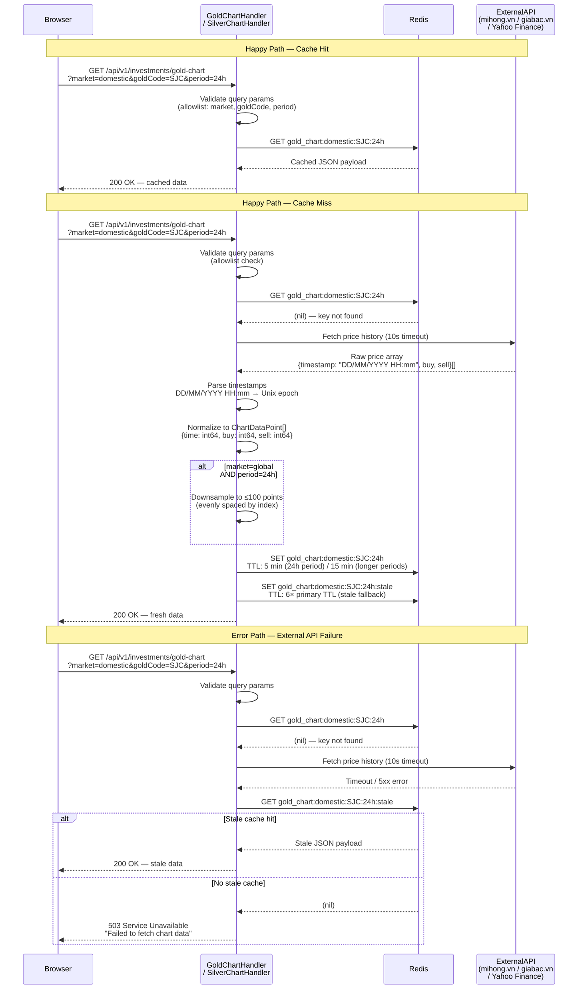

# Investment Domain — Runtime Flows

Investment portfolio management flows covering the most complex business logic in the system. Includes FIFO cost basis accounting, multi-source market price updates, and portfolio aggregation with FX conversion.

## Table of Contents

- [Create Investment (incl. Gold/Silver)](#1-create-investment-incl-goldsilver)
- [Buy Transaction with Lot Merging](#2-buy-transaction-with-lot-merging)
- [FIFO Sell Transaction](#3-fifo-sell-transaction)
- [Dividend Processing](#4-dividend-processing)
- [Market Price Update Pipeline](#5-market-price-update-pipeline)
- [Portfolio Summary Calculation](#6-portfolio-summary-calculation)

---

## 1. Create Investment (incl. Gold/Silver)

**Trigger:** User adds a new investment holding (wallet auto-selected by backend)
**Endpoint:** `POST /api/v1/investments`
**Source:** `domain/service/investment_service.go`, `handlers/investment.go`



### Storage Formats by Type

| Investment Type | Quantity Unit | Storage Multiplier | Example |
|----------------|-------------|-------------------|---------|
| Stocks, ETFs, Crypto | Shares | ×100 | 10 shares = 1000 |
| Gold (VND) | Grams | ×10,000 | 75g (2 taels) = 750,000 |
| Gold (USD) | Ounces | ×10,000 | 1 oz = 10,000 |
| Silver (VND) | Grams | ×10,000 | Same as gold |
| Silver (USD) | Ounces | ×10,000 | Same as gold |

### Error Paths

| Condition | Response | Rollback |
|-----------|----------|----------|
| No active wallet found (auto-select) | 400 Validation | None |
| Wallet not found or not owned | 404 | None |
| Symbol already exists in wallet | 400 Validation | None |
| Transaction creation fails | 500 | Delete investment |
| Lot creation fails | 500 | Delete tx + investment |

---

## 2. Buy Transaction with Lot Merging

**Trigger:** User buys more of an existing investment holding
**Endpoint:** `POST /api/v1/investments/:id/transactions`
**Source:** `domain/service/investment_service.go` — `processBuyTransaction()`



### Lot Merge Decision (24-Hour Window)

```
Most recent lot purchased at: 2025-03-05 10:00
Current purchase at:          2025-03-05 14:00  → MERGE (4h < 24h)
Current purchase at:          2025-03-06 12:00  → NEW LOT (26h > 24h)
```

### Key Invariants

- Lot merging prevents excessive lot fragmentation for same-day purchases
- Average cost is recalculated at both the lot and investment level after each buy
- Fees are included in total cost but tracked separately on the transaction
- No wallet balance deduction — investments are decoupled from wallet balances

---

## 3. FIFO Sell Transaction

**Trigger:** User sells shares/units of an investment
**Endpoint:** `POST /api/v1/investments/:id/transactions`
**Source:** `domain/service/investment_service.go` — `processSellTransaction()`



### FIFO Consumption Example

```
Lot 1: 100 shares @ $85 (purchased Jan 1) — remainingQty: 100
Lot 2: 50 shares  @ $90 (purchased Feb 1) — remainingQty: 50

Sell 120 shares @ $95:
  → Lot 1: consume 100, costBasis = 100 × $85 = $8,500, sellValue = 100 × $95 = $9,500, PNL = +$1,000
  → Lot 2: consume 20,  costBasis = 20 × $90  = $1,800, sellValue = 20 × $95  = $1,900, PNL = +$100
  → Total realizedPNL = $1,100 (before fees)
  → Lot 1 remainingQty: 0 (fully consumed)
  → Lot 2 remainingQty: 30
```

### Key Invariants

- Lots are consumed strictly in FIFO order (oldest `purchasedAt` first)
- Per-lot PNL is calculated individually, not using a blended average
- `TotalCost` and `AverageCost` on the investment are **not** modified during sells — they represent the historical cost basis
- Only `Quantity` and `RealizedPNL` are updated on the investment
- Fees are subtracted from realized PNL, not from the sell proceeds calculation

### Error Paths

| Condition | Response | Rollback |
|-----------|----------|----------|
| Insufficient quantity to sell | 400 Validation | None |
| Total remaining lots < sell quantity | 400 Validation | None |
| Lot update fails mid-loop | 500 | Earlier lots already consumed (inconsistency risk) |
| Transaction creation fails | 500 | Lots consumed but no tx record |

---

## 4. Dividend Processing

**Trigger:** User records a dividend payment
**Endpoint:** `POST /api/v1/investments/:id/transactions`
**Source:** `domain/service/investment_service.go` — `processDividendTransaction()`



### Key Invariants

- Dividends do **not** affect position size (Quantity unchanged)
- Dividends do **not** affect cost basis (TotalCost, AverageCost unchanged)
- No lot interaction — dividends are independent of FIFO tracking
- `quantity` field represents shares held at dividend date (for per-share calculation), not shares bought/sold

### Error Paths

| Condition | Response | Rollback |
|-----------|----------|----------|
| Transaction creation fails | 500 | None |
| Investment update fails | 500 | Delete tx |

---

## 5. Market Price Update Pipeline

**Trigger:** Scheduled job (every 15 min) or manual `PUT /api/v1/investments/market-price`
**Source:** `domain/service/market_data_service.go`, `domain/service/gold_price_service.go`, `domain/service/silver_price_service.go`



### Key Invariants

- Custom investments (`isCustom: true`) are excluded from automatic price updates — they use manual price via `UpdateInvestmentPriceForm`
- Price update runs asynchronously to avoid HTTP timeouts; client is notified immediately
- Stale cache is preferred over no data — API failures gracefully degrade
- Gold VND prices require tael-to-gram normalization before storage
- Silver USD uses Yahoo Finance as a fallback since the primary silver API only covers VND

### Price Sources by Type

| Investment Type | Primary Source | Fallback | Cache TTL |
|----------------|---------------|----------|-----------|
| Stocks / ETFs | Yahoo Finance | Stale cache | 15 min |
| Crypto | Yahoo Finance | Stale cache | 15 min |
| Gold (VND) | vang.today | Redis gold cache | 15 min |
| Gold (USD) | vang.today | Redis gold cache | 15 min |
| Silver (VND) | vang.today | Redis silver cache | 15 min |
| Silver (USD) | Yahoo Finance (`SI=F`) | Stale cache | 15 min |
| Custom | Manual only | N/A | N/A |

---

## 6. Portfolio Summary Calculation

**Trigger:** User navigates to the Portfolio page
**Endpoint:** `GET /api/v1/wallets/:walletId/portfolio-summary`
**Source:** `domain/service/investment_service.go` — `GetPortfolioSummary()`



### Key Invariants

- `CurrentValue` and `UnrealizedPNL` are recalculated by GORM hooks on every read (`AfterFind`)
- Stale detection triggers a background price refresh but does **not** block the response
- All monetary aggregation happens in the user's preferred currency via FX conversion
- Performers are ranked by percentage (PNL / cost × 100), not absolute value
- Division-by-zero protection: investments with zero TotalCost are excluded from PNL % calculation

### Portfolio Summary Fields

| Field | Calculation | Currency |
|-------|------------|----------|
| `totalValue` | Sum of `currentPrice × quantity` per investment | Preferred |
| `totalCost` | Sum of all purchase costs | Preferred |
| `unrealizedPNL` | `totalValue - totalCost` | Preferred |
| `realizedPNL` | Sum of profits from sell transactions | Preferred |
| `totalPNL` | `unrealizedPNL + realizedPNL` | Preferred |
| `totalPNLPercent` | `totalPNL / totalCost × 100` | Percentage |
| `investmentsByType` | Grouped value + count per type | Preferred |
| `topPerformers` | Best 5 by unrealized PNL % | Preferred |
| `worstPerformers` | Worst 5 by unrealized PNL % | Preferred |

---

## 7. Period PnL Calculation

**Trigger:** User selects a period tab (1D/1W/1M/ALL) on PNLCard or PortfolioSummaryEnhanced
**Endpoint:** `GET /api/v1/portfolio-summary/aggregated?period=2` (aggregated) or `GET /api/v1/wallets/:walletId/portfolio-summary?period=2` (per wallet)
**Source:** `domain/service/investment_service.go` — `computePeriodPnl()`, `domain/repository/portfolio_history_repository_impl.go` — `GetPeriodStartSnapshot()`



### Key Invariants

- `periodPnl` is always in `int64` (no float intermediaries for the snapshot delta)
- Fallback to all-time when no snapshot exists for the period (new user or sparse history)
- `DISTINCT ON (wallet_id)` ensures one snapshot per wallet, reducing multi-wallet users to their per-wallet period baseline
- Snapshots are aggregated in memory: sum `TotalPnl` and `TotalValue` across all wallets
- `PNL_PERIOD_ALL` (value=4) and `PNL_PERIOD_UNSPECIFIED` (value=0) both skip the snapshot query and mirror all-time PnL

### Error Paths

| Condition | Response | Rollback |
|-----------|----------|----------|
| `period` out of range (< 0 or > 4) | Default to `PERIOD_UNSPECIFIED` (all-time), no error | N/A |
| `portfolio_history` query fails | Non-fatal: log warning, fall back to all-time PnL | N/A |
| `snapshotTotalValue = 0` | `periodPnlPercent = 0` (no division) | N/A |
| No snapshots in DB for period | `periodPnl = totalPnl` (all-time fallback) | N/A |

---

## 8. Gold/Silver Chart Data Flow

**Trigger:** User opens the Gold or Silver price chart on the Market Prices page
**Endpoints:** `GET /api/v1/investments/gold-chart`, `GET /api/v1/investments/silver-chart`
**Source:** `handlers/gold.go`, `handlers/silver.go`



### Key Invariants

| Rule | Detail |
|------|--------|
| Cache key format | `gold_chart:{market}:{goldCode}:{period}` / `silver_chart:{market}:{silverCode}:{period}` |
| TTL — 24h period | 5 minutes (primary), 30 minutes (stale fallback) |
| TTL — longer periods (7d, 30d, 90d) | 15 minutes (primary), 90 minutes (stale fallback) |
| Stale TTL multiplier | Always 6× the primary TTL |
| Downsampling rule | Applied only when `market=global` AND `period=24h`; reduces array to ≤100 evenly spaced points |
| Size limit | Response payload must not exceed 100 data points after normalization/downsampling |
| Timestamp parsing | Input format `DD/MM/YYYY HH:mm` (local time, Asia/Ho_Chi_Minh); stored as Unix seconds |
| Monetary values | `buy` and `sell` stored in smallest currency unit (VND ×1, USD ×100) — consistent with investment storage |
| Param allowlist | `market`: `domestic` or `global`; `goldCode`/`silverCode`: registered type codes only; `period`: `24h`, `7d`, `30d`, `90d` |

### Error Paths

| Condition | Response | Fallback |
|-----------|----------|----------|
| Invalid `market`, `goldCode`/`silverCode`, or `period` param | 400 Bad Request | None |
| External API timeout (>10s) | Check stale cache | Stale data if available |
| External API 5xx | Check stale cache | Stale data if available |
| Stale cache also missing | 503 Service Unavailable | None |
| Timestamp parse failure on individual point | Skip point, continue | Partial dataset returned |
| Redis write failure (SET) | Log warning, continue | Fresh data still returned to client; next request will refetch |
