# Investment Domain — Runtime Flows

Investment portfolio management flows covering the most complex business logic in the system. Includes FIFO cost basis accounting, multi-source market price updates, and portfolio aggregation with FX conversion.

## Table of Contents

- [Create Investment (incl. Gold/Silver)](#1-create-investment-incl-goldsilver)
- [Buy Transaction with Lot Merging](#2-buy-transaction-with-lot-merging)
- [FIFO Sell Transaction](#3-fifo-sell-transaction)
- [Dividend Processing](#4-dividend-processing)
- [Market Price Update Pipeline](#5-market-price-update-pipeline)
- [Portfolio Summary Calculation](#6-portfolio-summary-calculation)
- [Period PnL Calculation](#7-period-pnl-calculation)
- [Gold/Silver Chart Data Flow](#8-goldsilver-chart-data-flow)
- [Edit Transaction (Delete-and-Recreate)](#9-edit-transaction-delete-and-recreate)
- [Gold/Silver Price Resolution via Fetch Codes](#10-goldsilver-price-resolution-via-fetch-codes)
- [Gold/Silver VND Investment Type Selection (Admin Config–Driven)](#11-goldsilver-vnd-investment-type-selection-admin-configdriven)
- [Currency Investment Price Refresh](#12-currency-investment-price-refresh)
- [Get Market Prices (Prices Page)](#13-get-market-prices-prices-page)

---

## 1. Create Investment (incl. Gold/Silver)

**Trigger:** User adds a new investment holding (owned directly by user_id; wallet is optional)
**Endpoint:** `POST /api/v1/investments`
**Source:** `domain/service/investment_service.go`, `handlers/investment.go`

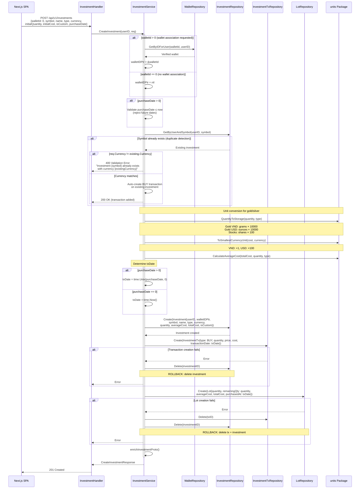

### Storage Formats by Type

| Investment Type | Quantity Unit | Storage Multiplier | Example |
|----------------|-------------|-------------------|---------|
| Stocks, ETFs, Crypto | Shares | ×100 | 10 shares = 1000 |
| Gold (VND) | Grams | ×10,000 | 75g (20 chỉ) = 750,000 |
| Gold (USD) | Ounces | ×10,000 | 1 oz = 10,000 |
| Silver (VND) | Grams | ×10,000 | Same as gold |
| Silver (USD) | Ounces | ×10,000 | Same as gold |

### Error Paths

| Condition | Response | Rollback |
|-----------|----------|----------|
| Wallet not found or not owned (when walletId > 0) | 404 | None |
| Duplicate symbol + currency mismatch | 400 Validation: "Investment {symbol} already exists with currency {currency}" | None |
| Duplicate symbol + currency match | 200 OK: auto-creates BUY transaction on existing investment | None |
| Transaction creation fails | 500 | Delete investment |
| Lot creation fails | 500 | Delete tx + investment |

---

## 2. Buy Transaction with Lot Merging

**Trigger:** User buys more of an existing investment holding
**Endpoint:** `POST /api/v1/investments/:id/transactions`
**Source:** `domain/service/investment_service.go` — `processBuyTransaction()`

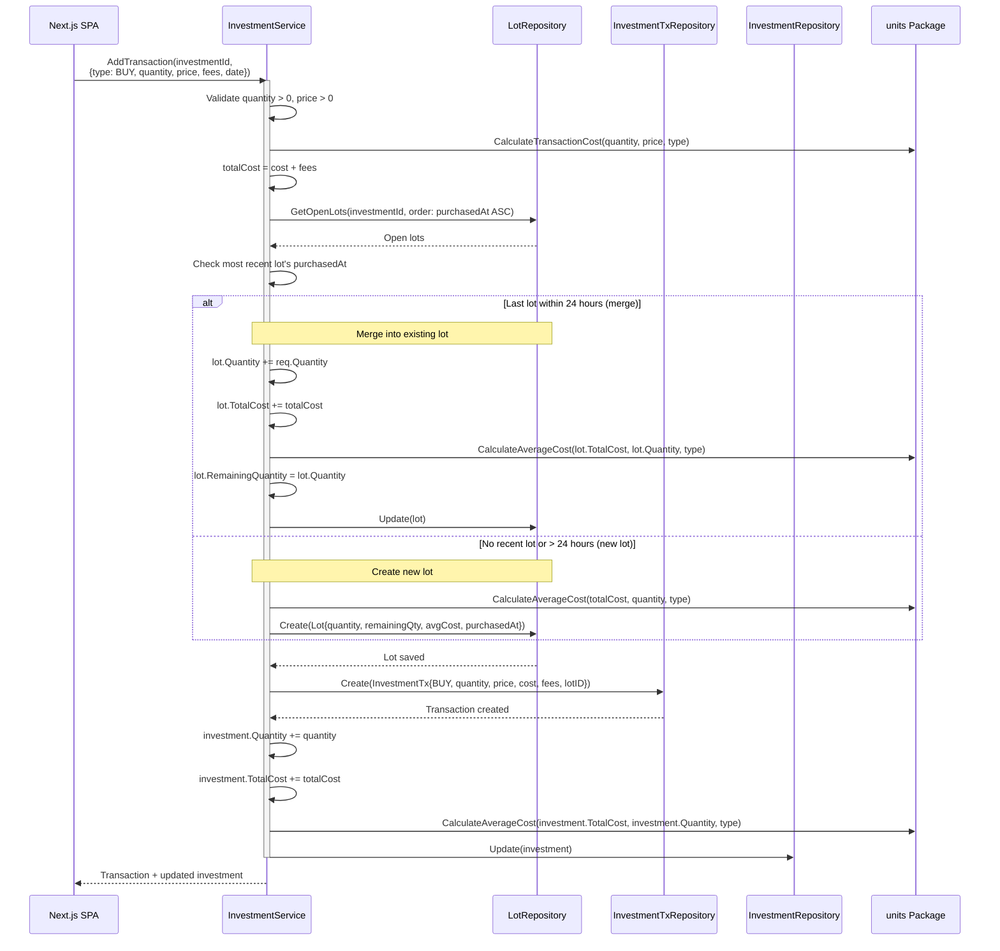

### Lot Merge Decision (24-Hour Window)

```
Most recent lot purchased at: 2025-03-05 10:00
Current purchase at:          2025-03-05 14:00  → MERGE (4h < 24h)
Current purchase at:          2025-03-06 12:00  → NEW LOT (26h > 24h)
```

### Key Invariants

- Lot merging prevents excessive lot fragmentation for same-day purchases
- Average cost is recalculated at both the lot and investment level after each buy
- Fees are included in total cost but tracked separately on the transaction
- No wallet balance deduction — investments are decoupled from wallet balances

---

## 3. FIFO Sell Transaction

**Trigger:** User sells shares/units of an investment
**Endpoint:** `POST /api/v1/investments/:id/transactions`
**Source:** `domain/service/investment_service.go` — `processSellTransaction()`

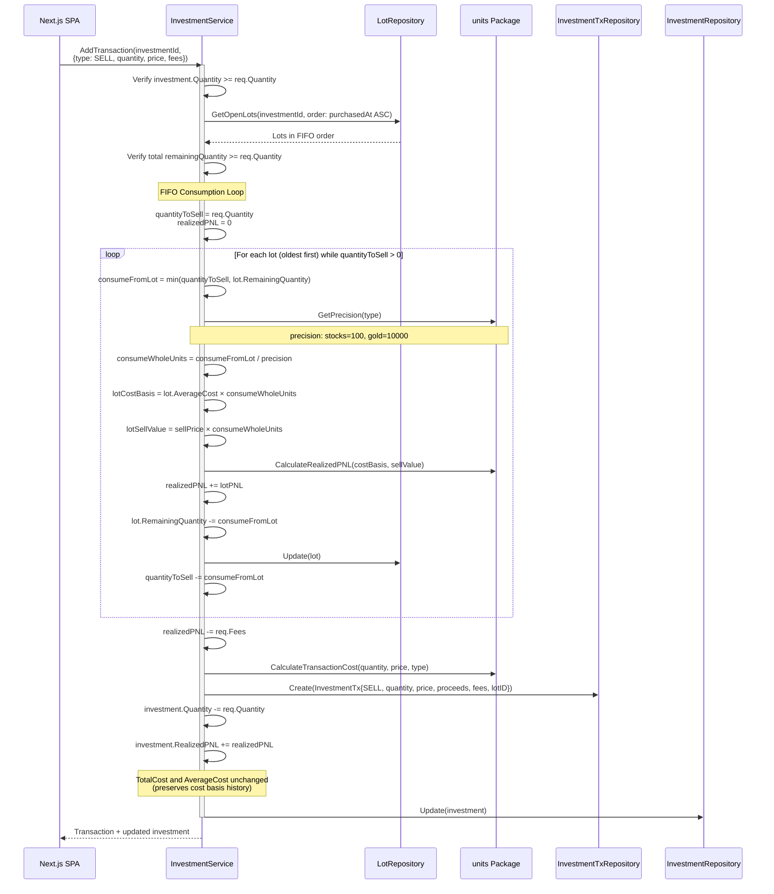

### FIFO Consumption Example

```
Lot 1: 100 shares @ $85 (purchased Jan 1) — remainingQty: 100
Lot 2: 50 shares  @ $90 (purchased Feb 1) — remainingQty: 50

Sell 120 shares @ $95:
  → Lot 1: consume 100, costBasis = 100 × $85 = $8,500, sellValue = 100 × $95 = $9,500, PNL = +$1,000
  → Lot 2: consume 20,  costBasis = 20 × $90  = $1,800, sellValue = 20 × $95  = $1,900, PNL = +$100
  → Total realizedPNL = $1,100 (before fees)
  → Lot 1 remainingQty: 0 (fully consumed)
  → Lot 2 remainingQty: 30
```

### Key Invariants

- Lots are consumed strictly in FIFO order (oldest `purchasedAt` first)
- Per-lot PNL is calculated individually, not using a blended average
- `TotalCost` and `AverageCost` on the investment are **not** modified during sells — they represent the historical cost basis
- Only `Quantity` and `RealizedPNL` are updated on the investment
- Fees are subtracted from realized PNL, not from the sell proceeds calculation

### Error Paths

| Condition | Response | Rollback |
|-----------|----------|----------|
| Insufficient quantity to sell | 400 Validation | None |
| Total remaining lots < sell quantity | 400 Validation | None |
| Lot update fails mid-loop | 500 | Earlier lots already consumed (inconsistency risk) |
| Transaction creation fails | 500 | Lots consumed but no tx record |

---

## 4. Dividend Processing

**Trigger:** User records a dividend payment
**Endpoint:** `POST /api/v1/investments/:id/transactions`
**Source:** `domain/service/investment_service.go` — `processDividendTransaction()`

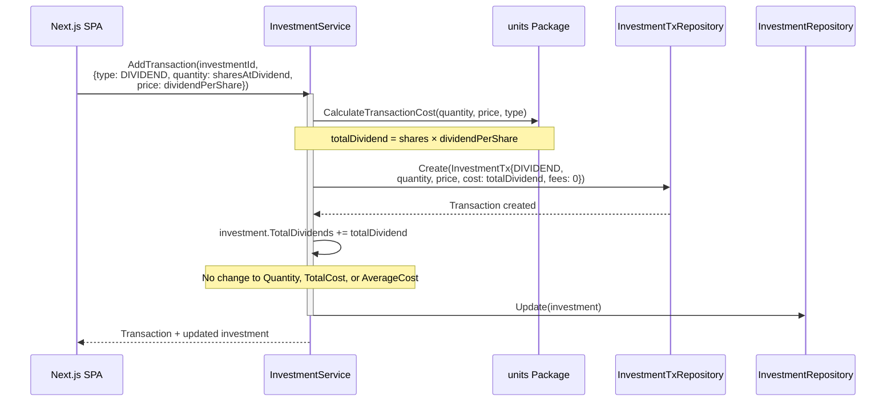

### Key Invariants

- Dividends do **not** affect position size (Quantity unchanged)
- Dividends do **not** affect cost basis (TotalCost, AverageCost unchanged)
- No lot interaction — dividends are independent of FIFO tracking
- `quantity` field represents shares held at dividend date (for per-share calculation), not shares bought/sold

### Error Paths

| Condition | Response | Rollback |
|-----------|----------|----------|
| Transaction creation fails | 500 | None |
| Investment update fails | 500 | Delete tx |

---

## 5. Market Price Update Pipeline

**Trigger:** Scheduled job (every 15 min) or manual `PUT /api/v1/investments/market-price`
**Source:** `domain/service/investment_service.go`, `domain/service/market_data_service.go`, `domain/service/asset_display_config_service.go`

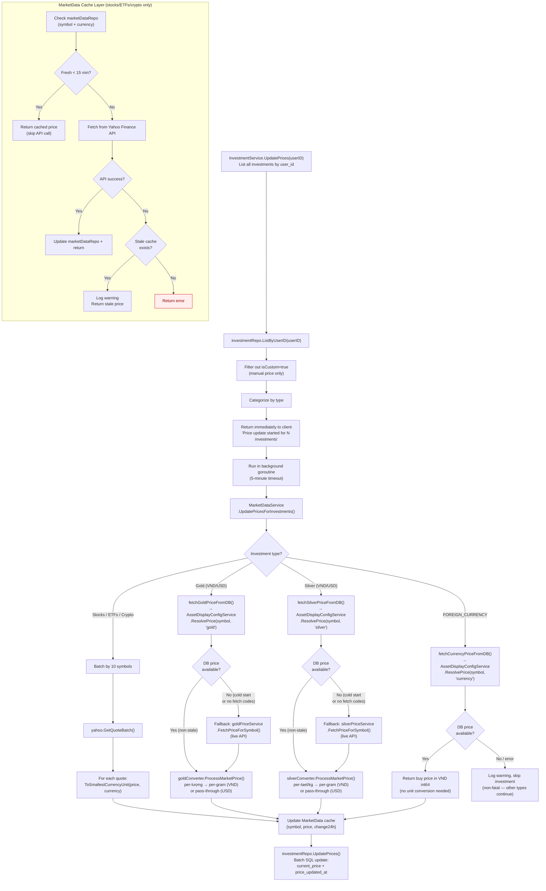

### Key Invariants

- Custom investments (`isCustom: true`) are excluded from automatic price updates — they use manual price via `UpdateInvestmentPriceForm`
- Price update runs asynchronously to avoid HTTP timeouts; client is notified immediately
- **Gold, silver, and FOREIGN_CURRENCY prices are read from the `asset_price` DB table** (written by `PriceCacheJob` every 15 min), not from live APIs
- Cold-start fallback: if `ResolvePrice` fails (DB empty, no fetch codes configured), `GoldPriceService`/`SilverPriceService` live APIs are called — no equivalent fallback for FOREIGN_CURRENCY (error is non-fatal and logged)
- `investmentRepo.UpdatePrices()` also writes `price_updated_at` timestamp for every successfully resolved price (including FOREIGN_CURRENCY), enabling staleness indicators on the frontend
- Gold VND prices require lượng-to-gram normalization before storage (applied in both DB and live-fallback paths)
- Silver USD normalization depends on the symbol: per-tael (`AG_VND_Tael`), per-kg (`AG_VND_Kg`), or pass-through (`XAG`)
- FOREIGN_CURRENCY investments are grouped by symbol — price lookup is O(unique currencies), not O(investments)

### Price Sources by Type

| Investment Type | Primary Source | Fallback | Notes |
|----------------|---------------|----------|-------|
| Stocks / ETFs / Crypto | Yahoo Finance (batch, 10/req) | Stale MarketData cache | Live API per request |
| Gold (VND/USD) | `asset_price` DB via `ResolvePrice()` | Live `GoldPriceService` (cold start only) | DB written by `PriceCacheJob` |
| Silver (VND/USD) | `asset_price` DB via `ResolvePrice()` | Live `SilverPriceService` (cold start only) | DB written by `PriceCacheJob` |
| FOREIGN_CURRENCY | `asset_price` DB via `ResolvePrice(symbol, "currency")` | None — error logged and skipped | DB written by `CurrencyPriceService` via `PriceCacheJob` |
| Custom | Manual only (`UpdateInvestmentPriceForm`) | N/A | Excluded from job |

---

## 6. Portfolio Summary Calculation

**Trigger:** User navigates to the Portfolio page
**Endpoint:** `GET /api/v1/wallets/:walletId/portfolio-summary`
**Source:** `domain/service/investment_service.go` — `GetPortfolioSummary()`

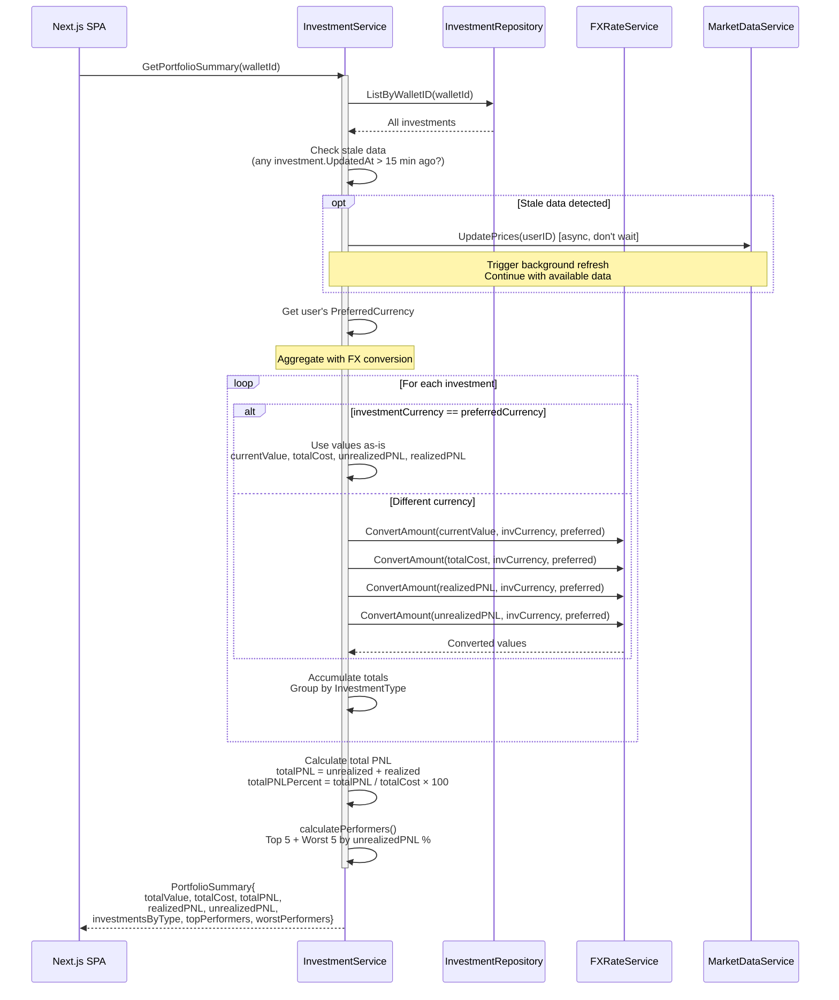

### Key Invariants

- `CurrentValue` and `UnrealizedPNL` are recalculated by GORM hooks on every read (`AfterFind`)
- Stale detection triggers a background price refresh but does **not** block the response
- All monetary aggregation happens in the user's preferred currency via FX conversion
- Performers are ranked by percentage (PNL / cost × 100), not absolute value
- Division-by-zero protection: investments with zero TotalCost are excluded from PNL % calculation

### Portfolio Summary Fields

| Field | Calculation | Currency |
|-------|------------|----------|
| `totalValue` | Sum of `currentPrice × quantity` per investment | Preferred |
| `totalCost` | Sum of all purchase costs | Preferred |
| `unrealizedPNL` | `totalValue - totalCost` | Preferred |
| `realizedPNL` | Sum of profits from sell transactions | Preferred |
| `totalPNL` | `unrealizedPNL + realizedPNL` | Preferred |
| `totalPNLPercent` | `totalPNL / totalCost × 100` | Percentage |
| `investmentsByType` | Grouped value + count per type | Preferred |
| `topPerformers` | Best 5 by unrealized PNL % | Preferred |
| `worstPerformers` | Worst 5 by unrealized PNL % | Preferred |

---

## 7. Period PnL Calculation

**Trigger:** User selects a period tab (1D/1W/1M/ALL) on PNLCard or PortfolioSummaryEnhanced
**Endpoint:** `GET /api/v1/portfolio-summary/aggregated?period=2` (aggregated) or `GET /api/v1/wallets/:walletId/portfolio-summary?period=2` (per wallet)
**Source:** `domain/service/investment_service.go` — `computePeriodPnl()`, `domain/repository/portfolio_history_repository_impl.go` — `GetPeriodStartSnapshot()`

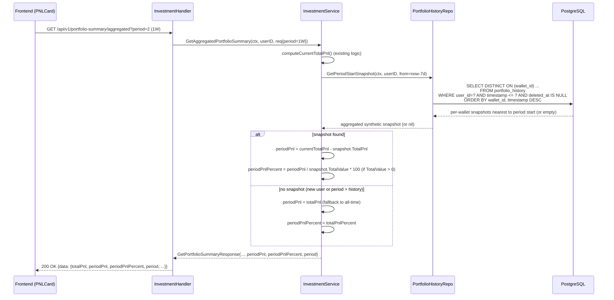

### Key Invariants

- `periodPnl` is always in `int64` (no float intermediaries for the snapshot delta)
- Fallback to all-time when no snapshot exists for the period (new user or sparse history)
- `DISTINCT ON (wallet_id)` ensures one snapshot per wallet, reducing multi-wallet users to their per-wallet period baseline
- Snapshots are aggregated in memory: sum `TotalPnl` and `TotalValue` across all wallets
- `PNL_PERIOD_ALL` (value=4) and `PNL_PERIOD_UNSPECIFIED` (value=0) both skip the snapshot query and mirror all-time PnL

### Error Paths

| Condition | Response | Rollback |
|-----------|----------|----------|
| `period` out of range (< 0 or > 4) | Default to `PERIOD_UNSPECIFIED` (all-time), no error | N/A |
| `portfolio_history` query fails | Non-fatal: log warning, fall back to all-time PnL | N/A |
| `snapshotTotalValue = 0` | `periodPnlPercent = 0` (no division) | N/A |
| No snapshots in DB for period | `periodPnl = totalPnl` (all-time fallback) | N/A |

---

## 8. Gold/Silver Chart Data Flow

**Trigger:** User opens the Gold or Silver price chart on the Market Prices page
**Endpoints:** `GET /api/v1/investments/gold-chart`, `GET /api/v1/investments/silver-chart`
**Source:** `handlers/gold.go`, `handlers/silver.go`

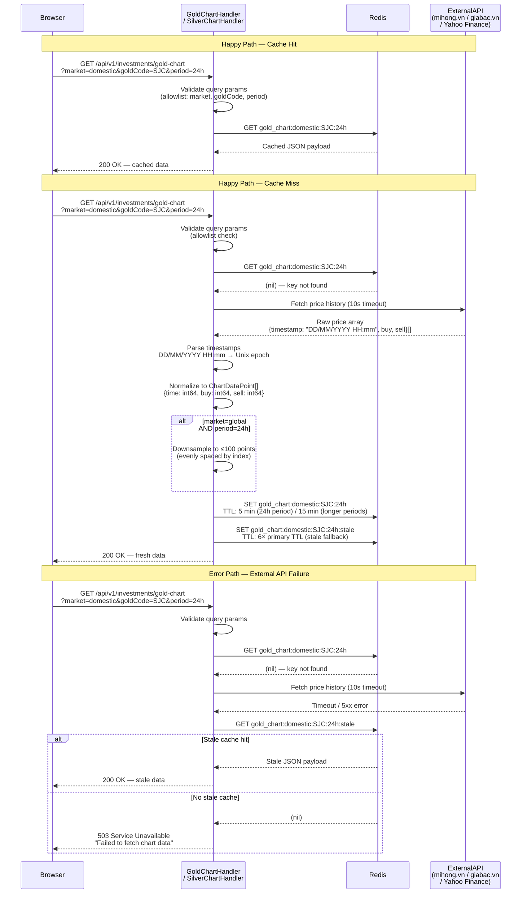

### Key Invariants

| Rule | Detail |
|------|--------|
| Cache key format | `gold_chart:{market}:{goldCode}:{period}` / `silver_chart:{market}:{silverCode}:{period}` |
| TTL — 24h period | 5 minutes (primary), 30 minutes (stale fallback) |
| TTL — longer periods (7d, 30d, 90d) | 15 minutes (primary), 90 minutes (stale fallback) |
| Stale TTL multiplier | Always 6× the primary TTL |
| Downsampling rule | Applied only when `market=global` AND `period=24h`; reduces array to ≤100 evenly spaced points |
| Size limit | Response payload must not exceed 100 data points after normalization/downsampling |
| Timestamp parsing | Input format `DD/MM/YYYY HH:mm` (local time, Asia/Ho_Chi_Minh); stored as Unix seconds |
| Monetary values | `buy` and `sell` stored in smallest currency unit (VND ×1, USD ×100) — consistent with investment storage |
| Param allowlist | `market`: `domestic` or `global`; `goldCode`/`silverCode`: registered type codes only; `period`: `24h`, `7d`, `30d`, `90d` |

### Error Paths

| Condition | Response | Fallback |
|-----------|----------|----------|
| Invalid `market`, `goldCode`/`silverCode`, or `period` param | 400 Bad Request | None |
| External API timeout (>10s) | Check stale cache | Stale data if available |
| External API 5xx | Check stale cache | Stale data if available |
| Stale cache also missing | 503 Service Unavailable | None |
| Timestamp parse failure on individual point | Skip point, continue | Partial dataset returned |
| Redis write failure (SET) | Log warning, continue | Fresh data still returned to client; next request will refetch |

---

## 9. Edit Transaction (Delete-and-Recreate)

**Trigger:** User clicks "Edit" on an existing investment transaction in the portfolio modal.
**Endpoint:** `PUT /api/v1/investment-transactions/{id}`
**Source:** `domain/service/investment_service.go` — `EditTransaction()`, `reverseBuyTransaction()`, `reverseSellTransaction()`, `reverseDividendTransaction()`, `processBuyTransaction()`, `processSellTransaction()`, `processDividendTransaction()`

**Strategy:** Atomic reverse-then-recreate — the old transaction is reversed and soft-deleted, then a new transaction is created with the updated values. This reuses the battle-tested `reverseBuyTransaction`/`reverseSellTransaction`/`reverseDividendTransaction` and `processBuyTransaction`/`processSellTransaction`/`processDividendTransaction` methods.

### Sequence Diagram

```mermaid
sequenceDiagram
    participant SPA as Next.js SPA
    participant H as InvestmentHandler
    participant IS as InvestmentService
    participant ITR as InvestmentTxRepository
    participant IR as InvestmentRepository
    participant LR as LotRepository
    participant Cache as Redis Cache

    SPA->>H: PUT /api/v1/investment-transactions/{id}<br/>{type, quantity, price, fees, transactionDate}
    H->>IS: EditTransaction(userID, txID, request)

    activate IS

    IS->>ITR: GetByIDForUser(txID, userID)
    alt Transaction not found or not owned by user
        ITR-->>IS: nil / error
        IS-->>H: 404 Not Found
    end
    ITR-->>IS: Existing transaction + investment

    IS->>IS: Validate request<br/>(type enum, quantity > 0, price > 0,<br/>transactionDate ≤ now)

    alt type == BUY and newQty < oldQty (quantity reduction)
        IS->>IS: validateBuyQuantityReduction(investment, oldTx, newQty)<br/>ensure no sold lots depend on reduced quantity
        alt Reduction would orphan sold lots
            IS-->>H: 400 Bad Request (ValidationError)
        end
    end

    alt oldType == BUY and newType == SELL
        Note over IS: Step 5b — Pre-flight viability check (no DB writes)
        IS->>IS: quantityAfterReversal = investment.Quantity - oldTx.Quantity
        alt quantityAfterReversal < req.Quantity
            IS-->>H: 400 Bad Request (INVESTMENT_EDIT_SELL_INSUFFICIENT_QTY)<br/>No DB mutations — prevents data corruption
        end
    end

    Note over IS: Reverse old transaction

    alt oldTx.Type == BUY
        IS->>IS: reverseBuyTransaction(investment, oldTx)
        IS->>LR: Update lot (restore RemainingQty or delete lot)
        IS->>IS: investment.Quantity -= oldTx.Quantity<br/>investment.TotalCost -= oldTx.Cost
    else oldTx.Type == SELL
        IS->>IS: reverseSellTransaction(investment, oldTx)
        IS->>LR: Restore lot RemainingQty consumed by sell
        IS->>IS: investment.Quantity += oldTx.Quantity<br/>investment.RealizedPNL -= oldTx.RealizedPNL
    else oldTx.Type == DIVIDEND
        IS->>IS: reverseDividendTransaction(investment, oldTx)
        IS->>IS: investment.TotalDividends -= oldTx.Cost
    end

    IS->>ITR: Delete(oldTx) [soft delete]
    ITR-->>IS: Old transaction soft-deleted

    IS->>IR: GetByID(investment.ID)
    Note over IS,IR: Re-fetch investment state from DB<br/>(not using in-memory stale state)
    IR-->>IS: Fresh investment record

    Note over IS: Process new transaction

    alt newTx.Type == BUY
        IS->>IS: processBuyTransaction(investment, request)
        IS->>LR: Create or merge lot
        IS->>IS: investment.Quantity += newQty<br/>investment.TotalCost += newCost
    else newTx.Type == SELL
        IS->>IS: processSellTransaction(investment, request)
        IS->>LR: Consume lots (FIFO)
        IS->>IS: investment.Quantity -= newQty<br/>investment.RealizedPNL += realizedPNL
    else newTx.Type == DIVIDEND
        IS->>IS: processDividendTransaction(investment, request)
        IS->>IS: investment.TotalDividends += newCost
    end

    IS->>IR: Update(investment)
    IR-->>IS: Investment updated

    IS->>Cache: Invalidate wallet investment value cache
    Note over IS,Cache: nil-guarded; skipped if investment<br/>has no associated wallet

    deactivate IS

    IS-->>H: EditTransactionResponse{transaction, investment}
    H-->>SPA: 200 OK {transaction, investment}
```

### Key Invariants

- Ownership is verified (`GetByIDForUser`) before any mutation — a missing or unowned transaction returns 404
- Buy quantity reduction guard: cannot reduce a buy quantity below units already sold from the lot (`validateBuyQuantityReduction`)
- Type change from BUY with consumed lot is rejected before any mutation begins — no partial state is written
- BUY→SELL pre-flight guard: `quantityAfterReversal = investment.Quantity - oldTx.Quantity` must be ≥ `req.Quantity` before any DB mutation — prevents investment.Quantity corruption when reversing the only BUY lot leaves nothing to sell (`INVESTMENT_EDIT_SELL_INSUFFICIENT_QTY`)
- Transaction date must not be in the future (`transactionDate ≤ now`)
- After reversal, investment state is re-fetched from DB (`IR.GetByID`) — never uses in-memory stale state from prior operations
- Cache is invalidated after successful edit so portfolio summary reflects the change immediately
- Original transaction is soft-deleted (preserved in DB for audit trail); new transaction is a fresh record

### Error Paths

| Condition | Error Response |
|-----------|---------------|
| Transaction not owned by user | 404 Not Found |
| Invalid type enum value | 400 Bad Request (`INVESTMENT_TX_TYPE_INVALID`) |
| Buy quantity below already-sold amount | 400 Bad Request (`ValidationError`) |
| BUY→SELL or BUY→DIVIDEND with consumed lot | 400 Bad Request (`ValidationError`) |
| Transaction date in the future | 400 Bad Request (`InvestmentTxDateFuture`) |
| BUY→SELL where qty after reversal < requested sell qty | 400 Bad Request (`INVESTMENT_EDIT_SELL_INSUFFICIENT_QTY`) — no DB writes |
| Reversal failure (lot update or delete) | 500 Internal Server Error (no partial state committed) |
| New transaction processing failure | 500 Internal Server Error (reversal already applied — inconsistency risk logged) |

---

## 10. Gold/Silver Price Resolution via Fetch Codes

**Trigger:** `PriceUpdateJob` calls `InvestmentService.UpdatePrices()` → `MarketDataService.UpdatePricesForInvestments()` → `fetchGoldPriceFromDB()` / `fetchSilverPriceFromDB()`
**Source:** `domain/service/market_data_service.go`, `domain/service/asset_display_config_service.go`, `domain/repository/asset_config_fetch_code_repository.go`, `domain/repository/asset_price_repository.go`

This sequence describes the internal resolution logic that `AssetDisplayConfigService.ResolvePrice()` uses to find the best available price for a gold or silver investment symbol. It reads exclusively from the `asset_price` DB table (populated by `PriceCacheJob`). The live gold/silver APIs are only contacted as a cold-start fallback when no DB rows exist.

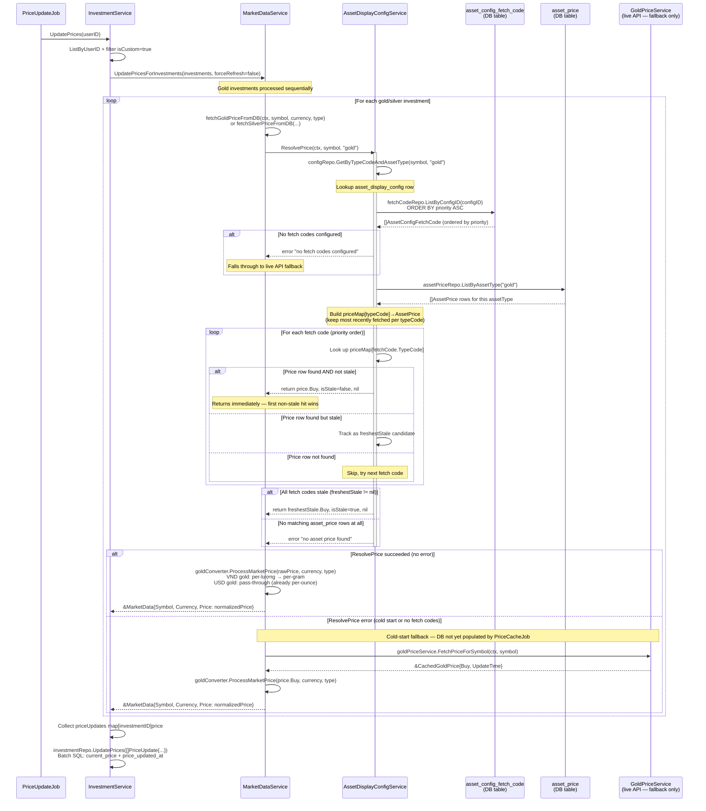

### ResolvePrice Algorithm Summary

```
Input:  typeCode (investment symbol), assetType ("gold" or "silver")
Output: (price int64, isStale bool, err error)

1. configRepo.GetByTypeCodeAndAssetType(typeCode, assetType)
   → 404 if no config row → caller falls back to live API

2. fetchCodeRepo.ListByConfigID(configID) ORDER BY priority ASC
   → validation error if empty → caller falls back to live API

3. assetPriceRepo.ListByAssetType(assetType)
   → build priceMap[typeCode] → most recently fetched per typeCode

4. Iterate fetch codes (priority order):
   → non-stale match found → return (price.Buy, false, nil)  ← early exit
   → stale match → record as freshestStale candidate

5. If freshestStale != nil → return (freshestStale.Buy, true, nil)

6. If no matching rows at all → return (0, false, error) → caller falls back to live API
```

### Producer-Consumer Relationship

| Role | Component | Frequency | Direction |
|------|-----------|-----------|-----------|
| **Writer (producer)** | `PriceCacheJob` → `AssetPriceService.RefreshAllPrices()` | Every 15 min | Writes `asset_price` table |
| **Reader (consumer)** | `PriceUpdateJob` → `MarketDataService` → `AssetDisplayConfigService.ResolvePrice()` | Every 15 min | Reads `asset_price` table |

`PriceCacheJob` is the **sole writer** to `asset_price`. `PriceUpdateJob` never writes to `asset_price` — it reads prices from it to update the `investment.current_price` column.

### Key Invariants

- **Priority order is respected**: fetch codes are ordered by `priority ASC` — lower number = higher priority (tried first)
- **First non-stale price wins**: the loop returns immediately on the first fetch code whose `asset_price` row has `is_stale = false`
- **Freshest stale fallback**: if all fetch codes resolve to stale rows, the most recently fetched stale price is returned (with `isStale=true`) rather than an error
- **Single DB read for all fetch codes**: `ListByAssetType` loads all prices for the asset type once and builds an in-memory map — not one query per fetch code
- **Cold-start safety**: if `ResolvePrice` returns any error, `MarketDataService` falls back to the live gold/silver API. This prevents portfolio prices from being blank on the very first run before `PriceCacheJob` has populated the table
- **Normalization is always applied**: `goldConverter.ProcessMarketPrice()` is called regardless of whether the price came from the DB or the live API fallback

### Error Paths

| Condition | Response | Caller Action |
|-----------|----------|--------------|
| No `asset_display_config` row for typeCode | `NotFoundError` | Fall back to live `GoldPriceService` |
| No fetch codes configured for config | `ValidationError` "no fetch codes configured" | Fall back to live `GoldPriceService` |
| All fetch codes stale | Returns `(price, isStale=true, nil)` | Uses stale price (no fallback — still a valid price) |
| No `asset_price` rows match any fetch code | `NotFoundError` "no asset price found" | Fall back to live `GoldPriceService` |
| Live API fallback also fails | `fmt.Errorf("failed to fetch gold price: ...")` | `fetchAndUpdateSingle` logs warning, skips investment |

---

## 11. Gold/Silver VND Investment Type Selection (Admin Config–Driven)

**Trigger:** User opens the Add Investment modal and selects "Gold (VND)" or "Silver (VND)" as the investment type.
**Source:** `handlers/gold.go`, `handlers/silver.go`, `domain/service/asset_display_config_service.go`, `domain/repository/asset_display_config_repository.go`

This flow replaces the former static registry approach where `GoldTypes` and `SilverTypes` arrays hardcoded all VND type options. VND types are now served dynamically from the `asset_display_config` table, controlled by admins. USD types remain statically registered (`XAUUSD` / `XAGUSD`).

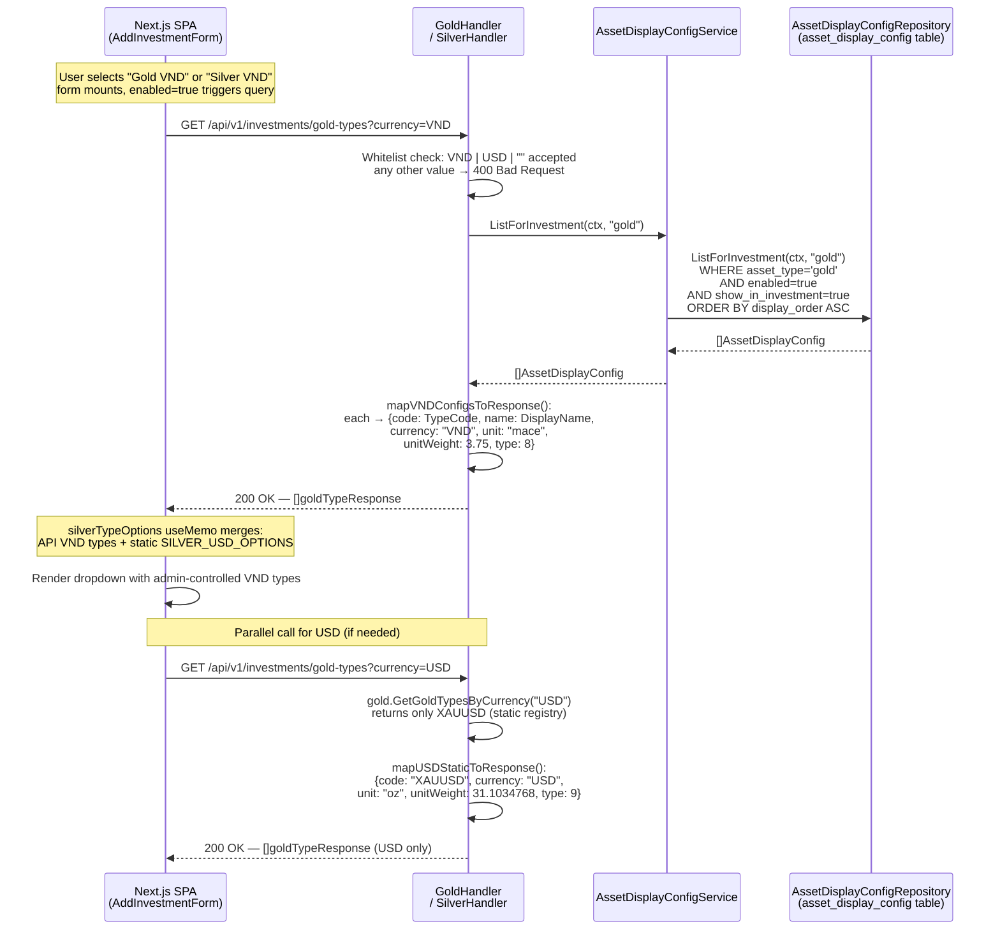

### Key Invariants

- **VND types are admin-controlled**: adding/removing/reordering VND gold or silver investment options requires no code change — admins update `asset_display_config` rows via the admin panel
- **USD types remain static**: `XAUUSD` (gold) and `XAGUSD` (silver) are hardcoded; they do not appear in `GoldTypes`/`SilverTypes` static arrays and are not managed via admin config
- **Currency whitelist**: `GoldHandler` and `SilverHandler` reject any `currency` param that is not `"VND"`, `"USD"`, or empty — returning `400 Bad Request`
- **Empty currency = merged**: omitting `?currency` returns VND (from DB) + USD (static) concatenated, in that order
- **show_in_investment flag**: `AssetDisplayConfigRepository.ListForInvestment()` requires both `enabled = true` AND `show_in_investment = true` — investment forms and the prices page use different flags; a config shown in prices but not investments will not appear here
- **display_order controls sort**: returned types appear in `display_order ASC` sequence, matching the admin-configured ordering

### Frontend Integration

| Form | Hook | Behavior |
|------|------|----------|
| `AddInvestmentForm` | `useQueryGetAssetDisplayPrices({ assetType: "silver" })` | Enabled only when Silver VND selected; `inferSilverUnits(typeCode)` maps type to unit array |
| `AddToWatchlistForm` | `useQueryGetAssetDisplayPrices({ assetType: "gold|silver" })` | Both hooks always active; VND options populated from API response |
| `CreatePriceAlertForm` | `useQueryGetAssetDisplayPrices({ assetType: "gold|silver" })` | API-driven select options; `useRef` one-shot init prevents infinite re-render |
| Gold investment type (USD) | Static `GOLD_USD_OPTIONS` | Not API-driven; `XAUUSD` only |
| Silver investment type (USD) | Static `SILVER_USD_OPTIONS` | Not API-driven; `XAGUSD` only |

### Error Paths

| Condition | Response | Caller Action |
|-----------|----------|--------------|
| Unknown `currency` param (e.g. `EUR`) | `400 Bad Request` "invalid currency 'EUR': must be VND, USD, or omitted" | Frontend shows validation error |
| `ListForInvestment` DB error | `500 Internal Server Error` | Frontend shows generic error state |
| Admin config empty (no matching rows) | `200 OK — []` (empty array) | Dropdown shows no VND options; user can still select USD |

---

## 12. Currency Investment Price Refresh

**Trigger:** Background scheduler every 15 minutes, or manual `PUT /api/v1/investments/market-price`
**Source:** `domain/service/investment_service.go`, `domain/service/market_data_service.go`, `domain/service/asset_display_config_service.go`

This flow documents how `FOREIGN_CURRENCY` investments receive automatic price updates — the same pipeline as gold/silver, using `AssetDisplayConfigService.ResolvePrice` with `assetType="currency"` to read buy prices from the `asset_price` DB table populated by `CurrencyPriceService`.

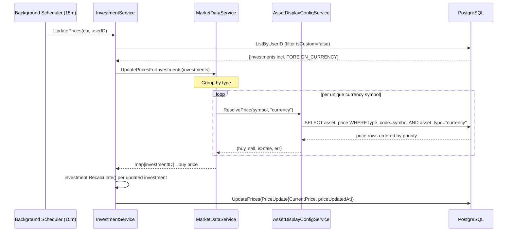

### Key Invariants

- FOREIGN_CURRENCY investments are grouped by symbol — price lookup is O(unique currencies), not O(investments)
- Error per symbol is non-fatal — logged and skipped; other investment types and other currency symbols continue unaffected
- `isStale=true` prices are still stored (stale price > 0 is better than no update); staleness is surfaced to the frontend via the `priceUpdatedAt` timestamp
- `priceUpdatedAt` is always written on successful price resolution — enables frontend staleness indicators

### Price Data Path

```
CurrencyPriceService (3 parallel sources: vangsaigon.vn, vang.today, Vietcombank)
    → asset_price table (upserted every 15 min by PriceCacheJob)
    → AssetDisplayConfigService.ResolvePrice(symbol, "currency")
    → MarketDataService.UpdatePricesForInvestments()
    → investmentRepo.UpdatePrices() [current_price + price_updated_at]
```

---

## 13. Get Market Prices (Prices Page)

**Trigger:** User opens `/dashboard/prices` — browser fetches `GET /api/v1/investments/market-prices`
**Endpoint:** `GET /api/v1/investments/market-prices`
**Source:** `handlers/market_prices.go`, `domain/service/asset_display_config_service.go`

This flow documents how the Prices page fetches display prices for gold, silver, and currency tabs. `MarketPricesHandler` calls `AssetDisplayConfigService.GetDisplayPrices()` three times (once per asset type) and combines the results. Each call returns only enabled configs ordered by `display_order`, with prices resolved via the fetch-code priority chain from the `asset_price` DB table.

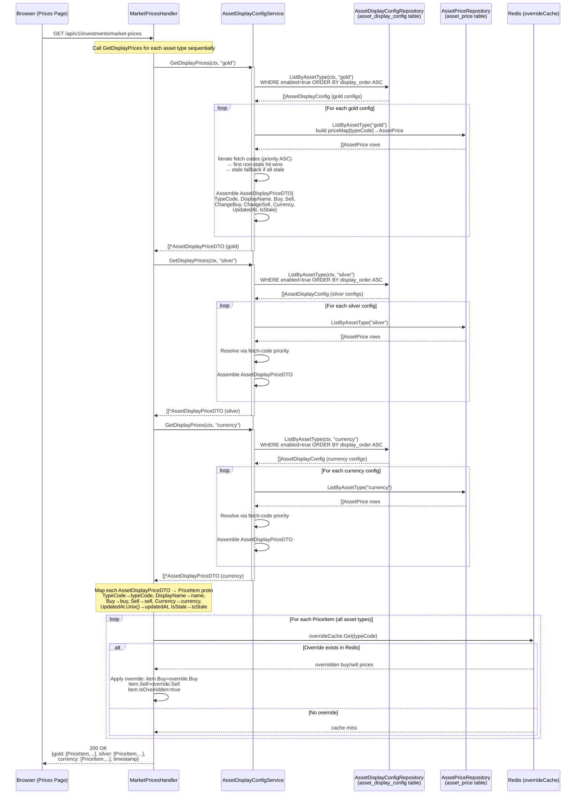

### Key Invariants

- **Three sequential calls, not one**: `GetDisplayPrices()` is called separately for `"gold"`, `"silver"`, and `"currency"` — each returns only its own asset type's configs
- **`enabled=true` filter**: only active configs are returned; if all gold configs are disabled, `gold: []` is returned and the frontend hides the gold tab
- **`display_order` controls sort**: items within each asset type appear in `display_order ASC` sequence, matching admin configuration
- **Fetch-code priority chain**: for each config, `ResolvePrice()` checks fetch codes in priority order — first non-stale match wins; freshest stale used as fallback if all stale
- **`asset_price` table is pre-populated**: prices are read from the DB (written by `PriceCacheJob` every 15 min), never from live APIs at request time — no latency spike
- **`overrideCache` preserved**: Redis admin price overrides are applied after DTO mapping, same as before the refactor
- **No auth required**: endpoint is public; `assetType` values are internal constants, never user-supplied

### Data Sources by Asset Type

| Asset Type | Config Source | Price Source | Write Frequency |
|------------|--------------|--------------|-----------------|
| `"gold"` | `asset_display_config WHERE asset_type='gold' AND enabled=true` | `asset_price` via fetch-code priority | Every 15 min (PriceCacheJob → GoldPriceService) |
| `"silver"` | `asset_display_config WHERE asset_type='silver' AND enabled=true` | `asset_price` via fetch-code priority | Every 15 min (PriceCacheJob → SilverPriceService) |
| `"currency"` | `asset_display_config WHERE asset_type='currency' AND enabled=true` | `asset_price` via fetch-code priority | Every 15 min (PriceCacheJob → CurrencyPriceService) |

### Field Mapping: AssetDisplayPriceDTO → PriceItem

| `AssetDisplayPriceDTO` field | `PriceItem` proto field | Notes |
|------------------------------|------------------------|-------|
| `TypeCode` | `typeCode` | Config type_code, not fetch type_code |
| `DisplayName` | `name` | Admin-controlled display name |
| `Buy` | `buy` | int64, smallest currency unit |
| `Sell` | `sell` | int64, smallest currency unit |
| `ChangeBuy` | `changeBuy` | int64, price delta |
| `ChangeSell` | `changeSell` | int64, price delta |
| `Currency` | `currency` | ISO 4217 (e.g. `"VND"`, `"USD"`) |
| `UpdatedAt.Unix()` | `updatedAt` | Unix timestamp (seconds) |
| `IsStale` | `isStale` | True if all fetch codes returned stale prices |
| Redis override | `isOverridden` | True if admin override applied from cache |

### Frontend Tab Visibility (driven by this response)

```
isSuccess && data?.gold?.length === 0   → gold tab hidden
isSuccess && data?.silver?.length === 0 → silver tab hidden
isSuccess && data?.currency?.length === 0 → currency tab hidden
isLoading || isError                    → all tabs shown (no flicker)
activeTab no longer visible             → reset to first visible tab
```
