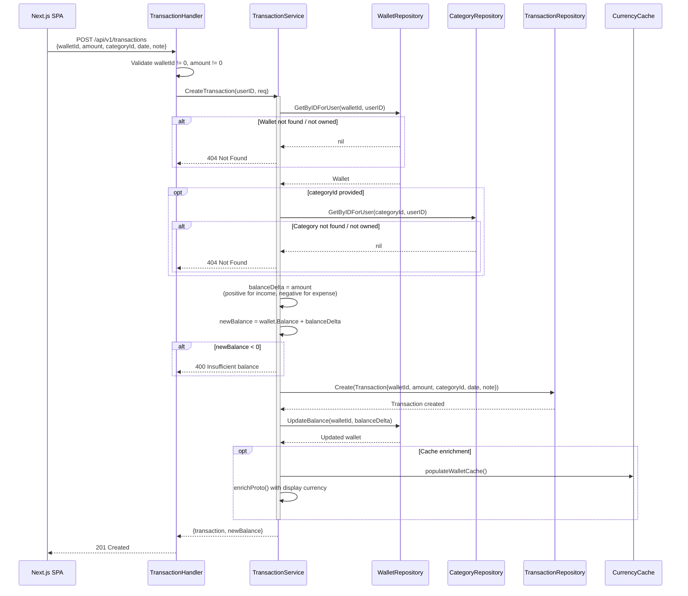
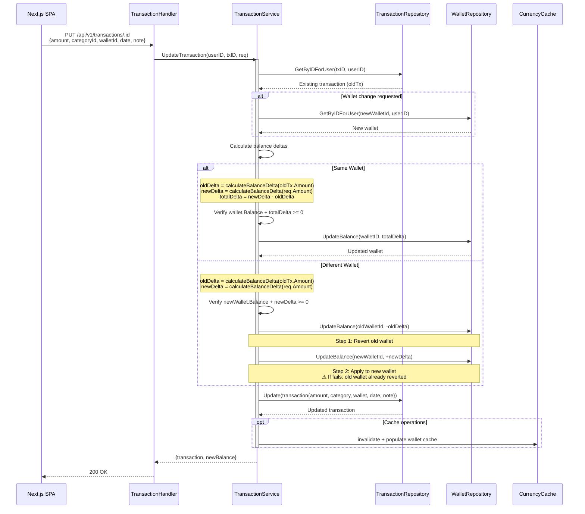
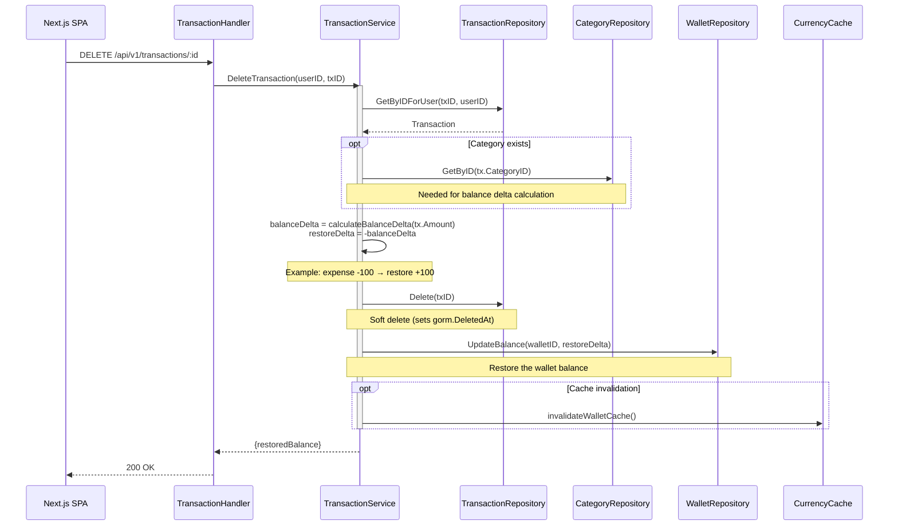
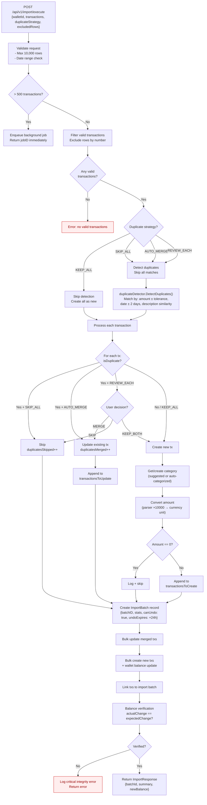

# Transaction Domain — Runtime Flows

Transaction management flows covering CRUD operations and bank statement import. All amounts use the signed convention: positive = income, negative = expense. Balance updates are applied as deltas to the wallet's current balance.

## Table of Contents

- [Create Transaction](#1-create-transaction)
- [Update Transaction](#2-update-transaction)
- [Delete Transaction](#3-delete-transaction)
- [Bank Statement Import Pipeline](#4-bank-statement-import-pipeline)

---

## 1. Create Transaction

**Trigger:** User submits "Add Transaction" form
**Endpoint:** `POST /api/v1/transactions`
**Source:** `domain/service/transaction_service.go:48-135`, `handlers/transaction.go:38-72`

### Key Invariants

- Amount sign determines direction: positive = adds to balance (income), negative = subtracts (expense)
- Balance is checked **before** the transaction is created — negative balances are rejected
- Transaction and balance update are separate DB calls (not within a DB transaction)

### Error Paths

| Condition | Response | Rollback |
|-----------|----------|----------|
| Wallet not found / not owned | 404 | None |
| Category not found / not owned | 404 | None |
| Insufficient balance (would go negative) | 400 | None |
| Transaction creation fails | 500 | None (balance unchanged) |
| Balance update fails | 500 | Transaction exists with stale balance |

---

## 2. Update Transaction

**Trigger:** User edits an existing transaction (amount, category, date, or wallet)
**Endpoint:** `PUT /api/v1/transactions/:id`
**Source:** `domain/service/transaction_service.go:219-355`, `handlers/transaction.go:172-208`

### Key Invariants

- **Same wallet:** A single delta is applied: `newDelta - oldDelta`. Example: changing expense from -100 to -150 applies delta of -50
- **Wallet change:** Two-step process — revert old wallet's balance, then apply to new wallet. These are **not** within a DB transaction
- Balance check happens against the new wallet's balance (including the new amount's effect)

### Balance Delta Examples

| Change | Old Amount | New Amount | Delta | Effect |
|--------|-----------|-----------|-------|--------|
| Increase expense | -100 | -150 | -50 | Balance decreases by 50 |
| Decrease expense | -100 | -50 | +50 | Balance increases by 50 |
| Increase income | +200 | +300 | +100 | Balance increases by 100 |
| Change type | -100 | +100 | +200 | Reversal: balance increases by 200 |

### Error Paths

| Condition | Response | Rollback |
|-----------|----------|----------|
| Transaction not found / not owned | 404 | None |
| New wallet not found / not owned | 404 | None |
| Insufficient balance after update | 400 | None |
| Wallet change step 2 fails | 500 | Old wallet already reverted (inconsistency risk) |
| Transaction update fails | 500 | Wallet balances already modified (inconsistency risk) |

---

## 3. Delete Transaction

**Trigger:** User confirms transaction deletion
**Endpoint:** `DELETE /api/v1/transactions/:id`
**Source:** `domain/service/transaction_service.go:358-403`, `handlers/transaction.go:222-245`

### Key Invariants

- Balance is **restored** by applying the negative of the original delta (expense deletion adds money back)
- Deletion is always a soft delete via `gorm.DeletedAt` — data remains in the database
- Delete and balance restore are separate DB calls (not atomic)

### Error Paths

| Condition | Response | Rollback |
|-----------|----------|----------|
| Transaction not found / not owned | 404 | None |
| Soft delete fails | 500 | Balance unchanged |
| Balance restore fails | 500 | Transaction deleted but balance stale |

---

## 4. Bank Statement Import Pipeline

**Trigger:** User uploads a CSV file and confirms import
**Endpoint:** `POST /api/v1/import/execute`
**Source:** `domain/service/import_service.go:262-790`, `handlers/import.go:673-740`

### Key Invariants

- Imports exceeding 500 transactions are automatically queued for background processing
- Duplicate detection uses multi-criteria matching: amount (within tolerance), date (±2 days), description similarity
- Amount conversion: parser stores at ×10,000 precision; conversion to currency units divides by 10,000
- Balance verification post-import catches any discrepancies between expected and actual balance changes
- Import batches support undo within a 24-hour window via `POST /api/v1/import/:id/undo`

### Duplicate Strategies

| Strategy | Duplicates Found | Behavior |
|----------|-----------------|----------|
| **KEEP_ALL** | Not detected | All transactions created as new |
| **SKIP_ALL** | Auto-skipped | Duplicates silently excluded |
| **AUTO_MERGE** | Auto-merged | Existing transactions updated in place |
| **REVIEW_EACH** | User decides per match | MERGE, SKIP, or KEEP_BOTH per duplicate |

### Undo Import Flow

The undo operation runs within a **database transaction** (unlike most other operations):

1. Validate: batch exists, owned by user, `canUndo: true`, within 24h window
2. Calculate reversal deltas per wallet (negate all transaction amounts)
3. **BEGIN DB TRANSACTION**
4. Soft-delete all imported transactions
5. Restore wallet balances with reversal deltas
6. Mark batch as undone (`undoneAt`, `canUndo: false`)
7. **COMMIT** (all-or-nothing)

### Error Paths

| Condition | Response | Rollback |
|-----------|----------|----------|
| Max rows exceeded (> 10,000) | 400 Validation | None |
| Future dates / dates > 10 years old | 400 Validation | None |
| No valid transactions after filtering | 400 | None |
| Duplicate detection fails | 500 | None (no changes made yet) |
| Bulk create fails | 500 | Batch created but no txs |
| Balance verification mismatch | 500 Critical | Transactions created, logged for manual review |
| Undo: expired (> 24h) | 400 | None |
| Undo: any DB step fails | 500 | Full DB transaction rollback |
