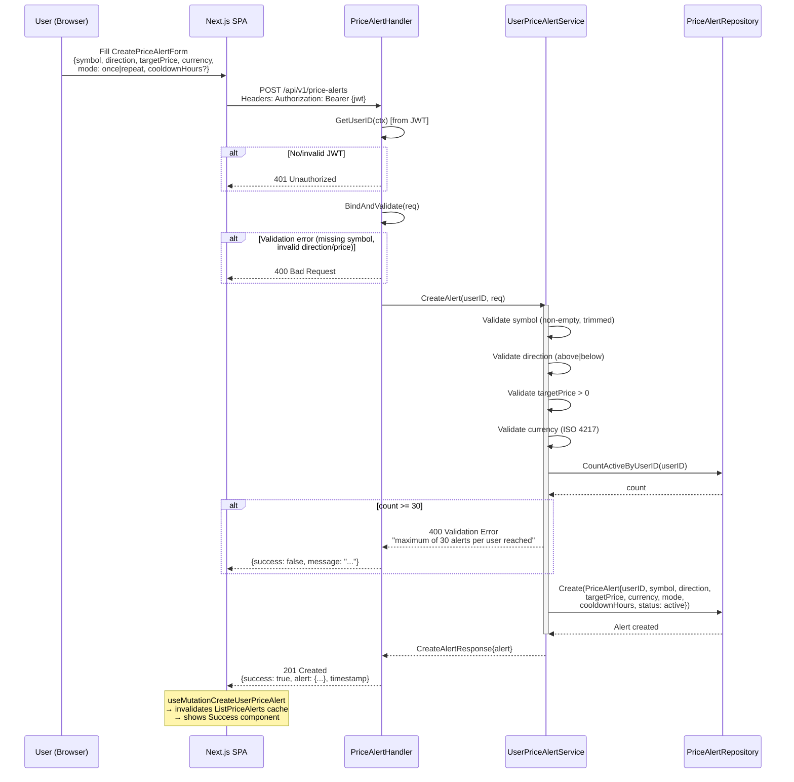
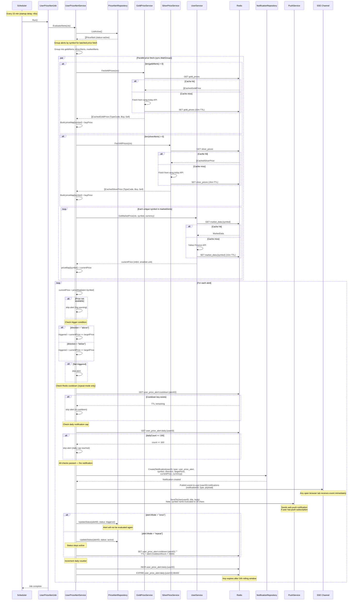
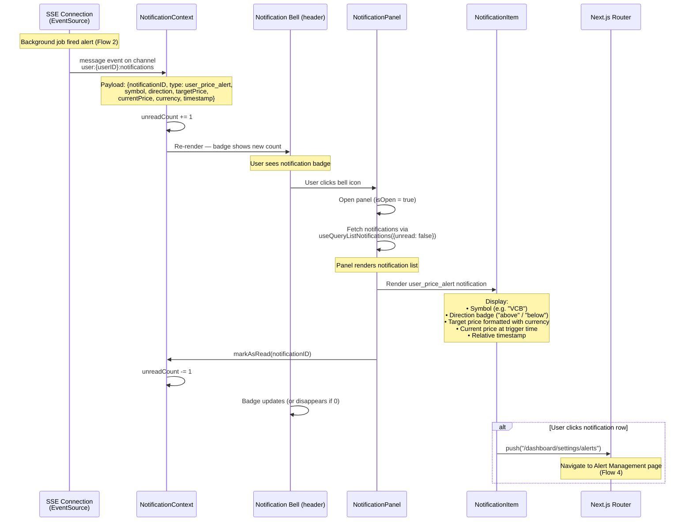
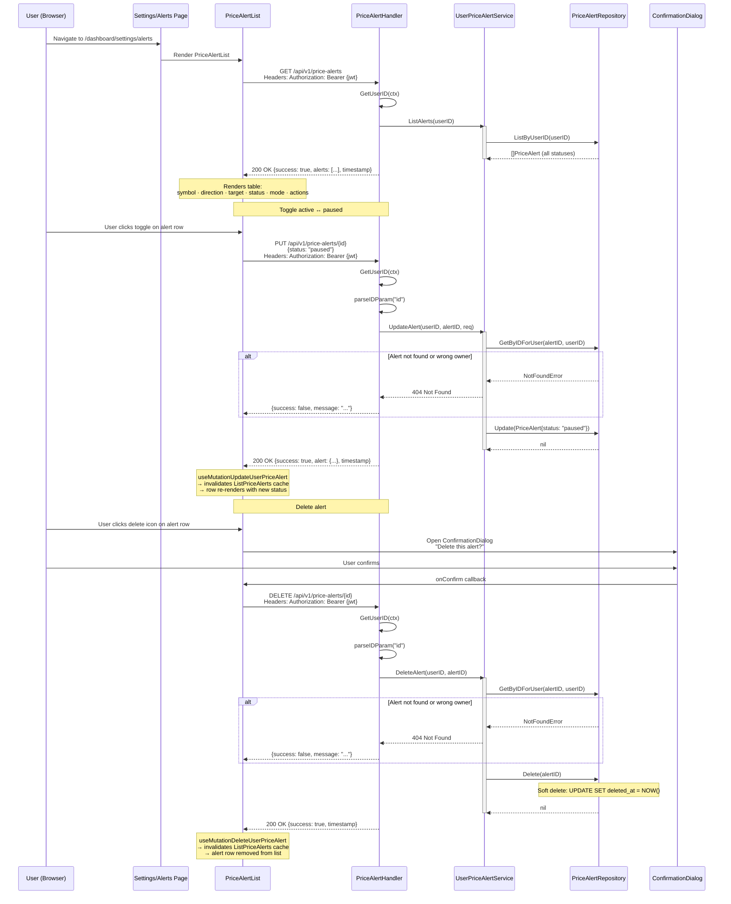

# User Price Alert Domain — Runtime Flows

Price alert lifecycle flows: create an alert, background evaluation against live market prices, notification delivery over SSE, and alert management from the settings page. All endpoints require JWT authentication and scope data to `user_id` extracted from the token.

## Table of Contents

- [Create Alert (User → API → DB)](#1-create-alert-user--api--db)
- [Background Evaluation (Scheduler → Notifications)](#2-background-evaluation-scheduler--notifications)
- [Alert Triggered → User Sees Notification](#3-alert-triggered--user-sees-notification)
- [Alert Management (Settings Page)](#4-alert-management-settings-page)

---

## 1. Create Alert (User → API → DB)

**Trigger:** User fills CreatePriceAlertForm and submits
**Endpoint:** `POST /api/v1/price-alerts`
**Source:** `domain/service/user_price_alert_service.go`, `handlers/user_price_alert.go`



### Validation Rules

| Field | Rule | Error |
|-------|------|-------|
| `symbol` | Non-empty, trimmed, ≤ 50 chars | 400 |
| `direction` | `above` or `below` | 400 |
| `targetPrice` | > 0, stored as int64 smallest unit | 400 |
| `currency` | Valid ISO 4217 code | 400 |
| `mode` | `once` or `repeat` | 400 |
| `cooldownHours` | > 0 when mode=`repeat` | 400 |
| Alert count | ≤ 30 active alerts per user | 400 |

### Error Paths

| Condition | Response | Rollback |
|-----------|----------|----------|
| Invalid/missing JWT | 401 Unauthorized | None |
| Validation failure | 400 Bad Request | None |
| Alert limit reached (≥ 30) | 400 Validation Error | None |
| DB insert fails | 500 Internal Error | None |

---

## 2. Background Evaluation (Scheduler → Notifications)

**Trigger:** Scheduled job every 15 minutes (45-second startup delay)
**Source:** `internal/scheduler/user_price_alert_job.go`, `domain/service/user_price_alert_service.go`



### Redis Key Reference

| Key | Value | TTL | Purpose |
|-----|-------|-----|---------|
| `user_price_alert:cooldown:{alertID}` | `""` (empty) | `cooldownHours × 3600s` | Prevent repeat-mode re-fire during cooldown |
| `user_price_alert:daily:{userID}` | integer count | 24 hours | Daily notification cap per user |

### Price Sources by Alert Type

| Symbol / Type | Price Source | Cache |
|---------------|-------------|-------|
| Gold type codes (GOLD_VND) | GoldPriceService → vang.today | Redis `gold_prices`, 15m TTL |
| Silver type codes (SILVER_VND) | SilverPriceService → vang.today | Redis `silver_prices`, 15m TTL |
| All other symbols (stocks, ETFs, crypto) | UserService.GetMarketPrice → Yahoo Finance | Redis `market_data:{symbol}`, 15m TTL |

### Alert Mode Behavior

| Mode | After Trigger | Redis Effect |
|------|--------------|--------------|
| `once` | `status = triggered` — never evaluated again | None |
| `repeat` | `status = active` — re-evaluated after cooldown | Cooldown key set with TTL |

### Key Invariants

- Startup delay of 45 seconds prevents evaluation before all services are ready
- Prices are fetched once per symbol per job run, shared across all alerts for that symbol
- Daily cap of 100 notifications per user per 24-hour rolling window
- Once-mode alerts are permanently deactivated after their first trigger
- Repeat-mode alerts reuse the same cooldown TTL from `alert.CooldownHours` (set at creation)
- A missing price (API failure, no cache) causes the alert to be skipped silently — no notification, no status change

---

## 3. Alert Triggered → User Sees Notification

**Trigger:** SSE event received in browser after background evaluation fires an alert
**Source:** `contexts/NotificationContext.tsx`, `components/feedback/NotificationPanel.tsx`



### NotificationItem Fields for user_price_alert

| Field | Source | Display Example |
|-------|--------|----------------|
| `symbol` | Alert record | `VCB` |
| `direction` | Alert record | `above` → "rose above" |
| `targetPrice` | Alert record (int64) | `₫95,000` |
| `currentPrice` | Price at trigger time | `₫95,200` |
| `currency` | Alert record | `VND` |
| `timestamp` | Notification created_at | "2 minutes ago" |

### Key Invariants

- SSE connection is per-user, scoped to `user:{userID}:notifications` channel
- NotificationContext maintains a global unread count — no page reload needed
- Clicking a notification navigates to `/dashboard/settings/alerts` where the triggered alert can be reviewed or deleted
- Push notification (via PushService) arrives independently of SSE — both paths lead to the same notification record in DB

---

## 4. Alert Management (Settings Page)

**Trigger:** User navigates to `/dashboard/settings/alerts`
**Endpoint:** `GET /api/v1/price-alerts`, `PUT /api/v1/price-alerts/{id}`, `DELETE /api/v1/price-alerts/{id}`
**Source:** `domain/service/user_price_alert_service.go`, `handlers/user_price_alert.go`



### Alert Status Transitions

```
active ──[triggered, mode=once]──► triggered  (terminal, not evaluated)
active ──[user toggle]────────────► paused     (excluded from evaluation)
active ──[evaluation fired, mode=repeat]──► active  (stays active, cooldown set)
paused ──[user toggle]────────────► active     (re-enters evaluation)
triggered ──[user deletes]────────► (soft deleted)
```

### Key Invariants

- `GetByIDForUser` ownership check is enforced on every write (update, delete) — a user cannot mutate another user's alerts
- Soft deletes preserve audit history — alerts are not physically removed from DB
- Paused alerts are excluded from background evaluation in `ListActive()` which filters `status = active`
- Toggling `active → paused` immediately prevents the next scheduler run from evaluating that alert
- React Query cache invalidation (`ListPriceAlerts` query key) after every mutation ensures the list reflects the latest server state without a page reload

### Error Paths

| Condition | Response | User Feedback |
|-----------|----------|---------------|
| 401 Unauthorized | 401 | Redirect to login |
| Alert not found or wrong owner | 404 | Inline error message |
| Toggle update DB failure | 500 | Error state on row |
| Delete DB failure | 500 | Error state on row |
| Dismiss ConfirmationDialog | No request sent | Dialog closes, alert unchanged |
