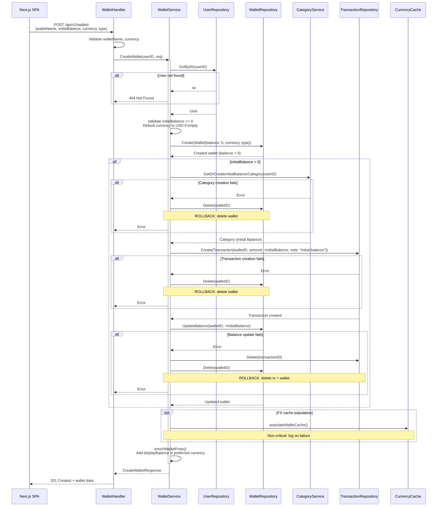
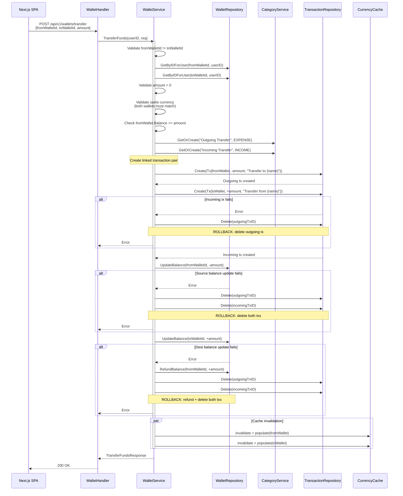
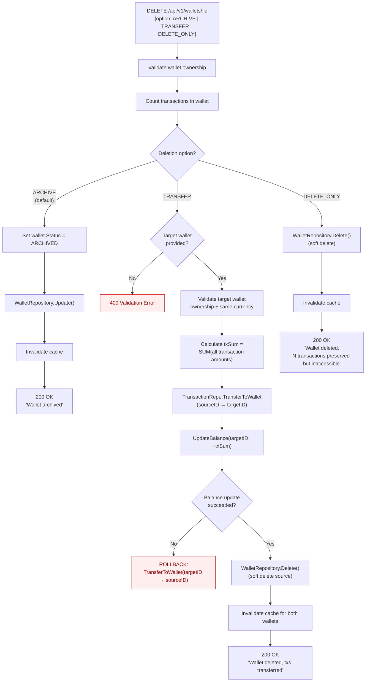

# Wallet Domain — Runtime Flows

Wallet management flows covering creation with initial balance, inter-wallet fund transfers, and multi-option deletion. All monetary operations use signed transactions where positive = income and negative = expense.

## Table of Contents

- [Create Wallet (with Initial Balance)](#1-create-wallet-with-initial-balance)
- [Transfer Funds Between Wallets](#2-transfer-funds-between-wallets)
- [Delete Wallet (3 Options)](#3-delete-wallet-3-options)

---

## 1. Create Wallet (with Initial Balance)

**Trigger:** User submits "Create Wallet" form with optional initial balance
**Endpoint:** `POST /api/v1/wallets`
**Source:** `domain/service/wallet_service.go:64-159`, `handlers/wallet_v2.go:39-76`

### Key Invariants

- Wallet is always created with `balance: 0` first; initial balance is applied via a transaction
- The "Initial Balance" category is auto-created if it doesn't exist (income type)
- Rollback is manual (delete operations), not database-transaction-based
- `enrichWalletProto()` adds `displayBalance` converted to the user's preferred currency via FX rates

### Error Paths

| Condition | Response | Rollback |
|-----------|----------|----------|
| User not found | 404 | None (wallet not created) |
| Negative initial balance | 400 Validation | None |
| Category creation fails | 500 | Delete wallet |
| Transaction creation fails | 500 | Delete wallet |
| Balance update fails | 500 | Delete transaction + wallet |
| Cache population fails | Warning logged | None (non-critical) |

---

## 2. Transfer Funds Between Wallets

**Trigger:** User submits transfer form with source, destination, and amount
**Endpoint:** `POST /api/v1/wallets/transfer`
**Source:** `domain/service/wallet_service.go:572-681`, `handlers/wallet_v2.go:342-378`

### Key Invariants

- Both wallets **must have the same currency** — cross-currency transfers are not supported
- Two linked transactions are created: one expense (negative) on source, one income (positive) on destination
- Transaction notes reference the other wallet's name for traceability
- Balance updates are sequential, not within a DB transaction — partial failure can leave inconsistent state

### Error Paths

| Condition | Response | Rollback |
|-----------|----------|----------|
| Same source and destination | 400 Validation | None |
| Wallet not found or not owned | 404 | None |
| Different currencies | 400 Validation | None |
| Insufficient balance | 400 Validation | None |
| Incoming tx creation fails | 500 | Delete outgoing tx |
| Source balance update fails | 500 | Delete both txs |
| Dest balance update fails | 500 | Refund source + delete both txs |

---

## 3. Delete Wallet (3 Options)

**Trigger:** User selects a deletion strategy for a wallet
**Endpoint:** `DELETE /api/v1/wallets/:id`
**Source:** `domain/service/wallet_service.go:356-467`, `handlers/wallet_v2.go:209-248`

### Key Invariants

- Default option is `ARCHIVE` if no option or empty body is provided
- `ARCHIVE` only changes status — no data is lost and the wallet can potentially be restored
- `TRANSFER` moves all transactions and adjusts the target wallet's balance by the net sum of transferred transactions
- `DELETE_ONLY` soft-deletes the wallet; transactions remain in the database but are orphaned
- All deletions are soft deletes (`gorm.DeletedAt`) — data is never physically removed

### Deletion Options

| Option | Wallet | Transactions | Balance | Use Case |
|--------|--------|--------------|---------|----------|
| **ARCHIVE** | Status → ARCHIVED | Preserved, still linked | No change | Temporary hiding |
| **TRANSFER** | Soft deleted | Moved to target wallet | Target += txSum | Consolidation |
| **DELETE_ONLY** | Soft deleted | Orphaned (preserved in DB) | No change | Clean removal |

### Error Paths

| Condition | Response | Rollback |
|-----------|----------|----------|
| Wallet not found / not owned | 404 | None |
| TRANSFER: no target wallet ID | 400 Validation | None |
| TRANSFER: target not found / not owned | 404 | None |
| TRANSFER: currency mismatch | 400 Validation | None |
| TRANSFER: balance update fails | 500 | Reverse transaction transfer |
