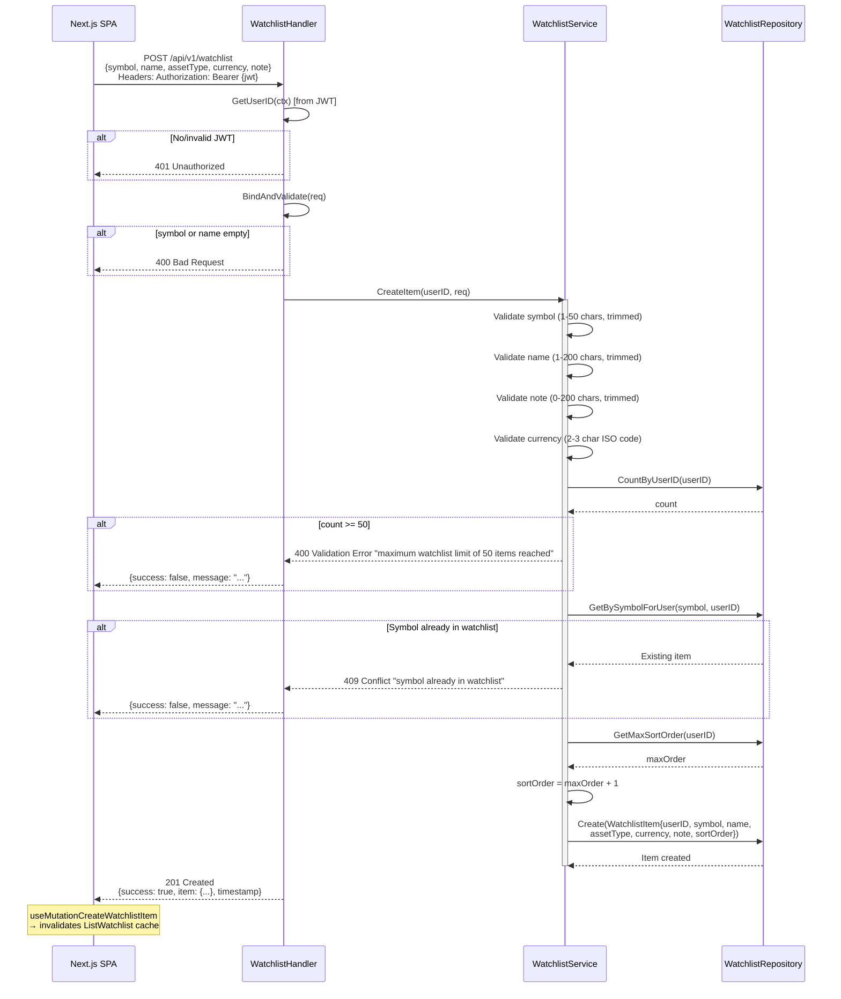
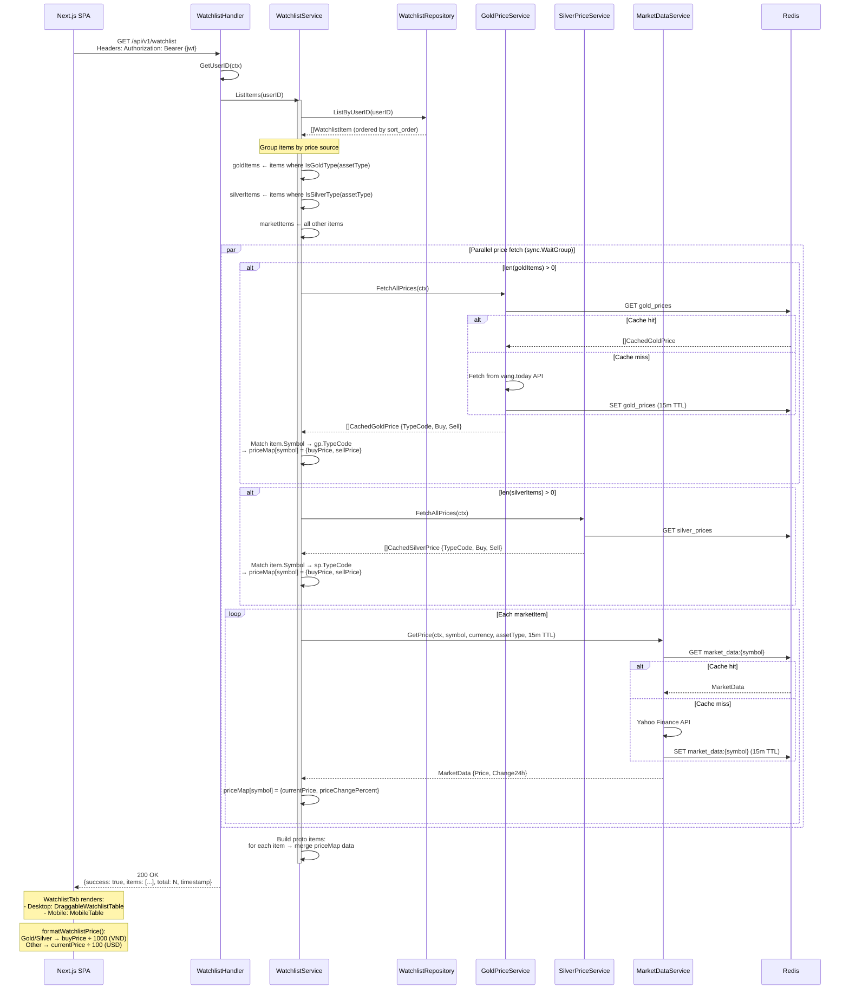
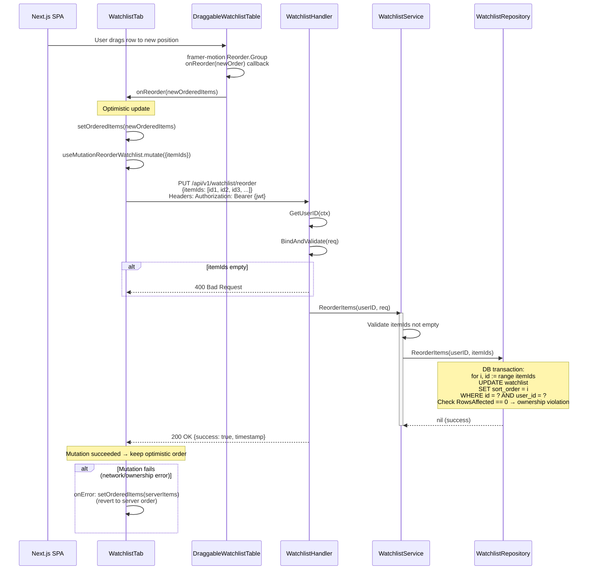
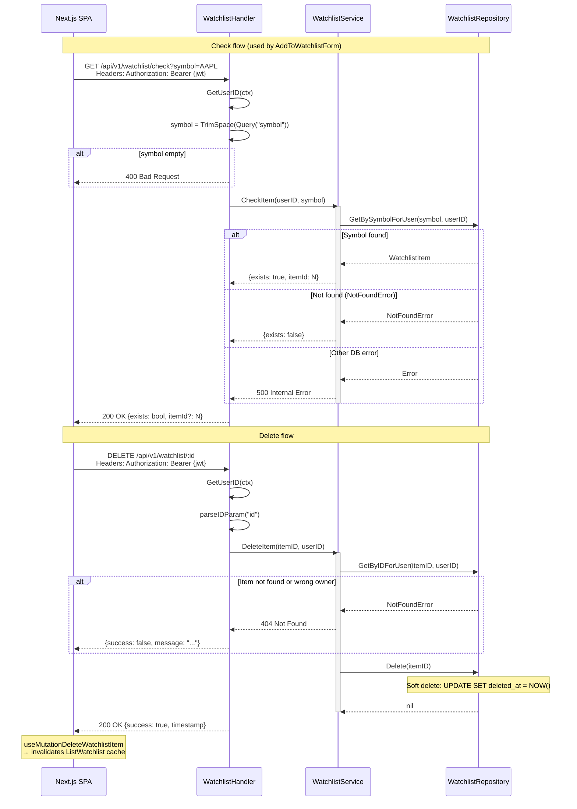

# Watchlist Domain — Runtime Flows

Symbol watchlist CRUD flows: add a symbol, list with live price enrichment, drag-and-drop reorder, and check/remove. All endpoints require JWT authentication and scope data to `user_id` extracted from the token.

## Table of Contents

- [Add Symbol to Watchlist](#1-add-symbol-to-watchlist)
- [List Watchlist with Price Enrichment](#2-list-watchlist-with-price-enrichment)
- [Reorder Watchlist (Drag-and-Drop)](#3-reorder-watchlist-drag-and-drop)
- [Check and Remove Symbol](#4-check-and-remove-symbol)

---

## 1. Add Symbol to Watchlist

**Trigger:** User submits AddToWatchlistForm (3-step: category → symbol → note)
**Endpoint:** `POST /api/v1/watchlist`
**Source:** `domain/service/watchlist_service.go`, `handlers/watchlist.go`

---

## 2. List Watchlist with Price Enrichment

**Trigger:** User opens Watchlist tab on Prices page
**Endpoint:** `GET /api/v1/watchlist`
**Source:** `domain/service/watchlist_service.go`, `handlers/watchlist.go`

---

## 3. Reorder Watchlist (Drag-and-Drop)

**Trigger:** User drags a watchlist row to a new position
**Endpoint:** `PUT /api/v1/watchlist/reorder`
**Source:** `domain/service/watchlist_service.go`, `handlers/watchlist.go`

---

## 4. Check and Remove Symbol

**Trigger:** User views symbol lookup result OR taps delete on a watchlist item
**Endpoints:**
- `GET /api/v1/watchlist/check?symbol=AAPL` — Check presence
- `DELETE /api/v1/watchlist/:id` — Remove item
**Source:** `domain/service/watchlist_service.go`, `handlers/watchlist.go`

