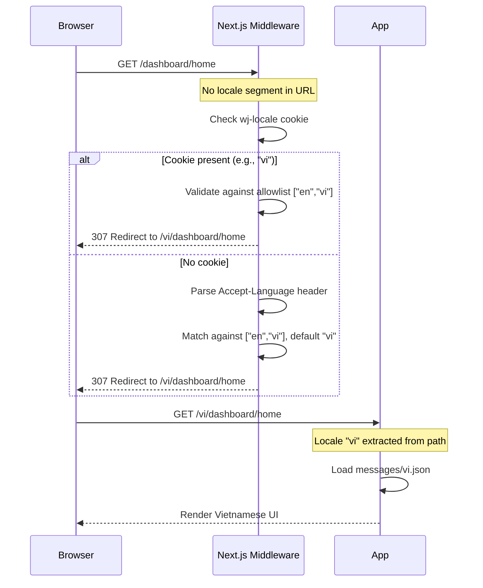

# i18n Translation System Implementation Plan

> **For implementation:** Use the secure-feature-pipeline skill, step: implement

**Goal:** Add a full internationalization (i18n) system to the WealthJourney frontend using `next-intl` with URL-based locale routing (`/vi/...`, `/en/...`), backend language preference storage, and full translation coverage for all UI strings.

**Spec:** `docs/specs/2026-03-05-i18n-translation-system-spec.md`

**Architecture:** The locale lives in the URL path segment. A Next.js middleware intercepts all requests, resolves the locale from the URL → cookie → `Accept-Language` header → default (`vi`), and redirects locale-less URLs. All pages move under `app/[locale]/`. The backend stores `preferred_language` in the `user` table and returns it in auth responses.

**Tech Stack:** next-intl ^3.x, Next.js 15 (App Router), Go backend (GORM, Protobuf), PostgreSQL

---

## Security Implementation Notes

- `language` field in `UpdatePreferences` MUST be validated server-side against strict allowlist `["en", "vi"]` — Go service layer
- Middleware must validate locale from URL/cookie against the known `locales` array before use; unsupported values fall back to `"vi"` silently
- Never use `dangerouslySetInnerHTML` with translation strings — only use `t()` in JSX text positions
- The `wj-locale` cookie should be set with `SameSite=Lax` to prevent CSRF misuse
- Existing JWT middleware already protects `PUT /api/v1/users/preferences` — no new auth surface

## C4 Architecture Diagram Updates

Per spec:
- `c4-component-backend.md` — update `UserHandler` description to note `language` field in UpdatePreferences
- `c4-component-frontend.md` — add `next-intl Middleware`, `Translation Catalogs`, update `SettingsPage`

---

## Task Overview

| # | Task | Layer | TDD |
|---|------|-------|-----|
| 0 | Update C4 Architecture Diagrams | Docs | No |
| 1 | Backend: DB migration — add `preferred_language` column | DB | No |
| 2 | Backend: Update User model + UserMapper | Go | Yes |
| 3 | Backend: Update `auth.proto` + `user.proto` — add `language` field | Proto | No |
| 4 | Backend: Run `task proto:all` to regenerate | Proto | No |
| 5 | Backend: Update service — validate + update language preference | Go Service | Yes |
| 6 | Backend: Update `UpdatePreferences` handler | Go Handler | Yes |
| 7 | Backend: Update `GetAuth` handler + auth mapper | Go Handler | No |
| 8 | Frontend: Install `next-intl` + configure `next.config.ts` | Config | No |
| 9 | Frontend: Restructure `app/` → `app/[locale]/` | Frontend | No |
| 10 | Frontend: Create `middleware.ts` for locale detection | Frontend | No |
| 11 | Frontend: Create `i18n/request.ts` and `global.d.ts` | Frontend | No |
| 12 | Frontend: Create `messages/en.json` — extract all strings | Frontend | No |
| 13 | Frontend: Create `messages/vi.json` — Vietnamese translations | Frontend | No |
| 14 | Frontend: Wire translations into layout, navigation, shared components | Frontend | No |
| 15 | Frontend: Wire translations into dashboard pages and feature forms | Frontend | No |
| 16 | Frontend: Create Language Settings page + LanguageSelector component | Frontend | No |
| 17 | Frontend: Update `AuthCheck` to read `language` from auth response + set cookie | Frontend | No |
| 18 | Frontend: Update date/number formatting utils to use active locale | Frontend | No |
| 19 | Create `flow-i18n.md` runtime flow diagrams | Docs | No |
| 20 | Update `docs/architecture/flow-auth.md` login flow | Docs | No |

---

### Task 0: Update C4 Architecture Diagrams

**Files:**
- Modify: `docs/architecture/c4-component-backend.md`
- Modify: `docs/architecture/c4-component-frontend.md`

**Steps:**

1. In `c4-component-backend.md`, find the `UserHandler` component description. Update it to read: "Handles user CRUD, preferences (currency + language), and profile operations."

2. In `c4-component-frontend.md`:
   - Add `next-intl Middleware` as an infrastructure component: "Intercepts all requests, resolves locale from URL/cookie/Accept-Language, redirects locale-less URLs"
   - Add `Translation Catalogs` as a data store: "`messages/en.json`, `messages/vi.json` — static per-locale string catalogs"
   - Update `SettingsPage` description to include language toggle functionality

3. No new L4 diagram needed (this is infrastructure, not a new bounded domain).

---

### Task 1: Backend DB Migration — Add `preferred_language` Column

**Files:**
- Create: `src/go-backend/cmd/migrate-i18n-language/main.go`

**Security notes:** Default value `'vi'` is hardcoded (not from user input). Migration is idempotent (uses `ADD COLUMN IF NOT EXISTS`).

**Step 1: Write the migration following the established pattern**

```go
package main

import (
	"context"
	"fmt"
	"log"

	"gorm.io/gorm"

	"wealthjourney/domain/models"
	"wealthjourney/pkg/config"
	"wealthjourney/pkg/database"
)

func main() {
	cfg, err := config.Load()
	if err != nil {
		log.Fatalf("Failed to load config: %v", err)
	}

	db, err := database.New(cfg)
	if err != nil {
		log.Fatalf("Failed to connect to database: %v", err)
	}
	defer db.Close()

	ctx := context.Background()
	if err := migrateI18nLanguage(ctx, db.DB); err != nil {
		log.Fatalf("Migration failed: %v", err)
	}

	log.Println("Migration completed successfully!")
}

func migrateI18nLanguage(ctx context.Context, db *gorm.DB) error {
	log.Println("Starting i18n language migration...")

	// Step 1: Add preferred_language column to user table
	log.Println("Adding preferred_language to user table...")
	if err := db.Exec(`
		ALTER TABLE "user"
		ADD COLUMN IF NOT EXISTS preferred_language VARCHAR(5) NOT NULL DEFAULT 'vi'
	`).Error; err != nil {
		return fmt.Errorf("failed to add preferred_language to user: %w", err)
	}
	log.Println("Added preferred_language column")

	// Step 2: Create index (idempotent check)
	if !db.Migrator().HasIndex(&models.User{}, "idx_user_preferred_language") {
		if err := db.Exec(`
			CREATE INDEX idx_user_preferred_language ON "user"(preferred_language)
		`).Error; err != nil {
			return fmt.Errorf("failed to create idx_user_preferred_language: %w", err)
		}
		log.Println("Created index idx_user_preferred_language")
	}

	// Step 3: Verify
	var count int64
	if err := db.Raw(`
		SELECT COUNT(*) FROM information_schema.columns
		WHERE table_name = 'user' AND column_name = 'preferred_language'
	`).Scan(&count).Error; err != nil {
		return fmt.Errorf("failed to verify migration: %w", err)
	}
	if count == 0 {
		return fmt.Errorf("migration verification failed: preferred_language column not found")
	}

	log.Printf("Migration verified: preferred_language column exists with %d existing rows defaulting to 'vi'", func() int64 {
		var n int64
		db.Raw(`SELECT COUNT(*) FROM "user"`).Scan(&n)
		return n
	}())
	return nil
}
```

**Step 2: Add task to `Taskfile.yml`**

In `Taskfile.yml`, after `backend:migrate-portfolio-history`, add:
```yaml
  backend:migrate-i18n-language:
    desc: "Run migration to add preferred_language column to user table"
    dir: "{{.BACKEND_DIR}}"
    cmds:
      - go run cmd/migrate-i18n-language/main.go
```

**Step 3: Verify it compiles**
```bash
cd src/go-backend && go build ./cmd/migrate-i18n-language/...
```

---

### Task 2: Backend — Update User Model + UserMapper

**Files:**
- Modify: `src/go-backend/domain/models/user.go`
- Modify: `src/go-backend/domain/service/mapper.go`

**Security notes:** `PreferredLanguage` is a non-sensitive UI preference. GORM tag `size:5` limits storage to match column constraint.

**Step 1: Write a test verifying mapper outputs language**

Create `src/go-backend/domain/service/mapper_language_test.go`:

```go
package service

import (
	"testing"

	"wealthjourney/domain/models"
)

func TestUserMapper_ModelToProto_IncludesLanguage(t *testing.T) {
	mapper := NewUserMapper()
	user := &models.User{
		ID:                1,
		Email:             "test@example.com",
		Name:              "Test User",
		PreferredCurrency: "VND",
		PreferredLanguage: "vi",
	}

	proto := mapper.ModelToProto(user)

	if proto == nil {
		t.Fatal("expected non-nil proto")
	}
	if proto.PreferredLanguage != "vi" {
		t.Errorf("expected PreferredLanguage 'vi', got %q", proto.PreferredLanguage)
	}
}

func TestUserMapper_ModelToProto_DefaultLanguage(t *testing.T) {
	mapper := NewUserMapper()
	user := &models.User{
		ID:                2,
		PreferredCurrency: "VND",
		PreferredLanguage: "",  // empty means not set
	}

	proto := mapper.ModelToProto(user)

	// Empty string is acceptable — frontend will fall back to "vi"
	if proto.PreferredLanguage != "" {
		t.Errorf("expected empty PreferredLanguage, got %q", proto.PreferredLanguage)
	}
}
```

**Step 2: Run test to verify it fails**
```bash
cd src/go-backend && go test ./domain/service/ -run TestUserMapper_ModelToProto -v
```
Expected: compilation error (fields don't exist yet).

**Step 3: Update `models/user.go`**

Add `PreferredLanguage` field after `ConversionInProgress`:
```go
PreferredLanguage    string         `gorm:"size:5;not null;default:'vi'" json:"preferredLanguage"`
```

**Step 4: Update `mapper.go` — `UserMapper.ModelToProto`**

Add `PreferredLanguage: user.PreferredLanguage,` to the proto struct literal in `ModelToProto`. This requires the proto field to exist — do this AFTER Task 3+4 are complete, OR add the field now and let it fail to compile until proto is updated.

> **Note:** Tasks 2, 3, 4 are tightly coupled at the Go compilation level. The recommended order is:
> 1. Add `PreferredLanguage` to `models/user.go` (model layer only — no proto dependency)
> 2. Update protos (Task 3) and run code gen (Task 4)
> 3. Update mapper to reference proto field (after proto types are generated)

**Step 5: Run tests after Task 4 (proto regeneration) is complete**
```bash
cd src/go-backend && go test ./domain/service/ -run TestUserMapper_ModelToProto -v
```
Expected: PASS.

---

### Task 3: Backend — Update `auth.proto` + `user.proto`

**Files:**
- Modify: `api/protobuf/v1/auth.proto`
- Modify: `api/protobuf/v1/user.proto`

**Security notes:** Proto3 fields are optional by default — adding a new field is backward-compatible. The field is a simple string, not a sensitive data type.

**Step 1: Update `auth.proto` — add `preferredLanguage` to `User` message**

In the `User` message (after field 8 `conversionInProgress`), add:
```protobuf
string preferredLanguage = 9 [json_name = "preferredLanguage"];  // ISO 639-1: "en", "vi"
```

**Step 2: Update `user.proto` — add `language` to `UserPreferences` message**

In the `UserPreferences` message (after field 1 `preferredCurrency`), add:
```protobuf
string language = 2 [json_name = "language"];  // ISO 639-1: "en", "vi"
```

**Step 3: Verify files saved correctly** (visual inspection — no test needed for proto syntax at this stage)

---

### Task 4: Backend — Regenerate Proto Code

**Files:**
- Auto-generated: `src/go-backend/protobuf/v1/auth.pb.go`
- Auto-generated: `src/go-backend/protobuf/v1/user.pb.go`
- Auto-generated: `src/wj-client/gen/protobuf/v1/auth.ts`
- Auto-generated: `src/wj-client/gen/protobuf/v1/user.ts`
- Auto-generated: `src/wj-client/utils/generated/hooks.ts` (updated request type)

**Step 1: Run generation**
```bash
task proto:all
```

**Step 2: Verify Go backend compiles**
```bash
cd src/go-backend && go build ./...
```

**Step 3: Verify TypeScript types include `preferredLanguage`**
```bash
grep -n "preferredLanguage" src/wj-client/gen/protobuf/v1/auth.ts
grep -n "language" src/wj-client/gen/protobuf/v1/user.ts
```
Expected: fields present in generated types.

---

### Task 5: Backend — Service Layer: Validate + Update Language Preference

**Files:**
- Modify: `src/go-backend/domain/service/user_service.go`

**Security notes:** Language validation MUST use a strict allowlist. Unlike currency change (which needs a background job), language change is a simple field update with no data conversion needed.

**Step 1: Write failing tests**

Add to `src/go-backend/domain/service/user_service_language_test.go`:

```go
package service_test

// NOTE: These are unit tests with mocked dependencies.
// Run with: go test -short ./domain/service/ -run TestUpdateLanguage

func TestUpdatePreferences_ValidLanguage_UpdatesUser(t *testing.T) {
	// Setup mock repo and service
	// Call UpdatePreferences with language "en"
	// Verify user.PreferredLanguage == "en" in the saved model
}

func TestUpdatePreferences_InvalidLanguage_ReturnsValidationError(t *testing.T) {
	// Call UpdatePreferences with language "fr" (unsupported)
	// Verify error is a ValidationError
	// Verify error message contains "unsupported language"
}

func TestUpdatePreferences_EmptyLanguage_NoChange(t *testing.T) {
	// Call UpdatePreferences with language ""
	// Verify no update occurs (language not changed, no error)
}

func TestUpdatePreferences_LanguageAndCurrency_BothHandled(t *testing.T) {
	// Call UpdatePreferences with both preferredCurrency "USD" and language "en"
	// Verify both fields are updated (currency triggers background job, language is immediate)
}
```

> **Note:** Fill in mock setup following the existing test patterns in `user_service_integration_test.go`. For short tests, use mock repos.

**Step 2: Run to verify failure**
```bash
cd src/go-backend && go test -short ./domain/service/ -run TestUpdatePreferences -v
```

**Step 3: Implement language validation and update in `UpdatePreferences` service method**

In `user_service.go`, modify the `UpdatePreferences` function:

```go
// supportedLanguages is the allowlist for language preferences.
var supportedLanguages = map[string]bool{
    "en": true,
    "vi": true,
}

func (s *userService) UpdatePreferences(ctx context.Context, userID int32, req *v1.UpdatePreferencesRequest) (*v1.UpdatePreferencesResponse, error) {
    var preferredCurrency string
    var language string

    if req.Preferences != nil {
        preferredCurrency = req.Preferences.PreferredCurrency
        language = req.Preferences.Language
    }

    // Validate language if provided
    if language != "" && !supportedLanguages[language] {
        return nil, apperrors.NewValidationError(fmt.Sprintf("unsupported language: %s", language))
    }

    // Handle currency update (existing logic via UpdateUserPreferences)
    var updateResp *protobufv1.UpdateUserResponse
    var err error

    if preferredCurrency != "" {
        updateResp, err = s.UpdateUserPreferences(ctx, userID, preferredCurrency)
        if err != nil {
            return nil, err
        }
    } else {
        // No currency change — get current user state for response
        user, err := s.userRepo.GetByID(ctx, userID)
        if err != nil {
            return nil, err
        }
        updateResp = &protobufv1.UpdateUserResponse{
            Success:   true,
            Message:   "Preferences updated",
            Data:      s.mapper.ModelToProto(user),
            Timestamp: time.Now().Format(time.RFC3339),
        }
    }

    // Handle language update (simple, no background job)
    if language != "" {
        user, err := s.userRepo.GetByID(ctx, userID)
        if err != nil {
            return nil, err
        }
        if user.PreferredLanguage != language {
            user.PreferredLanguage = language
            if err := s.userRepo.Update(ctx, user); err != nil {
                return nil, fmt.Errorf("failed to update language preference: %w", err)
            }
            updateResp.Data = s.mapper.ModelToProto(user)
            updateResp.Message = "Preferences updated"
        }
    }

    return &v1.UpdatePreferencesResponse{
        Success:   updateResp.Success,
        Message:   updateResp.Message,
        Data:      updateResp.Data,
        Timestamp: updateResp.Timestamp,
    }, nil
}
```

**Step 4: Run tests to verify they pass**
```bash
cd src/go-backend && go test -short ./domain/service/ -run TestUpdatePreferences -v
```

**Step 5: Run all backend tests**
```bash
cd src/go-backend && go test -short ./...
```

---

### Task 6: Backend — Update `UpdatePreferences` Handler

**Files:**
- Modify: `src/go-backend/handlers/user_v2.go`

**Security notes:** Language is validated in the service layer (Task 5). Handler only needs to map the field from request struct to proto. `PreferredCurrency` is no longer `binding:"required"` since either field can be updated independently.

**Step 1: Write handler test**

In `src/go-backend/handlers/user_v2_language_test.go` (or add to existing handler tests):

```go
// Test: PUT /api/v1/users/preferences with language field
// Test: invalid language "fr" → 400
// Test: valid language "en" → 200
// Test: valid language + currency → 200, both updated
```

Follow the pattern in `auth_integration_test.go` for HTTP integration tests.

**Step 2: Update the request struct and handler**

In `UpdatePreferences` in `user_v2.go`, change:

```go
var req struct {
    Preferences *struct {
        PreferredCurrency string `json:"preferredCurrency"`  // Removed binding:"required"
        Language          string `json:"language"`           // New field
    } `json:"preferences" binding:"required"`
}
```

Update the proto request building:
```go
protoReq := &v1.UpdatePreferencesRequest{
    Preferences: &v1.UserPreferences{
        PreferredCurrency: req.Preferences.PreferredCurrency,
        Language:          req.Preferences.Language,
    },
}
```

Also update the swagger comment to document both fields.

**Step 3: Run tests**
```bash
cd src/go-backend && go test -short ./handlers/... -run TestUpdatePreferences -v
```

---

### Task 7: Backend — Update `GetAuth` Handler + `UserMapper`

**Files:**
- Modify: `src/go-backend/handlers/auth.go`
- Modify: `src/go-backend/domain/service/mapper.go` (finalize `PreferredLanguage` mapping)

**Security notes:** `preferredLanguage` is non-sensitive. Adding it to the auth response doesn't create a new security surface. The data is only returned to the authenticated user for their own profile.

**Step 1: Ensure `UserMapper.ModelToProto` includes `PreferredLanguage`**

Verify (or add) the field in `mapper.go`:
```go
return &protobufv1.User{
    // ... existing fields ...
    PreferredLanguage:    user.PreferredLanguage,
}
```

**Step 2: Update `GetAuth` handler to include `preferredLanguage` in `gin.H`**

In `auth.go`, the `GetAuth` handler's `SuccessWithPath` call:
```go
handler.SuccessWithPath(c, gin.H{
    "id":                   userData.Data.Id,
    "email":                userData.Data.Email,
    "name":                 userData.Data.Name,
    "picture":              userData.Data.Picture,
    "preferredCurrency":    userData.Data.PreferredCurrency,
    "conversionInProgress": userData.Data.ConversionInProgress,
    "preferredLanguage":    userData.Data.PreferredLanguage,  // NEW
})
```

**Step 3: `VerifyAuth` — no code change needed**

`VerifyAuth` returns the result of `h.authSrv.VerifyAuth(token)` which passes through the proto `User` object. Since `UserMapper.ModelToProto` now includes `PreferredLanguage` and the proto field exists (after Task 3+4), `VerifyAuth` automatically includes the field.

**Step 4: Verify with a manual test after backend is running**
```bash
# After starting backend:
curl -H "Authorization: Bearer $TOKEN" http://localhost:8080/api/v1/auth | jq '.data.preferredLanguage'
# Expected: "vi" (or whatever the DB default is)
```

---

### Task 8: Frontend — Install `next-intl` + Configure `next.config.ts`

**Files:**
- Modify: `src/wj-client/package.json` (via npm install)
- Modify: `src/wj-client/next.config.ts`

**Step 1: Install next-intl**
```bash
cd src/wj-client && npm install next-intl
```

**Step 2: Verify installation**
```bash
cd src/wj-client && node -e "require('next-intl'); console.log('ok')"
```

**Step 3: Update `next.config.ts` to add `next-intl` plugin**

```typescript
import { NextConfig } from 'next';
import createNextIntlPlugin from 'next-intl/plugin';

const withNextIntl = createNextIntlPlugin('./i18n/request.ts');

const nextConfig: NextConfig = {
  images: {
    remotePatterns: [/* existing remotePatterns unchanged */],
  },
  compiler: {
    removeConsole: process.env.NODE_ENV === "production" ? { exclude: ["error", "warn"] } : false,
  },
  experimental: {
    optimizePackageImports: ['recharts', '@tanstack/react-query', '@tanstack/react-table', 'next-intl'],
    serverActions: {
      bodySizeLimit: '2mb',
    },
  },
  turbopack: {},
};

export default withNextIntl(nextConfig);
```

**Step 4: Create `src/wj-client/i18n/request.ts`** (referenced by plugin)

```typescript
import { getRequestConfig } from 'next-intl/server';
import { cookies } from 'next/headers';

export const locales = ['vi', 'en'] as const;
export type Locale = (typeof locales)[number];
export const defaultLocale: Locale = 'vi';

export default getRequestConfig(async ({ requestLocale }) => {
  // Get locale from request (set by middleware)
  let locale = await requestLocale;

  // Validate locale — fall back to default if invalid
  if (!locale || !locales.includes(locale as Locale)) {
    locale = defaultLocale;
  }

  return {
    locale,
    messages: (await import(`../messages/${locale}.json`)).default,
  };
});
```

**Step 5: Create `src/wj-client/global.d.ts`** for TypeScript type safety:

```typescript
import en from './messages/en.json';

type Messages = typeof en;

declare global {
  // Use type safe message keys with `next-intl`
  interface IntlMessages extends Messages {}
}
```

---

### Task 9: Frontend — Restructure `app/` → `app/[locale]/`

**Files:**
- Move: `app/layout.tsx` → `app/[locale]/layout.tsx`
- Move: `app/page.tsx` → `app/[locale]/page.tsx`
- Move: `app/landing/` → `app/[locale]/landing/`
- Move: `app/auth/` → `app/[locale]/auth/`
- Move: `app/dashboard/` → `app/[locale]/dashboard/`
- Move: `app/providers.tsx` → `app/[locale]/providers.tsx` (or keep at root, import from `[locale]/layout.tsx`)

**Security notes:** Moving files under `[locale]` does not change any security boundaries. Auth guards remain in place. The middleware (Task 10) handles locale-less URL redirect before routes are resolved.

**Step 1: Create the `app/[locale]/` directory structure**
```bash
cd src/wj-client
mkdir -p app/[locale]
```

**Step 2: Move directories**
```bash
mv app/landing app/[locale]/landing
mv app/auth app/[locale]/auth
mv app/dashboard app/[locale]/dashboard
```

**Step 3: Move and update `app/layout.tsx` → `app/[locale]/layout.tsx`**

The new layout receives `params` with the locale. Update:

```typescript
import { NextIntlClientProvider } from 'next-intl';
import { getMessages } from 'next-intl/server';
import { notFound } from 'next/navigation';
import { locales } from '@/i18n/request';
// ... keep all existing imports (font, Providers, etc.)

export default async function LocaleLayout({
  children,
  params,
}: {
  children: React.ReactNode;
  params: Promise<{ locale: string }>;
}) {
  const { locale } = await params;

  // Validate locale
  if (!locales.includes(locale as any)) {
    notFound();
  }

  // Fetch messages for this locale
  const messages = await getMessages();

  return (
    <html lang={locale} className="h-dvh">
      <head>
        {/* Keep all existing PWA meta tags */}
      </head>
      <body className={`${plusJakartaSans.variable} antialiased h-dvh`}>
        <NextIntlClientProvider messages={messages}>
          <Providers>{children}</Providers>
        </NextIntlClientProvider>
      </body>
    </html>
  );
}
```

**Step 4: Update `app/[locale]/page.tsx` (root redirector)**

The root page redirects to the default locale dashboard. Since middleware handles locale-less URLs, this page may not be needed, but keep it as a safety redirect:

```typescript
import { redirect } from 'next/navigation';

export default function RootPage() {
  redirect('/vi/dashboard/home');
}
```

**Step 5: Create a minimal root `app/layout.tsx`** to satisfy Next.js App Router requirement (there must be a root layout):

```typescript
export default function RootLayout({ children }: { children: React.ReactNode }) {
  return children;
}
```

**Step 6: Verify the project still builds**
```bash
cd src/wj-client && npm run build 2>&1 | tail -20
```

---

### Task 10: Frontend — Create `middleware.ts` for Locale Detection

**Files:**
- Create: `src/wj-client/middleware.ts`

**Security notes:** Middleware validates locale against the allowlist before use. Unsupported locales redirect to `vi` (default), not echoed back to the user. `Accept-Language` header is read-only, parsed by `@formatjs/intl-localematcher` which handles malformed values gracefully.

**Step 1: Install peer dependencies**
```bash
cd src/wj-client && npm install @formatjs/intl-localematcher negotiator
npm install --save-dev @types/negotiator
```

**Step 2: Create `middleware.ts`**

```typescript
import createMiddleware from 'next-intl/middleware';
import { locales, defaultLocale } from './i18n/request';

export default createMiddleware({
  // Supported locales
  locales,
  // Default locale (when no locale is detected)
  defaultLocale,
  // Locale prefix strategy: always include locale in URL
  localePrefix: 'always',
  // Cookie name for persisting locale preference
  localeCookie: 'wj-locale',
});

export const config = {
  // Match all routes except static files, images, and API routes
  matcher: [
    '/((?!_next/static|_next/image|favicon.ico|icons|manifest.json|api|.*\\.(?:svg|png|jpg|jpeg|gif|webp)$).*)',
  ],
};
```

**Step 3: Verify middleware is picked up**
```bash
cd src/wj-client && npm run dev &
# Visit http://localhost:3000 — should redirect to /vi/
# Visit http://localhost:3000/dashboard/home — should redirect to /vi/dashboard/home
```

---

### Task 11: Frontend — Create `messages/en.json` (Extract All Strings)

**Files:**
- Create: `src/wj-client/messages/en.json`

**Notes:** This is the largest task in terms of volume (~635 strings across ~69 files). The approach is to audit all `.tsx`/`.ts` files for hardcoded user-facing strings and extract them into the JSON catalog.

**Step 1: Create the base structure**

```json
{
  "common": {
    "save": "Save",
    "cancel": "Cancel",
    "delete": "Delete",
    "edit": "Edit",
    "add": "Add",
    "loading": "Loading...",
    "error": "Error",
    "retry": "Try again",
    "confirm": "Confirm",
    "close": "Close",
    "back": "Back",
    "next": "Next",
    "submit": "Submit",
    "search": "Search",
    "filter": "Filter",
    "export": "Export",
    "import": "Import",
    "noData": "No data",
    "success": "Success",
    "required": "Required",
    "optional": "(Optional)"
  },
  "nav": {
    "home": "Home",
    "transactions": "Transactions",
    "wallets": "Wallets",
    "portfolio": "Portfolio",
    "prices": "Prices",
    "report": "Reports",
    "budget": "Budget",
    "logout": "Logout",
    "settings": "Settings",
    "sessions": "Sessions",
    "importTemplates": "Import Templates",
    "language": "Language"
  },
  "landing": {
    "hero": {
      "title": "Your Trusted Guide to Financial Freedom",
      "subtitle": "Track, manage, and grow your wealth with WealthJourney",
      "ctaLogin": "Log in with Google",
      "ctaRegister": "Get Started Free"
    }
  },
  "auth": {
    "login": {
      "title": "Welcome back",
      "subtitle": "Log in to continue your financial journey",
      "loginWithGoogle": "Log in with Google",
      "noAccount": "Don't have an account?",
      "register": "Register"
    },
    "register": {
      "title": "Get started",
      "subtitle": "Create your WealthJourney account",
      "registerWithGoogle": "Register with Google",
      "hasAccount": "Already have an account?",
      "login": "Log in"
    }
  },
  "dashboard": {
    "home": {
      "title": "Dashboard",
      "totalBalance": "Total Balance",
      "recentTransactions": "Recent Transactions",
      "quickActions": "Quick Actions"
    }
  },
  "transaction": {
    "title": "Transactions",
    "add": "Add Transaction",
    "edit": "Edit Transaction",
    "delete": "Delete Transaction",
    "transfer": "Transfer Money",
    "type": {
      "income": "Income",
      "expense": "Expense",
      "transfer": "Transfer"
    },
    "fields": {
      "amount": "Amount",
      "category": "Category",
      "wallet": "Wallet",
      "date": "Date",
      "note": "Note",
      "description": "Description"
    },
    "empty": "No transactions yet",
    "emptyDesc": "Add your first transaction to start tracking"
  },
  "wallet": {
    "title": "Wallets",
    "create": "Create New Wallet",
    "edit": "Edit Wallet",
    "delete": "Delete Wallet",
    "deleteConfirm": "Are you sure you want to delete this wallet?",
    "fields": {
      "name": "Wallet Name",
      "balance": "Balance",
      "type": "Type",
      "currency": "Currency"
    },
    "types": {
      "basic": "Basic",
      "investment": "Investment"
    },
    "empty": "No wallets yet",
    "emptyDesc": "Create your first wallet to start tracking"
  },
  "investment": {
    "title": "Portfolio",
    "add": "Add Investment",
    "fields": {
      "symbol": "Symbol",
      "name": "Name",
      "quantity": "Quantity",
      "price": "Price",
      "type": "Type"
    },
    "tabs": {
      "overview": "Overview",
      "transactions": "Transactions",
      "addTransaction": "Add Transaction",
      "setPrice": "Set Price"
    },
    "empty": "No investments yet",
    "emptyDesc": "Add your first investment to start tracking"
  },
  "budget": {
    "title": "Budget",
    "add": "Add Budget",
    "edit": "Edit Budget",
    "addItem": "Add Budget Item",
    "editItem": "Edit Budget Item",
    "empty": "No budgets yet",
    "emptyDesc": "Create your first budget to start planning"
  },
  "report": {
    "title": "Reports",
    "export": "Export",
    "exportCSV": "Export CSV",
    "exportPDF": "Export PDF"
  },
  "prices": {
    "title": "Market Prices",
    "tabs": {
      "gold": "Gold",
      "silver": "Silver",
      "symbolLookup": "Symbol Lookup"
    },
    "goldPrices": "Gold Prices",
    "silverPrices": "Silver Prices",
    "searchSymbol": "Search Symbol",
    "buy": "Buy",
    "sell": "Sell",
    "change": "Change",
    "lastUpdated": "Last updated"
  },
  "settings": {
    "title": "Settings",
    "language": {
      "title": "Language",
      "subtitle": "Choose your preferred display language",
      "english": "English",
      "vietnamese": "Tiếng Việt",
      "save": "Save Language",
      "saved": "Language updated"
    },
    "sessions": {
      "title": "Active Sessions",
      "revoke": "Revoke",
      "revokeAll": "Revoke All Sessions"
    },
    "importTemplates": {
      "title": "Import Templates"
    }
  },
  "feedback": {
    "emptyState": {
      "defaultTitle": "Nothing here yet",
      "defaultDesc": "Get started by adding your first item"
    },
    "errorState": {
      "defaultTitle": "Something went wrong",
      "defaultDesc": "An error occurred. Please try again.",
      "retry": "Try again"
    }
  },
  "modals": {
    "confirm": "Confirm",
    "success": "Success",
    "deleteConfirm": "Are you sure?",
    "cannotUndo": "This action cannot be undone."
  }
}
```

**Step 2: Extract remaining strings from each file group**

Do a thorough pass through each area. Use grep to find hardcoded strings:
```bash
cd src/wj-client
grep -r "\"[A-Z][a-z]" app/ features/ components/ --include="*.tsx" -l
```

Add missing keys to the JSON for each namespace. Be exhaustive — ALL user-visible text must be extracted.

**Step 3: Verify JSON is valid**
```bash
node -e "JSON.parse(require('fs').readFileSync('messages/en.json', 'utf8')); console.log('valid')"
```

---

### Task 12: Frontend — Create `messages/vi.json` (Vietnamese Translations)

**Files:**
- Create: `src/wj-client/messages/vi.json`

**Notes:** Vietnamese translations for all keys in `en.json`. The translated strings must cover 100% of keys.

**Step 1: Create `messages/vi.json` with translations for all keys**

```json
{
  "common": {
    "save": "Lưu",
    "cancel": "Hủy",
    "delete": "Xóa",
    "edit": "Chỉnh sửa",
    "add": "Thêm",
    "loading": "Đang tải...",
    "error": "Lỗi",
    "retry": "Thử lại",
    "confirm": "Xác nhận",
    "close": "Đóng",
    "back": "Quay lại",
    "next": "Tiếp theo",
    "submit": "Gửi",
    "search": "Tìm kiếm",
    "filter": "Lọc",
    "export": "Xuất",
    "import": "Nhập",
    "noData": "Không có dữ liệu",
    "success": "Thành công",
    "required": "Bắt buộc",
    "optional": "(Tùy chọn)"
  },
  "nav": {
    "home": "Trang chủ",
    "transactions": "Giao dịch",
    "wallets": "Ví",
    "portfolio": "Danh mục",
    "prices": "Giá thị trường",
    "report": "Báo cáo",
    "budget": "Ngân sách",
    "logout": "Đăng xuất",
    "settings": "Cài đặt",
    "sessions": "Phiên đăng nhập",
    "importTemplates": "Mẫu nhập liệu",
    "language": "Ngôn ngữ"
  },
  "landing": {
    "hero": {
      "title": "Người đồng hành tin cậy trên con đường tự do tài chính",
      "subtitle": "Theo dõi, quản lý và gia tăng tài sản với WealthJourney",
      "ctaLogin": "Đăng nhập với Google",
      "ctaRegister": "Bắt đầu miễn phí"
    }
  },
  "auth": {
    "login": {
      "title": "Chào mừng trở lại",
      "subtitle": "Đăng nhập để tiếp tục hành trình tài chính",
      "loginWithGoogle": "Đăng nhập với Google",
      "noAccount": "Chưa có tài khoản?",
      "register": "Đăng ký"
    },
    "register": {
      "title": "Bắt đầu ngay",
      "subtitle": "Tạo tài khoản WealthJourney của bạn",
      "registerWithGoogle": "Đăng ký với Google",
      "hasAccount": "Đã có tài khoản?",
      "login": "Đăng nhập"
    }
  },
  "dashboard": {
    "home": {
      "title": "Bảng điều khiển",
      "totalBalance": "Tổng số dư",
      "recentTransactions": "Giao dịch gần đây",
      "quickActions": "Thao tác nhanh"
    }
  },
  "transaction": {
    "title": "Giao dịch",
    "add": "Thêm giao dịch",
    "edit": "Chỉnh sửa giao dịch",
    "delete": "Xóa giao dịch",
    "transfer": "Chuyển tiền",
    "type": {
      "income": "Thu nhập",
      "expense": "Chi tiêu",
      "transfer": "Chuyển khoản"
    },
    "fields": {
      "amount": "Số tiền",
      "category": "Danh mục",
      "wallet": "Ví",
      "date": "Ngày",
      "note": "Ghi chú",
      "description": "Mô tả"
    },
    "empty": "Chưa có giao dịch nào",
    "emptyDesc": "Thêm giao dịch đầu tiên để bắt đầu theo dõi"
  },
  "wallet": {
    "title": "Ví tiền",
    "create": "Tạo ví mới",
    "edit": "Chỉnh sửa ví",
    "delete": "Xóa ví",
    "deleteConfirm": "Bạn có chắc chắn muốn xóa ví này không?",
    "fields": {
      "name": "Tên ví",
      "balance": "Số dư",
      "type": "Loại",
      "currency": "Tiền tệ"
    },
    "types": {
      "basic": "Cơ bản",
      "investment": "Đầu tư"
    },
    "empty": "Chưa có ví nào",
    "emptyDesc": "Tạo ví đầu tiên để bắt đầu theo dõi"
  },
  "investment": {
    "title": "Danh mục đầu tư",
    "add": "Thêm khoản đầu tư",
    "fields": {
      "symbol": "Mã",
      "name": "Tên",
      "quantity": "Số lượng",
      "price": "Giá",
      "type": "Loại"
    },
    "tabs": {
      "overview": "Tổng quan",
      "transactions": "Giao dịch",
      "addTransaction": "Thêm giao dịch",
      "setPrice": "Cập nhật giá"
    },
    "empty": "Chưa có khoản đầu tư nào",
    "emptyDesc": "Thêm khoản đầu tư đầu tiên để bắt đầu theo dõi"
  },
  "budget": {
    "title": "Ngân sách",
    "add": "Thêm ngân sách",
    "edit": "Chỉnh sửa ngân sách",
    "addItem": "Thêm mục ngân sách",
    "editItem": "Chỉnh sửa mục ngân sách",
    "empty": "Chưa có ngân sách nào",
    "emptyDesc": "Tạo ngân sách đầu tiên để bắt đầu lập kế hoạch"
  },
  "report": {
    "title": "Báo cáo",
    "export": "Xuất",
    "exportCSV": "Xuất CSV",
    "exportPDF": "Xuất PDF"
  },
  "prices": {
    "title": "Giá thị trường",
    "tabs": {
      "gold": "Vàng",
      "silver": "Bạc",
      "symbolLookup": "Tra cứu mã"
    },
    "goldPrices": "Giá vàng",
    "silverPrices": "Giá bạc",
    "searchSymbol": "Tra cứu mã chứng khoán",
    "buy": "Mua",
    "sell": "Bán",
    "change": "Thay đổi",
    "lastUpdated": "Cập nhật lúc"
  },
  "settings": {
    "title": "Cài đặt",
    "language": {
      "title": "Ngôn ngữ",
      "subtitle": "Chọn ngôn ngữ hiển thị ưa thích",
      "english": "English",
      "vietnamese": "Tiếng Việt",
      "save": "Lưu ngôn ngữ",
      "saved": "Đã cập nhật ngôn ngữ"
    },
    "sessions": {
      "title": "Phiên đăng nhập đang hoạt động",
      "revoke": "Thu hồi",
      "revokeAll": "Thu hồi tất cả phiên"
    },
    "importTemplates": {
      "title": "Mẫu nhập liệu"
    }
  },
  "feedback": {
    "emptyState": {
      "defaultTitle": "Chưa có dữ liệu",
      "defaultDesc": "Bắt đầu bằng cách thêm mục đầu tiên"
    },
    "errorState": {
      "defaultTitle": "Đã xảy ra lỗi",
      "defaultDesc": "Có lỗi xảy ra. Vui lòng thử lại.",
      "retry": "Thử lại"
    }
  },
  "modals": {
    "confirm": "Xác nhận",
    "success": "Thành công",
    "deleteConfirm": "Bạn có chắc chắn không?",
    "cannotUndo": "Hành động này không thể hoàn tác."
  }
}
```

**Step 2: Verify key parity** — both files must have the same keys:
```bash
cd src/wj-client
node -e "
  const en = Object.keys(require('./messages/en.json'));
  const vi = Object.keys(require('./messages/vi.json'));
  const missing = en.filter(k => !vi.includes(k));
  if (missing.length) console.error('Missing in vi:', missing);
  else console.log('All top-level keys match');
"
```

---

### Task 13: Frontend — Wire Translations into Layout and Navigation

**Files:**
- Modify: `src/wj-client/app/[locale]/dashboard/layout.tsx`
- Modify: `src/wj-client/components/navigation/BottomNav.tsx`

**Step 1: Update `dashboard/layout.tsx` navigation labels**

Change the `navigationItems` array from hardcoded strings to `t('nav.home')` etc. Since `layout.tsx` is a client component, use `useTranslations`:

```typescript
"use client";

import { useTranslations } from 'next-intl';
// ...

export default function DashboardLayout({ children }: { children: React.ReactNode }) {
  const t = useTranslations('nav');

  const navigationItems = useMemo(() => [
    { href: routes.home, label: t('home'), icon: <HomeIcon /> },
    { href: routes.transaction, label: t('transactions'), icon: <TransactionIcon /> },
    { href: routes.wallets, label: t('wallets'), icon: <WalletIcon /> },
    { href: routes.portfolio, label: t('portfolio'), icon: <PortfolioIcon /> },
    { href: routes.report, label: t('report'), icon: <ReportsIcon /> },
    { href: routes.budget, label: t('budget'), icon: <BudgetIcon /> },
  ], [t]);
  // ...
}
```

**Step 2: Update `routes` in `app/constants.tsx`**

Routes need locale prefix. With `next-intl`, use `useRouter` and `Link` from `next-intl/navigation` instead of `next/navigation`. Create a locale-aware router config:

```typescript
// src/wj-client/lib/navigation.ts
import { createNavigation } from 'next-intl/navigation';
import { locales } from '@/i18n/request';

export const { Link, redirect, usePathname, useRouter } = createNavigation({ locales });
```

Update all components that use `useRouter` from `next/navigation` and `Link` from `next/link` to import from `@/lib/navigation` instead.

**Step 3: Update `BottomNav.tsx` to use `useTranslations`**

```typescript
import { useTranslations } from 'next-intl';

export function BottomNav() {
  const t = useTranslations('nav');

  const navItems = createNavItems({
    home: t('home'),
    transactions: t('transactions'),
    // ...
  });
  // ...
}
```

Or refactor `createNavItems` to accept translated labels directly.

**Step 4: Verify build still passes**
```bash
cd src/wj-client && npm run build 2>&1 | tail -20
```

---

### Task 14: Frontend — Wire Translations into Dashboard Pages and Feature Forms

**Files:**
- Modify: `src/wj-client/app/[locale]/dashboard/home/page.tsx`
- Modify: `src/wj-client/app/[locale]/dashboard/transaction/page.tsx`
- Modify: `src/wj-client/app/[locale]/dashboard/wallets/page.tsx`
- Modify: `src/wj-client/app/[locale]/dashboard/portfolio/page.tsx`
- Modify: `src/wj-client/app/[locale]/dashboard/budget/page.tsx`
- Modify: `src/wj-client/app/[locale]/dashboard/report/page.tsx`
- Modify: `src/wj-client/app/[locale]/dashboard/prices/page.tsx`
- Modify: Shared components (`EmptyState`, `ErrorState`, `ConfirmationDialog`, etc.)
- Modify: Feature forms (`AddTransactionForm`, `CreateWalletForm`, etc.)

**Pattern:** For each file, replace hardcoded strings with `t('namespace.key')`.

**Server components** (page files): use `getTranslations()` from `next-intl/server`:
```typescript
import { getTranslations } from 'next-intl/server';

export default async function TransactionPage() {
  const t = await getTranslations('transaction');
  // use t('title'), t('add'), etc.
}
```

**Client components** (forms, modals, interactive UI): use `useTranslations()`:
```typescript
"use client";
import { useTranslations } from 'next-intl';

export function AddTransactionForm() {
  const t = useTranslations('transaction');
  const tCommon = useTranslations('common');
  // use t('fields.amount'), tCommon('save'), etc.
}
```

**Step 1: Update shared feedback components first** (high-impact, used everywhere)

`EmptyState.tsx` and `ErrorState.tsx` — accept translated props from parent. Do NOT call `useTranslations` inside these shared components (they're used in many contexts). Instead, callers pass translated strings:

```typescript
// Pattern: parent passes translated string
<EmptyState
  title={t('transaction.empty')}
  description={t('transaction.emptyDesc')}
/>
```

Or, create locale-aware wrapper components per feature.

**Step 2: Update each page and form in sequence**

For each file, do a grep to find hardcoded strings:
```bash
grep -n '"[A-Z][a-zA-Z ]' src/wj-client/app/[locale]/dashboard/home/page.tsx
```

Replace each with `t('key')` calls.

**Step 3: Run TypeScript check to catch missing keys**
```bash
cd src/wj-client && npx tsc --noEmit 2>&1 | head -30
```

---

### Task 15: Frontend — Create Language Settings Page + LanguageSelector Component

**Files:**
- Create: `src/wj-client/app/[locale]/dashboard/settings/page.tsx`
- Create: `src/wj-client/features/settings/components/LanguageSelector.tsx`

**Security notes:** Language change calls `PUT /api/v1/users/preferences` with the selected value. The backend validates against allowlist. Cookie is set with `SameSite=Lax`. Redirect uses `router.replace` (locale-aware) to the current page under the new locale.

**Step 1: Create `LanguageSelector.tsx`**

```typescript
"use client";

import { useState } from "react";
import { useRouter, usePathname } from "@/lib/navigation";
import { useLocale, useTranslations } from "next-intl";
import { useMutationUpdatePreferences } from "@/utils/generated/hooks";
import { Button } from "@/components/Button";
import { ButtonType } from "@/app/constants";

const SUPPORTED_LANGUAGES = [
  { code: "en", label: "English", nativeLabel: "English" },
  { code: "vi", label: "Vietnamese", nativeLabel: "Tiếng Việt" },
] as const;

export function LanguageSelector() {
  const t = useTranslations("settings.language");
  const currentLocale = useLocale();
  const [selected, setSelected] = useState(currentLocale);
  const [error, setError] = useState<string>();
  const router = useRouter();
  const pathname = usePathname();

  const updatePref = useMutationUpdatePreferences({
    onSuccess: () => {
      // Set cookie then redirect to same page under new locale
      document.cookie = `wj-locale=${selected}; path=/; SameSite=Lax`;
      router.replace(pathname, { locale: selected });
    },
    onError: (err: any) => {
      setError(err.message || "Failed to update language");
    },
  });

  const handleSave = () => {
    updatePref.mutate({
      preferences: {
        language: selected,
      },
    });
  };

  return (
    <div className="space-y-4">
      <div>
        <h3 className="font-medium text-gray-900">{t("title")}</h3>
        <p className="text-sm text-gray-500">{t("subtitle")}</p>
      </div>

      <div className="space-y-2">
        {SUPPORTED_LANGUAGES.map((lang) => (
          <label
            key={lang.code}
            className="flex items-center gap-3 p-3 rounded-md border cursor-pointer hover:bg-gray-50"
          >
            <input
              type="radio"
              name="language"
              value={lang.code}
              checked={selected === lang.code}
              onChange={() => setSelected(lang.code)}
              className="accent-bg"
            />
            <span className="font-medium">{lang.nativeLabel}</span>
          </label>
        ))}
      </div>

      {error && <p className="text-red-600 text-sm">{error}</p>}

      <Button
        type={ButtonType.PRIMARY}
        onClick={handleSave}
        loading={updatePref.isPending}
        disabled={selected === currentLocale}
      >
        {t("save")}
      </Button>
    </div>
  );
}
```

**Step 2: Create `app/[locale]/dashboard/settings/page.tsx`**

```typescript
import { getTranslations } from "next-intl/server";
import { LanguageSelector } from "@/features/settings/components/LanguageSelector";

export default async function SettingsPage() {
  const t = await getTranslations("settings");

  return (
    <div className="max-w-lg mx-auto p-4 sm:p-6 space-y-6">
      <h1 className="text-xl font-semibold">{t("title")}</h1>

      <div className="bg-white rounded-md drop-shadow-round p-4">
        <LanguageSelector />
      </div>
    </div>
  );
}
```

**Step 3: Add settings route to `app/constants.tsx`**

Add `settings: "/dashboard/settings"` to the `routes` object.

**Step 4: Add settings link to dashboard navigation**

In `dashboard/layout.tsx`, add a settings link (e.g., in the sidebar footer or user menu area).

**Step 5: Verify the settings page renders**
```bash
cd src/wj-client && npm run dev
# Visit /vi/dashboard/settings — should show language selector
```

---

### Task 16: Frontend — Update `AuthCheck` to Read `language` from Auth Response

**Files:**
- Modify: `src/wj-client/app/[locale]/auth/utils/AuthCheck.tsx`
- Modify: `src/wj-client/features/auth/store/interface.tsx` (add `preferredLanguage` to `AuthPayload`)

**Security notes:** Language value from server is validated on the backend before being stored. Frontend should still guard against unexpected values — default to `"vi"` if the value is not in the supported locales list.

**Step 1: Update `AuthPayload` interface**

In `interface.tsx`, add:
```typescript
preferredLanguage?: string;  // ISO 639-1: "en" | "vi"
```

**Step 2: Update `AuthCheck.tsx`**

After successful auth verification, read `preferredLanguage` from the response and set the `wj-locale` cookie if different from current locale:

```typescript
useEffect(() => {
  const storedToken = localStorage.getItem(LOCAL_STORAGE_TOKEN_NAME);
  if (storedToken && authResponse?.data) {
    const lang = authResponse.data.preferredLanguage || "vi";

    // Dispatch to Redux store
    store.dispatch(
      setAuth({
        isAuthenticated: true,
        email: authResponse.data.email,
        fullname: authResponse.data.name,
        picture: authResponse.data.picture,
        preferredCurrency: authResponse.data.preferredCurrency || "VND",
        preferredLanguage: lang,
      })
    );

    // Set locale cookie (used by middleware on next navigation)
    document.cookie = `wj-locale=${lang}; path=/; SameSite=Lax`;

    // If current URL locale differs from user preference, redirect
    // (next-intl middleware will pick up the cookie on next request)
    const currentLocale = window.location.pathname.split('/')[1];
    const validLocales = ['en', 'vi'];
    const userLocale = validLocales.includes(lang) ? lang : 'vi';
    if (currentLocale !== userLocale) {
      const newPath = window.location.pathname.replace(`/${currentLocale}/`, `/${userLocale}/`);
      router.replace(newPath);
    }
  }
}, [authResponse]);
```

**Step 3: Verify no redirect loop**

The redirect only fires if locale differs. After redirect, the new locale is in the URL, so `currentLocale === userLocale` and no further redirect occurs.

---

### Task 17: Frontend — Update Date/Number Formatting Utils

**Files:**
- Modify: `src/wj-client/lib/utils/date.ts`
- Modify: `src/wj-client/lib/utils/number-format.ts`

**Step 1: Update `date.ts`**

Add an optional `locale` parameter defaulting to `'vi-VN'` (or accept it from callers):

```typescript
// At module top — import date-fns locales
import { vi, enUS } from 'date-fns/locale';
import { formatDistanceToNow } from 'date-fns';

const DATE_FNS_LOCALES: Record<string, Locale> = {
  vi: vi,
  en: enUS,
};

export const formatDateTime = (
  timestamp: number | undefined,
  locale = 'vi'
): string => {
  if (!timestamp) return "";
  const date = new Date(timestamp * 1000);
  const intlLocale = locale === 'vi' ? 'vi-VN' : 'en-US';
  return date.toLocaleString(intlLocale, {
    month: "short",
    day: "numeric",
    year: "numeric",
    hour: "numeric",
    minute: "2-digit",
    hour12: locale !== 'vi',
  });
};

export const formatDate = (
  timestamp: number | undefined,
  locale = 'vi'
): string => {
  if (!timestamp) return "";
  const date = new Date(timestamp * 1000);
  const intlLocale = locale === 'vi' ? 'vi-VN' : 'en-US';
  return date.toLocaleDateString(intlLocale, {
    month: "short",
    day: "numeric",
    year: "numeric",
  });
};

export const formatRelativeTime = (
  timestamp: number,
  locale = 'vi'
): string => {
  return formatDistanceToNow(new Date(timestamp * 1000), {
    addSuffix: true,
    locale: DATE_FNS_LOCALES[locale] || vi,
  });
};
```

**Step 2: Create a `useLocale`-aware wrapper hook for date formatting**

Create `src/wj-client/hooks/useDateFormat.ts`:

```typescript
"use client";

import { useLocale } from 'next-intl';
import { formatDate, formatDateTime } from '@/lib/utils/date';

export function useDateFormat() {
  const locale = useLocale();

  return {
    formatDate: (ts: number | undefined) => formatDate(ts, locale),
    formatDateTime: (ts: number | undefined) => formatDateTime(ts, locale),
  };
}
```

Components that need locale-aware dates use `useDateFormat()` instead of importing `formatDate` directly.

**Step 3: Number formatting — for non-currency numbers**

`number-format.ts` already uses comma separators. For locale-specific number formatting (thousands separator style), the currency formatter (`Intl.NumberFormat`) already handles this via `preferredCurrency`. Non-currency numbers in VN locale use `.` as thousands separator. This is a display-only concern — update if needed per visual audit.

---

### Task 18: Create `flow-i18n.md` Runtime Flow Diagrams

**Files:**
- Create: `docs/architecture/flow-i18n.md`
- Modify: `docs/architecture/flow-auth.md`
- Modify: `docs/architecture/README.md`

**Step 1: Create `flow-i18n.md`**

````markdown
# i18n Flow Diagrams

## Flow 1: First Visit Locale Detection
**Trigger:** Browser requests any URL (no locale in path)
**Source:** `src/wj-client/middleware.ts`



**Key Invariants:**
- Unsupported locale in URL → redirect to /vi/ (never rendered as-is)
- Cookie value always validated against allowlist before use

**Error Paths:**

| Condition | Response | Rollback |
|-----------|----------|----------|
| Unsupported locale in URL (e.g. /fr/) | 307 → /vi/ | N/A |
| Invalid cookie value | Ignored, fall back to Accept-Language or "vi" | N/A |
| Malformed Accept-Language header | Graceful parse failure, fall back to "vi" | N/A |

---

## Flow 2: Language Switch in Settings
**Trigger:** User selects new language and clicks Save in /*/dashboard/settings
**Source:** `src/wj-client/features/settings/components/LanguageSelector.tsx`

```mermaid
sequenceDiagram
    participant U as User (Browser)
    participant FE as LanguageSelector
    participant API as Go Backend
    participant DB as PostgreSQL

    U->>FE: Select "English", click Save
    FE->>API: PUT /api/v1/users/preferences {language: "en"}
    API->>API: Validate JWT (existing middleware)
    API->>API: Validate "en" ∈ ["en","vi"]
    API->>DB: UPDATE user SET preferred_language='en' WHERE id=$userID
    DB-->>API: OK
    API-->>FE: 200 {success: true, data: {preferredLanguage: "en"}}
    FE->>U: Set cookie: wj-locale=en; SameSite=Lax
    FE->>U: router.replace(currentPath, {locale: "en"})
    Note over U: URL changes from /vi/dashboard/settings → /en/dashboard/settings
    Note over U: Page re-renders with English UI
```

**Key Invariants:**
- Language is validated server-side against allowlist before DB write
- Cookie is set AFTER successful API response (not before)
- Redirect uses `router.replace` (not `push`) to avoid extra history entry

**Error Paths:**

| Condition | Response | Rollback |
|-----------|----------|----------|
| Unauthenticated request | 401 from existing JWT middleware | No DB change |
| Invalid language value | 400 ValidationError from service | No DB change |
| DB write failure | 500 from handler | Cookie not set, no redirect |
````

**Step 2: Update `flow-auth.md`** — add to the login flow:

After "JWT issued and returned to client", add:
```
- Client reads `preferredLanguage` from auth response
- Client sets `wj-locale` cookie = preferredLanguage
- If URL locale ≠ preferredLanguage → redirect to /{preferredLanguage}/dashboard/home
```

**Step 3: Update `docs/architecture/README.md`** — add `flow-i18n.md` to the Dynamic Behavior Diagrams table.

---

## Commit Strategy

Group related tasks into atomic commits:

| Commit | Tasks | Message |
|--------|-------|---------|
| 1 | 0 | `docs(arch): update C4 diagrams for i18n system` |
| 2 | 1 | `feat(db): add preferred_language migration for user table` |
| 3 | 2, 3, 4 | `feat(proto): add preferredLanguage to User and UserPreferences` |
| 4 | 5, 6, 7 | `feat(backend): validate and persist language preference` |
| 5 | 8, 9, 10, 11 | `feat(frontend): setup next-intl with locale routing and middleware` |
| 6 | 12, 13 | `feat(i18n): add en.json and vi.json message catalogs` |
| 7 | 14, 15 | `feat(frontend): wire translations into all pages and components` |
| 8 | 16, 17 | `feat(frontend): add language settings page and auth locale sync` |
| 9 | 18 | `feat(frontend): make date/number formatting locale-aware` |
| 10 | 19, 20 | `docs(arch): add flow-i18n.md and update flow-auth.md` |

---

## Known Risks & Mitigations

| Risk | Impact | Mitigation |
|------|--------|------------|
| Directory restructure (`app/[locale]/`) breaks imports | High | Run `npm run build` after Task 9 before proceeding |
| `next-intl` version incompatible with Next.js 16.1.4 | High | Check next-intl compatibility table before installing; pin exact version |
| Missing translation keys cause runtime errors | Medium | Configure next-intl `onError: "ignore"` + fallback locale in `i18n/request.ts` |
| `routes` object paths don't include locale prefix | Medium | Use `next-intl`'s `createNavigation` helpers (Task 13) to make routing locale-aware |
| `useTranslations` called in Server Component | Medium | Server pages use `getTranslations()`, client components use `useTranslations()` — verify per file |
| Cookie redirect loop in `AuthCheck` | Medium | Guard redirect with `currentLocale !== userLocale` check (Task 16) |
| Vietnamese date-fns locale missing | Low | `date-fns` v4.1.0 (already installed) has `vi` locale — import from `date-fns/locale` |
