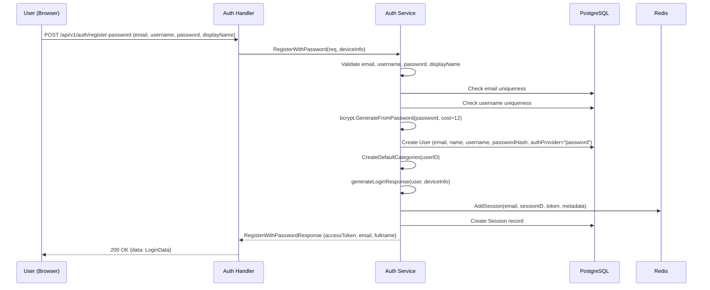

# Username & Password Authentication Implementation Plan

> **For implementation:** Use the secure-feature-pipeline skill, step: implement

**Goal:** Add username/password authentication alongside existing Google OAuth — register, login, account linking, and password change.
**Spec:** `docs/specs/2026-03-16-username-password-auth-spec.md`
**Architecture:** Extend the existing auth system (`domain/auth/auth.go`) with password-based flows. New fields on User model, new proto RPCs, new handler methods, and new frontend forms/pages. Session infrastructure (JWT + Redis + PostgreSQL) is fully reused.
**Tech Stack:** Go (bcrypt from `golang.org/x/crypto`), Protocol Buffers, Next.js, React Hook Form + Zod, Tailwind CSS, i18n (next-intl)

## Security Implementation Notes

- **Password hashing**: bcrypt cost 12, using `golang.org/x/crypto/bcrypt` (already in go.mod)
- **No user enumeration**: Login returns generic "Invalid credentials" for all failure cases
- **Password never in responses**: `PasswordHash` field uses `json:"-"` GORM tag
- **Authorization**: Link/change password endpoints require JWT auth via existing `AuthMiddleware`
- **Input validation**: Server-side validation for all fields (email, username, password strength)
- **Session invalidation**: Password change invalidates all other sessions via Redis + DB cleanup
- **No rate limiting**: Accepted risk per spec (T-5)

## C4 Architecture Diagram Updates

- Update `docs/architecture/c4-component-backend.md`: Add password auth notes to Auth Handler and Auth Service components
- Update `docs/architecture/c4-component-frontend.md`: Add SecuritySettings page, password forms to Auth module

## Runtime Flow Diagram Updates

- Update `docs/architecture/flow-auth.md`: Add 4 new sequence diagrams (password register, password login, account linking, password change)

---

### Task 1: Database Migration — Add Username, PasswordHash, AuthProvider to User Model

**Files:**
- Modify: `src/go-backend/domain/models/user.go`
- Create: `src/go-backend/cmd/migrate-password-auth/main.go`
- Modify: `Taskfile.yml` (add migration task)

**Security notes:** `PasswordHash` must have `json:"-"` tag to prevent leaking in any API response. `Username` gets a unique index.

**Step 1: Update User model**
Add three new fields to `models.User`:
```go
Username     *string        `gorm:"size:30;uniqueIndex" json:"username,omitempty"`
PasswordHash string         `gorm:"size:255" json:"-"`
AuthProvider string         `gorm:"size:20;default:'google';not null" json:"authProvider"`
```
- `Username` is pointer to `*string` for nullable unique index support
- `PasswordHash` uses `json:"-"` — NEVER exposed in API responses
- `AuthProvider`: "google", "password", "google+password"

**Step 2: Create migration file**
Create `src/go-backend/cmd/migrate-password-auth/main.go` following pattern from `migrate-admin/main.go`:
- `ALTER TABLE "user" ADD COLUMN IF NOT EXISTS username VARCHAR(30)`
- `CREATE UNIQUE INDEX IF NOT EXISTS idx_user_username ON "user"(username) WHERE username IS NOT NULL` (partial unique index — only enforce uniqueness on non-null)
- `ALTER TABLE "user" ADD COLUMN IF NOT EXISTS password_hash VARCHAR(255)`
- `ALTER TABLE "user" ADD COLUMN IF NOT EXISTS auth_provider VARCHAR(20) NOT NULL DEFAULT 'google'`
- Verify columns exist with `information_schema` query

**Step 3: Add Taskfile entry**
```yaml
backend:migrate-password-auth:
  desc: "Add username, password_hash, auth_provider columns to user table"
  dir: src/go-backend
  cmds:
    - go run cmd/migrate-password-auth/main.go
```

**Step 4: Commit**

---

### Task 2: Update Validators — Add Username and Password Strength Validators

**Files:**
- Modify: `src/go-backend/pkg/validator/validator.go`

**Security notes:** Username must be alphanumeric + underscore only (no XSS vectors). Password strength: min 10 chars, 1 upper, 1 lower, 1 digit, 1 special char per spec.

**Step 1: Add Username validator**
```go
var usernameRegex = regexp.MustCompile(`^[a-zA-Z0-9_]+$`)

func Username(username string) error {
    if username == "" {
        return apperrors.NewValidationError("username is required")
    }
    if len(username) < 3 {
        return apperrors.NewValidationError("username must be at least 3 characters")
    }
    if len(username) > 30 {
        return apperrors.NewValidationError("username must be at most 30 characters")
    }
    if !usernameRegex.MatchString(username) {
        return apperrors.NewValidationError("username can only contain letters, numbers, and underscores")
    }
    return nil
}
```

**Step 2: Add StrongPassword validator**
Update existing `PasswordWithConstraints` or add new `StrongPassword` function:
```go
func StrongPassword(password string) error {
    return StrongPasswordWithConstraints(password, 10, 72)
}

func StrongPasswordWithConstraints(password string, minLen, maxLen int) error {
    // Min 10 chars, max 72 (bcrypt limit)
    // Must have: 1 uppercase, 1 lowercase, 1 digit, 1 special character
    // Returns specific validation errors
}
```
Note: bcrypt truncates at 72 bytes — max length set to 72 per spec edge case.

**Step 3: Commit**

---

### Task 3: Proto API Definitions — Add Password Auth RPCs and Messages

**Files:**
- Modify: `api/protobuf/v1/auth.proto`

**Security notes:** Password fields are request-only — never in responses. Response messages reuse `LoginData` for consistency.

**Step 1: Add new RPCs to AuthService**
```protobuf
// Register with email/username/password
rpc RegisterWithPassword(RegisterWithPasswordRequest) returns (RegisterWithPasswordResponse) {
  option (google.api.http) = {
    post: "/api/v1/auth/register-password"
    body: "*"
  };
}

// Login with email-or-username + password
rpc LoginWithPassword(LoginWithPasswordRequest) returns (LoginWithPasswordResponse) {
  option (google.api.http) = {
    post: "/api/v1/auth/login-password"
    body: "*"
  };
}

// Link username/password to existing account (authenticated)
rpc LinkPassword(LinkPasswordRequest) returns (LinkPasswordResponse) {
  option (google.api.http) = {
    post: "/api/v1/auth/link-password"
    body: "*"
  };
}

// Change password (authenticated)
rpc ChangePassword(ChangePasswordRequest) returns (ChangePasswordResponse) {
  option (google.api.http) = {
    post: "/api/v1/auth/change-password"
    body: "*"
  };
}

// Get auth methods for current user (authenticated)
rpc GetAuthMethods(GetAuthMethodsRequest) returns (GetAuthMethodsResponse) {
  option (google.api.http) = {
    get: "/api/v1/auth/methods"
  };
}
```

**Step 2: Add new messages**
```protobuf
message RegisterWithPasswordRequest {
  string email = 1 [json_name = "email"];
  string username = 2 [json_name = "username"];
  string password = 3 [json_name = "password"];
  string display_name = 4 [json_name = "displayName"];
}

message RegisterWithPasswordResponse {
  bool success = 1 [json_name = "success"];
  string message = 2 [json_name = "message"];
  LoginData data = 3 [json_name = "data"];
  string timestamp = 4 [json_name = "timestamp"];
}

message LoginWithPasswordRequest {
  string identifier = 1 [json_name = "identifier"];
  string password = 2 [json_name = "password"];
}

message LoginWithPasswordResponse {
  bool success = 1 [json_name = "success"];
  string message = 2 [json_name = "message"];
  LoginData data = 3 [json_name = "data"];
  string timestamp = 4 [json_name = "timestamp"];
}

message LinkPasswordRequest {
  string username = 1 [json_name = "username"];
  string password = 2 [json_name = "password"];
}

message LinkPasswordResponse {
  bool success = 1 [json_name = "success"];
  string message = 2 [json_name = "message"];
  string timestamp = 3 [json_name = "timestamp"];
}

message ChangePasswordRequest {
  string current_password = 1 [json_name = "currentPassword"];
  string new_password = 2 [json_name = "newPassword"];
}

message ChangePasswordResponse {
  bool success = 1 [json_name = "success"];
  string message = 2 [json_name = "message"];
  string timestamp = 3 [json_name = "timestamp"];
}

message GetAuthMethodsRequest {}

message GetAuthMethodsResponse {
  bool success = 1 [json_name = "success"];
  string message = 2 [json_name = "message"];
  AuthMethods data = 3 [json_name = "data"];
  string timestamp = 4 [json_name = "timestamp"];
}

message AuthMethods {
  bool has_google = 1 [json_name = "hasGoogle"];
  bool has_password = 2 [json_name = "hasPassword"];
  string username = 3 [json_name = "username"];
  string email = 4 [json_name = "email"];
}
```

**Step 3: Update User message**
Add `username` and `authProvider` fields:
```protobuf
message User {
  // ... existing fields ...
  string username = 11 [json_name = "username"];
  string authProvider = 12 [json_name = "authProvider"];
}
```

**Step 4: Generate code**
```bash
task proto:all
```

**Step 5: Verify build**
```bash
cd src/go-backend && go build ./...
```

**Step 6: Commit**

---

### Task 4: User Repository — Add GetByUsername Method

**Files:**
- Modify: `src/go-backend/domain/service/interfaces.go` (UserRepository interface)
- Modify: `src/go-backend/domain/repository/user_repository.go` (implementation)

**Security notes:** Username lookup must use parameterized queries (GORM default).

**Step 1: Add to UserRepository interface**
```go
GetByUsername(ctx context.Context, username string) (*models.User, error)
```

**Step 2: Implement in user_repository.go**
```go
func (r *userRepository) GetByUsername(ctx context.Context, username string) (*models.User, error) {
    var user models.User
    result := r.db.GetDB().WithContext(ctx).Where("username = ?", username).First(&user)
    if result.Error != nil {
        return nil, r.handleDBError(result.Error, "user")
    }
    return &user, nil
}
```

**Step 3: Commit**

---

### Task 5: Auth Service — Password Register, Login, Link, Change Methods

**Files:**
- Modify: `src/go-backend/domain/auth/auth.go`

**Security notes:**
- bcrypt cost 12 for hashing
- Generic "Invalid credentials" error for login failures (no enumeration)
- Password change invalidates all other sessions
- Never log plaintext passwords

**Step 1: Add bcrypt import and helper functions**
```go
import "golang.org/x/crypto/bcrypt"

const bcryptCost = 12

func hashPassword(password string) (string, error) {
    hash, err := bcrypt.GenerateFromPassword([]byte(password), bcryptCost)
    if err != nil {
        return "", fmt.Errorf("failed to hash password: %w", err)
    }
    return string(hash), nil
}

func checkPassword(hash, password string) bool {
    return bcrypt.CompareHashAndPassword([]byte(hash), []byte(password)) == nil
}
```

**Step 2: Add RegisterWithPassword method**
```go
func (s *Server) RegisterWithPassword(ctx context.Context, req *authv1.RegisterWithPasswordRequest, deviceInfo *redis.SessionData) (*authv1.RegisterWithPasswordResponse, error)
```
Flow:
1. Validate email, username, password (using validators), display name
2. Check email uniqueness → "Email already registered"
3. Check username uniqueness → "Username already taken"
4. Hash password with bcrypt cost 12
5. Create user with: Email, Name (displayName), Username, PasswordHash, AuthProvider="password"
6. Create default categories
7. Generate login response (JWT + session) via `generateLoginResponse`
8. Return `RegisterWithPasswordResponse` with `LoginData`

**Step 3: Add LoginWithPassword method**
```go
func (s *Server) LoginWithPassword(ctx context.Context, req *authv1.LoginWithPasswordRequest, deviceInfo *redis.SessionData) (*authv1.LoginWithPasswordResponse, error)
```
Flow:
1. Determine if identifier is email (contains `@`) or username
2. Look up user by email or username
3. If not found → generic "Invalid credentials"
4. If user has no password set → generic "Invalid credentials"
5. Compare bcrypt hash → if no match, generic "Invalid credentials"
6. Generate login response via `generateLoginResponse`
7. Return `LoginWithPasswordResponse`

**Step 4: Add LinkPassword method**
```go
func (s *Server) LinkPassword(ctx context.Context, userID int32, req *authv1.LinkPasswordRequest) (*authv1.LinkPasswordResponse, error)
```
Flow:
1. Get user by ID
2. If user already has PasswordHash set → error "Password already set"
3. Validate username and password
4. Check username uniqueness
5. Hash password
6. Update user: Username, PasswordHash, AuthProvider → append "+password" if was "google"
7. Return success

**Step 5: Add ChangePassword method**
```go
func (s *Server) ChangePassword(ctx context.Context, userID int32, email string, req *authv1.ChangePasswordRequest, currentSessionID string) (*authv1.ChangePasswordResponse, error)
```
Flow:
1. Get user by ID
2. If no PasswordHash set → error "No password set"
3. Verify current password with bcrypt
4. Validate new password strength
5. Check new password differs from current
6. Hash new password
7. Update user PasswordHash
8. Invalidate all other sessions (Redis + DB) except `currentSessionID`
9. Return success

**Step 6: Add GetAuthMethods method**
```go
func (s *Server) GetAuthMethods(ctx context.Context, userID int32) (*authv1.GetAuthMethodsResponse, error)
```
Flow:
1. Get user by ID
2. Build `AuthMethods`: hasGoogle (AuthProvider contains "google"), hasPassword (PasswordHash != ""), username, email
3. Return response

**Step 7: Update userDataToProto to include Username and AuthProvider**
```go
func userDataToProto(data *UserData) *authv1.User {
    // ... existing fields ...
    // Add: Username, AuthProvider
}
```

**Step 8: Commit**

---

### Task 6: Auth Handlers — HTTP Endpoints for Password Auth

**Files:**
- Modify: `src/go-backend/handlers/auth.go`

**Security notes:** Register/login are public (no auth). Link/change/methods require `AuthMiddleware`. Extract `user_id` and `user_email` from gin context (set by middleware).

**Step 1: Add RegisterWithPassword handler**
```go
func (h *AuthHandlers) RegisterWithPassword(c *gin.Context)
```
- Bind JSON → `RegisterWithPasswordRequest`
- Extract device info
- Call `authSrv.RegisterWithPassword()`
- Return JSON response

**Step 2: Add LoginWithPassword handler**
```go
func (h *AuthHandlers) LoginWithPassword(c *gin.Context)
```
- Bind JSON → `LoginWithPasswordRequest`
- Extract device info
- Call `authSrv.LoginWithPassword()`
- Return JSON response

**Step 3: Add LinkPassword handler**
```go
func (h *AuthHandlers) LinkPassword(c *gin.Context)
```
- Extract `user_id` from context (set by AuthMiddleware)
- Bind JSON → `LinkPasswordRequest`
- Call `authSrv.LinkPassword(userID, req)`
- Return JSON response

**Step 4: Add ChangePassword handler**
```go
func (h *AuthHandlers) ChangePassword(c *gin.Context)
```
- Extract `user_id` and `user_email` from context
- Extract `sessionID` from JWT token in Authorization header
- Bind JSON → `ChangePasswordRequest`
- Call `authSrv.ChangePassword(userID, email, req, sessionID)`
- Return JSON response

**Step 5: Add GetAuthMethods handler**
```go
func (h *AuthHandlers) GetAuthMethods(c *gin.Context)
```
- Extract `user_id` from context
- Call `authSrv.GetAuthMethods(userID)`
- Return JSON response

**Step 6: Commit**

---

### Task 7: Route Registration — Wire New Endpoints

**Files:**
- Modify: `src/go-backend/handlers/routes.go`

**Security notes:** Register/login are in public group. Link/change/methods are in protected group with `AuthMiddleware`.

**Step 1: Add public auth routes**
In the existing `authGroup`:
```go
authGroup.POST("/register-password", h.Auth.RegisterWithPassword)
authGroup.POST("/login-password", h.Auth.LoginWithPassword)
```

**Step 2: Add protected auth routes**
In the existing `authProtected` group:
```go
authProtected.POST("/link-password", h.Auth.LinkPassword)
authProtected.POST("/change-password", h.Auth.ChangePassword)
authProtected.GET("/methods", h.Auth.GetAuthMethods)
```

**Step 3: Commit**

---

### Task 8: Update Google OAuth Flow — Set AuthProvider for Existing Users

**Files:**
- Modify: `src/go-backend/domain/auth/auth.go`

**Security notes:** Ensure Google OAuth registration sets `AuthProvider = "google"`. Handle edge case where Google login finds a user who registered with password using the same email.

**Step 1: Update RegisterWithDevice**
When creating a new user via Google OAuth, set `AuthProvider = "google"`.

**Step 2: Update edge case handling**
When Google OAuth login finds existing user:
- If user's AuthProvider is "password" → update to "google+password" (auto-link Google)
- If user's AuthProvider is "google" → no change
- If user's AuthProvider is "google+password" → no change

**Step 3: Commit**

---

### Task 9: i18n Translation Keys — Add Auth and Security Translations

**Files:**
- Modify: `src/wj-client/messages/en/auth.json`
- Modify: `src/wj-client/messages/vi/auth.json`
- Modify: `src/wj-client/messages/en/settings.json`
- Modify: `src/wj-client/messages/vi/settings.json`

**Step 1: Add English auth translations**
Add to `messages/en/auth.json` under `auth`:
```json
{
  "login": {
    // ... existing keys ...
    "emailOrUsername": "Email or Username",
    "emailOrUsernamePlaceholder": "Enter your email or username",
    "password": "Password",
    "passwordPlaceholder": "Enter your password",
    "signIn": "Sign In",
    "orDivider": "OR",
    "invalidCredentials": "Invalid email/username or password",
    "showPassword": "Show password",
    "hidePassword": "Hide password"
  },
  "register": {
    // ... existing keys ...
    "email": "Email",
    "emailPlaceholder": "Enter your email",
    "username": "Username",
    "usernamePlaceholder": "Choose a username",
    "displayName": "Display Name",
    "displayNamePlaceholder": "Enter your display name",
    "password": "Password",
    "passwordPlaceholder": "Create a password",
    "confirmPassword": "Confirm Password",
    "confirmPasswordPlaceholder": "Re-enter your password",
    "createAccount": "Create Account",
    "orDivider": "OR",
    "emailTaken": "Email already registered",
    "usernameTaken": "Username already taken",
    "passwordRequirements": "Min 10 characters: 1 uppercase, 1 lowercase, 1 number, 1 special character",
    "passwordsDoNotMatch": "Passwords do not match"
  }
}
```

**Step 2: Add English security settings translations**
Add to `messages/en/settings.json` under `settings`:
```json
{
  "security": {
    "title": "Security",
    "authMethods": "Authentication Methods",
    "googleLinked": "Google Account Linked",
    "passwordSet": "Password Set",
    "notSet": "Not Set",
    "linked": "Linked",
    "setPassword": "Set Password",
    "changePassword": "Change Password",
    "username": "Username",
    "currentPassword": "Current Password",
    "newPassword": "New Password",
    "confirmNewPassword": "Confirm New Password",
    "passwordChanged": "Password changed successfully. All other sessions have been logged out.",
    "passwordLinked": "Password and username set successfully",
    "currentPasswordPlaceholder": "Enter your current password",
    "newPasswordPlaceholder": "Enter your new password",
    "confirmNewPasswordPlaceholder": "Re-enter your new password",
    "usernamePlaceholder": "Choose a username",
    "passwordPlaceholder": "Create a password",
    "confirmPasswordPlaceholder": "Re-enter your password"
  },
  "passwordStrength": {
    "weak": "Weak",
    "medium": "Medium",
    "strong": "Strong",
    "veryStrong": "Very Strong"
  }
}
```

**Step 3: Add Vietnamese translations (same structure)**

**Step 4: Commit**

---

### Task 10: Frontend — PasswordInput Component with Show/Hide Toggle

**Files:**
- Create: `src/wj-client/features/auth/components/PasswordInput.tsx`

**Security notes:** Password field must default to `type="password"`. Show/hide toggle for usability.

**Step 0: Component inventory check**
- Reusing: `FormInput` (base input with floating label, icons, error/success states)
- Creating new: `PasswordInput` — wraps `FormInput` with show/hide toggle icon

**Step 1: Create PasswordInput component**
```typescript
"use client";

import { useState } from "react";
import { FormInput, FormInputProps } from "@/components/forms/FormInput";
import { EyeIcon, EyeOffIcon } from "@/components/icons/ui"; // or inline SVG
```

Props: extends `FormInputProps`, adds nothing extra.
- Wraps `FormInput` with `type={showPassword ? "text" : "password"}`
- Right icon toggles between eye/eye-off icons
- `onRightIconClick` toggles `showPassword` state
- `autoComplete="new-password"` for register, `autoComplete="current-password"` for login

**Step 2: Commit**

---

### Task 11: Frontend — PasswordStrengthIndicator Component

**Files:**
- Create: `src/wj-client/features/auth/components/PasswordStrengthIndicator.tsx`

**Step 1: Create strength calculation utility**
Strength levels based on criteria met:
- 0-1 criteria: Weak (red)
- 2 criteria: Medium (orange)
- 3 criteria: Strong (yellow-green)
- 4+ criteria (all + length > 12): Very Strong (green)

Criteria: uppercase, lowercase, digit, special char, length >= 10

**Step 2: Create PasswordStrengthIndicator component**
Visual: 4-segment bar + text label. Color-coded per strength level. Uses i18n for labels.

**Step 3: Commit**

---

### Task 12: Frontend — RegisterPasswordForm

**Files:**
- Create: `src/wj-client/features/auth/forms/RegisterPasswordForm.tsx`

**Security notes:** Client-side validation with Zod before submission. Server-side validation is the real gate.

**Step 0: Component inventory check**
- Reusing: `FormInput`, `Button`, `LoadingSpinner`
- Reusing new: `PasswordInput`, `PasswordStrengthIndicator`
- Using: `useMutationRegisterWithPassword` (generated hook)

**Step 1: Create Zod validation schema**
```typescript
const registerSchema = z.object({
  email: z.string().email("Invalid email").max(100),
  username: z.string().min(3).max(30).regex(/^[a-zA-Z0-9_]+$/, "Letters, numbers, and underscores only"),
  displayName: z.string().min(1).max(50),
  password: z.string().min(10).max(72),
  confirmPassword: z.string(),
}).refine(data => data.password === data.confirmPassword, {
  message: "Passwords do not match",
  path: ["confirmPassword"],
});
```

**Step 2: Create form component**
- Uses `react-hook-form` with `zodResolver`
- Fields: email, username, displayName, password (with PasswordInput), confirmPassword (with PasswordInput)
- Password field shows `PasswordStrengthIndicator`
- Submit calls `useMutationRegisterWithPassword`
- On success: store token in localStorage, dispatch Redux setAuth, redirect to dashboard
- On error: display server error message
- Loading state on submit button

**Step 3: Commit**

---

### Task 13: Frontend — LoginPasswordForm

**Files:**
- Create: `src/wj-client/features/auth/forms/LoginPasswordForm.tsx`

**Security notes:** Error message must be generic "Invalid credentials" — no enumeration hints.

**Step 1: Create Zod validation schema**
```typescript
const loginSchema = z.object({
  identifier: z.string().min(1, "Required"),
  password: z.string().min(1, "Required"),
});
```

**Step 2: Create form component**
- Fields: identifier (email or username), password (with PasswordInput)
- Submit calls `useMutationLoginWithPassword`
- On success: same token/Redux/redirect flow as Google OAuth login
- On error: display generic "Invalid credentials" message
- Loading state on submit button

**Step 3: Commit**

---

### Task 14: Frontend — Update Login Page

**Files:**
- Modify: `src/wj-client/app/[locale]/auth/login/page.tsx`

**Step 1: Import LoginPasswordForm**
```typescript
import { LoginPasswordForm } from "@/features/auth/forms/LoginPasswordForm";
```

**Step 2: Update layout**
New order (top to bottom):
1. Logo + Title + Subtitle (existing)
2. `LoginPasswordForm` (NEW)
3. "OR" divider with horizontal lines
4. Google OAuth button (existing, moved down)
5. "New to congdongvang.com?" link (existing)
6. Terms footer (existing)

**Step 3: Style the "OR" divider**
```tsx
<div className="flex items-center gap-3 my-4">
  <div className="flex-1 h-px bg-neutral-300" />
  <span className="text-sm text-neutral-500">{t("login.orDivider")}</span>
  <div className="flex-1 h-px bg-neutral-300" />
</div>
```

**Step 4: Commit**

---

### Task 15: Frontend — Update Register Page

**Files:**
- Modify: `src/wj-client/app/[locale]/auth/register/page.tsx`

**Step 1: Import RegisterPasswordForm**

**Step 2: Update layout**
New order (top to bottom):
1. Logo + Title + Subtitle (existing)
2. `RegisterPasswordForm` (NEW)
3. "OR" divider with horizontal lines
4. Google OAuth button (existing, moved down)
5. Feature highlights (existing)
6. "Already have an account?" link (existing)
7. Terms footer (existing)

**Step 3: Commit**

---

### Task 16: Frontend — LinkPasswordForm

**Files:**
- Create: `src/wj-client/features/auth/forms/LinkPasswordForm.tsx`

**Step 1: Create Zod schema**
```typescript
const linkPasswordSchema = z.object({
  username: z.string().min(3).max(30).regex(/^[a-zA-Z0-9_]+$/),
  password: z.string().min(10).max(72),
  confirmPassword: z.string(),
}).refine(data => data.password === data.confirmPassword, {
  path: ["confirmPassword"],
});
```

**Step 2: Create form component**
- Fields: username, password (with PasswordInput + PasswordStrengthIndicator), confirmPassword
- Submit calls `useMutationLinkPassword`
- On success: show success message, invalidate auth methods query
- On error: display error

**Step 3: Commit**

---

### Task 17: Frontend — ChangePasswordForm

**Files:**
- Create: `src/wj-client/features/auth/forms/ChangePasswordForm.tsx`

**Step 1: Create Zod schema**
```typescript
const changePasswordSchema = z.object({
  currentPassword: z.string().min(1, "Required"),
  newPassword: z.string().min(10).max(72),
  confirmNewPassword: z.string(),
}).refine(data => data.newPassword === data.confirmNewPassword, {
  path: ["confirmNewPassword"],
});
```

**Step 2: Create form component**
- Fields: currentPassword, newPassword (with strength indicator), confirmNewPassword
- Submit calls `useMutationChangePassword`
- On success: show success message + "All other sessions logged out" notice
- On error: display error (e.g., "Current password is incorrect")

**Step 3: Commit**

---

### Task 18: Frontend — AuthMethodsCard Component

**Files:**
- Create: `src/wj-client/features/auth/components/AuthMethodsCard.tsx`

**Step 0: Component inventory check**
- Reusing: `BaseCard`

**Step 1: Create AuthMethodsCard**
- Fetches auth methods via `useQueryGetAuthMethods`
- Displays:
  - Google OAuth status (linked/not linked) with green/gray badge
  - Password status (set/not set) with green/gray badge
  - Username (if set)
- Actions:
  - If no password: "Set Password" button → opens `LinkPasswordForm`
  - If has password: "Change Password" button → opens `ChangePasswordForm`

**Step 2: Commit**

---

### Task 19: Frontend — Security Settings Page

**Files:**
- Create: `src/wj-client/app/[locale]/dashboard/settings/security/page.tsx`

**Step 1: Create SecuritySettings page**
```typescript
"use client";

// Layout:
// 1. Page title: "Security" (h1)
// 2. AuthMethodsCard
// 3. Conditional form section:
//    - If password not set: LinkPasswordForm
//    - If password set and user clicks "Change Password": ChangePasswordForm
```

**Step 2: Commit**

---

### Task 20: Frontend — Settings Navigation Link to Security Page

**Files:**
- Modify: `src/wj-client/app/[locale]/dashboard/settings/page.tsx` (add link to security)

**Step 1: Add navigation link**
On the main settings page, add a link/card to `/dashboard/settings/security` alongside the existing language selector and sessions link.

**Step 2: Commit**

---

### Task 21: Update C4 Architecture Diagrams

**Files:**
- Modify: `docs/architecture/c4-component-backend.md`
- Modify: `docs/architecture/c4-component-frontend.md`

**Step 1: Update backend C4 diagram**
- Auth Handler: note dual auth support (Google OAuth + email/password)
- Auth Service: note bcrypt password hashing, session invalidation on password change

**Step 2: Update frontend C4 diagram**
- Auth Feature Module: add PasswordInput, RegisterPasswordForm, LoginPasswordForm, LinkPasswordForm, ChangePasswordForm, AuthMethodsCard, PasswordStrengthIndicator
- Settings: add Security page

**Step 3: Commit**

---

### Task 22: Update Runtime Flow Diagrams

**Files:**
- Modify: `docs/architecture/flow-auth.md`

**Step 1: Add Password Registration sequence diagram**


**Step 2: Add Password Login sequence diagram**

**Step 3: Add Account Linking sequence diagram**

**Step 4: Add Password Change sequence diagram (including session invalidation)**

**Step 5: Add Key Invariants and Error Paths tables**

**Step 6: Commit**

---

### Task 23: Backend Build Verification & Integration Test

**Files:**
- No new files — verification only

**Step 1: Build backend**
```bash
cd src/go-backend && go build ./...
```

**Step 2: Build frontend**
```bash
cd src/wj-client && npm run build
```

**Step 3: Fix any compilation errors**

**Step 4: Commit (if fixes needed)**

---

## Task Dependency Graph

```
Task 1 (DB Migration) ─────┐
Task 2 (Validators) ───────┤
Task 3 (Proto) ────────────┤
                            ├──→ Task 4 (Repository) ──→ Task 5 (Auth Service) ──→ Task 6 (Handlers) ──→ Task 7 (Routes) ──→ Task 8 (OAuth Update)
                            │
Task 9 (i18n) ─────────────┤
Task 10 (PasswordInput) ───┤
Task 11 (StrengthIndicator) ┤
                            ├──→ Task 12 (RegisterForm) ──→ Task 15 (Register Page)
                            ├──→ Task 13 (LoginForm) ──→ Task 14 (Login Page)
                            ├──→ Task 16 (LinkForm) ──→ Task 18 (AuthMethodsCard) ──→ Task 19 (Security Page) ──→ Task 20 (Settings Nav)
                            ├──→ Task 17 (ChangeForm) ──┘
                            │
Task 21 (C4 Diagrams) ─────┤ (independent, can run anytime)
Task 22 (Flow Diagrams) ───┤ (after implementation complete)
Task 23 (Build Verification) ── (final step)
```

**Parallel groups:**
- **Group A (independent):** Tasks 1, 2, 3, 9, 10, 11, 21
- **Group B (after proto + model):** Tasks 4, 5, 6, 7, 8
- **Group C (frontend forms, after i18n + components):** Tasks 12, 13, 16, 17
- **Group D (frontend pages, after forms):** Tasks 14, 15, 18, 19, 20
- **Group E (final):** Tasks 22, 23
