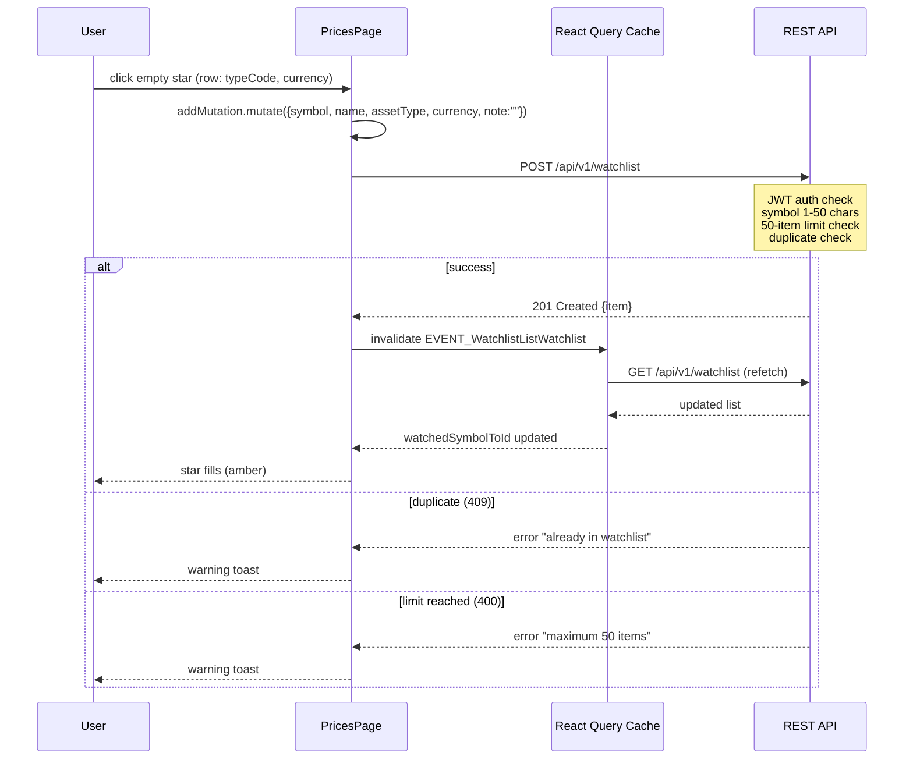
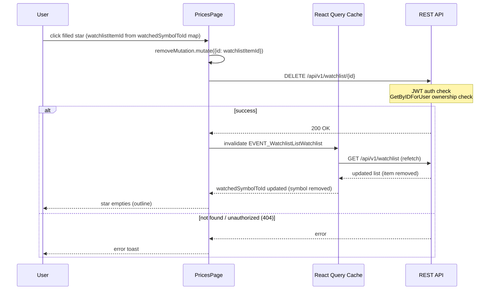

# Watchlist Star Toggle in Price Tables — Implementation Plan

> **For implementation:** Use the secure-feature-pipeline skill, step: implement

**Goal:** Add a star icon toggle to every row in the Gold, Silver, and Currency price tables — clicking an empty star adds the item to the watchlist instantly (no modal); clicking a filled star removes it.

**Spec:** `docs/specs/2026-03-24-watchlist-star-toggle-spec.md`

**Architecture:** Pure frontend change — no new backend endpoints, no proto changes, no database migrations. The feature adds a `StarToggleButton` inline component in `page.tsx`, a new `buildColumns` callback parameter to pass `watchedSymbols` and `watchedSymbolIds`, and two mutation calls (`useMutationCreateWatchlistItem`, `useMutationDeleteWatchlistItem`). React Query deduplicates `useQueryListWatchlist` between `WatchlistTab` and `PricesPage` — no refactoring of `WatchlistTab` needed.

**Tech Stack:** Next.js 15, React 19, TypeScript, TanStack Table, Tailwind CSS, React Query

## Security Implementation Notes

- Authentication: Star mutations use the same authenticated `/api/v1/watchlist` endpoints — JWT middleware already applied server-side.
- Authorization: Delete uses `id` from the server-returned watchlist item — server performs `GetByIDForUser` ownership check.
- Input validation: All `symbol`/`name`/`currency` values originate from server-returned `PriceItem` — not user-typed text. `assetType` is hardcoded per tab. No new input surface.
- XSS: All values rendered via JSX (escaped by React). No `dangerouslySetInnerHTML`.
- Double-click protection: Star button disabled while mutation `isPending`.

## Component Reuse Inventory

**Existing components to reuse:**

| Component | Location | Usage in This Feature |
|-----------|----------|-----------------------|
| `useQueryListWatchlist` | `@/utils/generated/hooks` | Build watched symbol Set + symbol→ID Map at page level |
| `useMutationCreateWatchlistItem` | `@/utils/generated/hooks` | Add to watchlist on empty-star click |
| `useMutationDeleteWatchlistItem` | `@/utils/generated/hooks` | Remove from watchlist on filled-star click |
| `useNotification` | `@/contexts/NotificationContext` | Show error toasts on mutation failure |
| `EVENT_WatchlistListWatchlist` | `@/utils/generated/hooks` | Cache key for invalidation after add/remove |
| Inline SVG star icons | — | Consistent with codebase pattern (no lucide star) |

**New components needed:**

| Component | Location | Justification |
|-----------|----------|---------------|
| `StarToggleButton` | Inline in `page.tsx` (top-level function, not exported) | Only used in this file; extracting to `features/watchlist/` would create a dependency on `PricesPage`-level state (tab type, mutation handlers). Small enough (~40 lines) to inline. |

## C4 Architecture Diagram Updates

Per spec: no structural changes. `StarToggleButton` is a sub-component within `PricesPage`, not a new feature module. **No C4 diagram updates needed.**

---

### Task 0: Add Translation Keys

**Files:**
- Modify: `src/wj-client/messages/en/investment.json`
- Modify: `src/wj-client/messages/vi/investment.json`

**Security notes:** None — translation strings only.

**Step 1: Add keys to English file**

Under `prices.watchlist`, add after existing keys:
```json
"starAdd": "Add to watchlist",
"starRemove": "Remove from watchlist",
"addedToWatchlist": "Added to watchlist",
"removedFromWatchlist": "Removed from watchlist"
```

**Step 2: Add keys to Vietnamese file**

Under `prices.watchlist`, add after existing keys:
```json
"starAdd": "Thêm vào danh sách theo dõi",
"starRemove": "Xóa khỏi danh sách theo dõi",
"addedToWatchlist": "Đã thêm vào danh sách theo dõi",
"removedFromWatchlist": "Đã xóa khỏi danh sách theo dõi"
```

**Step 3: Verify TypeScript compilation**
```bash
cd src/wj-client && npx tsc --noEmit
```

**Step 4: Commit**
```
feat(watchlist): add star toggle translation keys (en + vi)
```

---

### Task 1: Add StarToggleButton and Watchlist State to PricesPage

**Files:**
- Modify: `src/wj-client/app/[locale]/dashboard/prices/page.tsx`

**Security notes:**
- `symbol`, `name`, `currency` values come from server-returned `PriceItem` — never from user input
- `assetType` is hardcoded per tab (gold=8, silver=10, currency=7) — no user control
- `id` for delete comes from server-returned watchlist item — server validates ownership

**Step 0: Component inventory check**

Existing icons pattern: inline SVG (see `ChangeCell` in `page.tsx` line 51-63). No lucide-react star in icons directory found. Confirmed: use inline SVG for consistency.

LoadingSpinner: `@/components/loading/LoadingSpinner` — usable but too large for a table cell. Use inline spinning SVG (same pattern as `DeleteButton` in `WatchlistTab.tsx` line 89-102).

**Step 1: Write the TypeScript interfaces / types**

At top of `page.tsx`, add after existing imports:

```typescript
import {
  useQueryListWatchlist,
  useMutationCreateWatchlistItem,
  useMutationDeleteWatchlistItem,
  EVENT_WatchlistListWatchlist,
} from "@/utils/generated/hooks";
import { InvestmentType } from "@/gen/protobuf/v1/investment";
import { useNotification } from "@/contexts/NotificationContext";
```

Note: `InvestmentType` is already imported in `page.tsx` (line 19). Do not duplicate.
Note: `EVENT_WatchlistListWatchlist` is already imported in `page.tsx` (line 17). Do not duplicate.
Note: `useQueryListWatchlist`, `useMutationCreateWatchlistItem`, `useMutationDeleteWatchlistItem` need to be added to the existing import from `@/utils/generated/hooks`.

**Step 2: Add `StarToggleButton` component (above `PricesPage`)**

```typescript
// ─── Star Toggle Button ────────────────────────────────────────────────────────

interface StarToggleButtonProps {
  symbol: string;
  name: string;
  assetType: InvestmentType;
  currency: string;
  watchlistItemId: number | undefined; // undefined = not in watchlist
  onAddSuccess: () => void;
  onRemoveSuccess: () => void;
}

function StarToggleButton({
  symbol,
  name,
  assetType,
  currency,
  watchlistItemId,
  onAddSuccess,
  onRemoveSuccess,
}: StarToggleButtonProps) {
  const tw = useTranslations("prices.watchlist");
  const { toast } = useNotification();

  const addMutation = useMutationCreateWatchlistItem({
    onSuccess: () => {
      onAddSuccess();
    },
    onError: (error: { message: string }) => {
      const msg = error.message ?? "";
      const lower = msg.toLowerCase();
      if (lower.includes("already") || lower.includes("duplicate")) {
        toast.warning(tw("form.errors.alreadyInWatchlist"));
      } else if (lower.includes("maximum") || lower.includes("limit")) {
        toast.warning(tw("form.errors.limitReached"));
      } else {
        toast.error(tw("form.errors.failedToAdd"));
      }
    },
  });

  const removeMutation = useMutationDeleteWatchlistItem({
    onSuccess: () => {
      onRemoveSuccess();
    },
    onError: () => {
      toast.error(tw("form.errors.failedToAdd"));
    },
  });

  const isInWatchlist = watchlistItemId !== undefined;
  const isPending = addMutation.isPending || removeMutation.isPending;

  const handleClick = () => {
    if (isPending) return;
    if (isInWatchlist) {
      removeMutation.mutate({ id: watchlistItemId });
    } else {
      addMutation.mutate({ symbol, name, assetType, currency, note: "" });
    }
  };

  return (
    <button
      type="button"
      onClick={handleClick}
      disabled={isPending}
      aria-label={isInWatchlist ? tw("starRemove") : tw("starAdd")}
      aria-pressed={isInWatchlist}
      className={`flex items-center justify-center min-w-[44px] min-h-[44px] rounded transition-colors duration-150 focus:outline-none focus:ring-2 focus:ring-v2-gold-primary disabled:cursor-not-allowed ${
        isInWatchlist
          ? "text-amber-400 hover:text-amber-500"
          : "text-v2-text-tertiary hover:text-v2-gold-accent"
      }`}
    >
      {isPending ? (
        // Inline spinner (matches WatchlistTab pattern)
        <svg
          className="w-4 h-4 animate-spin"
          fill="none"
          viewBox="0 0 24 24"
          stroke="currentColor"
          aria-hidden="true"
        >
          <path
            strokeLinecap="round"
            strokeLinejoin="round"
            strokeWidth={2}
            d="M4 4v5h.582m15.356 2A8.001 8.001 0 004.582 9m0 0H9m11 11v-5h-.581m0 0a8.003 8.003 0 01-15.357-2m15.357 2H15"
          />
        </svg>
      ) : isInWatchlist ? (
        // Filled star
        <svg className="w-4 h-4" viewBox="0 0 24 24" fill="currentColor" aria-hidden="true">
          <path d="M12 2l3.09 6.26L22 9.27l-5 4.87 1.18 6.88L12 17.77l-6.18 3.25L7 14.14 2 9.27l6.91-1.01L12 2z" />
        </svg>
      ) : (
        // Outline star
        <svg className="w-4 h-4" viewBox="0 0 24 24" fill="none" stroke="currentColor" strokeWidth={1.5} aria-hidden="true">
          <path strokeLinecap="round" strokeLinejoin="round" d="M12 2l3.09 6.26L22 9.27l-5 4.87 1.18 6.88L12 17.77l-6.18 3.25L7 14.14 2 9.27l6.91-1.01L12 2z" />
        </svg>
      )}
    </button>
  );
}
```

**Step 3: Add watchlist state to `PricesPage`**

Inside `PricesPage` component, after the existing `useQueryGetMarketPrices` call, add:

```typescript
// Watchlist state for star toggles
const watchlistQuery = useQueryListWatchlist(
  {},
  { staleTime: 60 * 1000 }, // 1 min stale — React Query deduplicates with WatchlistTab's own query
);
const watchedItems = watchlistQuery.data?.items ?? [];

// O(1) lookup: symbol → watchlist item ID (undefined = not watched)
const watchedSymbolToId = useMemo(
  () => new Map<string, number>(watchedItems.map((item) => [item.symbol, item.id])),
  [watchedItems],
);

const handleStarAddSuccess = () => {
  queryClient.invalidateQueries({ queryKey: [EVENT_WatchlistListWatchlist] });
};

const handleStarRemoveSuccess = () => {
  queryClient.invalidateQueries({ queryKey: [EVENT_WatchlistListWatchlist] });
};
```

**Step 4: Update `buildTanstackColumns` to accept star props**

Change the function signature:

```typescript
function buildTanstackColumns(
  t: (key: string) => string,
  tab: Tab,
  isAdmin: boolean,
  watchedSymbolToId?: Map<string, number>,
  onStarAddSuccess?: () => void,
  onStarRemoveSuccess?: () => void,
)
```

Inside `buildTanstackColumns`, after the `isAdmin` admin column block, add the star column **for gold/silver/currency tabs only**:

```typescript
if (tab === "gold" || tab === "silver" || tab === "currency") {
  const assetType =
    tab === "gold"
      ? InvestmentType.INVESTMENT_TYPE_GOLD_VND
      : tab === "silver"
        ? InvestmentType.INVESTMENT_TYPE_SILVER_VND
        : InvestmentType.INVESTMENT_TYPE_OTHER;

  cols.push(
    columnHelper.display({
      id: "star",
      header: "",
      cell: ({ row }) => (
        <StarToggleButton
          symbol={row.original.typeCode}
          name={row.original.name || row.original.typeCode}
          assetType={assetType}
          currency={row.original.currency}
          watchlistItemId={watchedSymbolToId?.get(row.original.typeCode)}
          onAddSuccess={onStarAddSuccess ?? (() => {})}
          onRemoveSuccess={onStarRemoveSuccess ?? (() => {})}
        />
      ),
    }),
  );
}
```

**Step 5: Update `buildMobileColumns` similarly**

Change signature:
```typescript
function buildMobileColumns(
  t: (key: string) => string,
  tab: Tab,
  isAdmin: boolean,
  watchedSymbolToId?: Map<string, number>,
  onStarAddSuccess?: () => void,
  onStarRemoveSuccess?: () => void,
): MobileColumnDef<PriceItem>[]
```

After the `isAdmin` mobile column block, add:
```typescript
if (tab === "gold" || tab === "silver" || tab === "currency") {
  const assetType =
    tab === "gold"
      ? InvestmentType.INVESTMENT_TYPE_GOLD_VND
      : tab === "silver"
        ? InvestmentType.INVESTMENT_TYPE_SILVER_VND
        : InvestmentType.INVESTMENT_TYPE_OTHER;

  cols.push({
    id: "star",
    header: "",
    cell: ({ row }) => (
      <StarToggleButton
        symbol={row.typeCode}
        name={row.name || row.typeCode}
        assetType={assetType}
        currency={row.currency}
        watchlistItemId={watchedSymbolToId?.get(row.typeCode)}
        onAddSuccess={onStarAddSuccess ?? (() => {})}
        onRemoveSuccess={onStarRemoveSuccess ?? (() => {})}
      />
    ),
  });
}
```

**Step 6: Update `useMemo` calls in `PricesPage`**

Update both memoized column builders to pass the new arguments:

```typescript
const tanstackColumns = useMemo(
  () =>
    buildTanstackColumns(
      t as (key: string) => string,
      activeTab,
      isAdmin,
      watchedSymbolToId,
      handleStarAddSuccess,
      handleStarRemoveSuccess,
    ),
  [t, activeTab, isAdmin, watchedSymbolToId],
);

const mobileColumns = useMemo(
  () =>
    buildMobileColumns(
      t as (key: string) => string,
      activeTab,
      isAdmin,
      watchedSymbolToId,
      handleStarAddSuccess,
      handleStarRemoveSuccess,
    ),
  [t, activeTab, isAdmin, watchedSymbolToId],
);
```

**Step 7: TypeScript check**
```bash
cd src/wj-client && npx tsc --noEmit
```
Expected: zero errors.

**Step 8: Production build check**
```bash
cd src/wj-client && npm run build
```
Expected: successful build.

**Step 9: Commit**
```
feat(watchlist): add star toggle to gold/silver/currency price tables
```

---

### Task 2: Update Runtime Flow Diagrams

**Files:**
- Modify: `docs/architecture/flow-watchlist.md`

**Steps:**

**Step 1: Read the existing flow file**
```bash
Read docs/architecture/flow-watchlist.md
```

**Step 2: Add two new sequence diagrams at the end of the file**

```markdown
## Quick-Add via Star Icon (Gold/Silver/Currency Table)

> Trigger: User clicks empty star on a price table row
> Source: `src/wj-client/app/[locale]/dashboard/prices/page.tsx` — `StarToggleButton`



**Key Invariants:**
- Symbol and name values originate from server price data — never user-typed text
- assetType is hardcoded per tab (gold=GOLD_VND, silver=SILVER_VND, currency=OTHER)
- note is always empty string — no user input

**Error Paths:**

| Condition | Response | User Feedback |
|-----------|----------|---------------|
| 409 Duplicate | `alreadyInWatchlist` error | Warning toast |
| 400 Limit reached | `limitReached` error | Warning toast |
| Network error | Generic error | Error toast |

---

## Quick-Remove via Star Icon (Gold/Silver/Currency Table)

> Trigger: User clicks filled star on a price table row
> Source: `src/wj-client/app/[locale]/dashboard/prices/page.tsx` — `StarToggleButton`



**Key Invariants:**
- Item ID is sourced from server-returned watchlist data — not user-supplied
- Server performs ownership check (GetByIDForUser) before deletion

**Error Paths:**

| Condition | Response | User Feedback |
|-----------|----------|---------------|
| 404 Not found | Error | Error toast |
| Network error | Generic error | Error toast |
```

**Step 3: Commit**
```
docs(watchlist): add star toggle quick-add/remove flow diagrams
```

---

### Task 3: Final Verification

**Steps:**

**Step 1: TypeScript check (zero errors)**
```bash
cd src/wj-client && npx tsc --noEmit
```

**Step 2: Production build (zero errors)**
```bash
cd src/wj-client && npm run build
```

**Step 3: Manual testing checklist**

1. Open `/dashboard/prices` → Gold tab
2. **Empty star**: Click star on any gold row → star fills amber immediately after refetch
3. **Already in watchlist**: Click same star again immediately → fills again (deduped server-side toast)
4. **Filled star**: Click filled star → star empties after refetch
5. **Silver tab**: Same toggle behavior
6. **Currency tab**: Same toggle behavior
7. **Watchlist tab**: Star not shown (WatchlistTab renders its own delete UI)
8. **Symbol Lookup tab**: Star not shown (existing "Add to Watchlist" button)
9. **Loading state**: Rapidly click star → button disabled during pending (spinner shown)
10. **50-item limit**: When at limit, clicking empty star shows warning toast

**Step 4: Commit (if any fixes)**
```
fix(watchlist): star toggle verification fixes
```
