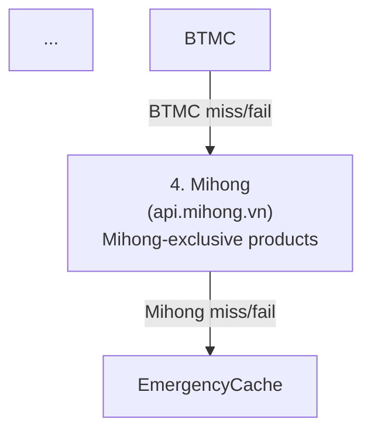

# Mihong Gold Source — Implementation Plan

> **For implementation:** Use the secure-feature-pipeline skill, step: implement

**Goal:** Add `api.mihong.vn` as a 4th gold price source so `Mihong_999` lookups succeed when all other sources are down, and fix two missing `aliasToCanonical` entries (`SJ9999`, `SJL1L10`) to eliminate stale-cache warnings for `Vàng nhẫn SJC`.

**Spec:** `docs/specs/2026-03-25-mihong-gold-source-spec.md`

**Architecture:** New `pkg/mihong` package mirrors `pkg/btmc` — typed HTTP client, 1 MB limit, zero-price guard, `x-market: mihong` header. A new `gold_fetcher_mihong.go` adapter implements `GoldPriceFetcher` and is appended to the `NewGoldPriceService` waterfall. No new config, no DB changes, no proto changes, no frontend changes.

**Tech Stack:** Go stdlib only (`net/http`, `encoding/json`, `context`, `io`, `time`). No new module dependencies.

---

## Security Implementation Notes

- **Authentication:** Mihong endpoint is public (no API key). No credentials to manage.
- **Authorization:** Price data is public; no user data flows out.
- **Input validation:** `buyingPrice` / `sellingPrice` must be > 0 (drop entry otherwise). `code` must be non-empty. Response body capped at 1 MB via `io.LimitReader`.
- **Data sanitization:** All price conversions are integer arithmetic (multiply by 10, no float accumulation). `dateTime` parse failure falls back to `time.Time{}` (non-fatal).
- **TLS:** `api.mihong.vn` is HTTPS — Go default TLS verification applies automatically.
- **Timeout:** 5-second context deadline prevents slow-loris stall.

---

## Component Reuse Inventory (Frontend Tasks)

No frontend changes.

---

## C4 Architecture Diagram Updates

Per spec §Architecture Changes:
- **`docs/architecture/c4-context.md`** — add "Mi Hồng Price API" external system.
- **`docs/architecture/c4-component-backend.md`** — add `pkg/mihong` in pkg layer; update GoldPriceService description to show 4-source chain.

---

### Task 0: Update C4 Architecture Diagrams

**Files:**
- Modify: `docs/architecture/c4-context.md`
- Modify: `docs/architecture/c4-component-backend.md`

**Security notes:** Documentation only — no security implications.

**Step 1: Update `c4-context.md`**

Add "Mi Hồng Price API" as an external system in the L1 context diagram:
```
Ext_Sys(mihong, "Mi Hồng Price API", "api.mihong.vn — GET /v1/gold-prices?market=domestic\nHTTPS, header: x-market:mihong")
Rel(backend, mihong, "Fetches Mihong-exclusive gold prices", "HTTPS/JSON (fallback #4)")
```

**Step 2: Update `c4-component-backend.md`**

In the pkg layer, add:
```
Component(mihong, "pkg/mihong", "Go Package", "HTTP client for api.mihong.vn.\nMaps code→canonical TypeCode, multiplies per-mace price ×10 to per-lượng.")
```

Update GoldPriceService description to reference 4-source waterfall:
`"vangsaigon → vang.today → BTMC (conditional) → Mihong"`

**Step 3: Commit**
```
git add docs/architecture/c4-context.md docs/architecture/c4-component-backend.md
git commit -m "docs(architecture): add Mihong Price API to C4 context and backend component diagrams"
```

---

### Task 1: Fix `aliasToCanonical` — Add `SJ9999` and `SJL1L10` Aliases

**Files:**
- Modify: `src/go-backend/domain/service/price_fetcher.go` (lines 35-38, `aliasToCanonical` map)
- Test (already written — red): `src/go-backend/domain/service/price_fetcher_test.go`
  - `TestWaterfallGoldFetcher_AllSources_SJ9999AliasNormalization`
  - `TestWaterfallGoldFetcher_AllSources_SJL1L10AliasNormalization`

**Security notes:** Alias map is static, in-memory. No injection surface. Canonical TypeCodes are controlled values from `pkg/gold/types.go`.

**Step 1: Tests already written (red phase)**

Two TDD tests already added to `price_fetcher_test.go`:
- `TestWaterfallGoldFetcher_AllSources_SJ9999AliasNormalization` — expects `TypeCode:"Vàng nhẫn SJC"` after normalization of `SJ9999`
- `TestWaterfallGoldFetcher_AllSources_SJL1L10AliasNormalization` — expects `TypeCode:"SJC"` after normalization of `SJL1L10`

**Step 2: Verify tests are red**
```bash
cd src/go-backend && go test -run "TestWaterfallGoldFetcher_AllSources_SJ9999" ./domain/service/... -v
cd src/go-backend && go test -run "TestWaterfallGoldFetcher_AllSources_SJL1L10" ./domain/service/... -v
```
Expected: FAIL (alias not yet in map).

**Step 3: Implement — add aliases to `aliasToCanonical`**

In `price_fetcher.go`, update the `aliasToCanonical` map:
```go
var aliasToCanonical = map[string]string{
    "VNGSJC":    "SJC",
    "MIHONG_999": "Mihong_999",
    "SJ9999":    "Vàng nhẫn SJC",  // vang.today TypeCode for SJC Ring
    "SJL1L10":   "SJC",            // vang.today TypeCode for SJC 9999
}
```

**Step 4: Verify tests are green**
```bash
cd src/go-backend && go test -run "TestWaterfallGoldFetcher_AllSources_SJ9999" ./domain/service/... -v
cd src/go-backend && go test -run "TestWaterfallGoldFetcher_AllSources_SJL1L10" ./domain/service/... -v
```
Expected: PASS.

**Step 5: Run full service tests to confirm no regression**
```bash
cd src/go-backend && go test -short ./domain/service/... -count=1
```

**Step 6: Commit**
```
git add src/go-backend/domain/service/price_fetcher.go src/go-backend/domain/service/price_fetcher_test.go
git commit -m "fix(price-fallback): add SJ9999→Vàng nhẫn SJC and SJL1L10→SJC aliases"
```

---

### Task 2: Create `pkg/mihong` — Types

**Files:**
- Create: `src/go-backend/pkg/mihong/types.go`

**Security notes:** Plain Go structs for JSON unmarshal. No user data. Field types match JSON schema.

**Step 1: Write test** (in `types_test.go`)

```go
// File: src/go-backend/pkg/mihong/types_test.go
package mihong

import (
    "encoding/json"
    "testing"
)

func TestGoldPriceResponse_Unmarshal(t *testing.T) {
    raw := `[{"buyingPrice":17150000,"sellingPrice":17500000,"code":"999","dateTime":"25/03/2026 13:23","sellChange":0,"buyChange":0,"buyChangePercent":0,"sellChangePercent":0}]`
    var resp []GoldPriceResponse
    if err := json.Unmarshal([]byte(raw), &resp); err != nil {
        t.Fatalf("unmarshal: %v", err)
    }
    if len(resp) != 1 {
        t.Fatalf("expected 1 entry, got %d", len(resp))
    }
    if resp[0].Code != "999" {
        t.Errorf("code: want 999, got %s", resp[0].Code)
    }
    if resp[0].BuyingPrice != 17_150_000 {
        t.Errorf("buyingPrice: want 17150000, got %f", resp[0].BuyingPrice)
    }
}
```

**Step 2: Verify test is red**
```bash
cd src/go-backend && go test ./pkg/mihong/... -v 2>&1 | head -20
```
Expected: compile error (package does not exist yet).

**Step 3: Implement `types.go`**

```go
// Package mihong provides an HTTP client for the Mi Hồng (Mihong) gold price API.
package mihong

// GoldPriceResponse is one entry in the array returned by
// GET https://api.mihong.vn/v1/gold-prices?market=domestic
// with header x-market: mihong.
type GoldPriceResponse struct {
    BuyingPrice        float64 `json:"buyingPrice"`
    SellingPrice       float64 `json:"sellingPrice"`
    Code               string  `json:"code"`
    SellChange         float64 `json:"sellChange"`
    BuyChange          float64 `json:"buyChange"`
    BuyChangePercent   float64 `json:"buyChangePercent"`
    SellChangePercent  float64 `json:"sellChangePercent"`
    DateTime           string  `json:"dateTime"`
}

// GoldPrice is the normalized output of the Mihong client.
// Buy and Sell are in VND per lượng (10 mace = 1 lượng).
// The raw Mihong API prices are per mace; the client multiplies by 10.
type GoldPrice struct {
    TypeCode   string
    Name       string
    Buy        int64     // VND per lượng, full VND (not ×1000)
    Sell       int64     // VND per lượng, full VND
    Currency   string    // always "VND"
    UpdateTime time.Time
}
```
(Add `"time"` import.)

**Step 4: Verify test is green**
```bash
cd src/go-backend && go test ./pkg/mihong/... -v
```

**Step 5: Commit** (combine with Task 3 below — commit after client is complete)

---

### Task 3: Create `pkg/mihong` — HTTP Client

**Files:**
- Create: `src/go-backend/pkg/mihong/client.go`
- Create: `src/go-backend/pkg/mihong/client_test.go`

**Security notes:**
- `x-market: mihong` header required — include on every request.
- `io.LimitReader(resp.Body, MaxBodySize+1)` prevents memory exhaustion.
- Context with deadline (caller provides) for timeout.
- Drop entries where `buyingPrice <= 0 || sellingPrice <= 0` (T-1 mitigation).
- `code` → canonical TypeCode: `"999"` → `"Mihong_999"`, etc. (done inline in client, not via alias map).
- `dateTime` parsed with `time.ParseInLocation` using `"Asia/Ho_Chi_Minh"` timezone; parse failure = `time.Time{}` (non-fatal).
- Prices multiplied by 10 (per mace → per lượng) — int64 arithmetic only.

**Step 1: Write `client_test.go` (TDD — all tests red)**

```go
// File: src/go-backend/pkg/mihong/client_test.go
package mihong

import (
    "context"
    "fmt"
    "net/http"
    "net/http/httptest"
    "strings"
    "testing"
    "time"
)

func TestClient_FetchGoldPrices_ValidResponse(t *testing.T) {
    srv := httptest.NewServer(http.HandlerFunc(func(w http.ResponseWriter, r *http.Request) {
        if r.Header.Get("x-market") != "mihong" {
            t.Errorf("missing x-market header")
        }
        w.Header().Set("Content-Type", "application/json")
        fmt.Fprint(w, `[{"buyingPrice":17150000,"sellingPrice":17500000,"code":"999","dateTime":"25/03/2026 13:23"}]`)
    }))
    defer srv.Close()

    c := &Client{httpClient: &http.Client{}, baseURL: srv.URL}
    prices, err := c.FetchGoldPrices(context.Background())
    if err != nil {
        t.Fatalf("unexpected error: %v", err)
    }
    if len(prices) != 1 {
        t.Fatalf("expected 1 price, got %d", len(prices))
    }
    p := prices[0]
    if p.TypeCode != "Mihong_999" {
        t.Errorf("TypeCode: want Mihong_999, got %s", p.TypeCode)
    }
    // 17_150_000 per mace × 10 = 171_500_000 per lượng
    if p.Buy != 171_500_000 {
        t.Errorf("Buy: want 171500000, got %d", p.Buy)
    }
    if p.Sell != 175_000_000 {
        t.Errorf("Sell: want 175000000, got %d", p.Sell)
    }
    if p.Currency != "VND" {
        t.Errorf("Currency: want VND, got %s", p.Currency)
    }
}

func TestClient_FetchGoldPrices_HTTP500(t *testing.T) {
    srv := httptest.NewServer(http.HandlerFunc(func(w http.ResponseWriter, r *http.Request) {
        w.WriteHeader(http.StatusInternalServerError)
    }))
    defer srv.Close()

    c := &Client{httpClient: &http.Client{}, baseURL: srv.URL}
    _, err := c.FetchGoldPrices(context.Background())
    if err == nil {
        t.Fatal("expected error for HTTP 500")
    }
}

func TestClient_FetchGoldPrices_ZeroPriceDropped(t *testing.T) {
    srv := httptest.NewServer(http.HandlerFunc(func(w http.ResponseWriter, r *http.Request) {
        fmt.Fprint(w, `[
            {"buyingPrice":0,"sellingPrice":17500000,"code":"SJC","dateTime":"25/03/2026 13:23"},
            {"buyingPrice":17150000,"sellingPrice":0,"code":"985","dateTime":"25/03/2026 13:23"},
            {"buyingPrice":17150000,"sellingPrice":17500000,"code":"999","dateTime":"25/03/2026 13:23"}
        ]`)
    }))
    defer srv.Close()

    c := &Client{httpClient: &http.Client{}, baseURL: srv.URL}
    prices, err := c.FetchGoldPrices(context.Background())
    if err != nil {
        t.Fatalf("unexpected error: %v", err)
    }
    if len(prices) != 1 {
        t.Fatalf("expected 1 price (zero/neg dropped), got %d", len(prices))
    }
    if prices[0].TypeCode != "Mihong_999" {
        t.Errorf("wrong TypeCode: %s", prices[0].TypeCode)
    }
}

func TestClient_FetchGoldPrices_BodyExceedsLimit(t *testing.T) {
    srv := httptest.NewServer(http.HandlerFunc(func(w http.ResponseWriter, r *http.Request) {
        w.Header().Set("Content-Type", "application/json")
        // Write > 1 MB
        big := strings.Repeat("x", MaxBodySize+1)
        fmt.Fprintf(w, "[%q]", big)
    }))
    defer srv.Close()

    c := &Client{httpClient: &http.Client{}, baseURL: srv.URL}
    _, err := c.FetchGoldPrices(context.Background())
    if err == nil {
        t.Fatal("expected error for body exceeding limit")
    }
}

func TestClient_FetchGoldPrices_Timeout(t *testing.T) {
    srv := httptest.NewServer(http.HandlerFunc(func(w http.ResponseWriter, r *http.Request) {
        // simulate slow server
        select {
        case <-r.Context().Done():
        case <-time.After(10 * time.Second):
        }
    }))
    defer srv.Close()

    ctx, cancel := context.WithTimeout(context.Background(), 50*time.Millisecond)
    defer cancel()

    c := &Client{httpClient: &http.Client{}, baseURL: srv.URL}
    _, err := c.FetchGoldPrices(ctx)
    if err == nil {
        t.Fatal("expected timeout error")
    }
}
```

**Step 2: Verify tests are red**
```bash
cd src/go-backend && go test ./pkg/mihong/... -v 2>&1 | head -30
```
Expected: compile error (Client not defined).

**Step 3: Implement `client.go`**

```go
// Package mihong provides an HTTP client for the Mi Hồng gold price API.
//
// Security notes:
//   - Endpoint: HTTPS (api.mihong.vn) — Go default TLS certificate verification applies.
//   - Requires header: x-market: mihong (no API key needed — public endpoint).
//   - Response body limited to 1 MB via io.LimitReader (T-3 mitigation).
//   - Timeout is propagated via context; callers must provide a context with deadline.
//   - Entries with zero or negative buyingPrice or sellingPrice are dropped (T-1 mitigation).
//   - Prices are in VND per mace (chỉ); adapter multiplies by 10 to get per lượng.
package mihong

import (
    "context"
    "encoding/json"
    "fmt"
    "io"
    "net/http"
    "time"
)

const (
    DefaultBaseURL = "https://api.mihong.vn/v1/gold-prices?market=domestic"
    MaxBodySize    = 1 * 1024 * 1024 // 1 MB
    xMarketHeader  = "mihong"
)

// codeToTypeCode maps Mihong API code strings to canonical TypeCodes.
// These TypeCodes must be consistent with pkg/gold/types.go.
var codeToTypeCode = map[string]string{
    "SJC": "SJC",
    "999": "Mihong_999",
    "985": "Mihong_985",
    "980": "Mihong_980",
    "950": "Mihong_950",
    "750": "Mihong_750",
    "680": "Mihong_680",
    "610": "Mihong_610",
    "580": "Mihong_580",
    "410": "Mihong_410",
}

// codeToName maps Mihong API code strings to display names.
var codeToName = map[string]string{
    "SJC": "SJC 9999",
    "999": "Mi Hồng 999",
    "985": "Mi Hồng 985",
    "980": "Mi Hồng 980",
    "950": "Mi Hồng 950",
    "750": "Mi Hồng 750",
    "680": "Mi Hồng 680",
    "610": "Mi Hồng 610",
    "580": "Mi Hồng 580",
    "410": "Mi Hồng 410",
}

// Client is an HTTP client for the Mihong gold price API.
type Client struct {
    httpClient *http.Client
    baseURL    string
}

// NewClient creates a new Mihong client with the given timeout.
func NewClient(timeout time.Duration) *Client {
    if timeout <= 0 {
        timeout = 5 * time.Second
    }
    return &Client{
        httpClient: &http.Client{Timeout: timeout},
        baseURL:    DefaultBaseURL,
    }
}

// FetchGoldPrices fetches gold prices from the Mihong API.
//
// The caller should pass a context with an appropriate deadline (5 seconds recommended).
// Entries with zero or negative buyingPrice / sellingPrice are silently dropped.
// Raw prices are per mace (chỉ); returned GoldPrice.Buy and .Sell are per lượng (×10).
func (c *Client) FetchGoldPrices(ctx context.Context) ([]*GoldPrice, error) {
    req, err := http.NewRequestWithContext(ctx, http.MethodGet, c.baseURL, nil)
    if err != nil {
        return nil, fmt.Errorf("mihong: create request: %w", err)
    }
    req.Header.Set("x-market", xMarketHeader)

    resp, err := c.httpClient.Do(req)
    if err != nil {
        return nil, fmt.Errorf("mihong: fetch prices: %w", err)
    }
    defer func() { _ = resp.Body.Close() }()

    if resp.StatusCode != http.StatusOK {
        body, _ := io.ReadAll(io.LimitReader(resp.Body, 512))
        return nil, fmt.Errorf("mihong: unexpected status %d: %s", resp.StatusCode, string(body))
    }

    limitedReader := io.LimitReader(resp.Body, MaxBodySize+1)
    body, err := io.ReadAll(limitedReader)
    if err != nil {
        return nil, fmt.Errorf("mihong: read response: %w", err)
    }
    if int64(len(body)) > MaxBodySize {
        return nil, fmt.Errorf("mihong: response body exceeds %d bytes limit", MaxBodySize)
    }

    var raw []GoldPriceResponse
    if err := json.Unmarshal(body, &raw); err != nil {
        return nil, fmt.Errorf("mihong: parse JSON response: %w", err)
    }

    prices := make([]*GoldPrice, 0, len(raw))
    for _, item := range raw {
        if item.Code == "" {
            continue
        }
        if item.BuyingPrice <= 0 || item.SellingPrice <= 0 {
            continue
        }

        typeCode, ok := codeToTypeCode[item.Code]
        if !ok {
            // Unknown code — use Mihong_ prefix for forward compatibility
            typeCode = "Mihong_" + item.Code
        }
        name, ok := codeToName[item.Code]
        if !ok {
            name = "Mi Hồng " + item.Code
        }

        updateTime := parseMihongTimestamp(item.DateTime)

        // Raw price is per mace (chỉ, 1/10 lượng). Multiply by 10 to get per lượng,
        // matching the CachedGoldPrice.Buy convention used by the vang.today adapter.
        buy := int64(item.BuyingPrice) * 10
        sell := int64(item.SellingPrice) * 10

        prices = append(prices, &GoldPrice{
            TypeCode:   typeCode,
            Name:       name,
            Buy:        buy,
            Sell:       sell,
            Currency:   "VND",
            UpdateTime: updateTime,
        })
    }

    return prices, nil
}

// parseMihongTimestamp parses the Mihong datetime format "DD/MM/YYYY HH:MM".
// Returns the zero time if parsing fails (non-fatal).
func parseMihongTimestamp(s string) time.Time {
    if s == "" {
        return time.Time{}
    }
    loc, err := time.LoadLocation("Asia/Ho_Chi_Minh")
    if err != nil {
        loc = time.UTC
    }
    t, err := time.ParseInLocation("02/01/2006 15:04", s, loc)
    if err != nil {
        return time.Time{}
    }
    return t
}
```

**Step 4: Verify tests are green**
```bash
cd src/go-backend && go test ./pkg/mihong/... -v
```
Expected: all 5 tests PASS.

**Step 5: Run full short tests**
```bash
cd src/go-backend && go test -short ./... 2>&1 | tail -20
```

**Step 6: Commit**
```
git add src/go-backend/pkg/mihong/
git commit -m "feat(mihong): add pkg/mihong HTTP client with unit tests"
```

---

### Task 4: Create `gold_fetcher_mihong.go` — Service Adapter

**Files:**
- Create: `src/go-backend/domain/service/gold_fetcher_mihong.go`
- Create: `src/go-backend/domain/service/gold_fetcher_mihong_test.go`

**Security notes:** Adapter only maps struct fields — no new validation surface. `GoldPriceFetcher` interface is already the trust boundary.

**Step 1: Write `gold_fetcher_mihong_test.go` (TDD)**

```go
package service

import (
    "context"
    "errors"
    "testing"

    "wealthjourney/pkg/mihong"
)

type fetchMihongFnTest func(ctx context.Context) ([]*mihong.GoldPrice, error)

func TestMihongGoldFetcher_Source(t *testing.T) {
    f := newMihongGoldFetcherWithStub(func(ctx context.Context) ([]*mihong.GoldPrice, error) {
        return nil, nil
    })
    if f.Source() != SourceMihong {
        t.Errorf("Source(): want %s, got %s", SourceMihong, f.Source())
    }
}

func TestMihongGoldFetcher_FetchGoldPrices_MapsCorrectly(t *testing.T) {
    stub := func(ctx context.Context) ([]*mihong.GoldPrice, error) {
        return []*mihong.GoldPrice{
            {TypeCode: "Mihong_999", Name: "Mi Hồng 999", Buy: 171_500_000, Sell: 175_000_000, Currency: "VND"},
        }, nil
    }
    f := newMihongGoldFetcherWithStub(stub)
    prices, err := f.FetchGoldPrices(context.Background())
    if err != nil {
        t.Fatalf("unexpected error: %v", err)
    }
    if len(prices) != 1 {
        t.Fatalf("expected 1 price, got %d", len(prices))
    }
    p := prices[0]
    if p.TypeCode != "Mihong_999" {
        t.Errorf("TypeCode: want Mihong_999, got %s", p.TypeCode)
    }
    if p.Buy != 171_500_000 {
        t.Errorf("Buy: want 171500000, got %d", p.Buy)
    }
    if p.Currency != "VND" {
        t.Errorf("Currency: want VND, got %s", p.Currency)
    }
}

func TestMihongGoldFetcher_FetchGoldPrices_PropagatesError(t *testing.T) {
    stub := func(ctx context.Context) ([]*mihong.GoldPrice, error) {
        return nil, errors.New("network error")
    }
    f := newMihongGoldFetcherWithStub(stub)
    _, err := f.FetchGoldPrices(context.Background())
    if err == nil {
        t.Fatal("expected error to be propagated")
    }
}
```

**Step 2: Verify tests are red**
```bash
cd src/go-backend && go test -run "TestMihongGoldFetcher" ./domain/service/... -v 2>&1 | head -20
```
Expected: compile error (`SourceMihong` and `mihongGoldFetcher` not defined).

**Step 3: Implement `gold_fetcher_mihong.go`**

```go
package service

import (
    "context"
    "fmt"
    "time"

    "wealthjourney/pkg/mihong"
)

// fetchMihongFn is the function signature for calling the mihong client.
// It allows tests to inject a stub without a real HTTP connection.
type fetchMihongFn func(ctx context.Context) ([]*mihong.GoldPrice, error)

// mihongGoldFetcher implements GoldPriceFetcher backed by the Mihong API.
type mihongGoldFetcher struct {
    fetchGoldPrices fetchMihongFn
}

// NewMihongGoldFetcher constructs a GoldPriceFetcher that calls the Mihong API
// via mihong.Client. No API key required — the Mihong API is public.
func NewMihongGoldFetcher(timeout time.Duration) GoldPriceFetcher {
    client := mihong.NewClient(timeout)
    return &mihongGoldFetcher{
        fetchGoldPrices: client.FetchGoldPrices,
    }
}

// newMihongGoldFetcherWithStub is an internal constructor for tests that
// replaces the real HTTP call with an in-memory function.
func newMihongGoldFetcherWithStub(fn fetchMihongFn) *mihongGoldFetcher {
    return &mihongGoldFetcher{fetchGoldPrices: fn}
}

// Source returns the source identifier for this fetcher.
func (f *mihongGoldFetcher) Source() PriceSource {
    return SourceMihong
}

// FetchGoldPrices calls the Mihong API and maps GoldPrice entries to
// []*CachedGoldPrice. The mihong.Client already multiplies raw prices ×10
// (mace→lượng), so this adapter performs a direct field copy.
//
// Note: Mihong API does not provide buy/sell change data; ChangeBuy and
// ChangeSell are always 0.
func (f *mihongGoldFetcher) FetchGoldPrices(ctx context.Context) ([]*CachedGoldPrice, error) {
    mihongPrices, err := f.fetchGoldPrices(ctx)
    if err != nil {
        return nil, fmt.Errorf("fetch from mihong: %w", err)
    }

    prices := make([]*CachedGoldPrice, 0, len(mihongPrices))
    for _, gp := range mihongPrices {
        prices = append(prices, &CachedGoldPrice{
            TypeCode:   gp.TypeCode,
            Name:       gp.Name,
            Buy:        gp.Buy,
            Sell:       gp.Sell,
            ChangeBuy:  0, // Mihong API does not provide change data
            ChangeSell: 0,
            Currency:   gp.Currency,
            UpdateTime: gp.UpdateTime,
        })
    }

    return prices, nil
}
```

**Step 4: Add `SourceMihong` constant to `price_fetcher.go`**

In `price_fetcher.go`, after the existing `SourceBTMC` constant:
```go
SourceMihong PriceSource = "mihong"
```

**Step 5: Verify tests are green**
```bash
cd src/go-backend && go test -run "TestMihongGoldFetcher" ./domain/service/... -v
```

**Step 6: Run full service tests**
```bash
cd src/go-backend && go test -short ./domain/service/... -count=1
```

**Step 7: Commit**
```
git add src/go-backend/domain/service/gold_fetcher_mihong.go src/go-backend/domain/service/gold_fetcher_mihong_test.go src/go-backend/domain/service/price_fetcher.go
git commit -m "feat(mihong): add MihongGoldFetcher adapter and SourceMihong constant"
```

---

### Task 5: Wire Mihong into `NewGoldPriceService` + End-to-End Test

**Files:**
- Modify: `src/go-backend/domain/service/gold_price_service.go` (`NewGoldPriceService`, append Mihong)
- Modify: `src/go-backend/domain/service/price_fetcher_test.go` (add E2E integration test)

**Security notes:** Mihong is unconditionally appended (no API key guard) — it's the last fallback. Existing health-tracking pattern applies automatically.

**Step 1: Write E2E test (TDD)**

Add to `price_fetcher_test.go`:
```go
// TestWaterfallGoldFetcher_AllSources_MihongFallback verifies that when
// vangsaigon + vang.today + BTMC all fail, the Mihong source provides Mihong_999.
func TestWaterfallGoldFetcher_AllSources_MihongFallback(t *testing.T) {
    failFetcher := func(src PriceSource) *mockGoldFetcher {
        return &mockGoldFetcher{
            source: src,
            err:    errors.New("source down"),
        }
    }
    mihongFetcher := &mockGoldFetcher{
        source: SourceMihong,
        prices: []*CachedGoldPrice{
            {TypeCode: "Mihong_999", Name: "Mi Hồng 999", Buy: 171_500_000, Sell: 175_000_000, Currency: "VND"},
        },
    }

    fetchers := []GoldPriceFetcher{
        failFetcher(SourceVangSaiGon),
        failFetcher(SourceVangToday),
        failFetcher(SourceBTMC),
        mihongFetcher,
    }
    waterfall := NewWaterfallGoldFetcher(fetchers, &alwaysHealthyTracker{})

    allPrices, err := waterfall.FetchGoldPricesAllSources(context.Background())
    if err != nil {
        t.Fatalf("unexpected error: %v", err)
    }

    found := false
    for _, p := range allPrices {
        if p.TypeCode == "Mihong_999" {
            found = true
            break
        }
    }
    if !found {
        t.Error("expected Mihong_999 in all-sources result, got none")
    }
}
```

**Step 2: Verify test is red**
```bash
cd src/go-backend && go test -run "TestWaterfallGoldFetcher_AllSources_MihongFallback" ./domain/service/... -v
```
Expected: FAIL (Mihong not in waterfall yet; possibly compile error if `alwaysHealthyTracker` doesn't exist — check and add if needed).

**Step 3: Wire Mihong into `NewGoldPriceService`**

In `gold_price_service.go`, update `NewGoldPriceService`:
```go
func NewGoldPriceService(redisClient *redis.Client, btmcAPIKey string) GoldPriceService {
    fetchers := []GoldPriceFetcher{
        NewVangSaiGonGoldFetcher(5 * time.Second),
        NewVangTodayGoldFetcher(5 * time.Second),
    }
    if btmcAPIKey != "" {
        btmcFetcher, err := NewBTMCGoldFetcher(5*time.Second, btmcAPIKey)
        if err == nil {
            fetchers = append(fetchers, btmcFetcher)
        } else {
            log.Printf("[goldPriceService] Warning: BTMC fetcher disabled: %v", err)
        }
    }
    // Mihong is always appended — no API key needed (public endpoint).
    fetchers = append(fetchers, NewMihongGoldFetcher(5*time.Second))

    healthTracker := NewSourceHealthCacheAdapter(cache.NewSourceHealthCache(redisClient))

    return &goldPriceService{
        waterfall: NewWaterfallGoldFetcher(fetchers, healthTracker),
        cache:     cache.NewGoldPriceCache(redisClient),
    }
}
```

**Step 4: Verify E2E test is green**
```bash
cd src/go-backend && go test -run "TestWaterfallGoldFetcher_AllSources_MihongFallback" ./domain/service/... -v
```

**Step 5: Run all short tests**
```bash
cd src/go-backend && go test -short ./... -count=1
```
Expected: all PASS.

**Step 6: Build check**
```bash
cd src/go-backend && go build ./...
```

**Step 7: Lint check**
```bash
cd src/go-backend && task ci:backend-lint
```

**Step 8: Commit**
```
git add src/go-backend/domain/service/gold_price_service.go src/go-backend/domain/service/price_fetcher_test.go
git commit -m "feat(mihong): wire MihongGoldFetcher as 4th source in gold price waterfall"
```

---

### Task 6: Update `flow-cross-cutting.md` — Price Fallback Chain

**Files:**
- Modify: `docs/architecture/flow-cross-cutting.md` (§12 Price Fallback Chain)

**Security notes:** Documentation only.

**Step 1: Read current §12 flowchart in `flow-cross-cutting.md`**

**Step 2: Add Mihong as 4th node after BTMC**

Update the waterfall flowchart:


Also update the `FetchPriceForSymbol` alias-map step to show the new aliases:
```
aliasToCanonical:
  VNGSJC → SJC
  MIHONG_999 → Mihong_999
  SJ9999 → Vàng nhẫn SJC  ← NEW
  SJL1L10 → SJC            ← NEW
```

**Step 3: Commit**
```
git add docs/architecture/flow-cross-cutting.md
git commit -m "docs(flow): add Mihong as 4th waterfall node and SJ9999/SJL1L10 aliases to FetchPriceForSymbol diagram"
```

---

### Task 7: Append Fix 5 to Implementation Report

**Files:**
- Modify: `docs/reports/2026-03-25-price-fallback-report.md`

**Security notes:** Documentation only.

**Step 1: Append Fix 5 section**

Add after the last fix entry:
```markdown
## Fix 5: Add Mihong Gold Source + SJ9999/SJL1L10 Aliases (2026-03-25)

### Problem
- `Mihong_999` not found: `vang.today` (the only working fallback) does not carry any Mi Hồng products. Alias `MIHONG_999` was correct but moot — product absent.
- `Vàng nhẫn SJC` stale cache: `vang.today` carries it as `SJ9999` — alias was missing.
- `SJC 9999` via `vang.today` uses `SJL1L10` — also missing.

### Root Cause
Live API curl of `vang.today` confirmed: 12 entries, no Mihong products. `api.mihong.vn/v1/gold-prices?market=domestic` (with `x-market: mihong` header) is Mihong's own public API.

### Fix
1. Added `"SJ9999":"Vàng nhẫn SJC"` and `"SJL1L10":"SJC"` to `aliasToCanonical`.
2. Created `pkg/mihong` — typed HTTP client for `api.mihong.vn` with 1 MB limit, zero-price guard, `x-market: mihong` header, mace→lượng ×10 conversion.
3. Created `domain/service/gold_fetcher_mihong.go` — `GoldPriceFetcher` adapter.
4. Appended `NewMihongGoldFetcher` as 4th source in `NewGoldPriceService` waterfall.

### Files Changed
- `domain/service/price_fetcher.go` — aliases added, `SourceMihong` constant
- `domain/service/gold_fetcher_mihong.go` — new adapter
- `domain/service/gold_fetcher_mihong_test.go` — unit tests
- `domain/service/gold_price_service.go` — wired 4th source
- `domain/service/price_fetcher_test.go` — SJ9999/SJL1L10/Mihong E2E tests
- `pkg/mihong/types.go`, `pkg/mihong/client.go`, `pkg/mihong/client_test.go` — new package
- `docs/architecture/c4-context.md`, `c4-component-backend.md`, `flow-cross-cutting.md`
```

**Step 2: Commit**
```
git add docs/reports/2026-03-25-price-fallback-report.md
git commit -m "docs(price-fallback): add Fix 5 to implementation report"
```

---

## Task Execution Order

```
Task 0  →  Task 1  →  Task 2 + 3 (sequential: types then client)  →  Task 4  →  Task 5  →  Task 6  →  Task 7
(C4 docs)  (aliases)  (pkg/mihong)                                    (adapter)  (wire)     (flow docs)  (report)
```

Tasks 0, 1 are independent and can run in parallel with Tasks 2+3 if using worktrees (different file sets). In the main branch, execute sequentially in the order above to keep commits coherent.

---

## Verification Checklist (Pre-Review)

- [ ] `go test -short ./...` — all pass
- [ ] `go build ./...` — compiles clean
- [ ] `task ci:backend-lint` — no violations
- [ ] `SourceMihong` constant exists in `price_fetcher.go`
- [ ] `aliasToCanonical` has 4 entries including `SJ9999` and `SJL1L10`
- [ ] `pkg/mihong` package has `client.go`, `types.go`, `client_test.go`
- [ ] `gold_fetcher_mihong.go` implements `GoldPriceFetcher`
- [ ] `NewGoldPriceService` appends Mihong fetcher unconditionally
- [ ] C4 context diagram updated with Mihong external system
- [ ] C4 backend component diagram updated with `pkg/mihong`
- [ ] `flow-cross-cutting.md` §12 shows 4-node waterfall
- [ ] `docs/reports/2026-03-25-price-fallback-report.md` has Fix 5 section
