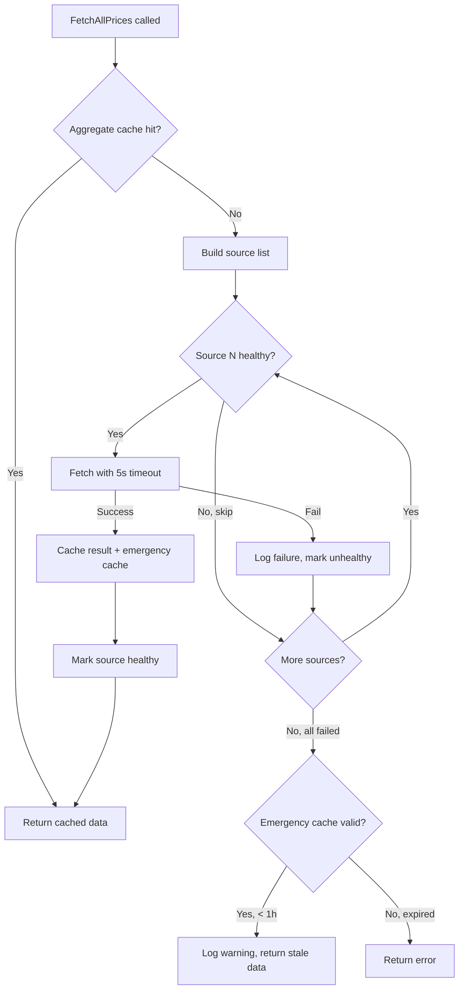

# Gold & Currency Price Fallback System — Implementation Plan

> **For implementation:** Use the secure-feature-pipeline skill, step: implement

**Goal:** Add a multi-source waterfall fallback chain for gold and currency prices so the system degrades gracefully when the primary vangsaigon.vn API is down.

**Spec:** `docs/specs/2026-03-25-price-fallback-spec.md`

**Architecture:** The gold and currency price services currently depend on a single external API (`vangsaigon.vn` via the `pkg/vnprice` client). This plan adds two new price clients (`pkg/vangtoday` for vang.today JSON API, `pkg/btmc` for BTMC XML API), a `PriceFetcher` interface for source abstraction, waterfall fallback logic in the existing `goldPriceService` and `currencyPriceService`, source health tracking in Redis, and an emergency stale cache as a last resort.

**Tech Stack:** Go 1.25 (standard library only — `encoding/xml`, `context`, `net/http`), Redis 7

## Security Implementation Notes

- **Authentication:** No changes — `GET /api/v1/investments/market-prices` remains JWT-authenticated
- **Authorization:** No changes — price data is public (same for all users)
- **Input validation:** All external API responses are validated: JSON schema for vang.today, XML structure limits for BTMC, price range checks (reject zero/negative), response body size limits (1 MB)
- **Data sanitization:** BTMC XML parsed with `xml.Decoder` + max token size limit to prevent XML bomb (billion laughs). Response body read limited to 1 MB via `io.LimitReader`
- **API key security:** BTMC API key stored in `BTMC_API_KEY` environment variable, never hardcoded
- **Observability:** Every source attempt logged with source name, success/failure, latency, error details

## Component Reuse Inventory (Frontend Tasks)

**No frontend changes.** The API response format is identical regardless of which source provides data.

## C4 Architecture Diagram Updates

Per spec section "Architecture Changes":
- **L1 Context (`c4-context.md`):** Add "vang.today Price API" and "BTMC Price API" as external systems
- **L3 Backend Components (`c4-component-backend.md`):** Update GoldPriceService/CurrencyPriceService to show fallback chain; add `btmc` and `vangtoday` packages

## Runtime Flow Diagram Updates

Per spec section "Runtime Flow Diagrams":
- **`flow-investment.md`:** Update "market price update" sequence to show fallback chain
- **`flow-cross-cutting.md`:** Add "Price Fallback Chain" flowchart showing waterfall decision logic, health check bypass, emergency cache path

---

### Task 0: Update C4 Architecture Diagrams

**Files:**
- Modify: `docs/architecture/c4-context.md`
- Modify: `docs/architecture/c4-component-backend.md`

**Security notes:** Documentation only — no runtime impact.

**Steps:**

1. Read current `c4-context.md` and add `vang.today Price API` and `BTMC Price API` as external systems connected to WealthJourney
2. Read current `c4-component-backend.md` and update GoldPriceService/CurrencyPriceService dependencies to show the 3-source fallback chain; add `pkg/vangtoday` and `pkg/btmc` in the infrastructure layer
3. Commit diagram changes

---

### Task 1: Create `PriceFetcher` Interface and Source Abstraction

**Files:**
- Create: `src/go-backend/domain/service/price_fetcher.go`
- Test: `src/go-backend/domain/service/price_fetcher_test.go`

**Security notes:** Interface only — no external calls. Ensure the interface contract requires `context.Context` for timeout propagation.

**Step 1: Write the failing test**

Create a test that verifies the `WaterfallFetcher` tries sources in order and falls back when one fails. Test with mock `PriceFetcher` implementations that return errors or valid data.

Test cases:
- Primary succeeds → returns primary data, no fallback attempted
- Primary fails → secondary tried and succeeds
- All fail → returns aggregated error
- Source marked unhealthy → skipped
- At least one source always tried (never skip all)

**Step 2: Run test to verify it fails**
```bash
cd src/go-backend && go test -run TestWaterfallFetcher ./domain/service/...
```

**Step 3: Write minimal implementation**

```go
// price_fetcher.go

// PriceSource identifies a price data source.
type PriceSource string

const (
    SourceVangSaiGon PriceSource = "vangsaigon"
    SourceVangToday  PriceSource = "vangtoday"
    SourceBTMC       PriceSource = "btmc"
)

// GoldPriceFetcher abstracts fetching gold prices from a single source.
type GoldPriceFetcher interface {
    FetchGoldPrices(ctx context.Context) ([]*CachedGoldPrice, error)
    Source() PriceSource
}

// CurrencyPriceFetcher abstracts fetching currency prices from a single source.
type CurrencyPriceFetcher interface {
    FetchCurrencyPrices(ctx context.Context) ([]*CachedCurrencyPrice, error)
    Source() PriceSource
}

// WaterfallGoldFetcher tries multiple GoldPriceFetchers in priority order.
type WaterfallGoldFetcher struct {
    fetchers     []GoldPriceFetcher
    healthTracker SourceHealthTracker
}

// WaterfallCurrencyFetcher tries multiple CurrencyPriceFetchers in priority order.
type WaterfallCurrencyFetcher struct {
    fetchers     []CurrencyPriceFetcher
    healthTracker SourceHealthTracker
}

// SourceHealthTracker tracks which sources are healthy.
type SourceHealthTracker interface {
    IsHealthy(ctx context.Context, source PriceSource) bool
    MarkUnhealthy(ctx context.Context, source PriceSource) error
}
```

The `WaterfallGoldFetcher.Fetch()` method:
1. Iterates fetchers in order
2. Skips sources marked unhealthy (unless it's the last one — at least one must be tried)
3. For each source: call with 5-second context timeout
4. On failure: log source name, error, duration; mark unhealthy; continue to next
5. On success: return data
6. All fail: return combined error

**Step 4: Run test to verify it passes**
```bash
cd src/go-backend && go test -run TestWaterfallFetcher ./domain/service/...
```

**Step 5: Commit**

---

### Task 2: Create Source Health Tracker (Redis-backed)

**Files:**
- Create: `src/go-backend/pkg/cache/source_health_cache.go`
- Test: `src/go-backend/pkg/cache/source_health_cache_test.go`

**Security notes:** Health status is a simple boolean flag in Redis. No sensitive data. TTL prevents permanent lockout (self-healing).

**Step 1: Write the failing test**

Test cases:
- Fresh source is healthy (no key in Redis)
- After `MarkUnhealthy`: source reports unhealthy
- After TTL expires (2 minutes): source reports healthy again
- Redis nil/error: returns healthy (fail-open)

**Step 2: Run test to verify it fails**
```bash
cd src/go-backend && go test -run TestSourceHealthCache ./pkg/cache/...
```

**Step 3: Write minimal implementation**

```go
// source_health_cache.go

const (
    SourceHealthKeyPrefix = "price_source_health"
    SourceHealthTTL       = 2 * time.Minute
)

type SourceHealthCache struct {
    client *redis.Client
}

func NewSourceHealthCache(client *redis.Client) *SourceHealthCache

// IsHealthy returns true if the source is NOT marked as unhealthy.
// Returns true on Redis errors (fail-open — never block all sources).
func (c *SourceHealthCache) IsHealthy(ctx context.Context, source string) bool

// MarkUnhealthy marks a source as unhealthy with a 2-minute TTL.
func (c *SourceHealthCache) MarkUnhealthy(ctx context.Context, source string) error
```

Redis keys: `price_source_health:vangsaigon`, `price_source_health:vangtoday`, `price_source_health:btmc`

**Step 4: Run test to verify it passes**

**Step 5: Commit**

---

### Task 3: Create Emergency Cache (1-Hour Stale Data)

**Files:**
- Modify: `src/go-backend/pkg/cache/gold_price_cache.go`
- Modify: `src/go-backend/pkg/cache/currency_price_cache.go`
- Test: `src/go-backend/pkg/cache/gold_price_cache_test.go` (add emergency cache tests)
- Test: `src/go-backend/pkg/cache/currency_price_cache_test.go` (add emergency cache tests)

**Security notes:** Emergency cache contains the same data as regular cache, just with longer TTL. No user-specific data. Price data is public.

**Step 1: Write the failing test**

Test cases:
- `SetEmergency` stores data with 1-hour TTL
- `GetEmergency` retrieves data when regular cache is expired
- `GetEmergency` returns nil after 1-hour TTL expires
- `SetEmergency` is updated on every successful fetch

**Step 2: Run test to verify it fails**
```bash
cd src/go-backend && go test -run TestEmergencyCache ./pkg/cache/...
```

**Step 3: Write minimal implementation**

Add to `GoldPriceCache`:
```go
const (
    EmergencyGoldCacheTTL    = 1 * time.Hour
    emergencyGoldKey         = "gold_price:emergency"
)

func (c *GoldPriceCache) SetEmergency(ctx context.Context, prices []*CachedGoldPrice) error
func (c *GoldPriceCache) GetEmergency(ctx context.Context) ([]*CachedGoldPrice, error)
```

Add to `CurrencyPriceCache`:
```go
const (
    EmergencyCurrencyCacheTTL = 1 * time.Hour
    emergencyCurrencyKey      = "currency_price:emergency"
)

func (c *CurrencyPriceCache) SetEmergency(ctx context.Context, prices []*CachedCurrencyPrice) error
func (c *CurrencyPriceCache) GetEmergency(ctx context.Context) ([]*CachedCurrencyPrice, error)
```

**Step 4: Run test to verify it passes**

**Step 5: Commit**

---

### Task 4: Create vang.today Client (`pkg/vangtoday`)

**Files:**
- Create: `src/go-backend/pkg/vangtoday/client.go`
- Create: `src/go-backend/pkg/vangtoday/types.go`
- Test: `src/go-backend/pkg/vangtoday/client_test.go`

**Security notes:**
- HTTPS only for all external calls (Go default TLS verification)
- 5-second timeout via `context.WithTimeout`
- Response body limited to 1 MB via `io.LimitReader`
- Validate JSON response has required fields (`type_code`, `buy`, `sell`)
- Reject prices with zero or negative values (T-1 mitigation)

**Step 1: Write the failing test**

Test cases using `httptest.Server`:
- Valid JSON response → parsed correctly into `GoldPrice` and `CurrencyPrice` structs
- HTTP 500 → typed error returned
- Invalid JSON → parse error returned
- Timeout exceeded → context deadline error
- Price = 0 → treated as invalid, filtered out
- Response > 1 MB → rejected

**Step 2: Run test to verify it fails**
```bash
cd src/go-backend && go test -run TestVangTodayClient ./pkg/vangtoday/...
```

**Step 3: Write minimal implementation**

```go
// types.go
type APIPrice struct {
    TypeCode   string  `json:"type_code"`
    Buy        float64 `json:"buy"`
    Sell       float64 `json:"sell"`
    ChangeBuy  float64 `json:"change_buy"`
    ChangeSell float64 `json:"change_sell"`
    UpdateTime string  `json:"update_time"`
}

// client.go
const (
    BaseURL    = "https://www.vang.today/api/prices"
    MaxBodySize = 1 * 1024 * 1024 // 1 MB
)

type Client struct {
    httpClient *http.Client
    baseURL    string
}

func NewClient(timeout time.Duration) *Client

// FetchPrices fetches all prices from vang.today API.
func (c *Client) FetchPrices(ctx context.Context) (*PricesResponse, error)
```

The client must:
1. Create request with context (for timeout propagation)
2. Read body with `io.LimitReader(resp.Body, MaxBodySize)`
3. Parse JSON into `[]APIPrice`
4. Classify by type_code into gold vs currency (SJC/DOJI/PNJ/BTMC/XAU = gold; USD/EUR/etc = currency)
5. Normalize to match existing `CachedGoldPrice` / `CachedCurrencyPrice` struct format:
   - VND gold: `Buy * 1000`, `Sell * 1000` (same as vnprice)
   - USD gold: `Buy * 100`, `Sell * 100`
   - Currency: raw VND (no multiplication, same as vnprice)
6. Filter out entries with zero/negative Buy or Sell

**Step 4: Run test to verify it passes**

**Step 5: Commit**

---

### Task 5: Create BTMC Client (`pkg/btmc`)

**Files:**
- Create: `src/go-backend/pkg/btmc/client.go`
- Create: `src/go-backend/pkg/btmc/types.go`
- Test: `src/go-backend/pkg/btmc/client_test.go`

**Security notes:**
- BTMC API uses HTTP (not HTTPS) — note in comments, acceptable for public price data
- XML response parsed with `xml.Decoder` — set `MaxTokenSize` limit
- Response body limited to 1 MB via `io.LimitReader` (T-3: XML bomb mitigation)
- API key from `BTMC_API_KEY` environment variable — NOT hardcoded
- 5-second timeout via `context.WithTimeout`
- Reject zero/negative prices

**Step 1: Write the failing test**

Test cases using `httptest.Server`:
- Valid XML response → parsed correctly into gold prices
- BTMC type codes mapped to vangsaigon codes (e.g., SJC bars → "SJC")
- BTMC-only types get BTMC-prefixed codes
- HTTP error → typed error
- Invalid XML → parse error
- Response > 1 MB → rejected
- Missing API key → client creation returns error/warning
- Price = 0 → filtered out

**Step 2: Run test to verify it fails**
```bash
cd src/go-backend && go test -run TestBTMCClient ./pkg/btmc/...
```

**Step 3: Write minimal implementation**

```go
// types.go
type BTMCResponse struct {
    XMLName xml.Name   `xml:"root"`
    Rows    []BTMCRow  `xml:"DataList>Data"`
}

type BTMCRow struct {
    Name       string `xml:"n_1"`    // Product name
    Karat      string `xml:"k_1"`    // Karat purity
    Purity     string `xml:"h_1"`    // Purity percentage
    BuyPrice   string `xml:"pb_1"`   // Buy price (string, needs parsing)
    SellPrice  string `xml:"ps_1"`   // Sell price
    WorldPrice string `xml:"pt_1"`   // World gold price
    Timestamp  string `xml:"d_1"`    // Last update timestamp
}

// client.go
const (
    BaseURL     = "http://api.btmc.vn/api/BTMCAPI/getpricebtmc"
    MaxBodySize = 1 * 1024 * 1024 // 1 MB
)

type Client struct {
    httpClient *http.Client
    baseURL    string
    apiKey     string
}

func NewClient(timeout time.Duration, apiKey string) (*Client, error)
func (c *Client) FetchGoldPrices(ctx context.Context) ([]*GoldPrice, error)
```

BTMC type code mapping:
| BTMC Name Pattern | Mapped Code | Notes |
|-------------------|-------------|-------|
| Contains "SJC" + "1L", "10L", "1 Lượng" | `SJC` | Main SJC bar |
| Contains "SJC" + "0.5L", "5 chỉ" | `SJC_5chi` | SJC half-bar |
| Contains "Nhẫn" | `BTMC_ring` | BTMC gold ring |
| Contains "Nữ trang" | `BTMC_jewelry` | BTMC jewelry |
| Other BTMC products | `BTMC_<sanitized_name>` | Prefixed |

Output: normalized to `service.CachedGoldPrice` format (VND × 1000, currency="VND")

**Step 4: Run test to verify it passes**

**Step 5: Commit**

---

### Task 6: Implement vangsaigon `GoldPriceFetcher` Adapter

**Files:**
- Create: `src/go-backend/domain/service/gold_fetcher_vangsaigon.go`
- Test: `src/go-backend/domain/service/gold_fetcher_vangsaigon_test.go`

**Security notes:** Wraps existing `vnprice.Client` — same security posture as current code. Adds 5-second context timeout enforcement.

**Step 1: Write the failing test**

Test that the adapter:
- Implements `GoldPriceFetcher` interface
- Calls `vnprice.Client.FetchPrices()` and normalizes to `[]*CachedGoldPrice`
- Enforces 5-second timeout via `context.WithTimeout`
- Returns `SourceVangSaiGon` from `Source()`

**Step 2: Run test to verify it fails**

**Step 3: Write minimal implementation**

```go
type vangSaiGonGoldFetcher struct {
    client *vnprice.Client
}

func NewVangSaiGonGoldFetcher(timeout time.Duration) GoldPriceFetcher

func (f *vangSaiGonGoldFetcher) FetchGoldPrices(ctx context.Context) ([]*CachedGoldPrice, error)
func (f *vangSaiGonGoldFetcher) Source() PriceSource { return SourceVangSaiGon }
```

The normalization logic is extracted from existing `goldPriceService.FetchAllPrices()` (lines 158-182 of `gold_price_service.go`).

**Step 4: Run test to verify it passes**

**Step 5: Commit**

---

### Task 7: Implement vang.today `GoldPriceFetcher` and `CurrencyPriceFetcher` Adapters

**Files:**
- Create: `src/go-backend/domain/service/gold_fetcher_vangtoday.go`
- Create: `src/go-backend/domain/service/currency_fetcher_vangtoday.go`
- Test: `src/go-backend/domain/service/gold_fetcher_vangtoday_test.go`
- Test: `src/go-backend/domain/service/currency_fetcher_vangtoday_test.go`

**Security notes:** Uses the new `pkg/vangtoday` client which enforces HTTPS, body size limits, and timeout. Normalization matches existing format.

**Step 1: Write the failing test**

Test that each adapter:
- Implements the correct interface (`GoldPriceFetcher` / `CurrencyPriceFetcher`)
- Calls `vangtoday.Client.FetchPrices()` and normalizes correctly
- Returns `SourceVangToday` from `Source()`

**Step 2-4: Standard TDD cycle**

**Step 5: Commit**

---

### Task 8: Implement BTMC `GoldPriceFetcher` Adapter

**Files:**
- Create: `src/go-backend/domain/service/gold_fetcher_btmc.go`
- Test: `src/go-backend/domain/service/gold_fetcher_btmc_test.go`

**Security notes:** Uses the new `pkg/btmc` client with XML bomb protection. Only provides gold data (no currency fallback from BTMC per spec).

**Step 1: Write the failing test**

Test that the adapter:
- Implements `GoldPriceFetcher` interface
- Calls `btmc.Client.FetchGoldPrices()` and normalizes to `[]*CachedGoldPrice`
- Returns `SourceBTMC` from `Source()`
- Handles missing API key gracefully (returns error, not panic)

**Step 2-4: Standard TDD cycle**

**Step 5: Commit**

---

### Task 9: Implement vangsaigon `CurrencyPriceFetcher` Adapter

**Files:**
- Create: `src/go-backend/domain/service/currency_fetcher_vangsaigon.go`
- Test: `src/go-backend/domain/service/currency_fetcher_vangsaigon_test.go`

**Security notes:** Wraps existing `vnprice.Client` for currency data. Same security as current code.

**Step 1: Write the failing test**

Test that the adapter:
- Implements `CurrencyPriceFetcher` interface
- Calls `vnprice.Client.FetchPrices()` and extracts currency data
- Normalizes to `[]*CachedCurrencyPrice` (raw VND, no multiplication)
- Returns `SourceVangSaiGon` from `Source()`

**Step 2-4: Standard TDD cycle**

**Step 5: Commit**

---

### Task 10: Refactor `goldPriceService` to Use Waterfall Fallback

**Files:**
- Modify: `src/go-backend/domain/service/gold_price_service.go`
- Test: `src/go-backend/domain/service/gold_price_service_test.go`

**Security notes:**
- Emergency cache served with warning log including cache age
- Source failures logged with source name, error type, and duration (FR-1 observability)
- Response format identical regardless of source (FR-1 acceptance criteria)

**Step 1: Write the failing test**

Test the refactored `FetchAllPrices()`:
- Primary succeeds → returns primary data, emergency cache updated
- Primary fails, secondary succeeds → returns secondary data, primary marked unhealthy
- All sources fail, regular cache valid → returns regular cache
- All sources fail, regular cache expired, emergency cache valid → returns emergency data + warning log
- All sources fail, emergency cache expired → returns error
- Unhealthy source skipped on subsequent request

**Step 2: Run test to verify it fails**

**Step 3: Write minimal implementation**

Refactor `goldPriceService` struct:
```go
type goldPriceService struct {
    waterfall     *WaterfallGoldFetcher   // replaces single vnprice.Client
    cache         *cache.GoldPriceCache
    healthTracker *cache.SourceHealthCache
}
```

Refactor `NewGoldPriceService`:
```go
func NewGoldPriceService(redisClient *redis.Client, btmcAPIKey string) GoldPriceService {
    fetchers := []GoldPriceFetcher{
        NewVangSaiGonGoldFetcher(5 * time.Second),
        NewVangTodayGoldFetcher(5 * time.Second),
    }
    if btmcAPIKey != "" {
        btmcFetcher, err := NewBTMCGoldFetcher(5*time.Second, btmcAPIKey)
        if err == nil {
            fetchers = append(fetchers, btmcFetcher)
        } else {
            log.Printf("Warning: BTMC client disabled: %v", err)
        }
    }

    healthTracker := cache.NewSourceHealthCache(redisClient)

    return &goldPriceService{
        waterfall: NewWaterfallGoldFetcher(fetchers, healthTracker),
        cache:     cache.NewGoldPriceCache(redisClient),
        healthTracker: healthTracker,
    }
}
```

Refactor `FetchAllPrices`:
```
1. Check aggregate cache → return if hit
2. Try waterfall fetch (sources in priority order, skip unhealthy)
3. On success:
   a. Write regular cache (5 min aggregate, 15 min per-symbol) — non-blocking
   b. Write emergency cache (1 hour) — non-blocking
   c. Return data
4. On all sources fail:
   a. Try emergency cache → return if valid, log warning with cache age
   b. Emergency also expired → return error
```

**Step 4: Run test to verify it passes**

**Step 5: Verify existing per-symbol `FetchPriceForSymbol` still works**

Refactor `FetchPriceForSymbol` similarly: try cache → waterfall → emergency cache.

**Step 6: Commit**

---

### Task 11: Refactor `currencyPriceService` to Use Waterfall Fallback

**Files:**
- Modify: `src/go-backend/domain/service/currency_price_service.go`
- Test: `src/go-backend/domain/service/currency_price_service_test.go`

**Security notes:** Same as Task 10. Currency chain is shorter (2 sources: vangsaigon, vang.today — BTMC has no currency data per spec).

**Step 1: Write the failing test**

Same test pattern as Task 10 but for currency:
- Primary succeeds → returns currency data
- Primary fails → vang.today tried
- Both fail → emergency cache
- Both fail + emergency expired → error

**Step 2: Run test to verify it fails**

**Step 3: Write minimal implementation**

Refactor `currencyPriceService` struct:
```go
type currencyPriceService struct {
    waterfall     *WaterfallCurrencyFetcher
    cache         *cache.CurrencyPriceCache
    healthTracker *cache.SourceHealthCache
}
```

Same pattern as gold: aggregate cache → waterfall → emergency cache → error.

**Step 4: Run test to verify it passes**

**Step 5: Commit**

---

### Task 12: Update DI Wiring (`services.go` and `builder.go`)

**Files:**
- Modify: `src/go-backend/domain/service/services.go`
- Modify: `src/go-backend/handlers/builder.go`
- Modify: `src/go-backend/pkg/config/config.go`

**Security notes:** BTMC API key read from environment variable. Log warning if missing (reduced fallback chain, not an error).

**Step 1: Write the failing test**

Verify:
- `NewGoldPriceService` accepts `btmcAPIKey` parameter
- `NewCurrencyPriceService` accepts `redisClient` (no change needed, just verify)
- Config struct has new `BTMC` field
- When `BTMC_API_KEY` is empty, gold service operates with 2-source chain (no panic)

**Step 2: Run test to verify it fails**

**Step 3: Write minimal implementation**

Add to `config.go`:
```go
type BTMC struct {
    APIKey string
}
```

Update `services.go` `NewServices()`:
```go
// Read BTMC key from env
btmcAPIKey := os.Getenv("BTMC_API_KEY")
if btmcAPIKey == "" {
    log.Println("Warning: BTMC_API_KEY not set — gold price fallback chain reduced to 2 sources")
}

goldPriceSvc := NewGoldPriceService(redisClient, btmcAPIKey)
```

Update `builder.go` `NewHandlers()` similarly — pass `btmcAPIKey` when creating handler price services.

**Step 4: Run test to verify it passes**

**Step 5: Verify build**
```bash
cd src/go-backend && go build ./...
```

**Step 6: Commit**

---

### Task 13: Run Full Backend Lint + Test Suite

**Files:** None (verification only)

**Security notes:** Depguard enforcement — ensure new packages don't violate architecture boundaries (service layer must not import `gorm.io/gorm`, `go-redis`, or `gin-gonic/gin`).

**Steps:**

1. Run lint:
```bash
cd src/go-backend && task ci:backend-lint
```

2. Run all tests:
```bash
cd src/go-backend && go test -short ./...
```

3. Fix any lint errors or test failures

4. Commit fixes if any

---

### Task 14: Create/Update Runtime Flow Diagrams

**Files:**
- Modify: `docs/architecture/flow-investment.md` (update market price sequence)
- Modify: `docs/architecture/flow-cross-cutting.md` (add Price Fallback Chain flowchart)

**Security notes:** Documentation only.

**Steps:**

1. Read current `flow-investment.md` — find the "Market Price Update Pipeline" section
2. Update sequence diagram to show: GoldPriceService → vangsaigon → (on fail) → vang.today → (on fail) → BTMC → (on fail) → emergency cache
3. Read current `flow-cross-cutting.md`
4. Add new section "Price Fallback Chain" with `flowchart TD`:



5. Update `docs/architecture/README.md` if new entries needed
6. Commit diagram changes

---

## Task Dependency Graph

```
Task 0  (C4 diagrams)          — independent
Task 1  (PriceFetcher interface) — foundation
Task 2  (Health tracker)         — foundation
Task 3  (Emergency cache)        — foundation
Task 4  (vang.today client)      — depends on nothing
Task 5  (BTMC client)            — depends on nothing
Task 6  (vangsaigon gold adapter) — depends on Task 1
Task 7  (vang.today adapters)     — depends on Task 1, Task 4
Task 8  (BTMC adapter)           — depends on Task 1, Task 5
Task 9  (vangsaigon currency adapter) — depends on Task 1
Task 10 (Refactor gold service)   — depends on Tasks 1-3, 6-8
Task 11 (Refactor currency service) — depends on Tasks 1-3, 9, 7
Task 12 (DI wiring)              — depends on Tasks 10-11
Task 13 (Lint + tests)           — depends on Task 12
Task 14 (Flow diagrams)          — depends on Task 10-11 (read implemented code)
```

**Parallelizable groups:**
- Tasks 0, 1, 2, 3, 4, 5 can all run in parallel
- Tasks 6, 7, 8, 9 can run in parallel (all depend on Task 1)
- Tasks 10, 11 can run in parallel
- Tasks 12, 13, 14 are sequential

## Security-Specific Tasks Summary

Security concerns are embedded in each task above. Cross-cutting highlights:

| Threat | Task | Mitigation |
|--------|------|------------|
| T-1: Price manipulation | Tasks 4, 5 | Reject zero/negative prices; body size limit |
| T-2: DNS hijacking | Tasks 4, 5 | HTTPS (Go default TLS), except BTMC which is HTTP |
| T-3: XML bomb | Task 5 | `io.LimitReader(1MB)`, `xml.Decoder` with limits |
| T-4: Slow-loris DoS | Tasks 6-9 | 5-second `context.WithTimeout` per source |
| T-6: Repudiation | Tasks 10-11 | Log source name + timestamp on every fetch |

## Estimated Task Count

15 tasks (0-14), approximately 2-5 minutes each when following TDD.
