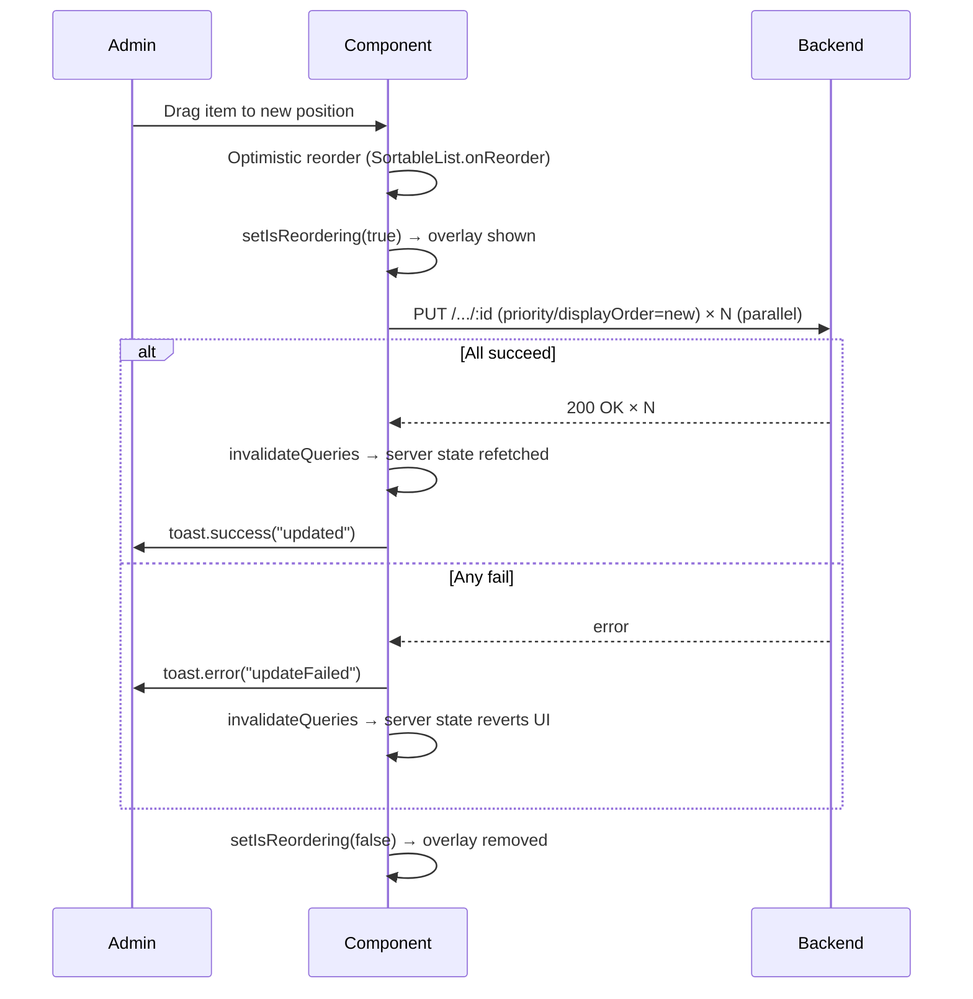

# Admin Gold Config UI Enhancement — Implementation Plan

> **For implementation:** Use the secure-feature-pipeline skill, step: implement

**Goal:** Add drag-and-drop reordering to the gold config display-order table and fetch code priority list, and fix the hardcoded "Gold Config" tab label with an i18n key.
**Spec:** `docs/specs/2026-04-02-enhance-ui-admin-gold-config-spec.md`
**Architecture:** Pure frontend changes to two existing feature-admin components. No backend, no proto, no new API endpoints. `SortableList` (already in `components/table/SortableList.tsx`) wraps both lists; API calls use existing `PUT` endpoints via `apiClient`.
**Tech Stack:** Next.js 16.2, React 19, TypeScript 5, next-intl v4, @dnd-kit (already installed), React Query v5, Tailwind CSS v2-tokens

---

## Security Implementation Notes

- **Authentication:** Both PUT endpoints already require `AuthMiddleware` + `AdminMiddleware` — no change needed.
- **Authorization:** Admin-only surface; no resource-ownership check required beyond existing middleware.
- **Input validation:** Frontend sends sequential 1-based integers (positions 0..N-1 → priorities 1..N) — no NaN or negative-value risk. Backend already validates integer bounds.
- **Data sanitization:** No user-supplied text is submitted by these interactions — only numeric IDs and computed priority/displayOrder values.

---

## Component Reuse Inventory (Frontend Tasks)

**Existing components to reuse:**

| Component | Location | Usage in This Feature |
|-----------|----------|-----------------------|
| `SortableList` | `components/table/SortableList.tsx` | Wraps gold config rows and fetch code rows for drag-and-drop |
| `GripVertical` (lucide-react) | Already imported in `SortableList` | Drag handle icon (already rendered by `SortableList`) |
| `ConfirmationDialog` | `components/modals/ConfirmationDialog.tsx` | Delete confirm (already used in both components) |
| `useNotification` | `contexts/NotificationContext.tsx` | Toast on success/error (already used) |
| `apiClient` | `utils/api-client` | PUT requests for reorder (already used) |

**New components needed:**

None — all UI needs are met by existing components.

---

## C4 Architecture Diagram Updates

Per spec: No structural change (no new feature modules or shared components). L3 backend and frontend diagrams do not require updates.

No C4 diagram task needed.

---

## Runtime Flow Diagram Updates

Per spec: Update `docs/architecture/flow-cross-cutting.md` with the drag-to-reorder batch update sequence diagram. This is Task 4 (last task, after implementation).

---

## Tasks (in dependency order)

| # | Task | Files | Est. |
|---|------|-------|------|
| 1 | i18n key — add `goldConfig` tab key to both locale files + update admin page | `messages/en/admin.json`, `messages/vi/admin.json`, `app/[locale]/dashboard/admin/page.tsx` | 2 min |
| 2 | `AssetDisplayConfigTable` drag-and-drop reorder | `features/admin/components/AssetDisplayConfigTable.tsx` | 5 min |
| 3 | `FetchCodeList` drag-and-drop reorder | `features/admin/components/FetchCodeList.tsx` | 5 min |
| 4 | Flow diagram update | `docs/architecture/flow-cross-cutting.md` | 3 min |

---

### Task 1: i18n — Add `goldConfig` tab key

**Files:**
- Modify: `src/wj-client/messages/en/admin.json` (add `goldConfig` to `admin.page.tabs`)
- Modify: `src/wj-client/messages/vi/admin.json` (add `goldConfig` to `admin.page.tabs`)
- Modify: `src/wj-client/app/[locale]/dashboard/admin/page.tsx:395` (replace hardcoded string)

**Security notes:** No security surface — translation keys only.

**Step 1: Write the failing test**

```typescript
// No unit test for translation key existence; verified by TypeScript type errors
// and next-intl runtime warnings. The acceptance test is: the admin page
// renders "Price Config" (en) / "Cấu hình giá" (vi) for the gold-config tab.
// Playwright E2E verifies this (Step N-1 below).
```

> Note: Translation key changes do not require a separate unit test file. The TypeScript compiler will fail if `t("page.tabs.goldConfig")` is called but the key does not exist when strict i18n typing is enabled. Playwright E2E covers the runtime behavior.

**Step 2: Add `goldConfig` key to `en/admin.json`**

In `src/wj-client/messages/en/admin.json`, inside `admin.page.tabs`, add after `"notifications"`:
```json
"goldConfig": "Price Config"
```

Resulting `tabs` object:
```json
"tabs": {
  "seo": "SEO",
  "users": "Users",
  "feedback": "Feedback",
  "broadcast": "Broadcast",
  "notifications": "Notifications",
  "goldConfig": "Price Config"
}
```

**Step 3: Add `goldConfig` key to `vi/admin.json`**

In `src/wj-client/messages/vi/admin.json`, inside `admin.page.tabs`, add after `"notifications"`:
```json
"goldConfig": "Cấu hình giá"
```

**Step 4: Update `admin/page.tsx` line 395**

Replace:
```typescript
{ id: "gold-config", label: "Gold Config" },
```
With:
```typescript
{ id: "gold-config", label: t("page.tabs.goldConfig") },
```

**Step 5: Verify compilation**
```bash
cd src/wj-client && npx tsc --noEmit 2>&1 | head -20
```
Expected: no errors related to `page.tabs.goldConfig`.

**Step N-1: Playwright E2E Audit** _(skip — no existing admin E2E spec; i18n label verified visually)_

**Step N: Commit**
```
feat(admin): add goldConfig i18n key and fix hardcoded tab label
```

---

### Task 2: `AssetDisplayConfigTable` — drag-and-drop display order reorder

**Files:**
- Modify: `src/wj-client/features/admin/components/AssetDisplayConfigTable.tsx`

**Security notes:** Only admins reach this component. Sequential displayOrder integers sent to backend — no injection risk.

**Step 1: Write the failing test**

```typescript
// src/wj-client/features/admin/components/__tests__/AssetDisplayConfigTable.reorder.test.tsx
import { render, screen, fireEvent, waitFor } from "@testing-library/react";
import { AssetDisplayConfigTable } from "../AssetDisplayConfigTable";
// ... mocks for apiClient, queryClient, useNotification, useTranslations

it("shows loading overlay while reorder is in flight", async () => {
  // Mock data: 2 configs, mock PUT to delay 100ms
  // Simulate drag end via onReorder callback
  // Expect: aria-busy or opacity-50 on list container
  // Expect: PUT called twice (one per item)
});
```

> **Test scope:** The DnD interaction itself is not unit-testable without full DnD environment. Test the reorder callback wiring: when `onReorder` fires with new item order, `isReordering` state is set to `true` and PUT calls are made with correct `displayOrder` values (1-based sequential).

**Step 2: Implement drag-and-drop in `AssetDisplayConfigTable.tsx`**

Changes to make:

1. **Add imports:**
```typescript
import { SortableList } from "@/components/table/SortableList";
```

2. **Add `isReordering` state** (after existing `toggleLoading` state):
```typescript
const [isReordering, setIsReordering] = useState(false);
```

3. **Add `handleReorder` callback** (after `handleToggleShowInInvestment`):
```typescript
const handleReorder = useCallback(
  async (newOrder: AssetDisplayConfigItem[]) => {
    setIsReordering(true);
    // Compute which items changed displayOrder
    const updates = newOrder.map((item, index) => ({
      id: item.id,
      newOrder: index + 1,
    }));
    try {
      await Promise.all(
        updates.map(({ id, newOrder: displayOrder }) => {
          const item = newOrder.find((c) => c.id === id)!;
          return apiClient.put(`/api/v1/admin/asset-display-config/${id}`, {
            displayName: item.displayName,
            displayOrder,
            enabled: item.enabled,
            showInInvestment: item.showInInvestment,
          } satisfies UpdateConfigRequest);
        })
      );
      queryClient.invalidateQueries({ queryKey: [QUERY_KEY_ASSET_DISPLAY_CONFIG] });
      queryClient.invalidateQueries({ queryKey: [EVENT_InvestmentGetAssetDisplayPrices] });
      toast.success(t("toast.updated"));
    } catch {
      toast.error(t("toast.updateFailed"));
      queryClient.invalidateQueries({ queryKey: [QUERY_KEY_ASSET_DISPLAY_CONFIG] });
    } finally {
      setIsReordering(false);
    }
  },
  [apiClient, queryClient, toast, t]
);
```

> **Note:** `apiClient` is imported as a module-level singleton — it doesn't need to be in `useCallback` deps. Remove it from deps, or annotate with `// eslint-disable-next-line react-hooks/exhaustive-deps` if lint complains.

4. **Replace `<MobileTable>` rendering block** with `SortableList`:

Replace the `<MobileTable ... />` block (lines 341–371) with:

```tsx
{/* Reorder loading overlay wrapper */}
<div className={`relative ${isReordering ? "animate-pulse opacity-50 pointer-events-none" : ""}`}>
  {isLoading ? (
    <div className="space-y-2">
      {[1, 2, 3].map((i) => (
        <div key={i} className="h-14 rounded-md bg-v2-bg-dark animate-pulse" />
      ))}
    </div>
  ) : configs.length === 0 ? (
    <div className="py-8 text-center text-v2-text-tertiary text-sm">
      <p className="font-medium">{t("emptyMessage")}</p>
      <p className="mt-1">{t("emptyDescription")}</p>
    </div>
  ) : (
    <SortableList
      items={configs}
      onReorder={handleReorder}
      renderItem={(row, isDragging) => (
        <div
          className={`flex flex-wrap items-center gap-2 px-3 py-3 rounded-md bg-v2-bg-dark border border-v2-border-light ${
            isDragging ? "opacity-40" : ""
          }`}
        >
          {/* Order number */}
          <span className="text-sm font-mono text-v2-text-tertiary w-6 text-center flex-shrink-0">
            {row.displayOrder}
          </span>
          {/* Type code */}
          <span className="text-xs font-mono text-v2-text-secondary bg-v2-bg-primary/40 px-1.5 py-0.5 rounded flex-shrink-0">
            {row.typeCode}
          </span>
          {/* Display name */}
          <span className="text-sm text-v2-gold-accent flex-1 min-w-0 truncate">
            {row.displayName}
          </span>
          {/* Enabled toggle */}
          {(() => {
            const key = `enabled-${row.id}`;
            const isInFlight = toggleLoading.has(key);
            return (
              <button
                type="button"
                role="switch"
                aria-checked={row.enabled}
                disabled={isInFlight}
                onClick={(e) => {
                  e.stopPropagation();
                  handleToggleEnabled(row);
                }}
                className={`inline-flex items-center justify-center min-h-[44px] min-w-[44px] cursor-pointer focus-visible:ring-2 focus-visible:ring-v2-gold-primary rounded-md flex-shrink-0 ${
                  isInFlight ? "opacity-50 cursor-not-allowed" : ""
                }`}
              >
                <span
                  className={`relative inline-flex h-6 w-11 items-center rounded-full transition-colors ${
                    row.enabled ? "bg-v2-green-positive/60" : "bg-v2-bg-primary"
                  }`}
                >
                  <span
                    className={`inline-block h-4 w-4 transform rounded-full bg-white transition-transform ${
                      row.enabled ? "translate-x-6" : "translate-x-1"
                    }`}
                  />
                </span>
              </button>
            );
          })()}
          {/* Actions */}
          <div className="flex gap-1 flex-shrink-0">
            <button
              type="button"
              onClick={() => setModalState(row.id)}
              className="min-h-[44px] px-3 py-1 text-sm font-medium text-v2-gold-accent border border-v2-border rounded-md hover:bg-v2-maroon-600 cursor-pointer transition-colors focus-visible:ring-2 focus-visible:ring-v2-gold-primary"
              aria-label={`${t("actions.edit")} ${row.displayName}`}
            >
              {t("actions.edit")}
            </button>
            <button
              type="button"
              onClick={() => setDeleteTarget(row)}
              className="min-h-[44px] px-3 py-1 text-sm font-medium text-v2-red-negative border border-v2-red-negative/40 rounded-md hover:bg-v2-red-negative/10 cursor-pointer transition-colors focus-visible:ring-2 focus-visible:ring-v2-red-negative"
              aria-label={`${t("actions.delete")} ${row.displayName}`}
            >
              {t("actions.delete")}
            </button>
          </div>
        </div>
      )}
    />
  )}
</div>
```

5. **Remove now-unused MobileTable import and type** if not used elsewhere in the file:
   - Remove `import { MobileTable } from "@/components/table/MobileTable";`
   - Remove `import type { MobileColumnDef } from "@/components/table/MobileTable";`
   - Remove the `columns` constant definition (lines 205–296)

**Step 3: Run lint**
```bash
cd src/wj-client && npm run lint -- --max-warnings=0 2>&1 | tail -20
```

**Step 4: Verify TypeScript**
```bash
cd src/wj-client && npx tsc --noEmit 2>&1 | head -20
```

**Step 5: Responsive & accessibility check**
- Drag handle has `aria-label="Drag to reorder"` — provided by `SortableList.SortableRow` automatically (line 67 of `SortableList.tsx`)
- Cards use `min-h-[44px]` equivalent (44px+ natural height via `py-3` + content)
- Touch: `PointerSensor` with 5px distance constraint — already configured in `SortableList`

**Step N-1: Playwright E2E Audit**

Affected page: `/dashboard/admin?tab=gold-config`

No existing E2E spec for admin page. Verify manually that:
1. Drag handle (`≡`) appears on each config row
2. Rows can be reordered by dragging
3. Loading overlay appears during save
4. Toast shows on success

Document result under `## Playwright E2E Results` in the report.

**Step N: Commit**
```
feat(admin): add drag-and-drop reorder to AssetDisplayConfigTable
```

---

### Task 3: `FetchCodeList` — drag-and-drop priority reorder

**Files:**
- Modify: `src/wj-client/features/admin/components/FetchCodeList.tsx`

**Security notes:** Same as Task 2 — admin-only, sequential integers, no injection risk.

**Step 1: Write the failing test**

```typescript
// src/wj-client/features/admin/components/__tests__/FetchCodeList.reorder.test.tsx
import { render, screen, waitFor } from "@testing-library/react";
import { FetchCodeList } from "../FetchCodeList";

it("calls PUT for each fetch code with new sequential priority on reorder", async () => {
  // Mock: configId=1, assetType="gold"
  // Mock fetchCodes: [{id:1,priority:1,typeCode:"sjc"},{id:2,priority:2,typeCode:"doji"}]
  // Mock apiClient.put to resolve immediately
  // Simulate onReorder([{id:2,...},{id:1,...}]) (swap)
  // Expect: apiClient.put called with priority=1 for id=2, priority=2 for id=1
});
```

**Step 2: Implement drag-and-drop in `FetchCodeList.tsx`**

Changes:

1. **Add import:**
```typescript
import { SortableList } from "@/components/table/SortableList";
```

2. **Add `isReordering` state** (after `deleteTarget` state):
```typescript
const [isReordering, setIsReordering] = useState(false);
```

3. **Add `handleReorder` callback** (after `handleAddSubmit`):
```typescript
const handleReorder = useCallback(
  async (newOrder: AssetConfigFetchCode[]) => {
    setIsReordering(true);
    try {
      await Promise.all(
        newOrder.map((fc, index) =>
          apiClient.put(
            `/api/v1/admin/asset-display-config/${configId}/fetch-codes/${fc.id}`,
            { typeCode: fc.typeCode, priority: index + 1 }
          )
        )
      );
      queryClient.invalidateQueries({ queryKey: fetchCodeQueryKey(configId) });
      toast.success(t("toast.updated"));
    } catch {
      toast.error(t("toast.updateFailed"));
      queryClient.invalidateQueries({ queryKey: fetchCodeQueryKey(configId) });
    } finally {
      setIsReordering(false);
    }
  },
  [configId, queryClient, toast, t]
);
```

> **Note:** `apiClient` is a singleton not in deps; safe to omit from the array or add ESLint comment.

4. **Replace static fetch code rows** (the `div.space-y-2` containing column headers + row map, lines 184–221) with `SortableList`:

```tsx
{/* Reorder loading overlay */}
<div className={`relative ${isReordering ? "animate-pulse opacity-50 pointer-events-none" : ""}`}>
  {/* Column headers */}
  <div className="grid grid-cols-[2rem_1fr_auto] gap-2 px-3 py-1 ml-11">
    <span className="text-xs font-medium text-v2-text-tertiary">
      {t("columns.priority")}
    </span>
    <span className="text-xs font-medium text-v2-text-tertiary">
      {t("columns.typeCode")}
    </span>
    <span className="text-xs font-medium text-v2-text-tertiary">
      {t("columns.actions")}
    </span>
  </div>

  <SortableList
    items={fetchCodes}
    onReorder={handleReorder}
    renderItem={(fc, _isDragging) => (
      <div className="grid grid-cols-[2rem_1fr_auto] gap-2 items-center px-3 py-2 rounded-md bg-v2-bg-dark border border-v2-border-light">
        <span className="text-sm font-mono text-v2-text-secondary text-center">
          {fetchCodes.indexOf(fc) + 1}
        </span>
        <span className="text-sm font-mono text-v2-text-secondary truncate">
          {fc.typeCode}
        </span>
        <button
          type="button"
          onClick={() => setDeleteTarget(fc)}
          aria-label={`${t("delete.confirm")} ${fc.typeCode}`}
          className="min-h-[44px] min-w-[44px] flex items-center justify-center px-2 text-sm font-medium text-v2-red-negative border border-v2-red-negative/30 rounded-md hover:bg-v2-red-negative/10 cursor-pointer transition-colors focus-visible:ring-2 focus-visible:ring-v2-red-negative"
        >
          {t("delete.confirm")}
        </button>
      </div>
    )}
  />
</div>
```

> **Note on priority display:** `fetchCodes.indexOf(fc) + 1` shows the optimistic position during drag. After the server save, `invalidateQueries` re-fetches the canonical order from backend.

> **SortableList wraps the full list:** The drag handle (44px touch target) is rendered by `SortableList` to the left of each row. The column header row has `ml-11` (44px) to align under content, not under the handle.

**Step 3: Run lint + TypeScript check**
```bash
cd src/wj-client && npm run lint -- --max-warnings=0 2>&1 | tail -10
cd src/wj-client && npx tsc --noEmit 2>&1 | head -10
```

**Step 4: Verify `toast.updated` and `toast.updateFailed` keys exist in both locale files for `fetchCodes` section**

Check `messages/en/admin.json` and `messages/vi/admin.json` under `admin.assetDisplayConfig.fetchCodes.toast`. If missing, add them.

```bash
grep -A5 '"toast"' src/wj-client/messages/en/admin.json | grep -E "updated|updateFailed"
grep -A5 '"toast"' src/wj-client/messages/vi/admin.json | grep -E "updated|updateFailed"
```

Per spec: "toast.updated and toast.updateFailed already exist in both assetDisplayConfig and assetDisplayConfig.fetchCodes sections." Verify and add if missing.

**Step 5: Responsive & accessibility check**
- Column headers shift right by `ml-11` (width of grip handle) — aligns correctly
- Drag handle from `SortableList` has `aria-label="Drag to reorder"` and `touchAction: none`
- Delete button: `min-h-[44px] min-w-[44px]` — touch compliant

**Step N-1: Playwright E2E Audit**

Affected area: `AssetDisplayConfigForm` edit modal (fetch code list is rendered inside modal when editing).

No existing E2E spec for this flow. Manual verification:
1. Open admin → Gold Config tab → Edit a config
2. Drag handle appears on each fetch code row
3. Reorder works; priority numbers update
4. Toast on success/error

**Step N: Commit**
```
feat(admin): add drag-and-drop reorder to FetchCodeList priority
```

---

### Task 4: Update `flow-cross-cutting.md` with drag-reorder flow

**Files:**
- Modify: `docs/architecture/flow-cross-cutting.md`

**Steps:**

1. Read the current `flow-cross-cutting.md` to find a good insertion point.

2. Add a new section: **Admin Drag-to-Reorder Batch Update** with the sequence diagram from the spec:

```markdown
## Admin Drag-to-Reorder Batch Update

Applies to: `AssetDisplayConfigTable` (displayOrder) and `FetchCodeList` (priority).



**Key Invariants:**
- Optimistic update always applied first (zero-lag UX)
- On any batch failure, `invalidateQueries` forces re-fetch (server wins over optimistic state)
- `isReordering` flag prevents concurrent drag while batch is in flight (`pointer-events-none`)
- Each batch PUT is independent; no transaction — partial failure leaves server in inconsistent order until re-fetch corrects it

**Error Paths:**

| Condition | Response | Rollback |
|-----------|----------|---------|
| Any PUT fails | `toast.error` | `invalidateQueries` — server order restored on next render |
| All PUTs succeed | `toast.success` | `invalidateQueries` — canonical order confirmed |
```

3. Commit:
```
docs(arch): add drag-to-reorder batch update flow to flow-cross-cutting.md
```

---

## Test Summary

| Layer | Test type | File | What it tests |
|-------|-----------|------|---------------|
| Frontend | Unit (Jest) | `features/admin/components/__tests__/AssetDisplayConfigTable.reorder.test.tsx` | `handleReorder` wires PUT calls with correct displayOrder values |
| Frontend | Unit (Jest) | `features/admin/components/__tests__/FetchCodeList.reorder.test.tsx` | `handleReorder` wires PUT calls with sequential priority values |
| Frontend | Playwright E2E (manual) | `tests/e2e/` — no existing spec | Drag handle renders; visual reorder works; toast shown |

---

## Risk Notes

1. **`fetchCodes.indexOf(fc)` in `renderItem`**: This is computed per-render inside `SortableList`. During drag, `SortableList` uses its internal `localItems` state (not the parent's `fetchCodes`). The displayed priority number during drag will reflect the *parent's* array order, not the dragged order. This is a cosmetic-only issue — after drag end, the number updates correctly. **Acceptable tradeoff** per spec (optimistic update covers the full list at `onReorder` callback).

   **Fix:** Pass the position as an argument via closure in `handleReorder`'s `newOrder` parameter — the `renderItem` closure can use `newOrder` from the callback context. **Or** use `SortableList`'s own ordering from `localItems`. Since `renderItem` receives the `item` (not index), the position cannot be derived from `renderItem` alone. The simplest solution: show the *server-side priority number* (`fc.priority`) in the card during drag, then invalidate after save to refresh. This matches existing behavior.

   **Revised display:** Use `fc.priority` instead of `fetchCodes.indexOf(fc) + 1` — shows the server-canonical priority, which updates after invalidation.

2. **Partial batch failure** for display config reorder: Unlike fetch codes (parallel), the spec says display config reorder can use either parallel or sequential calls. We use `Promise.all` for both (parallel) matching the spec's NFR for performance.
