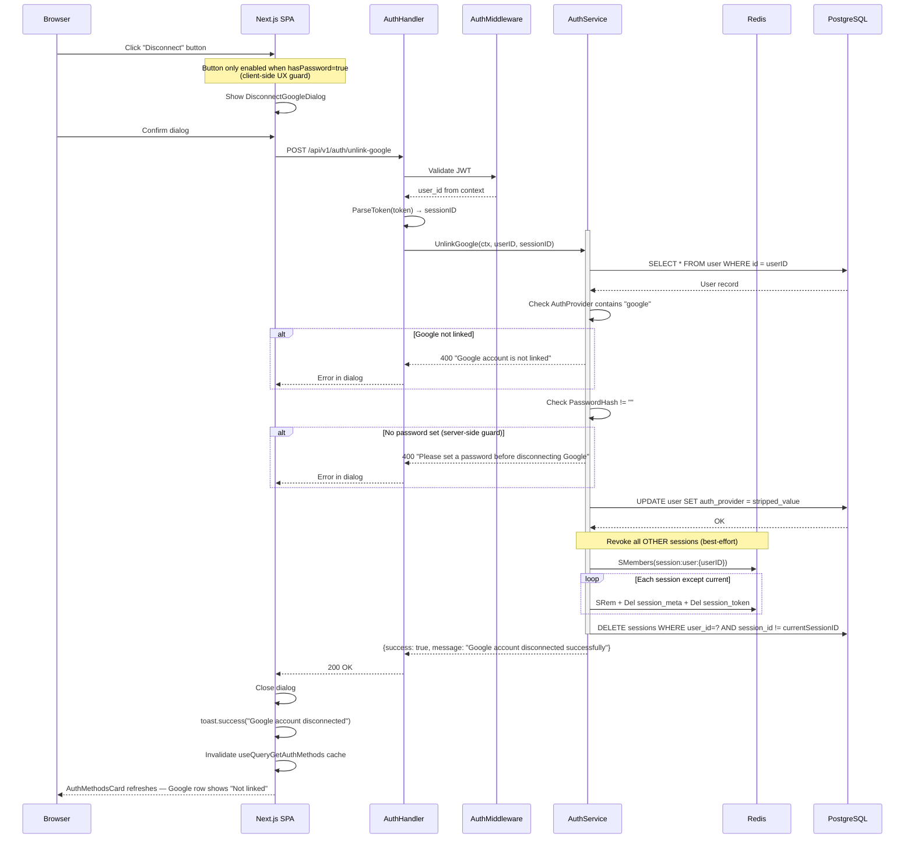

# Cancel Google Connection Implementation Plan

> **For implementation:** Use the secure-feature-pipeline skill, step: implement

**Goal:** Allow authenticated users to unlink their Google account from the security settings page, with a server-side guard ensuring the user has a password set before unlinking.

**Spec:** `docs/specs/2026-04-03-cancel-google-connection-spec.md`

**Architecture:** Adds `UnlinkGoogle` RPC to `auth.proto` and a new `POST /api/v1/auth/unlink-google` handler in `handlers/auth.go`. The service method lives in `domain/auth/auth.go` alongside the existing `LinkGoogle`. Frontend adds a `DisconnectGoogleDialog` component to `features/auth/components/` and a "Disconnect" button in `AuthMethodsCard`.

**Tech Stack:** Go 1.25 (backend), Protocol Buffers, Next.js 16 + React 19 + TypeScript 5, Tailwind CSS 3.4, React Query v5, next-intl v4

---

## Security Implementation Notes

- **Authentication:** `AuthMiddleware` on `POST /api/v1/auth/unlink-google` — userID extracted from JWT, never from request body
- **Authorization:** userID comes from validated JWT context only — no admin-on-behalf path
- **Server-side guard:** `PasswordHash != ""` check is authoritative; client-side disabled button is UX only
- **Session revocation:** calls `invalidateOtherSessions(userID, currentSessionID)` — reuses existing pattern from `ChangePassword`; current session is preserved
- **Atomicity:** Update `auth_provider` in DB BEFORE calling `invalidateOtherSessions` — revocation is best-effort (failures are logged, not fatal), consistent with existing `ChangePassword` pattern
- **Error messages:** Return specific 400 messages for known cases; 500 for internal errors (no internal details leaked)
- **Input validation:** `UnlinkGoogleRequest` is empty — zero input surface

---

## Component Reuse Inventory (Frontend Tasks)

**Existing components to reuse:**

| Component | Location | Usage in This Feature |
|-----------|----------|-----------------------|
| `ConfirmationDialog` | `components/modals/ConfirmationDialog.tsx` | Disconnect confirmation dialog with `variant="danger"` |
| `Button` | `components/Button.tsx` | Disconnect button (disabled state when no password) |
| `BaseCard` | `components/BaseCard.tsx` | Already wrapping `AuthMethodsCard` — no change needed |
| `LoadingSpinner` | `components/loading/LoadingSpinner.tsx` | Loading state in `AuthMethodsCard` (already used) |
| `useQueryGetAuthMethods` / `EVENT_AuthGetAuthMethods` | `utils/generated/hooks.ts` | Cache invalidation after unlink success |
| `useNotification` / toast | `contexts/NotificationContext.tsx` | Success toast after unlink |

**New components needed (with justification):**

| Component | Location | Justification |
|-----------|----------|---------------|
| `DisconnectGoogleDialog` | `features/auth/components/DisconnectGoogleDialog.tsx` | Encapsulates confirmation + `useMutationUnlinkGoogle` mutation + inline error state; keeps `AuthMethodsCard` lean |

---

## C4 Architecture Diagram Updates

Per spec §Architecture Changes (C4):
- **`c4-component-backend.md`:** Add `UnlinkGoogle` to the AuthHandler component description
- **`c4-component-frontend.md`:** No structural change — `AuthMethodsCard` gains a new action but no new module; `DisconnectGoogleDialog` is noted as a sub-component

---

## Task Ordering

```
Task 0: C4 architecture diagrams update
Task 1: Proto — add UnlinkGoogle RPC + messages
Task 2: Backend — UnlinkGoogle service method (+ unit tests)
Task 3: Backend — UnlinkGoogle handler + route registration (+ integration tests)
Task 4: Frontend — i18n keys (en + vi)
Task 5: Frontend — error-mapper.ts — add mapUnlinkGoogleError
Task 6: Frontend — DisconnectGoogleDialog component (+ component tests)
Task 7: Frontend — AuthMethodsCard — add Disconnect button + wire dialog
Task 8: Runtime flow diagram update (flow-auth.md)
```

Tasks 1 → 2 → 3 must be sequential (proto first, then service, then handler).
Tasks 4, 5 can run after Task 1 (proto confirms field names).
Tasks 6, 7 depend on Task 5 (error mapper) and generated hook (Task 1→proto:all).

---

### Task 0: Update C4 Architecture Diagrams

**Files:**
- Modify: `docs/architecture/c4-component-backend.md`
- Modify: `docs/architecture/c4-component-frontend.md`

**Steps:**

1. In `c4-component-backend.md`, find the AuthHandler component description. Add `UnlinkGoogle` to the list of operations alongside `LinkGoogle`.
2. In `c4-component-frontend.md`, find the `AuthMethodsCard` component entry. Add a note that it now includes a `DisconnectGoogleDialog` sub-component.
3. Commit: `docs(arch): add UnlinkGoogle to C4 component diagrams`

---

### Task 1: Proto — Add UnlinkGoogle RPC and Messages

**Files:**
- Modify: `api/protobuf/v1/auth.proto`

**Security notes:** Empty request body — no input validation needed beyond JWT auth. Response mirrors `LinkGoogleResponse` shape.

**Step 1: Write the failing test**

Proto changes are validated by compilation. The "test" is: after adding the proto, `task proto:all && cd src/go-backend && go build ./...` must compile cleanly.

Before editing proto, verify current state compiles:
```bash
cd src/go-backend && go build ./...
```
Expected: no errors (baseline established).

**Step 2: Add UnlinkGoogle RPC and messages to `auth.proto`**

After line 95 (end of `LinkGoogle` rpc), add:

```protobuf
  // Unlink Google account from existing user (authenticated)
  // Requires password set on account. Revokes all other sessions.
  rpc UnlinkGoogle(UnlinkGoogleRequest) returns (UnlinkGoogleResponse) {
    option (google.api.http) = {
      post: "/api/v1/auth/unlink-google"
      body: "*"
    };
  }
```

After `LinkGoogleResponse` message (line 272), add:

```protobuf
// UnlinkGoogle request (authenticated) — no body fields needed
message UnlinkGoogleRequest {}

// UnlinkGoogle response
message UnlinkGoogleResponse {
  bool success = 1 [json_name = "success"];
  string message = 2 [json_name = "message"];
  string timestamp = 3 [json_name = "timestamp"];
}
```

**Step 3: Generate code**

```bash
task proto:all
```

**Step 4: Verify compilation**

```bash
cd src/go-backend && go build ./...
cd src/wj-client && npx tsc --noEmit
```

Expected: both compile without errors. The generated `useMutationUnlinkGoogle` hook will appear in `utils/generated/hooks.ts`.

**Step 5: Commit**

```
feat(proto): add UnlinkGoogle RPC to auth.proto
```

---

### Task 2: Backend — UnlinkGoogle Service Method

**Files:**
- Modify: `src/go-backend/domain/auth/auth.go` (add `UnlinkGoogle` method after `LinkGoogle` ~line 794)
- Test: `src/go-backend/domain/auth/auth_test.go`

**Security notes:**
- Load user from DB — check `strings.Contains(user.AuthProvider, "google")` → return 400 if not linked
- Check `user.PasswordHash != ""` → return 400 if no password set
- Strip `"google"` from `AuthProvider` (all 4 provider format variants)
- Update DB first, then call `invalidateOtherSessions` (best-effort, consistent with `ChangePassword` pattern)
- `currentSessionID` is passed in (extracted from JWT in handler)

**Step 1: Write the failing tests** in `auth_test.go`

```go
func TestUnlinkGoogle_NoGoogleLinked(t *testing.T) {
    // Setup user with AuthProvider = "password", PasswordHash = "hash"
    // Call s.UnlinkGoogle(ctx, userID, sessionID)
    // Expect: apperrors.ValidationError "Google account is not linked"
}

func TestUnlinkGoogle_NoPasswordSet(t *testing.T) {
    // Setup user with AuthProvider = "google", PasswordHash = ""
    // Call s.UnlinkGoogle(ctx, userID, sessionID)
    // Expect: apperrors.ValidationError "Please set a password before disconnecting Google"
}

func TestUnlinkGoogle_ProviderFormats(t *testing.T) {
    // Table-driven test:
    // "google" → reject (no password guard fires first)
    // "google+password" → "password"
    // "password+google" → "password"
    // Each case: setup user with PasswordHash = "hash", verify resulting AuthProvider
}

func TestUnlinkGoogle_Success_InvalidatesOtherSessions(t *testing.T) {
    // Verify invalidateOtherSessions is called with correct userID and keepSessionID
}
```

**Step 2: Run tests to verify they fail**

```bash
cd src/go-backend && go test -run TestUnlinkGoogle ./domain/auth/...
```

Expected: compile error (method not found) or test failures.

**Step 3: Implement `UnlinkGoogle` in `auth.go`**

Add after `LinkGoogle` (line 794):

```go
// UnlinkGoogle removes Google auth from a user's account.
// Requires the user to have a password set to prevent lockout.
// Revokes all sessions except the current one.
func (s *Server) UnlinkGoogle(ctx context.Context, userID int32, currentSessionID string) (*authv1.UnlinkGoogleResponse, error) {
    var user models.User
    if err := s.db.DB.First(&user, userID).Error; err != nil {
        return nil, fmt.Errorf("user not found: %w", err)
    }

    // Guard: Google must be linked
    if !strings.Contains(user.AuthProvider, "google") {
        return nil, apperrors.NewValidationError("Google account is not linked")
    }

    // Guard: Password must be set (prevent lockout)
    if user.PasswordHash == "" {
        return nil, apperrors.NewValidationError("Please set a password before disconnecting Google")
    }

    // Strip "google" (and any "+" separator) from AuthProvider
    // Handles: "google+password" → "password", "password+google" → "password"
    newProvider := strings.ReplaceAll(user.AuthProvider, "google+", "")
    newProvider = strings.ReplaceAll(newProvider, "+google", "")
    newProvider = strings.ReplaceAll(newProvider, "google", "")

    if err := s.db.DB.Model(&user).Update("auth_provider", newProvider).Error; err != nil {
        return nil, fmt.Errorf("failed to update auth provider: %w", err)
    }

    // Revoke all other sessions (best-effort, consistent with ChangePassword)
    s.invalidateOtherSessions(userID, currentSessionID)

    log.Printf("[AUTH] User %d unlinked Google account", userID)

    return &authv1.UnlinkGoogleResponse{
        Success:   true,
        Message:   "Google account disconnected successfully",
        Timestamp: time.Now().Format(time.RFC3339),
    }, nil
}
```

**Step 4: Run tests to verify they pass**

```bash
cd src/go-backend && go test -run TestUnlinkGoogle ./domain/auth/...
```

Expected: all tests pass.

**Step 5: Run lint**

```bash
cd src/go-backend && task ci:backend-lint
```

Expected: no lint errors.

**Step 6: Commit**

```
feat(auth): implement UnlinkGoogle service method with password guard
```

---

### Task 3: Backend — UnlinkGoogle Handler and Route

**Files:**
- Modify: `src/go-backend/handlers/auth.go` (add `UnlinkGoogle` handler after `LinkGoogle` ~line 297)
- Modify: `src/go-backend/handlers/routes.go` (add route after `link-google` line 149)

**Security notes:**
- Extract `userID` via `handler.GetUserID(c)`
- Extract `sessionID` via `ExtractBearerToken` + `h.authSrv.ParseToken(token)` — same pattern as `ChangePassword`
- No request body to parse
- Log failures with `[AUTH]` prefix

**Step 1: Write the failing integration test** (handler level)

In `src/go-backend/handlers/auth_test.go` (or create if not exists):

```go
func TestUnlinkGoogle_Handler_Unauthorized(t *testing.T) {
    // No Authorization header → 401
}

func TestUnlinkGoogle_Handler_NoPasswordSet(t *testing.T) {
    // Valid JWT, user has Google but no password → 400 with message
}

func TestUnlinkGoogle_Handler_Success(t *testing.T) {
    // Valid JWT, user has google+password → 200 {success: true}
}
```

**Step 2: Run tests to verify they fail**

```bash
cd src/go-backend && go test -run TestUnlinkGoogle_Handler ./handlers/...
```

Expected: compile error or 404 (route not registered).

**Step 3: Add the handler in `handlers/auth.go`**

Add after `LinkGoogle` handler (~line 297):

```go
// UnlinkGoogle handles unlinking a Google account from an existing user
func (h *AuthHandlers) UnlinkGoogle(c *gin.Context) {
    userID, ok := handler.GetUserID(c)
    if !ok {
        handler.UnauthorizedWithPath(c, "User not authenticated")
        return
    }

    // Extract session ID from JWT token (same as ChangePassword pattern)
    token, ok := ExtractBearerToken(c)
    if !ok {
        return
    }
    claims, err := h.authSrv.ParseToken(token)
    if err != nil {
        handler.HandleError(c, apperrors.NewUnauthorizedErrorWithCode(apperrors.Codes.AuthInvalidToken, "invalid token"))
        return
    }

    result, err := h.authSrv.UnlinkGoogle(c.Request.Context(), userID, claims.SessionID)
    if err != nil {
        log.Printf("[AUTH] Unlink Google failed: %v", err)
        handler.HandleError(c, err)
        return
    }

    c.JSON(http.StatusOK, result)
}
```

**Step 4: Register the route in `handlers/routes.go`**

Add after `link-google` (line 149):

```go
authProtected.POST("/unlink-google", h.Auth.UnlinkGoogle)
```

**Step 5: Run tests to verify they pass**

```bash
cd src/go-backend && go test -run TestUnlinkGoogle_Handler ./handlers/...
cd src/go-backend && go build ./...
```

Expected: tests pass, no build errors.

**Step 6: Run full backend lint**

```bash
cd src/go-backend && task ci:backend-lint
```

Expected: no lint errors.

**Step 7: Commit**

```
feat(auth): add UnlinkGoogle handler and POST /api/v1/auth/unlink-google route
```

---

### Task 4: Frontend — i18n Keys

**Files:**
- Modify: `src/wj-client/messages/en/settings.json`
- Modify: `src/wj-client/messages/vi/settings.json`

**Security notes:** No security considerations — display strings only.

**Step 1: Add English keys**

In `en/settings.json`, under `settings.security`, add after `"username"`:

```json
"disconnectGoogle": "Disconnect",
"disconnectGoogleTitle": "Disconnect Google?",
"disconnectGoogleMessage": "Your Google account will be unlinked. All other active sessions will be signed out. You can reconnect Google at any time.",
"disconnectGoogleConfirm": "Disconnect",
"disconnectGoogleSuccess": "Google account disconnected",
"disconnectGoogleHint": "Set a password first to disconnect Google",
```

In `settings.security.errors`, add after `"linkGoogleFailed"`:

```json
"googleNotLinked": "Google account is not linked",
"unlinkGoogleFailed": "Failed to disconnect Google. Please try again.",
"disconnectRequiresPassword": "Please set a password before disconnecting Google."
```

**Step 2: Add Vietnamese keys**

In `vi/settings.json`, under `settings.security`, add after `"username"`:

```json
"disconnectGoogle": "Ngắt kết nối",
"disconnectGoogleTitle": "Ngắt kết nối Google?",
"disconnectGoogleMessage": "Tài khoản Google của bạn sẽ bị hủy liên kết. Tất cả phiên hoạt động khác sẽ bị đăng xuất. Bạn có thể kết nối lại Google bất kỳ lúc nào.",
"disconnectGoogleConfirm": "Ngắt kết nối",
"disconnectGoogleSuccess": "Đã ngắt kết nối tài khoản Google",
"disconnectGoogleHint": "Hãy đặt mật khẩu trước khi ngắt kết nối Google",
```

In `settings.security.errors`, add after `"linkGoogleFailed"`:

```json
"googleNotLinked": "Tài khoản Google chưa được liên kết",
"unlinkGoogleFailed": "Ngắt kết nối Google thất bại. Vui lòng thử lại.",
"disconnectRequiresPassword": "Vui lòng đặt mật khẩu trước khi ngắt kết nối Google."
```

**Step 3: Verify TypeScript compilation (next-intl catches missing keys)**

```bash
cd src/wj-client && npx tsc --noEmit
```

**Step 4: Commit**

```
feat(i18n): add UnlinkGoogle translation keys for en and vi
```

---

### Task 5: Frontend — Error Mapper

**Files:**
- Modify: `src/wj-client/features/auth/utils/error-mapper.ts`

**Step 1: Write the failing test** in `src/wj-client/features/auth/utils/__tests__/error-mapper.test.ts` (create if not exists)

```typescript
describe('mapUnlinkGoogleError', () => {
  it('maps "google account is not linked" to googleNotLinked', () => {
    expect(mapUnlinkGoogleError("Google account is not linked")).toBe("googleNotLinked");
  });
  it('maps "please set a password before disconnecting google" to disconnectRequiresPassword', () => {
    expect(mapUnlinkGoogleError("Please set a password before disconnecting Google")).toBe("disconnectRequiresPassword");
  });
  it('returns null for unknown errors', () => {
    expect(mapUnlinkGoogleError("some unknown error")).toBeNull();
  });
  it('returns null for undefined', () => {
    expect(mapUnlinkGoogleError(undefined)).toBeNull();
  });
});
```

**Step 2: Run test to verify it fails**

```bash
cd src/wj-client && npm test -- error-mapper
```

Expected: `mapUnlinkGoogleError` not found.

**Step 3: Add to `error-mapper.ts`**

Add after `LINK_GOOGLE_ERROR_MAP`:

```typescript
/** Error map for unlink Google action (uses settings.security.errors namespace) */
const UNLINK_GOOGLE_ERROR_MAP: Record<string, string> = {
  "google account is not linked": "googleNotLinked",
  "please set a password before disconnecting google": "disconnectRequiresPassword",
};

/**
 * Maps a server error message to an i18n key for the unlink Google action.
 * Returns the i18n key if found, or null for the fallback.
 */
export function mapUnlinkGoogleError(
  serverMessage: string | undefined
): string | null {
  if (!serverMessage) return null;
  const lower = serverMessage.toLowerCase();
  return UNLINK_GOOGLE_ERROR_MAP[lower] ?? null;
}
```

**Step 4: Run tests to verify they pass**

```bash
cd src/wj-client && npm test -- error-mapper
```

Expected: all tests pass.

**Step 5: Commit**

```
feat(auth): add mapUnlinkGoogleError to error-mapper
```

---

### Task 6: Frontend — DisconnectGoogleDialog Component

**Files:**
- Create: `src/wj-client/features/auth/components/DisconnectGoogleDialog.tsx`
- Create (test): `src/wj-client/features/auth/components/__tests__/DisconnectGoogleDialog.test.tsx`

**Security notes:** Inline error display — no HTML injection risk (React escapes). Mutation is guarded server-side.

**Step 0: Component inventory check**

- `ConfirmationDialog` at `components/modals/ConfirmationDialog.tsx` — props: `title`, `message`, `confirmText`, `cancelText`, `onConfirm`, `onCancel`, `isLoading`, `variant`. **Reuse this** for the dialog shell.
- `useMutationUnlinkGoogle` — auto-generated after Task 1 proto:all
- `useNotification` from `contexts/NotificationContext.tsx` for success toast
- `EVENT_AuthGetAuthMethods` from `utils/generated/hooks` for cache invalidation

**Step 1: Write the failing component test**

```typescript
// DisconnectGoogleDialog.test.tsx
import { render, screen, fireEvent } from '@testing-library/react';
import { DisconnectGoogleDialog } from '../DisconnectGoogleDialog';

describe('DisconnectGoogleDialog', () => {
  it('renders with title and message', () => {
    render(<DisconnectGoogleDialog isOpen onClose={jest.fn()} />);
    expect(screen.getByText(/Disconnect Google/i)).toBeInTheDocument();
  });

  it('calls onClose when Cancel is clicked', () => {
    const onClose = jest.fn();
    render(<DisconnectGoogleDialog isOpen onClose={onClose} />);
    fireEvent.click(screen.getByText(/Cancel/i));
    expect(onClose).toHaveBeenCalled();
  });

  it('shows error message when mutation fails', async () => {
    // Mock useMutationUnlinkGoogle to call onError
    // Verify error message appears in dialog
  });
});
```

**Step 2: Run test to verify it fails**

```bash
cd src/wj-client && npm test -- DisconnectGoogleDialog
```

Expected: module not found.

**Step 3: Implement `DisconnectGoogleDialog.tsx`**

```typescript
"use client";

import { useState } from "react";
import { useTranslations } from "next-intl";
import { useQueryClient } from "@tanstack/react-query";
import { ConfirmationDialog } from "@/components/modals/ConfirmationDialog";
import {
  useMutationUnlinkGoogle,
  EVENT_AuthGetAuthMethods,
} from "@/utils/generated/hooks";
import { useNotification } from "@/contexts/NotificationContext";
import { mapUnlinkGoogleError } from "@/features/auth/utils/error-mapper";

interface DisconnectGoogleDialogProps {
  isOpen: boolean;
  onClose: () => void;
}

export function DisconnectGoogleDialog({
  isOpen,
  onClose,
}: DisconnectGoogleDialogProps) {
  const t = useTranslations("settings.security");
  const queryClient = useQueryClient();
  const { toast } = useNotification();
  const [errorMessage, setErrorMessage] = useState<string | null>(null);

  const unlinkGoogle = useMutationUnlinkGoogle({
    onSuccess() {
      setErrorMessage(null);
      queryClient.invalidateQueries({ queryKey: [EVENT_AuthGetAuthMethods] });
      toast.success(t("disconnectGoogleSuccess"));
      onClose();
    },
    onError(error: any) {
      const i18nKey = mapUnlinkGoogleError(error.message);
      setErrorMessage(
        i18nKey
          ? t(`errors.${i18nKey}`)
          : error.message || t("errors.unlinkGoogleFailed"),
      );
    },
  });

  const handleConfirm = () => {
    setErrorMessage(null);
    unlinkGoogle.mutate({});
  };

  if (!isOpen) return null;

  return (
    <ConfirmationDialog
      title={t("disconnectGoogleTitle")}
      message={
        <div className="space-y-3">
          <p>{t("disconnectGoogleMessage")}</p>
          {errorMessage && (
            <div className="p-2.5 bg-v2-bg-dark border border-v2-red-negative/30 rounded-lg">
              <p className="text-xs text-v2-red-negative">{errorMessage}</p>
            </div>
          )}
        </div>
      }
      confirmText={t("disconnectGoogleConfirm")}
      onConfirm={handleConfirm}
      onCancel={() => {
        setErrorMessage(null);
        onClose();
      }}
      isLoading={unlinkGoogle.isPending}
      variant="danger"
    />
  );
}
```

**Step 4: Run tests to verify they pass**

```bash
cd src/wj-client && npm test -- DisconnectGoogleDialog
```

**Step 5: Responsive & accessibility check**

- Component is a portal dialog (no scroll impact)
- Button touch targets: `ConfirmationDialog` uses `Button` which has `min-h-[44px]` ✓
- No images; no `` tags

**Step 6: Commit**

```
feat(auth): add DisconnectGoogleDialog component
```

---

### Task 7: Frontend — AuthMethodsCard Disconnect Button

**Files:**
- Modify: `src/wj-client/features/auth/components/AuthMethodsCard.tsx`

**Security notes:** Disabled button when `!methods?.hasPassword` — UX guard only; server enforces the real guard.

**Step 1: Write the failing test** — add to existing or create `AuthMethodsCard.test.tsx`

```typescript
describe('AuthMethodsCard — Disconnect Google', () => {
  it('shows disabled Disconnect button when Google linked but no password', () => {
    // Mock useQueryGetAuthMethods to return hasGoogle=true, hasPassword=false
    // Expect: button present, disabled, with hint tooltip
  });

  it('shows enabled Disconnect button when Google linked and password set', () => {
    // Mock useQueryGetAuthMethods to return hasGoogle=true, hasPassword=true
    // Expect: button present, not disabled
  });

  it('opens DisconnectGoogleDialog when Disconnect button clicked', () => {
    // Click enabled button → verify dialog appears
  });

  it('hides Disconnect button when Google is not linked', () => {
    // Mock hasGoogle=false → no disconnect button
  });
});
```

**Step 2: Run tests to verify they fail**

```bash
cd src/wj-client && npm test -- AuthMethodsCard
```

**Step 3: Modify `AuthMethodsCard.tsx`**

Add imports at top:

```typescript
import { useState } from "react"; // already imported
import { DisconnectGoogleDialog } from "@/features/auth/components/DisconnectGoogleDialog";
```

Add state and handler inside `AuthMethodsCard`:

```typescript
const [showDisconnectDialog, setShowDisconnectDialog] = useState(false);
```

Modify the Google OAuth Row section (after `StatusBadge` line ~179). Replace:

```typescript
{!methods?.hasGoogle && (
  <div className="mt-3 pl-12">
    <ResponsiveGoogleButton ... />
  </div>
)}
```

With:

```typescript
{!methods?.hasGoogle && (
  <div className="mt-3 pl-12">
    <ResponsiveGoogleButton
      onSuccess={handleGoogleLink}
      onError={() => setLinkGoogleError(t("errors.linkGoogleFailed"))}
    />
  </div>
)}

{methods?.hasGoogle && (
  <div className="mt-2 pl-12">
    <button
      onClick={() => methods?.hasPassword ? setShowDisconnectDialog(true) : undefined}
      disabled={!methods?.hasPassword}
      title={!methods?.hasPassword ? t("disconnectGoogleHint") : undefined}
      className={`inline-flex items-center gap-1.5 text-sm font-medium transition-colors py-1 min-h-[44px] ${
        methods?.hasPassword
          ? "text-v2-red-negative hover:text-red-400 active:text-red-500 cursor-pointer"
          : "text-v2-text-tertiary cursor-not-allowed opacity-50"
      }`}
    >
      <svg
        className="w-4 h-4"
        fill="none"
        viewBox="0 0 24 24"
        stroke="currentColor"
        strokeWidth={2}
      >
        <path
          strokeLinecap="round"
          strokeLinejoin="round"
          d="M13.875 18.825A10.05 10.05 0 0112 19c-4.478 0-8.268-2.943-9.543-7a9.97 9.97 0 011.563-3.029m5.858.908a3 3 0 114.243 4.243M9.878 9.878l4.242 4.242M9.88 9.88l-3.29-3.29m7.532 7.532l3.29 3.29M3 3l3.59 3.59m0 0A9.953 9.953 0 0112 5c4.478 0 8.268 2.943 9.543 7a10.025 10.025 0 01-4.132 4.411m0 0L21 21"
        />
      </svg>
      {t("disconnectGoogle")}
    </button>
  </div>
)}
```

Add `DisconnectGoogleDialog` before the closing `</BaseCard>`:

```typescript
<DisconnectGoogleDialog
  isOpen={showDisconnectDialog}
  onClose={() => setShowDisconnectDialog(false)}
/>
```

**Step 4: Run tests to verify they pass**

```bash
cd src/wj-client && npm test -- AuthMethodsCard
```

**Step 5: Run TypeScript check**

```bash
cd src/wj-client && npx tsc --noEmit
```

**Step 6: Playwright E2E Audit**

- Affected page: `/dashboard/settings/security`
- Run existing e2e tests:

```bash
cd src/wj-client && npx playwright test tests/e2e/ --reporter=list
```

- Verify no regressions on security settings page
- Add/update `tests/e2e/security-settings-flow.spec.ts` if it exists, or note that no e2e spec exists for this page yet (lower priority — unit tests cover the component logic)

**Step 7: Commit**

```
feat(auth): add Disconnect Google button to AuthMethodsCard
```

---

### Task 8: Update Runtime Flow Diagram (flow-auth.md)

**Files:**
- Modify: `docs/architecture/flow-auth.md`

**Steps:**

1. Add `## 9. Unlink Google (Account Unlinking)` section at the end of the file.
2. Add sequence diagram with: trigger → confirmation dialog → `POST /api/v1/auth/unlink-google` → service guards → DB update → session revocation → UI refresh.
3. Add Key Invariants and Error Paths sections.

**New flow section to add:**

````markdown
---

## 9. Unlink Google (Account Unlinking)

**Trigger:** User with Google linked AND password set clicks "Disconnect" in Security Settings and confirms
**Endpoint:** `POST /api/v1/auth/unlink-google` (authenticated)
**Source:** `domain/auth/auth.go`, `handlers/auth.go`



### Key Invariants

- Server-side password guard is authoritative — client-side disabled button is UX only
- userID always from JWT context, never from request body
- AuthProvider stripping handles all valid formats: `"google"` (blocked by password guard), `"google+password"` → `"password"`, `"password+google"` → `"password"`
- DB update applies BEFORE session revocation — no partial state if revocation partially fails
- Session revocation is best-effort (failures logged); consistent with ChangePassword pattern
- Current session preserved — user stays logged in after disconnecting Google

### Error Paths

| Condition | Response | Effect on State |
|-----------|----------|-----------------|
| Not authenticated | 401 Unauthorized | No change |
| Invalid token in ParseToken | 401 Invalid token | No change |
| Google not linked | 400 "Google account is not linked" | No change |
| No password set (server guard) | 400 "Please set a password..." | No change |
| Database update fails | 500 Internal Error | No change |
| Redis session revocation partially fails | Warning logged | Some other sessions may remain active |
````

4. Commit: `docs(flow): add Unlink Google sequence to flow-auth.md`

---

## Summary of Files Changed

### Backend
| File | Change |
|------|--------|
| `api/protobuf/v1/auth.proto` | Add `UnlinkGoogle` RPC, `UnlinkGoogleRequest`, `UnlinkGoogleResponse` |
| `src/go-backend/domain/auth/auth.go` | Add `UnlinkGoogle` method |
| `src/go-backend/domain/auth/auth_test.go` | Add `TestUnlinkGoogle_*` tests |
| `src/go-backend/handlers/auth.go` | Add `UnlinkGoogle` handler |
| `src/go-backend/handlers/routes.go` | Register `POST /api/v1/auth/unlink-google` |

### Frontend (auto-generated)
| File | Change |
|------|--------|
| `src/wj-client/utils/generated/hooks.ts` | Auto-generated `useMutationUnlinkGoogle` |
| `src/wj-client/gen/protobuf/v1/auth_pb.ts` | Auto-generated types |

### Frontend (manual)
| File | Change |
|------|--------|
| `src/wj-client/messages/en/settings.json` | Add disconnect Google strings |
| `src/wj-client/messages/vi/settings.json` | Add disconnect Google strings (Vietnamese) |
| `src/wj-client/features/auth/utils/error-mapper.ts` | Add `UNLINK_GOOGLE_ERROR_MAP` + `mapUnlinkGoogleError` |
| `src/wj-client/features/auth/components/DisconnectGoogleDialog.tsx` | New component |
| `src/wj-client/features/auth/components/AuthMethodsCard.tsx` | Add Disconnect button + dialog |

### Docs
| File | Change |
|------|--------|
| `docs/architecture/c4-component-backend.md` | Add `UnlinkGoogle` to AuthHandler |
| `docs/architecture/c4-component-frontend.md` | Note `DisconnectGoogleDialog` sub-component |
| `docs/architecture/flow-auth.md` | Add §9 Unlink Google sequence diagram |
