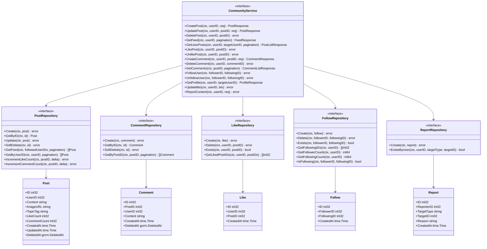

# Community Feature — Phase 1 (MVP) Specification

## Phase Overview

This feature is planned in 3 phases:

| Phase | Scope | Status |
|-------|-------|--------|
| **Phase 1 (MVP)** | Feed, Posts (text+image), Like, Comment, Follow, Basic Profile | **Current** |
| Phase 2 | Share, Notifications, Saved posts, Suggested users, Trending topics | Planned |
| Phase 3 | Groups, Advanced profile, Polls, Content moderation dashboard | Planned |

---

## Summary

Phase 1 introduces a community module to WealthJourney — a finance-focused social feed where users can create posts (text + images), like, comment, and follow other users. The feed uses chronological ordering (newest first) showing posts from followed users. It integrates into the existing dashboard layout using the app sidebar on desktop and bottom nav on mobile. Content is finance-themed with topic tags (e.g., "Chứng khoán VN", "Giao dịch Crypto").

**Design Reference:** `design/pencil/design-v2/community/feed.pen`

## User Stories

### Feed & Posts
- As a user, I want to see a chronological feed of posts from people I follow, so that I can stay updated on their financial insights.
- As a user, I want to create a text post with an optional image, so that I can share my financial knowledge and experiences.
- As a user, I want to select a finance topic tag when creating a post, so that my content is categorized.
- As a user, I want to edit my own posts, so that I can correct mistakes.
- As a user, I want to delete my own posts, so that I can remove content I no longer want shared.

### Engagement
- As a user, I want to like/unlike a post, so that I can show appreciation for useful content.
- As a user, I want to comment on a post, so that I can discuss financial topics with others.
- As a user, I want to delete my own comments, so that I can remove things I've said.
- As a user, I want to see the like count and comment count on posts, so that I can gauge engagement.

### Follow
- As a user, I want to follow/unfollow other users, so that I can curate my feed.
- As a user, I want to see my follower/following counts on my profile, so that I know my community reach.

### Profile (Basic)
- As a user, I want to see my community profile with post count, follower count, and following count.
- As a user, I want to view another user's profile and their posts.

### Moderation
- As a user, I want to report a post or comment that violates guidelines, so that inappropriate content can be reviewed.

---

## Functional Requirements

### FR-1: Community Feed

The feed displays posts in reverse chronological order from users the current user follows, plus the current user's own posts.

**Acceptance criteria:**
- [ ] Feed loads paginated posts (default 10 per page, infinite scroll)
- [ ] Posts appear newest-first
- [ ] Feed shows posts from followed users + own posts
- [ ] If user follows no one, show a "discover" state suggesting users to follow
- [ ] Each post card displays: author avatar (initials), author name, timestamp (relative: "2h", "5h"), topic tag, post text, optional image, like count, comment count, action buttons (Like, Comment)
- [ ] Clicking a post author's name navigates to their profile
- [ ] Pull-to-refresh on mobile

### FR-2: Create Post

Users can create posts with text content, optional image, and a topic tag.

**Acceptance criteria:**
- [ ] Create post box shows user avatar + placeholder text "Chia sẻ kiến thức tài chính..."
- [ ] Post creation form includes: text area (required, max 2000 chars), image upload (optional, max 5MB, jpeg/png/webp), topic tag selector (required)
- [ ] Topic tags: "Chứng khoán VN", "Giao dịch Crypto", "Vàng & Bạc", "Ngân sách", "Tiết kiệm", "Bất động sản", "Bảo hiểm", "Tổng hợp"
- [ ] Image uploaded to Supabase Storage
- [ ] Post appears at top of feed immediately after creation
- [ ] Quick actions in create box: Ảnh (image), Bình chọn (poll — Phase 3), Cảm xúc (emoji — decorative only in Phase 1)

### FR-3: Edit/Delete Post

Users can edit or delete their own posts.

**Acceptance criteria:**
- [ ] Three-dot menu (ellipsis) on own posts shows "Chỉnh sửa" and "Xóa" options
- [ ] Edit preserves original image (can replace or remove)
- [ ] Delete shows confirmation dialog
- [ ] Deleted posts are soft-deleted (hidden from feed, not purged)
- [ ] Three-dot menu on others' posts shows "Báo cáo" (report) only

### FR-4: Like/Unlike

Users can toggle likes on posts.

**Acceptance criteria:**
- [ ] Heart icon toggles between liked (filled red) and unliked (outline)
- [ ] Like count updates optimistically in UI
- [ ] User can only like a post once (toggle behavior)
- [ ] Like count displays as "243 lượt thích" format

### FR-5: Comments

Users can comment on posts and view existing comments.

**Acceptance criteria:**
- [ ] Comment section shows below post with comment count
- [ ] Comments display: author avatar, author name, comment text, timestamp
- [ ] Comment bubble style with `$bg-primary` background and 12px corner radius (per design)
- [ ] Add comment input at bottom of comment section
- [ ] Comments load paginated (5 initially, "Xem thêm bình luận" to load more)
- [ ] Users can delete their own comments
- [ ] Max comment length: 500 characters

### FR-6: Follow/Unfollow

Users can follow/unfollow other users with open follow model (no approval required).

**Acceptance criteria:**
- [ ] Follow button on user profiles and user cards
- [ ] Follow is instant (no approval flow)
- [ ] Following a user adds their posts to your feed
- [ ] Unfollowing removes their posts from your feed
- [ ] Cannot follow yourself
- [ ] Follow/unfollow is idempotent

### FR-7: Basic Profile

Users have a community profile showing their activity.

**Acceptance criteria:**
- [ ] Profile card on left sidebar (desktop) shows: avatar, name, bio, post count, follower count, following count
- [ ] Profile page shows user's posts in chronological order
- [ ] Stats displayed with `font-jetbrains` (JetBrains Mono) for numbers
- [ ] Own profile shows edit bio option
- [ ] Other users' profiles show Follow/Unfollow button

### FR-8: Report Content

Users can report posts or comments.

**Acceptance criteria:**
- [ ] Report option in three-dot menu for posts, long-press for comments
- [ ] Report reasons: "Nội dung không phù hợp", "Spam", "Thông tin sai lệch", "Quấy rối", "Khác"
- [ ] Report creates a record for manual review
- [ ] User sees confirmation "Đã gửi báo cáo" after reporting
- [ ] Same content can only be reported once per user

---

## Non-Functional Requirements

- **Performance**: Feed page load < 1s (first 10 posts). Image uploads < 3s for 5MB files.
- **Security**: All endpoints require JWT auth. Users can only modify their own content. Rate limiting on post creation (max 10 posts/hour) and comments (max 30 comments/hour).
- **Scalability**: Pagination on all list endpoints. Indexed queries for feed generation.
- **Accessibility**: ARIA labels on interactive elements. Keyboard navigation for post actions.
- **Mobile**: Responsive design. Mobile-first with `sm:` breakpoint at 800px.

---

## Architecture Changes (C4)

### Diagrams to Update

1. **`docs/architecture/c4-component-backend.md`** — Add new Community domain components:
   - `CommunityHandler` in Handlers layer
   - `CommunityService` in Service layer
   - `PostRepository`, `CommentRepository`, `FollowRepository`, `LikeRepository`, `ReportRepository` in Repository layer

2. **`docs/architecture/c4-component-frontend.md`** — Add:
   - `community` feature module in Features layer
   - `/dashboard/community` page in Pages layer
   - New shared components (PostCard, CommentThread, FollowButton) if reusable

### New Diagrams

**L4 Code Diagram: Community Domain** (`docs/architecture/c4-code-community.md`)



---

## Runtime Flow Diagrams

### Flow Diagrams to Create

**New file: `docs/architecture/flow-community.md`**

1. **Create Post Flow** (sequenceDiagram) — User → Handler → Service (validate, upload image to Supabase) → Repository → Response
2. **Feed Generation Flow** (sequenceDiagram) — User → Handler → Service (get followed user IDs, query posts, check liked status) → Repository → Response
3. **Like/Unlike Flow** (sequenceDiagram) — User → Handler → Service (toggle like, update count) → Repository → Response
4. **Follow/Unfollow Flow** (sequenceDiagram) — User → Handler → Service (create/delete follow) → Repository → Response

### Existing Diagrams to Update

- `docs/architecture/README.md` — Add Community flow diagram to the Dynamic Behavior Diagrams table

---

## Data Model Changes

### New Tables

#### `post`
| Column | Type | Constraints | Description |
|--------|------|-------------|-------------|
| id | int32 | PK, autoincrement | Post ID |
| user_id | int32 | FK → user.id, NOT NULL, INDEX | Author |
| content | text | NOT NULL, max 2000 chars | Post text |
| image_url | varchar(500) | nullable | Supabase Storage URL |
| topic_tag | varchar(50) | NOT NULL | Finance topic tag |
| like_count | int32 | DEFAULT 0 | Denormalized like count |
| comment_count | int32 | DEFAULT 0 | Denormalized comment count |
| created_at | timestamp | NOT NULL | Creation time |
| updated_at | timestamp | NOT NULL | Last update |
| deleted_at | timestamp | nullable, INDEX | Soft delete |

**Indexes:** `idx_post_user_id`, `idx_post_created_at`, `idx_post_deleted_at`

#### `comment`
| Column | Type | Constraints | Description |
|--------|------|-------------|-------------|
| id | int32 | PK, autoincrement | Comment ID |
| post_id | int32 | FK → post.id, NOT NULL, INDEX | Parent post |
| user_id | int32 | FK → user.id, NOT NULL, INDEX | Author |
| content | text | NOT NULL, max 500 chars | Comment text |
| created_at | timestamp | NOT NULL | Creation time |
| deleted_at | timestamp | nullable, INDEX | Soft delete |

**Indexes:** `idx_comment_post_id`, `idx_comment_user_id`

#### `post_like`
| Column | Type | Constraints | Description |
|--------|------|-------------|-------------|
| id | int32 | PK, autoincrement | Like ID |
| user_id | int32 | FK → user.id, NOT NULL | Liker |
| post_id | int32 | FK → post.id, NOT NULL | Liked post |
| created_at | timestamp | NOT NULL | Like time |

**Indexes:** `idx_like_user_post UNIQUE(user_id, post_id)`, `idx_like_post_id`

#### `user_follow`
| Column | Type | Constraints | Description |
|--------|------|-------------|-------------|
| id | int32 | PK, autoincrement | Follow ID |
| follower_id | int32 | FK → user.id, NOT NULL | Follower |
| following_id | int32 | FK → user.id, NOT NULL | Followed user |
| created_at | timestamp | NOT NULL | Follow time |

**Indexes:** `idx_follow_follower_following UNIQUE(follower_id, following_id)`, `idx_follow_following_id`

#### `content_report`
| Column | Type | Constraints | Description |
|--------|------|-------------|-------------|
| id | int32 | PK, autoincrement | Report ID |
| reporter_id | int32 | FK → user.id, NOT NULL | Reporter |
| target_type | varchar(20) | NOT NULL | "post" or "comment" |
| target_id | int32 | NOT NULL | ID of reported content |
| reason | varchar(50) | NOT NULL | Report reason |
| details | text | nullable | Optional details |
| status | varchar(20) | DEFAULT 'pending' | "pending", "reviewed", "resolved" |
| created_at | timestamp | NOT NULL | Report time |

**Indexes:** `idx_report_target UNIQUE(reporter_id, target_type, target_id)`, `idx_report_status`

### User Table Extension

Add to existing `user` table:
| Column | Type | Constraints | Description |
|--------|------|-------------|-------------|
| bio | varchar(200) | nullable | Community bio |

---

## API Changes

### New Protobuf: `api/protobuf/v1/community.proto`

#### Service Definition

```protobuf
service CommunityService {
  // Posts
  rpc CreatePost(CreatePostRequest) returns (CreatePostResponse) {
    option (google.api.http) = { post: "/api/v1/community/posts" body: "*" };
  }
  rpc UpdatePost(UpdatePostRequest) returns (UpdatePostResponse) {
    option (google.api.http) = { put: "/api/v1/community/posts/{post_id}" body: "*" };
  }
  rpc DeletePost(DeletePostRequest) returns (DeletePostResponse) {
    option (google.api.http) = { delete: "/api/v1/community/posts/{post_id}" };
  }
  rpc GetPost(GetPostRequest) returns (GetPostResponse) {
    option (google.api.http) = { get: "/api/v1/community/posts/{post_id}" };
  }
  rpc GetFeed(GetFeedRequest) returns (GetFeedResponse) {
    option (google.api.http) = { get: "/api/v1/community/feed" };
  }
  rpc GetUserPosts(GetUserPostsRequest) returns (GetUserPostsResponse) {
    option (google.api.http) = { get: "/api/v1/community/users/{user_id}/posts" };
  }

  // Likes
  rpc LikePost(LikePostRequest) returns (LikePostResponse) {
    option (google.api.http) = { post: "/api/v1/community/posts/{post_id}/like" };
  }
  rpc UnlikePost(UnlikePostRequest) returns (UnlikePostResponse) {
    option (google.api.http) = { delete: "/api/v1/community/posts/{post_id}/like" };
  }

  // Comments
  rpc CreateComment(CreateCommentRequest) returns (CreateCommentResponse) {
    option (google.api.http) = { post: "/api/v1/community/posts/{post_id}/comments" body: "*" };
  }
  rpc DeleteComment(DeleteCommentRequest) returns (DeleteCommentResponse) {
    option (google.api.http) = { delete: "/api/v1/community/comments/{comment_id}" };
  }
  rpc GetComments(GetCommentsRequest) returns (GetCommentsResponse) {
    option (google.api.http) = { get: "/api/v1/community/posts/{post_id}/comments" };
  }

  // Follow
  rpc FollowUser(FollowUserRequest) returns (FollowUserResponse) {
    option (google.api.http) = { post: "/api/v1/community/users/{user_id}/follow" };
  }
  rpc UnfollowUser(UnfollowUserRequest) returns (UnfollowUserResponse) {
    option (google.api.http) = { delete: "/api/v1/community/users/{user_id}/follow" };
  }

  // Profile
  rpc GetCommunityProfile(GetCommunityProfileRequest) returns (GetCommunityProfileResponse) {
    option (google.api.http) = { get: "/api/v1/community/users/{user_id}/profile" };
  }
  rpc UpdateBio(UpdateBioRequest) returns (UpdateBioResponse) {
    option (google.api.http) = { put: "/api/v1/community/profile/bio" body: "*" };
  }

  // Report
  rpc ReportContent(ReportContentRequest) returns (ReportContentResponse) {
    option (google.api.http) = { post: "/api/v1/community/report" body: "*" };
  }

  // Image Upload
  rpc GetUploadURL(GetUploadURLRequest) returns (GetUploadURLResponse) {
    option (google.api.http) = { post: "/api/v1/community/upload-url" body: "*" };
  }
}
```

#### Key Message Types

```protobuf
message PostItem {
  int32 post_id = 1;
  int32 user_id = 2;
  string user_name = 3;
  string user_avatar_initials = 4;
  string content = 5;
  string image_url = 6;
  string topic_tag = 7;
  int32 like_count = 8;
  int32 comment_count = 9;
  bool is_liked = 10;       // Current user has liked this post
  bool is_own_post = 11;    // Current user is the author
  int64 created_at = 12;    // Unix timestamp
  int64 updated_at = 13;
}

message CommentItem {
  int32 comment_id = 1;
  int32 post_id = 2;
  int32 user_id = 3;
  string user_name = 4;
  string user_avatar_initials = 5;
  string content = 6;
  bool is_own_comment = 7;
  int64 created_at = 8;
}

message CommunityProfile {
  int32 user_id = 1;
  string user_name = 2;
  string user_avatar_initials = 3;
  string bio = 4;
  int32 post_count = 5;
  int32 follower_count = 6;
  int32 following_count = 7;
  bool is_following = 8;    // Current user follows this user
  bool is_own_profile = 9;
}
```

#### Image Upload Flow

1. Frontend calls `GetUploadURL` with file metadata (content_type, file_size)
2. Backend generates a signed upload URL for Supabase Storage
3. Frontend uploads directly to Supabase Storage using the signed URL
4. Frontend includes the resulting public URL in `CreatePostRequest.image_url`

---

## UI/UX Changes

### New Route

`/dashboard/community` — Community feed page

### Desktop Layout (>= 800px)

Uses existing app sidebar (64px) + content area with 3-column body:

```
┌─────────┬──────────────────────────────────────────────────┐
│ App     │ Top Header (gradient, logo, search, icons)       │
│ Sidebar │──────────────────────────────────────────────────│
│ (64px)  │ ┌──────────┬──────────────────┬──────────┐      │
│         │ │Left      │ Center Feed      │ Right    │      │
│         │ │Sidebar   │                  │ Sidebar  │      │
│         │ │(280px)   │ (fill)           │ (280px)  │      │
│         │ │          │                  │          │      │
│         │ │Profile   │ Create Post Box  │ Suggested│      │
│         │ │Card      │ Post Card 1      │ Users    │      │
│         │ │          │ Post Card 2      │          │      │
│         │ │Nav Card  │ ...              │ (Phase 2)│      │
│         │ │          │                  │          │      │
│         │ └──────────┴──────────────────┴──────────┘      │
└─────────┴──────────────────────────────────────────────────┘
```

**Left Sidebar (280px):**
- Profile card: banner gradient, avatar (initials), name, bio, stats (posts/followers/following)
- Nav card: Bảng tin (active), Hồ sơ, Bài đã lưu (Phase 2), Đang theo dõi, Thông báo (Phase 2)

**Center Feed (flexible width):**
- Create post box: avatar + input placeholder + action buttons (Ảnh, Bình chọn, Cảm xúc)
- Post cards: header (avatar, name, meta), body (text), optional image (220px height), engagement row, action row, comments section

**Right Sidebar (280px):**
- Suggested users (Phase 2 — show placeholder "Sắp ra mắt" in Phase 1)

### Mobile Layout (< 800px)

Uses existing bottom nav + community sub-tabs:

```
┌────────────────────────────┐
│ Status Bar                 │
│ Top Header (gradient)      │
│ Tab Bar (Bảng tin, Nhóm*, │
│   Hồ sơ, Thông báo*, Menu)│
├────────────────────────────┤
│ Create Post Box            │
│ Post Card 1                │
│ Post Card 2                │
│ ...                        │
├────────────────────────────┤
│ Bottom Nav (existing 6)    │
└────────────────────────────┘
```

*Nhóm and Thông báo tabs are Phase 2/3 — show as disabled in Phase 1.

### Frontend Feature Module

```
features/community/
├── components/
│   ├── PostCard.tsx          # Individual post display
│   ├── PostHeader.tsx        # Post author info + menu
│   ├── PostBody.tsx          # Post content + image
│   ├── PostActions.tsx       # Like, Comment action buttons
│   ├── PostEngagement.tsx    # Like count, comment count row
│   ├── CommentSection.tsx    # Comments list + add comment
│   ├── CommentBubble.tsx     # Individual comment display
│   ├── CreatePostBox.tsx     # Create post input area
│   ├── ProfileCard.tsx       # Sidebar profile card
│   ├── CommunityNav.tsx      # Left sidebar navigation
│   ├── CommunityTabBar.tsx   # Mobile tab bar
│   ├── FollowButton.tsx      # Follow/Unfollow button
│   └── FeedEmpty.tsx         # Empty state when no posts
├── forms/
│   ├── CreatePostForm.tsx    # Full create post modal/form
│   └── EditPostForm.tsx      # Edit post modal/form
├── hooks/
│   ├── useFeed.ts            # Feed data fetching + infinite scroll
│   ├── useLike.ts            # Optimistic like/unlike
│   └── useFollow.ts          # Follow/unfollow with optimistic update
└── utils/
    ├── community.schema.ts   # Zod validation schemas
    ├── topic-tags.ts         # Topic tag constants
    └── time-format.ts        # Relative time formatting ("2h", "5h")
```

### Design Tokens (from feed.pen, adapted to current app fonts)

| Token | Usage |
|-------|-------|
| `$bg-surface` | Post card, sidebar card backgrounds |
| `$bg-primary` | Comment bubble, input backgrounds |
| `$border-light` | Card borders, dividers |
| `$red-primary` | Active tab, active nav, follow button CTA |
| `$red-light` | Active nav item background |
| `$red-negative` | Liked heart icon |
| `$text-primary` | Post text, user names |
| `$text-secondary` | Action button text, secondary info |
| `$text-tertiary` | Timestamps, meta text, tab labels |
| `$text-on-dark` | Text on gradient header |
| `$gold-light` / `$gold-dark` / `$gold-accent` | User avatar styling |
| `$green-light` / `$green-positive` | Alt avatar colors, image action |
| `font-vietnam` (Be Vietnam Pro) | All UI text (maps from Sora in design) |
| `font-jetbrains` (JetBrains Mono) | Stats numbers, engagement counts (maps from IBM Plex Mono in design) |
| `font-jakarta` (Plus Jakarta Sans) | Secondary text if needed |

**Font mapping note:** The design mockup uses Sora and IBM Plex Mono. Implementation uses the app's existing V2 fonts: Be Vietnam Pro (`font-vietnam`), JetBrains Mono (`font-jetbrains`), and Plus Jakarta Sans (`font-jakarta`).

---

## Security & Risk Assessment

### Data Flow Diagram

| # | Source | Data | Trust Boundary Crossed? | Destination | Notes |
|---|--------|------|------------------------|-------------|-------|
| 1 | User browser | Post text + image | Yes: Internet → App | CommunityHandler | User-generated content, XSS risk |
| 2 | CommunityHandler | Validated post data | No (internal) | CommunityService | After input validation |
| 3 | CommunityService | Post model | No (internal) | PostRepository/DB | GORM parameterized queries |
| 4 | User browser | Image file | Yes: Internet → Supabase | Supabase Storage | Direct upload via signed URL |
| 5 | Supabase Storage | Image URL | Yes: External → App | Post record | URL stored in DB |
| 6 | User browser | Like/comment/follow request | Yes: Internet → App | CommunityHandler | Rate-limited |
| 7 | DB | Feed data | No (internal) | CommunityService | Query results |
| 8 | CommunityService | Response JSON | Yes: App → Internet | User browser | Sanitized output |

### Trust Boundaries

| Boundary | Crossed By | Security Control |
|----------|-----------|-----------------|
| Internet → App | All community requests | JWT auth + rate limiting + input validation |
| Internet → Supabase | Image uploads | Signed URL (time-limited), file type/size validation |
| App → DB | All queries | GORM parameterized queries, ownership checks |
| App → Internet | Feed responses | HTML entity encoding, no raw user HTML |

### Threats Identified (STRIDE per boundary crossing)

| # | Data Flow | Boundary | STRIDE | Threat | Severity | Mitigation |
|---|-----------|----------|--------|--------|----------|------------|
| T-1 | 1 | Internet → App | Spoofing | Impersonate another user's post | High | User ID from JWT context, never from request |
| T-2 | 1 | Internet → App | Tampering | Inject XSS in post content | High | Server-side HTML sanitization, escape on render |
| T-3 | 1 | Internet → App | Tampering | Upload malicious file as image | Medium | File type validation (magic bytes), size limit, Supabase scans |
| T-4 | 4 | Internet → Supabase | Tampering | Reuse signed URL for different file | Low | Short-lived signed URLs (5 min), content-type lock |
| T-5 | 6 | Internet → App | DoS | Spam posts/comments/likes | Medium | Rate limiting per user (10 posts/hr, 30 comments/hr) |
| T-6 | 6 | Internet → App | Elevation | Edit/delete others' content | High | Ownership verification in service layer |
| T-7 | 8 | App → Internet | Information Disclosure | Leak private user data in feed | Medium | Only expose public profile fields, never email/auth data |
| T-8 | 5 | External → App | Tampering | Manipulated image URL injected | Medium | Validate URL points to Supabase Storage domain only |
| T-9 | 1 | Internet → App | Repudiation | User denies posting content | Low | Audit trail: created_at, user_id, soft deletes preserve history |

### Authorization Rules

| Action | Who | Rule |
|--------|-----|------|
| Create post | Authenticated user | Any auth user |
| Edit post | Post author | user_id == JWT user_id |
| Delete post | Post author | user_id == JWT user_id |
| Like/unlike | Authenticated user | Any auth user (not own post — optional) |
| Comment | Authenticated user | Any auth user |
| Delete comment | Comment author | user_id == JWT user_id |
| Follow/unfollow | Authenticated user | Cannot follow self |
| View feed | Authenticated user | Only see posts from followed users + own |
| View profile | Authenticated user | Public profiles (all can view) |
| Edit bio | Profile owner | user_id == JWT user_id |
| Report | Authenticated user | Cannot report own content |

### Input Validation Rules

| Field | Validation | Where |
|-------|-----------|-------|
| Post content | Required, 1-2000 chars, strip HTML tags | Server (handler) |
| Post image_url | Optional, must be valid Supabase Storage URL pattern | Server (handler) |
| Post topic_tag | Required, must be in allowed list | Server (handler) |
| Comment content | Required, 1-500 chars, strip HTML tags | Server (handler) |
| Bio | Optional, 0-200 chars | Server (handler) |
| Report reason | Required, must be in allowed list | Server (handler) |
| File upload | Max 5MB, only jpeg/png/webp, validate magic bytes | Server (upload URL generation) |
| User IDs in follow | Must be valid int32, must exist | Server (service) |

### External Dependency Risks

| Dependency | Risk | Mitigation |
|------------|------|------------|
| Supabase Storage | Outage prevents image upload | Graceful degradation: allow text-only posts, show "image unavailable" |
| Supabase Storage | Cost overrun from abuse | Rate limit uploads, max file size, monitor usage |

### Sensitive Data Handling

| Data | Classification | Protection |
|------|---------------|------------|
| Post content | User-generated, public | Stored in DB, displayed to followers |
| User email | Private | Never exposed in community responses |
| User auth tokens | Secret | Never included in community data |
| Image files | User-generated, public | Stored in Supabase with public read access |
| Report details | Restricted | Only visible to admin (future) |

### Issues & Risks Summary

1. **XSS via post/comment content** — Must sanitize all user-generated text server-side
2. **Image upload abuse** — Rate limit + file size/type validation required
3. **Feed query performance** — Feed generation requires JOIN with follows table; needs proper indexing
4. **Denormalized counts** — like_count and comment_count can drift; need periodic reconciliation job (Phase 2)
5. **No admin moderation UI** — Reports accumulate without review in Phase 1; acceptable for MVP

---

## Edge Cases & Error Handling

| Scenario | Handling |
|----------|---------|
| User follows 0 people | Show "discover" empty state with popular users |
| Post has 0 comments | Show empty comment section with input |
| Image upload fails | Show error toast, allow retry, don't block text post |
| Post author deleted account | Show "Người dùng đã xóa" placeholder |
| Concurrent like/unlike | Unique constraint prevents double-like; handle 409 gracefully |
| Very long post text | Truncate in feed with "Xem thêm" expand button |
| Rapid pagination | Debounce infinite scroll, prevent duplicate requests |
| Network error during post creation | Show retry button, preserve draft in local state |

---

## Dependencies & Assumptions

### Dependencies
- Existing `user` table and auth system (JWT + Redis)
- Supabase Storage bucket for community images
- Existing app sidebar and layout infrastructure

### Assumptions
- Users have accounts (Google OAuth) — no anonymous viewing
- All community content is public to authenticated users (no private posts in Phase 1)
- The existing user model has `name` field accessible for display
- Supabase Storage is already configured or can be configured

---

## Out of Scope (Phase 1)

- Share/repost functionality (Phase 2)
- Push notifications (Phase 2)
- Saved/bookmarked posts (Phase 2)
- Suggested users algorithm (Phase 2)
- Trending topics (Phase 2)
- Groups (Phase 3)
- Polls (Phase 3)
- Admin moderation dashboard (Phase 3)
- Rich text/markdown in posts
- Video uploads
- Direct messaging (separate feature)
- Post editing history
- Nested comment replies (flat comments only)
- Hashtag system
- @mentions
